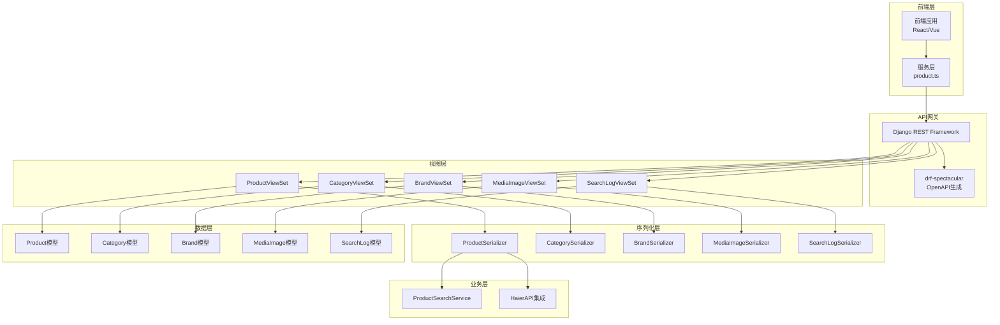
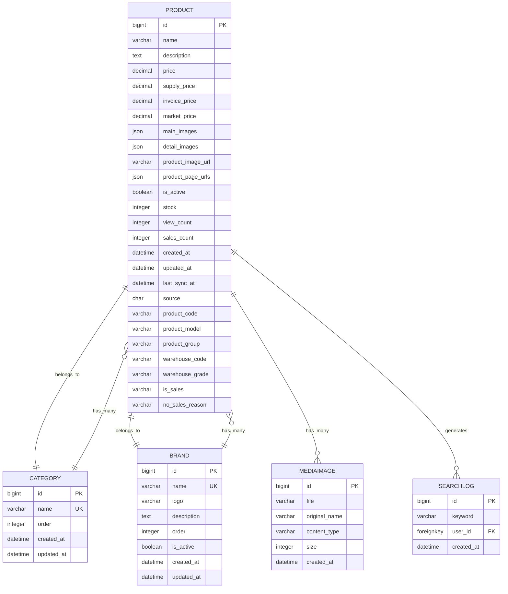
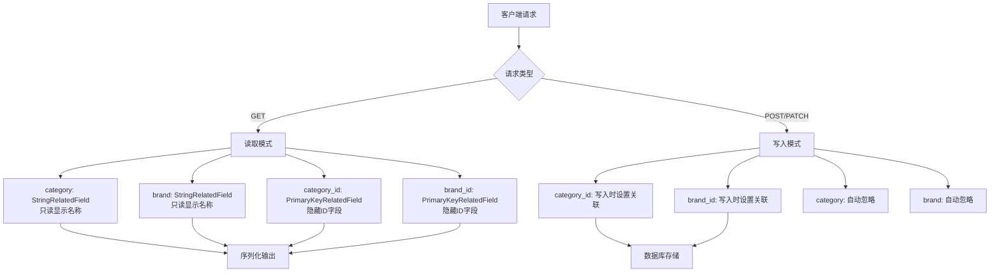
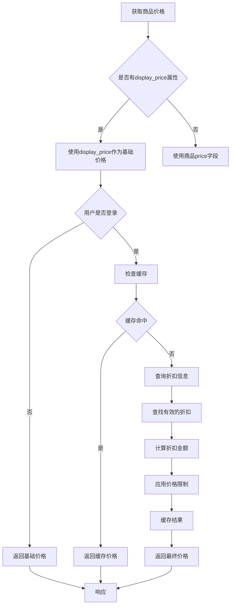
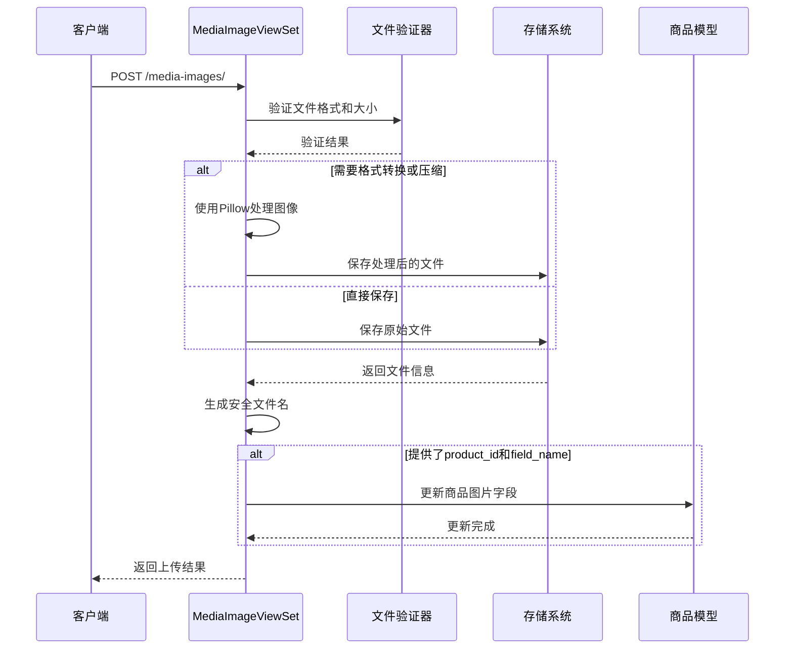
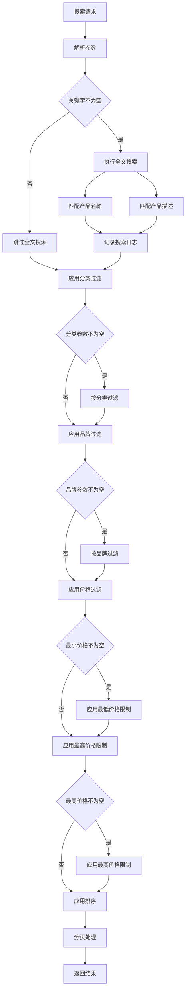
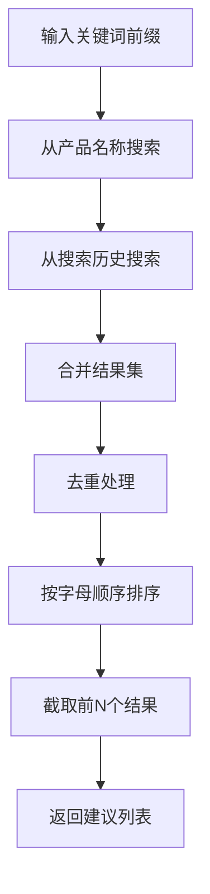

# 商品目录API接口文档

<cite>
**本文档引用的文件**
- [views.py](file://backend/catalog/views.py)
- [serializers.py](file://backend/catalog/serializers.py)
- [models.py](file://backend/catalog/models.py)
- [urls.py](file://backend/catalog/urls.py)
- [search.py](file://backend/catalog/search.py)
- [product.ts](file://frontend/src/services/product.ts)
- [api.ts](file://merchant/src/services/api.ts)
- [base.py](file://backend/backend/settings/base.py)
- [urls.py](file://backend/backend/urls.py)
</cite>

## 目录
1. [简介](#简介)
2. [项目架构概览](#项目架构概览)
3. [核心组件分析](#核心组件分析)
4. [ProductViewSet API接口](#productviewset-api接口)
5. [ProductSerializer序列化器](#productserializer序列化器)
6. [MediaImageViewSet文件上传](#mediaimageviewset文件上传)
7. [搜索与过滤功能](#搜索与过滤功能)
8. [OpenAPI规范集成](#openapi规范集成)
9. [错误处理与状态码](#错误处理与状态码)
10. [最佳实践指南](#最佳实践指南)

## 简介

本文档详细描述了电商小程序项目中的商品目录模块API接口，涵盖商品列表、详情、搜索、分类和品牌管理等核心功能。该系统采用Django REST Framework构建，支持高级搜索过滤、智能排序和文件上传等特性。

### 主要功能特性

- **商品管理**：完整的CRUD操作，支持批量操作和状态管理
- **高级搜索**：多维度搜索过滤（关键词、分类、品牌、价格范围）
- **智能排序**：多种排序策略（相关性、价格、销量、创建时间）
- **图片管理**：安全的文件上传和图片处理
- **推荐系统**：基于用户行为的商品推荐
- **海尔API集成**：支持海尔商品的库存和价格同步

## 项目架构概览



**图表来源**
- [views.py](file://backend/catalog/views.py#L28-L980)
- [serializers.py](file://backend/catalog/serializers.py#L1-L352)
- [models.py](file://backend/catalog/models.py#L1-L312)

## 核心组件分析

### 数据模型关系



**图表来源**
- [models.py](file://backend/catalog/models.py#L43-L312)

**章节来源**
- [models.py](file://backend/catalog/models.py#L1-L312)

## ProductViewSet API接口

### 基础列表接口

#### GET /api/v1/products/

**功能描述**：获取商品列表，支持高级搜索和过滤

**请求参数**：
| 参数名 | 类型 | 必填 | 描述 | 默认值 |
|--------|------|------|------|--------|
| search | string | 否 | 关键词搜索（产品名称和描述） | - |
| category | string | 否 | 分类名称过滤 | - |
| brand | string | 否 | 品牌名称过滤 | - |
| min_price | decimal | 否 | 最小价格过滤 | - |
| max_price | decimal | 否 | 最大价格过滤 | - |
| sort_by | string | 否 | 排序策略 | relevance |
| page | integer | 否 | 页码（从1开始） | 1 |
| page_size | integer | 否 | 每页结果数 | 20 |

**支持的排序策略**：
- `relevance`：相关性排序（默认）
- `price_asc`：价格升序
- `price_desc`：价格降序
- `sales`：销量降序
- `created`：创建时间降序
- `views`：浏览量降序

**响应结构**：
```json
{
  "results": [
    {
      "id": 1,
      "name": "商品名称",
      "description": "商品描述",
      "price": "199.99",
      "discounted_price": "179.99",
      "originalPrice": "199.99",
      "category": "家电",
      "brand": "海尔",
      "main_images": ["https://example.com/image1.jpg"],
      "detail_images": [],
      "is_haier_product": true,
      "haier_info": {
        "product_code": "HA123456",
        "product_model": "X500",
        "supply_price": "189.99",
        "invoice_price": "219.99"
      }
    }
  ],
  "total": 100,
  "page": 1,
  "total_pages": 5,
  "has_next": true,
  "has_previous": false
}
```

**权限要求**：允许公开访问（AllowAny）

**章节来源**
- [views.py](file://backend/catalog/views.py#L69-L131)

### 商品详情接口

#### GET /api/v1/products/{id}/

**功能描述**：获取单个商品的详细信息

**路径参数**：
| 参数名 | 类型 | 必填 | 描述 |
|--------|------|------|------|
| id | integer | 是 | 商品ID |

**响应结构**：
```json
{
  "id": 1,
  "name": "商品名称",
  "description": "详细描述",
  "price": "199.99",
  "discounted_price": "179.99",
  "originalPrice": "199.99",
  "category": "家电",
  "brand": "海尔",
  "category_id": 1,
  "brand_id": 1,
  "stock": 10,
  "view_count": 150,
  "sales_count": 25,
  "main_images": ["https://example.com/image1.jpg"],
  "detail_images": ["https://example.com/detail1.jpg"],
  "is_haier_product": true,
  "haier_info": {
    "product_code": "HA123456",
    "product_model": "X500",
    "supply_price": "189.99",
    "invoice_price": "219.99",
    "market_price": "229.99"
  }
}
```

**权限要求**：允许公开访问（AllowAny）

**章节来源**
- [views.py](file://backend/catalog/views.py#L387-L396)

### 相关商品接口

#### GET /api/v1/products/{id}/related/

**功能描述**：获取与指定商品相关的其他商品

**路径参数**：
| 参数名 | 类型 | 必填 | 描述 |
|--------|------|------|------|
| id | integer | 是 | 商品ID |

**查询参数**：
| 参数名 | 类型 | 必填 | 描述 | 默认值 |
|--------|------|------|------|--------|
| limit | integer | 否 | 最大相关商品数量 | 10 |

**响应结构**：
```json
[
  {
    "id": 2,
    "name": "相关商品2",
    "price": "299.99",
    "discounted_price": "279.99",
    "main_images": ["https://example.com/image2.jpg"]
  },
  {
    "id": 3,
    "name": "相关商品3",
    "price": "149.99",
    "discounted_price": "129.99",
    "main_images": ["https://example.com/image3.jpg"]
  }
]
```

**权限要求**：允许公开访问（AllowAny）

**章节来源**
- [views.py](file://backend/catalog/views.py#L404-L433)

### 分类商品接口

#### GET /api/v1/products/by_category/

**功能描述**：按分类获取商品列表

**查询参数**：
| 参数名 | 类型 | 必填 | 描述 | 默认值 |
|--------|------|------|------|--------|
| category | string | 是 | 分类名称 | - |
| sort_by | string | 否 | 排序策略 | relevance |
| page | integer | 否 | 页码 | 1 |
| page_size | integer | 否 | 每页结果数 | 20 |

**支持的排序策略**：
- `relevance`：相关性排序（默认）
- `sales`：销量降序
- `price_asc`：价格升序
- `price_desc`：价格降序
- `created`：创建时间降序

**响应结构**：同基础列表接口

**权限要求**：允许公开访问（AllowAny）

**章节来源**
- [views.py](file://backend/catalog/views.py#L202-L263)

### 品牌商品接口

#### GET /api/v1/products/by_brand/

**功能描述**：按品牌获取商品列表

**查询参数**：
| 参数名 | 类型 | 必填 | 描述 | 默认值 |
|--------|------|------|------|--------|
| brand | string | 是 | 品牌名称 | - |
| sort_by | string | 否 | 排序策略 | relevance |
| page | integer | 否 | 页码 | 1 |
| page_size | integer | 否 | 每页结果数 | 20 |

**支持的排序策略**：同分类商品接口

**响应结构**：同基础列表接口

**权限要求**：允许公开访问（AllowAny）

**章节来源**
- [views.py](file://backend/catalog/views.py#L265-L318)

### 商品推荐接口

#### GET /api/v1/products/recommendations/

**功能描述**：获取商品推荐

**查询参数**：
| 参数名 | 类型 | 必填 | 描述 | 默认值 |
|--------|------|------|------|--------|
| type | string | 否 | 推荐类型 | popular |
| limit | integer | 否 | 推荐数量限制 | 10 |
| category_id | integer | 否 | 分类ID（仅category类型） | - |

**推荐类型**：
- `popular`：热门商品（默认）
- `trending`：趋势商品
- `category`：分类推荐

**响应结构**：
```json
[
  {
    "id": 1,
    "name": "热门商品1",
    "price": "199.99",
    "discounted_price": "179.99",
    "main_images": ["https://example.com/popular1.jpg"]
  }
]
```

**权限要求**：允许公开访问（AllowAny）

**章节来源**
- [views.py](file://backend/catalog/views.py#L337-L385)

### 搜索建议接口

#### GET /api/v1/products/search_suggestions/

**功能描述**：获取搜索建议

**查询参数**：
| 参数名 | 类型 | 必填 | 描述 | 默认值 |
|--------|------|------|------|--------|
| prefix | string | 是 | 关键词前缀 | - |
| limit | integer | 否 | 建议数量限制 | 10 |

**响应结构**：
```json
{
  "suggestions": ["洗衣机", "空调", "冰箱"]
}
```

**权限要求**：允许公开访问（AllowAny）

**章节来源**
- [views.py](file://backend/catalog/views.py#L141-L157)

### 热门关键词接口

#### GET /api/v1/products/hot_keywords/

**功能描述**：获取热门搜索关键词

**查询参数**：
| 参数名 | 类型 | 必填 | 描述 | 默认值 |
|--------|------|------|------|--------|
| limit | integer | 否 | 关键词数量限制 | 10 |
| days | integer | 否 | 统计天数范围 | 7 |

**响应结构**：
```json
{
  "hot_keywords": [
    {"keyword": "洗衣机", "count": 150},
    {"keyword": "空调", "count": 120},
    {"keyword": "冰箱", "count": 100}
  ]
}
```

**权限要求**：允许公开访问（AllowAny）

**章节来源**
- [views.py](file://backend/catalog/views.py#L167-L187)

## ProductSerializer序列化器

### 字段映射与验证

ProductSerializer负责处理商品数据的读写分离和特殊字段处理：

#### 读写分离设计



**图表来源**
- [serializers.py](file://backend/catalog/serializers.py#L50-L62)

#### 价格字段处理

| 字段名 | 类型 | 描述 | 验证规则 |
|--------|------|------|----------|
| price | PriceField | 销售价格 | 最大10位，2位小数，最小值0 |
| supply_price | PriceField | 供货价格 | 可为空，最大10位，2位小数 |
| invoice_price | PriceField | 发票价格 | 可为空，最大10位，2位小数 |
| market_price | PriceField | 市场价格 | 可为空，最大10位，2位小数 |
| stock_rebate | PriceField | 直扣金额 | 可为空，最大10位，2位小数 |
| rebate_money | PriceField | 台返金额 | 可为空，最大10位，2位小数 |

#### 折扣计算逻辑



**图表来源**
- [serializers.py](file://backend/catalog/serializers.py#L205-L250)

#### 图片URL规范化

ProductSerializer实现了智能的图片URL处理逻辑：

1. **主图优先级**：
   - 本地上传的主图（main_images）
   - 海尔API提供的主图（product_image_url）
   - 空数组

2. **详情图优先级**：
   - 海尔拉页URL（product_page_urls）
   - 本地上传的详情图（detail_images）

3. **URL标准化**：
   - 绝对URL保持不变
   - 相对路径转换为完整URL
   - 本地路径添加MEDIA_URL前缀

**章节来源**
- [serializers.py](file://backend/catalog/serializers.py#L50-L352)

## MediaImageViewSet文件上传

### 文件上传机制

MediaImageViewSet提供了安全的文件上传功能，支持格式转换和压缩：

#### 支持的文件格式

| 格式 | MIME类型 | 描述 |
|------|----------|------|
| JPEG | image/jpeg | 适用于照片和复杂图像 |
| PNG | image/png | 适用于透明背景和简单图形 |
| WebP | image/webp | 现代高效格式，支持透明度 |
| GIF | image/gif | 适用于动画和简单图形 |

#### 上传流程



**图表来源**
- [views.py](file://backend/catalog/views.py#L840-L980)

#### 上传参数

| 参数名 | 类型 | 必填 | 描述 | 示例 |
|--------|------|------|------|------|
| file | file | 是 | 要上传的文件 | - |
| format | string | 否 | 目标格式：webp, jpeg, png | webp |
| compress | boolean | 否 | 是否压缩 | true |
| product_id | integer | 否 | 关联的商品ID | 123 |
| field_name | string | 否 | 图片字段名：main_images或detail_images | main_images |

#### 安全特性

1. **UUID文件名生成**：防止文件名冲突和路径遍历攻击
2. **MIME类型检测**：验证文件类型安全性
3. **文件大小限制**：防止大文件上传
4. **扩展名验证**：确保文件扩展名正确
5. **内容类型验证**：双重验证文件类型

**章节来源**
- [views.py](file://backend/catalog/views.py#L749-L980)

## 搜索与过滤功能

### ProductSearchService核心功能

ProductSearchService提供了强大的搜索和过滤能力：

#### 搜索参数处理



**图表来源**
- [search.py](file://backend/catalog/search.py#L47-L158)

#### 排序策略实现

| 排序类型 | SQL排序字段 | 描述 |
|----------|-------------|------|
| price_asc | price | 价格升序排列 |
| price_desc | -price | 价格降序排列 |
| sales | -sales_count | 销量降序排列 |
| views | -view_count | 浏览量降序排列 |
| created | -created_at | 创建时间降序排列 |
| relevance | name_match | 相关性排序（关键词匹配度） |

#### 搜索建议算法



**图表来源**
- [search.py](file://backend/catalog/search.py#L248-L282)

**章节来源**
- [search.py](file://backend/catalog/search.py#L19-L287)

## OpenAPI规范集成

### drf-spectacular配置

系统使用drf-spectacular自动生成OpenAPI 3.0规范：

#### 标签分类

```python
SPECTACULAR_SETTINGS = {
    'TAGS': [
        {'name': 'Products', 'description': '商品管理与搜索'},
        {'name': 'Categories', 'description': '商品分类管理'},
        {'name': 'Brands', 'description': '品牌管理'},
        {'name': 'Orders', 'description': '订单管理'},
        {'name': 'Payments', 'description': '支付处理'},
        {'name': 'Users', 'description': '用户认证与资料'},
        {'name': 'Addresses', 'description': '用户地址管理'},
        {'name': 'Cart', 'description': '购物车管理'},
        {'name': 'Favorites', 'description': '商品收藏管理'},
        {'name': 'Search', 'description': '商品搜索与分析'},
        {'name': 'Integrations', 'description': '供应商API集成'},
    ]
}
```

#### API文档访问

- **Swagger UI**: `/api/docs/`
- **ReDoc**: `/api/redoc/`
- **JSON Schema**: `/api/schema/`

#### 自动生成的端点文档

每个API端点都通过`@extend_schema`装饰器添加了详细的元数据：

```python
@extend_schema(
    operation_id='products_list',
    parameters=[
        OpenApiParameter('search', OT.STR, OpenApiParameter.QUERY, description='关键词搜索'),
        OpenApiParameter('category', OT.STR, OpenApiParameter.QUERY, description='分类过滤'),
        OpenApiParameter('brand', OT.STR, OpenApiParameter.QUERY, description='品牌过滤'),
        OpenApiParameter('min_price', OT.DECIMAL, OpenApiParameter.QUERY, description='最小价格'),
        OpenApiParameter('max_price', OT.DECIMAL, OpenApiParameter.QUERY, description='最大价格'),
        OpenApiParameter('sort_by', OT.STR, OpenApiParameter.QUERY, description='排序策略'),
        OpenApiParameter('page', OT.INT, OpenApiParameter.QUERY, description='页码'),
        OpenApiParameter('page_size', OT.INT, OpenApiParameter.QUERY, description='每页数量'),
    ],
    description='获取商品列表，支持高级搜索和过滤',
)
```

**章节来源**
- [base.py](file://backend/backend/settings/base.py#L64-L140)
- [views.py](file://backend/catalog/views.py#L28-L980)

## 错误处理与状态码

### HTTP状态码标准

| 状态码 | 场景 | 响应格式 |
|--------|------|----------|
| 200 | 请求成功 | JSON响应数据 |
| 201 | 创建成功 | 新资源的JSON表示 |
| 400 | 请求参数错误 | 错误信息数组 |
| 401 | 未认证 | 认证失败信息 |
| 403 | 权限不足 | 权限拒绝信息 |
| 404 | 资源不存在 | 通用错误信息 |
| 409 | 资源冲突 | 冲突详情信息 |
| 500 | 服务器内部错误 | 服务器错误信息 |

### 常见错误响应

#### 文件上传错误
```json
{
  "detail": "缺少文件: file",
  "status_code": 400
}
```

#### 品牌删除错误
```json
{
  "error": "无法删除品牌",
  "message": "该品牌有 5 个关联商品，请先删除或转移这些商品",
  "associated_products_count": 5,
  "suggestion": "如需强制删除，请添加 ?force_delete=true 参数"
}
```

#### 海尔API同步错误
```json
{
  "detail": "同步失败: 网络连接超时",
  "status_code": 500
}
```

### 验证错误格式

```json
{
  "name": ["品牌名称不能为空"],
  "price": ["价格不能小于0"],
  "file": ["文件格式不支持"]
}
```

## 最佳实践指南

### 前端调用建议

#### 商品列表优化
```typescript
// 推荐的分页参数
const params = {
  page: 1,
  page_size: 20,
  sort_by: 'sales', // 或 'price_asc', 'price_desc'
  category: '家电',
  min_price: 100,
  max_price: 1000
};

// 实现无限滚动加载
const loadMore = async () => {
  const newParams = { ...params, page: currentPage + 1 };
  const newData = await productService.getProducts(newParams);
  
  if (newData.has_next) {
    currentPage++;
    allProducts.push(...newData.results);
  }
};
```

#### 图片上传最佳实践
```typescript
// 图片上传配置
const uploadConfig = {
  maxSize: 5 * 1024 * 1024, // 5MB
  allowedFormats: ['image/jpeg', 'image/png', 'image/webp'],
  compress: true,
  targetFormat: 'webp'
};

// 批量上传
const uploadImages = async (files: File[], productId?: number) => {
  const uploadPromises = files.map(file => {
    return uploadImage(file, productId, 'main_images');
  });
  
  return Promise.all(uploadPromises);
};
```

### 性能优化建议

#### 1. 查询优化
- 使用`select_related`预加载关联对象
- 避免N+1查询问题
- 合理使用索引

#### 2. 缓存策略
- 商品折扣信息缓存60秒
- 热门关键词缓存1小时
- 分类和品牌列表缓存24小时

#### 3. 图片处理
- 生产环境启用WebP格式
- 启用图片压缩（质量85%）
- 使用CDN加速图片访问

### 安全注意事项

#### 1. 输入验证
- 所有用户输入都要进行验证
- 文件上传要有严格的格式和大小限制
- 防止SQL注入和XSS攻击

#### 2. 权限控制
- 敏感操作（创建、修改、删除）需要管理员权限
- 图片上传需要认证
- 海尔API同步仅限管理员

#### 3. 数据保护
- 敏感信息（如海尔产品编码）不对外暴露
- 删除品牌时检查关联商品
- 日志记录重要的管理操作

### 监控与调试

#### 1. 搜索分析
- 记录所有搜索关键词
- 监控热门搜索
- 分析搜索转化率

#### 2. 性能监控
- 监控API响应时间
- 跟踪数据库查询性能
- 监控文件上传成功率

#### 3. 错误追踪
- 记录所有API错误
- 监控第三方API调用失败
- 跟踪用户操作异常