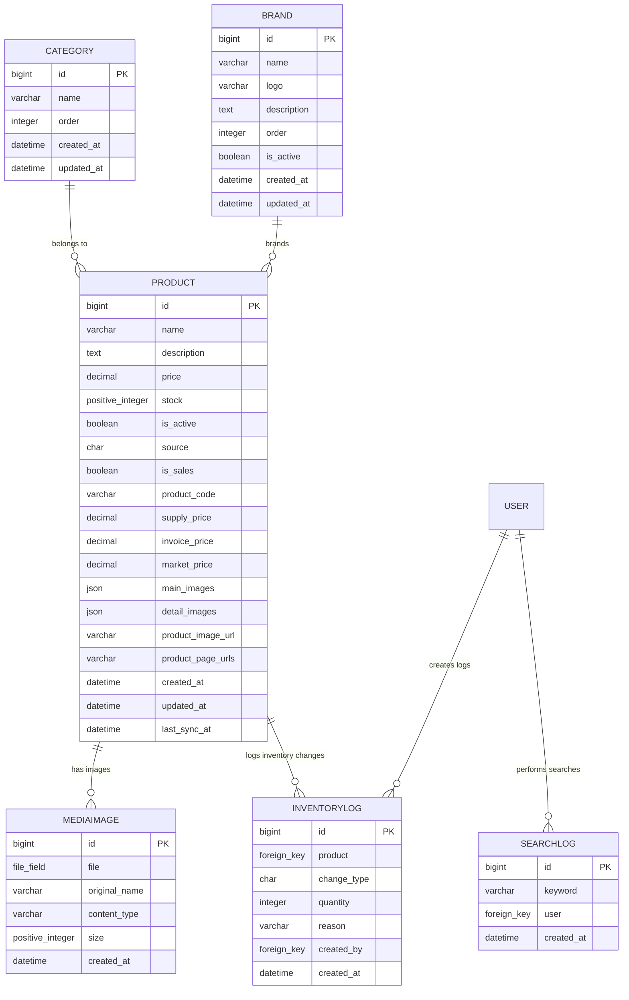
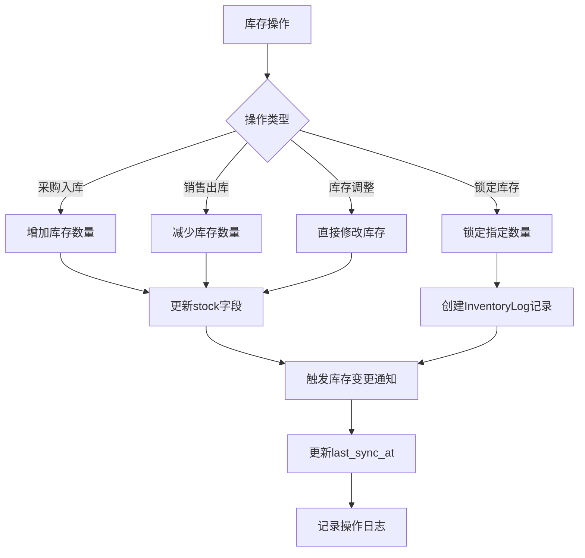
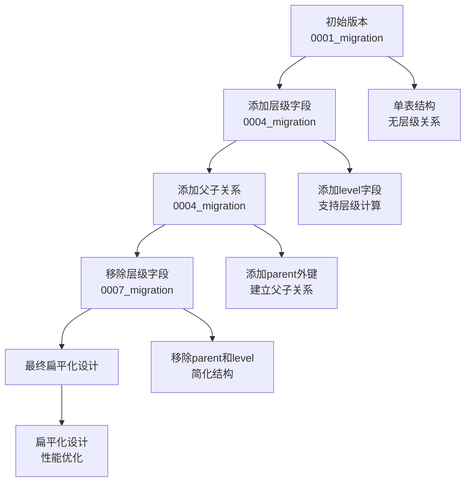
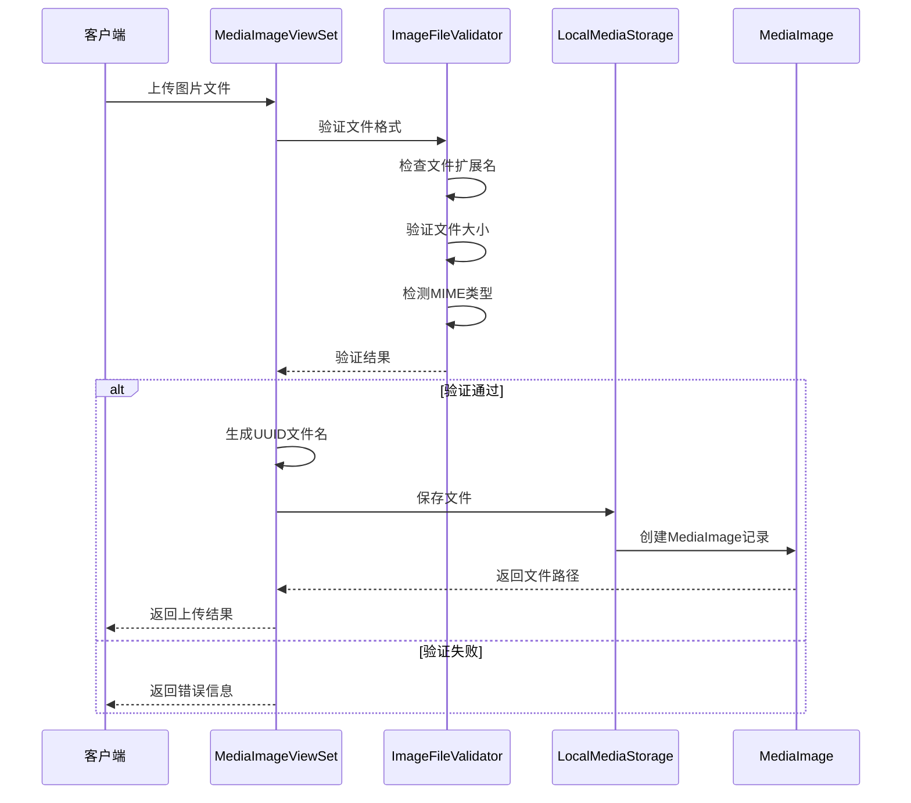
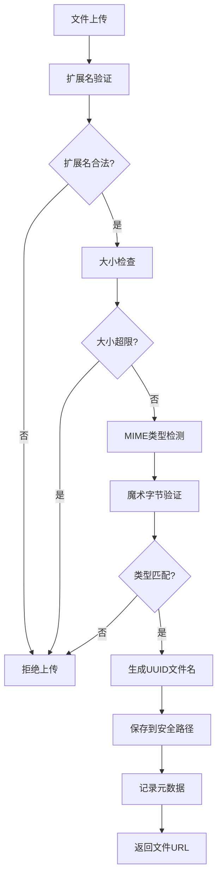
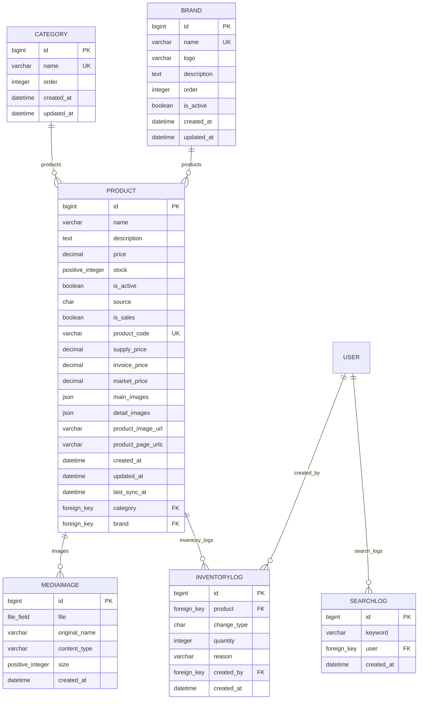
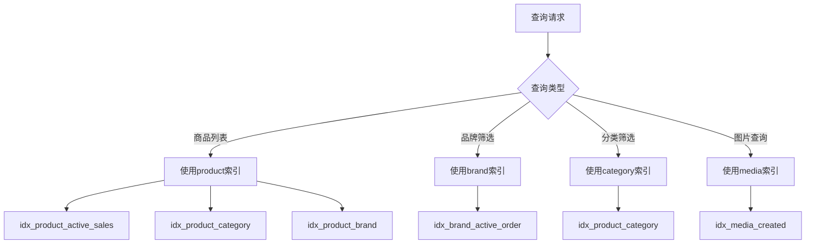
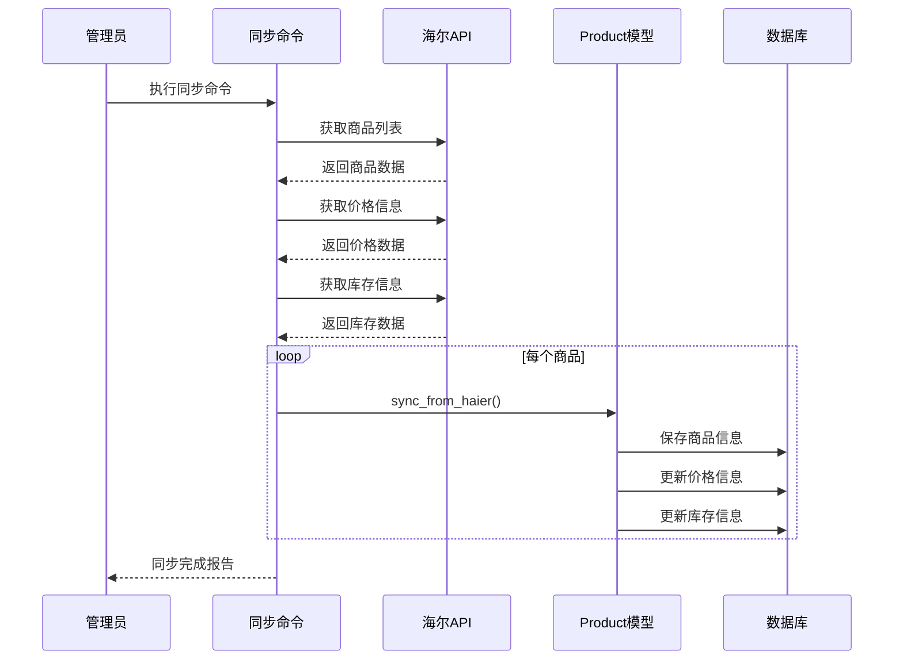
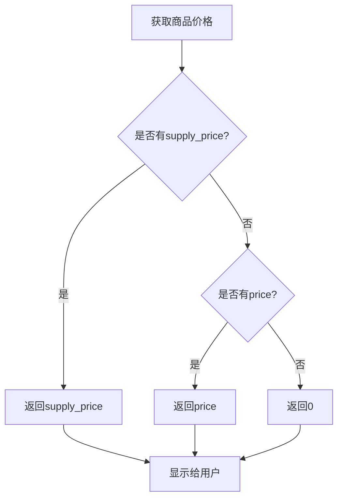
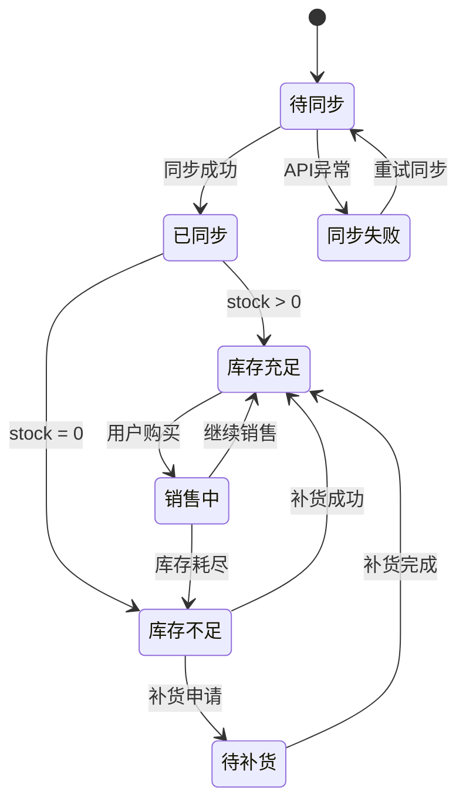

# 商品目录数据模型

<cite>
**本文档中引用的文件**
- [models.py](file://backend/catalog/models.py)
- [storage.py](file://backend/catalog/storage.py)
- [serializers.py](file://backend/catalog/serializers.py)
- [0001_initial.py](file://backend/catalog/migrations/0001_initial.py)
- [0004_alter_category_options_category_level_category_order_and_more.py](file://backend/catalog/migrations/0004_alter_category_options_category_level_category_order_and_more.py)
- [0007_flatten_categories_remove_parent_level.py](file://backend/catalog/migrations/0007_flatten_categories_remove_parent_level.py)
- [0010_extend_brand_model.py](file://backend/catalog/migrations/0010_extend_brand_model.py)
- [0011_product_supplier_product_supplier_code_and_more.py](file://backend/catalog/migrations/0011_product_supplier_product_supplier_code_and_more.py)
- [0014_product_invoice_price_product_is_sales_and_more.py](file://backend/catalog/migrations/0014_product_invoice_price_product_is_sales_and_more.py)
- [common/serializers.py](file://backend/common/serializers.py)
- [views.py](file://backend/catalog/views.py)
- [sync_haier_products.py](file://backend/catalog/management/commands/sync_haier_products.py)
- [haierapi.py](file://backend/integrations/haierapi.py)
</cite>

## 目录
1. [概述](#概述)
2. [核心数据模型](#核心数据模型)
3. [Product模型详解](#product模型详解)
4. [Category模型演进](#category模型演进)
5. [Brand模型扩展](#brand模型扩展)
6. [MediaImage模型安全机制](#mediaimage模型安全机制)
7. [模型关系图](#模型关系图)
8. [数据完整性约束](#数据完整性约束)
9. [索引优化策略](#索引优化策略)
10. [业务场景应用](#业务场景应用)

## 概述

商品目录模块是电商业务的核心数据层，包含四个主要模型：Product（商品）、Category（分类）、Brand（品牌）和MediaImage（媒体图片）。这些模型共同构成了一个完整的商品管理体系，支持本地商品管理和海尔API集成的混合业务模式。

## 核心数据模型

### 模型架构概览

**图表来源**
- [models.py](file://backend/catalog/models.py#L5-L312)

## Product模型详解

### 价格体系设计

Product模型实现了多层次的价格体系，以适应不同的业务需求：

| 字段名称 | 数据类型 | 描述 | 用途 |
|---------|---------|------|------|
| `price` | Decimal(10,2) | 基础销售价格 | 主要定价字段，用于前端展示 |
| `supply_price` | Decimal(10,2) | 普通供价 | 供应商供货价格，优先于基础价格 |
| `invoice_price` | Decimal(10,2) | 开票价 | 发票计价依据 |
| `market_price` | Decimal(10,2) | 市场价 | 参考市场价格 |
| `stock_rebate` | Decimal(10,2) | 直扣 | 库存折扣政策 |
| `rebate_money` | Decimal(10,2) | 台返 | 单台返利金额 |

### 库存管理机制

**图表来源**
- [models.py](file://backend/catalog/models.py#L181-L194)

### 商品状态管理

Product模型包含多个状态字段，用于精细化的商品管理：

| 字段 | 类型 | 默认值 | 描述 |
|------|------|--------|------|
| `is_active` | Boolean | True | 商品是否上架，影响前端展示 |
| `is_sales` | Char(1) | '1' | 海尔商品是否可采（1可采，0不可采） |
| `source` | Char(20) | 'local' | 商品来源：local（本地）或 haier（海尔） |
| `view_count` | PositiveInteger | 0 | 商品浏览次数 |
| `sales_count` | PositiveInteger | 0 | 商品销售数量 |

### 海尔集成字段

针对海尔API集成，Product模型扩展了专门的字段：

| 字段名称 | 数据类型 | 描述 | 业务用途 |
|---------|---------|------|----------|
| `product_code` | Char(50) | 海尔产品编码 | 唯一标识海尔商品 |
| `product_model` | Char(100) | 海尔产品型号 | 产品具体型号信息 |
| `product_group` | Char(100) | 海尔产品组 | 产品分组标识 |
| `warehouse_code` | Char(50) | 库位编码 | 仓库位置标识 |
| `warehouse_grade` | Char(1) | 仓库等级 | 0=本级仓，1=上级仓 |

**节点来源**
- [models.py](file://backend/catalog/models.py#L43-L205)

## Category模型演进

### 层级结构到扁平化设计

Category模型经历了从树形结构到扁平化设计的演进过程：

**图表来源**
- [0004_alter_category_options_category_level_category_order_and_more.py](file://backend/catalog/migrations/0004_alter_category_options_category_level_category_order_and_more.py#L14-L32)
- [0007_flatten_categories_remove_parent_level.py](file://backend/catalog/migrations/0007_flatten_categories_remove_parent_level.py#L11-L18)

### 分类字段定义

| 字段名称 | 数据类型 | 约束 | 描述 |
|---------|---------|------|------|
| `id` | BigAutoField | 主键 | 分类唯一标识 |
| `name` | Char(100) | 非空，唯一 | 分类名称 |
| `order` | Integer | 默认0 | 排序权重 |
| `created_at` | DateTime | 自动添加 | 创建时间 |
| `updated_at` | DateTime | 自动更新 | 更新时间 |

**节点来源**
- [models.py](file://backend/catalog/models.py#L5-L18)
- [0001_initial.py](file://backend/catalog/migrations/0001_initial.py#L23-L40)

## Brand模型扩展

### 扩展字段设计

Brand模型从简单的品牌名称扩展为包含完整品牌信息的模型：

| 字段名称 | 数据类型 | 约束 | 描述 |
|---------|---------|------|------|
| `id` | BigAutoField | 主键 | 品牌唯一标识 |
| `name` | Char(100) | 非空，唯一 | 品牌名称 |
| `logo` | URLField(500) | 可选 | 品牌Logo地址 |
| `description` | TextField | 可选 | 品牌描述 |
| `order` | Integer | 默认0 | 显示顺序 |
| `is_active` | Boolean | 默认True | 是否启用 |
| `created_at` | DateTime | 自动添加 | 创建时间 |
| `updated_at` | DateTime | 自动更新 | 更新时间 |

### 供应商和产地扩展

通过迁移文件扩展了品牌的相关字段：

| 字段名称 | 数据类型 | 约束 | 描述 |
|---------|---------|------|------|
| `supplier` | Char(50) | 可选 | 供应商标识 |
| `origin_country` | Char(50) | 可选 | 产地国家 |
| `supplier_code` | Char(100) | 可选 | 供应商系统商品代码 |

**节点来源**
- [models.py](file://backend/catalog/models.py#L21-L40)
- [0010_extend_brand_model.py](file://backend/catalog/migrations/0010_extend_brand_model.py#L13-L51)
- [0011_product_supplier_product_supplier_code_and_more.py](file://backend/catalog/migrations/0011_product_supplier_product_supplier_code_and_more.py#L13-L22)

## MediaImage模型安全机制

### 安全文件存储设计

MediaImage模型实现了完整的安全文件管理系统：

**图表来源**
- [views.py](file://backend/catalog/views.py#L749-L936)
- [serializers.py](file://backend/catalog/serializers.py#L255-L328)

### 文件安全特性

| 特性 | 实现方式 | 安全收益 |
|------|---------|----------|
| UUID文件名 | `uuid.uuid4().hex` | 防止文件覆盖和路径遍历攻击 |
| 扩展名白名单 | jpg, jpeg, png, gif, webp, bmp | 限制可上传文件类型 |
| 大小限制 | 最大20MB | 防止大文件攻击 |
| MIME类型检测 | 魔术字节检测 + 内容验证 | 防止文件类型欺骗 |
| 原始文件名保留 | `original_name`字段 | 用户体验和审计需要 |
| 内容类型记录 | `content_type`字段 | 文件类型追溯 |

### 文件处理流程

**图表来源**
- [common/serializers.py](file://backend/common/serializers.py#L51-L250)

**节点来源**
- [models.py](file://backend/catalog/models.py#L207-L229)
- [storage.py](file://backend/catalog/storage.py#L5-L15)

## 模型关系图

### 实体关系图

**图表来源**
- [models.py](file://backend/catalog/models.py#L5-L312)

## 数据完整性约束

### 外键约束

| 关系 | 约束类型 | 删除行为 | 业务影响 |
|------|---------|---------|----------|
| Product.category | 外键 | CASCADE | 删除分类时自动删除对应商品 |
| Product.brand | 外键 | CASCADE | 删除品牌时自动删除对应商品 |
| MediaImage.product | 外键 | CASCADE | 删除商品时自动删除关联图片 |
| InventoryLog.product | 外键 | CASCADE | 删除商品时自动删除库存日志 |
| InventoryLog.created_by | 外键 | SET_NULL | 删除用户时保留日志但清除操作人 |

### 唯一性约束

| 约束名称 | 字段组合 | 业务意义 |
|---------|---------|----------|
| `unique_product_code` | `product_code` | 海尔商品编码唯一性 |
| `unique_brand_name` | `name` | 品牌名称唯一性 |
| `unique_category_name` | `name` | 分类名称唯一性 |
| `unique_supplier_code` | `supplier`, `supplier_code` | 供应商商品唯一性 |

### 检查约束

| 字段 | 约束条件 | 验证逻辑 |
|------|---------|----------|
| `price` | ≥ 0 | 使用MinValueValidator(0) |
| `stock` | ≥ 0 | PositiveIntegerField |
| `size` | > 0 | PositiveIntegerField |
| `order` | ≥ 0 | IntegerField with default 0 |

**节点来源**
- [models.py](file://backend/catalog/models.py#L101-L113)
- [0011_product_supplier_product_supplier_code_and_more.py](file://backend/catalog/migrations/0011_product_supplier_product_supplier_code_and_more.py#L43-L46)

## 索引优化策略

### 性能优化索引

| 索引名称 | 字段组合 | 查询场景 | 性能收益 |
|---------|---------|----------|----------|
| `idx_product_active_sales` | `is_active`, `-sales_count` | 商品列表查询 | 加速活跃商品排序 |
| `idx_product_active_views` | `is_active`, `-view_count` | 热门商品排行 | 提升排序性能 |
| `idx_product_category` | `category`, `is_active` | 分类商品查询 | 减少扫描范围 |
| `idx_product_brand` | `brand`, `is_active` | 品牌商品查询 | 快速定位品牌商品 |
| `idx_product_created` | `-created_at` | 新品推荐 | 快速获取最新商品 |
| `idx_product_code` | `product_code` | 海尔商品查找 | 加速海尔商品检索 |
| `idx_product_sales` | `is_sales` | 可采商品查询 | 过滤可销售商品 |
| `idx_brand_active_order` | `is_active`, `order` | 品牌列表排序 | 优化品牌展示 |
| `idx_media_created` | `-created_at` | 最新图片查询 | 快速获取最新图片 |

### 索引使用场景分析

**图表来源**
- [models.py](file://backend/catalog/models.py#L105-L113)

**节点来源**
- [models.py](file://backend/catalog/models.py#L35-L37)
- [0011_product_supplier_product_supplier_code_and_more.py](file://backend/catalog/migrations/0011_product_supplier_product_supplier_code_and_more.py#L56-L58)

## 业务场景应用

### 海尔API集成场景

#### 商品同步流程

**图表来源**
- [sync_haier_products.py](file://backend/catalog/management/commands/sync_haier_products.py#L80-L142)
- [models.py](file://backend/catalog/models.py#L118-L177)

#### 价格显示逻辑

**图表来源**
- [models.py](file://backend/catalog/models.py#L196-L200)

### 商品管理业务流程

#### 商品状态流转

| 状态 | 条件 | 影响 |
|------|------|------|
| 上架 | `is_active=True` | 前端可见，可购买 |
| 下架 | `is_active=False` | 前端隐藏，不可购买 |
| 可采 | `is_sales='1'` | 可进行采购 |
| 不可采 | `is_sales='0'` | 无法采购，显示原因 |
| 库存不足 | `stock=0` | 显示缺货状态 |

#### 库存管理策略

**节点来源**
- [models.py](file://backend/catalog/models.py#L181-L194)
- [sync_haier_products.py](file://backend/catalog/management/commands/sync_haier_products.py#L112-L142)

### 品牌和分类管理

#### 品牌管理功能

| 功能 | 实现方式 | 业务价值 |
|------|---------|----------|
| 品牌启用/禁用 | `is_active`字段控制 | 灵活管理品牌展示 |
| 品牌排序 | `order`字段 | 控制品牌展示顺序 |
| 品牌搜索 | 名称模糊匹配 | 快速定位品牌 |
| 品牌统计 | `created_at`和`updated_at` | 品牌生命周期管理 |

#### 分类管理功能

| 功能 | 实现方式 | 业务价值 |
|------|---------|----------|
| 分类排序 | `order`字段 | 控制分类展示顺序 |
| 分类统计 | `products`反向查询 | 分类商品数量统计 |
| 分类导航 | 层级结构简化 | 简化前端导航逻辑 |

**节点来源**
- [models.py](file://backend/catalog/models.py#L12-L18)
- [models.py](file://backend/catalog/models.py#L31-L40)