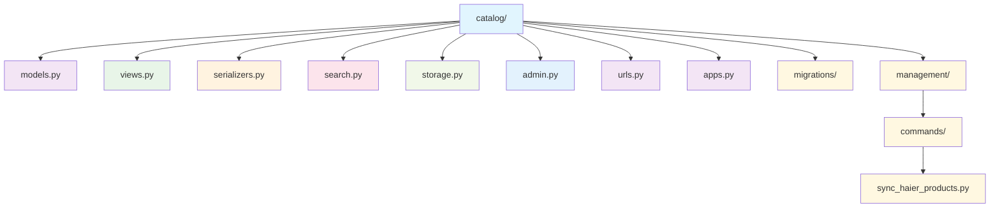
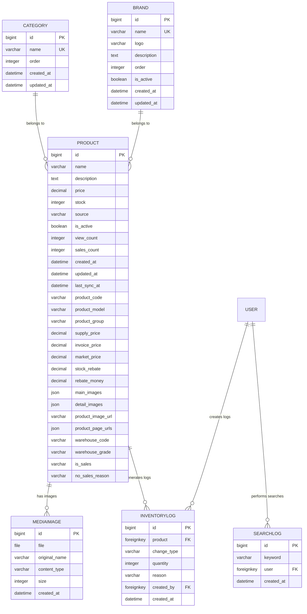
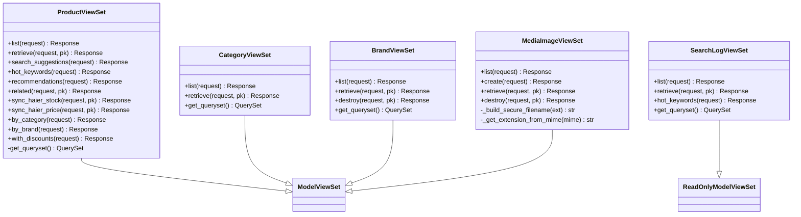
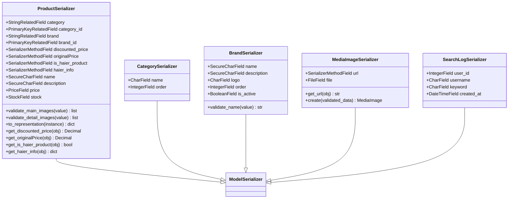
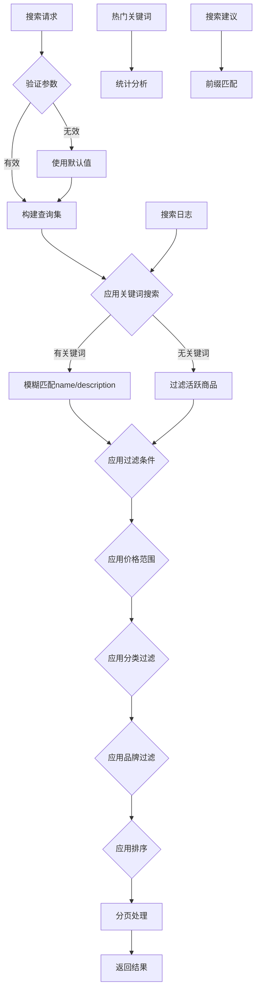
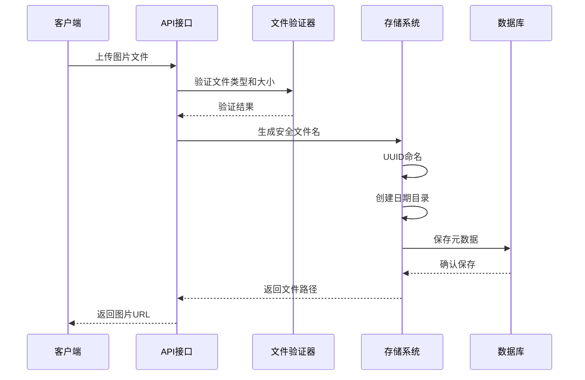
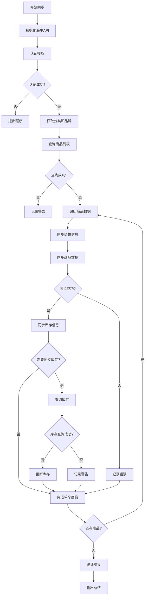
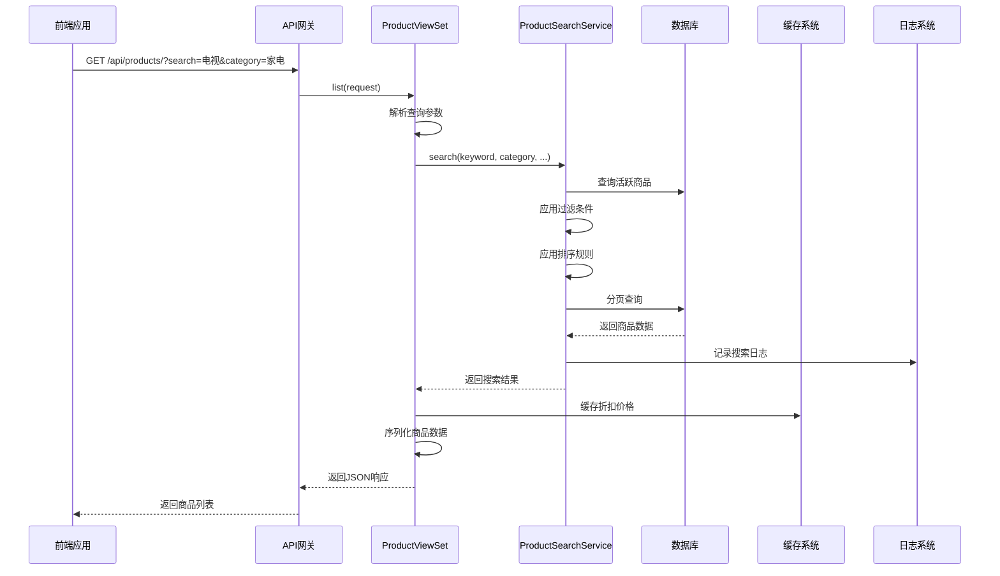

# 商品目录模块结构

<cite>
**本文档引用的文件**
- [models.py](file://backend/catalog/models.py)
- [views.py](file://backend/catalog/views.py)
- [serializers.py](file://backend/catalog/serializers.py)
- [search.py](file://backend/catalog/search.py)
- [storage.py](file://backend/catalog/storage.py)
- [sync_haier_products.py](file://backend/catalog/management/commands/sync_haier_products.py)
- [admin.py](file://backend/catalog/admin.py)
- [urls.py](file://backend/catalog/urls.py)
- [apps.py](file://backend/catalog/apps.py)
- [0001_initial.py](file://backend/catalog/migrations/0001_initial.py)
- [0005_mediaimage.py](file://backend/catalog/migrations/0005_mediaimage.py)
- [0015_product_source.py](file://backend/catalog/migrations/0015_product_source.py)
</cite>

## 目录
1. [简介](#简介)
2. [项目结构概览](#项目结构概览)
3. [核心模型架构](#核心模型架构)
4. [视图层设计](#视图层设计)
5. [序列化器系统](#序列化器系统)
6. [搜索服务](#搜索服务)
7. [媒体文件管理](#媒体文件管理)
8. [商品同步机制](#商品同步机制)
9. [扩展功能模块](#扩展功能模块)
10. [API调用链路分析](#api调用链路分析)
11. [性能优化策略](#性能优化策略)
12. [总结](#总结)

## 简介

商品目录模块是电商系统的核心组件，负责管理商品信息、分类、品牌、库存、搜索等功能。该模块采用Django REST Framework构建，提供了完整的商品生命周期管理能力，包括商品数据的增删改查、智能搜索、库存同步、媒体文件管理等核心功能。

模块设计遵循分层架构原则，将业务逻辑、数据访问、接口控制清晰分离，确保系统的可维护性和扩展性。通过集成海尔API，实现了与外部供应商的商品数据同步，支持混合商品管理模式。

## 项目结构概览

商品目录模块位于`backend/catalog/`目录下，采用标准的Django应用结构：

**图表来源**
- [models.py](file://backend/catalog/models.py#L1-L312)
- [views.py](file://backend/catalog/views.py#L1-L980)
- [serializers.py](file://backend/catalog/serializers.py#L1-L352)
- [search.py](file://backend/catalog/search.py#L1-L287)
- [storage.py](file://backend/catalog/storage.py#L1-L15)

**章节来源**
- [models.py](file://backend/catalog/models.py#L1-L312)
- [views.py](file://backend/catalog/views.py#L1-L980)
- [serializers.py](file://backend/catalog/serializers.py#L1-L352)
- [search.py](file://backend/catalog/search.py#L1-L287)
- [storage.py](file://backend/catalog/storage.py#L1-L15)

## 核心模型架构

### 实体关系设计

商品目录模块的核心模型包括Product（商品）、Category（分类）、Brand（品牌）、MediaImage（媒体图片）、SearchLog（搜索日志）和InventoryLog（库存日志）。这些模型形成了完整的商品管理体系。

**图表来源**
- [models.py](file://backend/catalog/models.py#L5-L312)

### Product模型详解

Product模型是整个商品体系的核心，包含了丰富的商品属性和业务逻辑：

#### 核心字段设计
- **基础信息字段**：name、description、price、stock等基本商品属性
- **分类品牌关联**：通过外键关联Category和Brand模型
- **商品来源标识**：SOURCE_LOCAL和SOURCE_HAIER两种商品类型
- **价格体系**：supply_price（供价）、invoice_price（开票价）、market_price（市场价）等多维度价格管理
- **库存信息**：stock（库存数量）、warehouse_code（库位编码）、warehouse_grade（仓库等级）

#### 海尔API集成字段
- **产品编码**：product_code唯一标识海尔商品
- **产品型号**：product_model、product_group等海尔特有的产品信息
- **价格政策**：stock_rebate（直扣）、rebate_money（台返）等促销价格
- **状态信息**：is_sales（可采状态）、no_sales_reason（不可采原因）

#### 统计与追踪字段
- **浏览销售统计**：view_count、sales_count用于商品热度分析
- **时间戳字段**：created_at、updated_at、last_sync_at记录时间信息
- **搜索日志**：自动记录商品被搜索的次数和频率

#### 关键方法实现
- **sync_from_haier()**：从海尔API同步商品数据的核心方法
- **update_stock_from_haier()**：更新海尔商品库存信息
- **display_price属性**：智能价格计算逻辑
- **is_available_from_haier属性**：判断海尔商品可采状态

**章节来源**
- [models.py](file://backend/catalog/models.py#L43-L312)

### Category和Brand模型

#### Category模型
- **层级结构支持**：通过order字段实现分类排序
- **索引优化**：包含多个复合索引提升查询性能
- **时间戳管理**：自动记录创建和更新时间

#### Brand模型
- **品牌信息管理**：logo、description等品牌相关信息
- **激活状态**：is_active字段控制品牌是否可见
- **排序功能**：通过order字段控制品牌展示顺序

**章节来源**
- [models.py](file://backend/catalog/models.py#L5-L41)

### 扩展功能模型

#### MediaImage模型
专门用于管理上传的媒体文件：
- **安全存储**：使用UUID生成唯一文件名防止冲突
- **元数据记录**：保存文件大小、内容类型、原始文件名
- **时间戳追踪**：记录文件创建时间

#### SearchLog模型
记录用户搜索行为：
- **关键词追踪**：记录搜索关键词和搜索时间
- **用户关联**：匿名用户和已登录用户的搜索记录
- **数据分析**：支持热门关键词统计和搜索趋势分析

#### InventoryLog模型
记录库存变更历史：
- **变更类型**：lock（锁定）、release（释放）、adjust（调整）
- **审计追踪**：记录每次库存变更的原因和操作人
- **商品关联**：与Product模型建立一对一关系

**章节来源**
- [models.py](file://backend/catalog/models.py#L207-L312)

## 视图层设计

### RESTful API架构

商品目录模块采用Django REST Framework构建RESTful API，提供了完整的CRUD操作和高级查询功能。

**图表来源**
- [views.py](file://backend/catalog/views.py#L29-L980)

### 核心API功能

#### 商品列表与搜索
- **高级搜索**：支持关键词、分类、品牌、价格范围的组合查询
- **智能排序**：relevance（相关性）、price_asc（价格升序）、price_desc（价格降序）、sales（销量）、created（创建时间）、views（浏览量）
- **分页支持**：默认每页20条，最大100条，支持自定义分页参数

#### 商品详情与推荐
- **详情获取**：预加载相关分类和品牌数据避免N+1查询
- **相关商品**：基于同一分类的商品推荐
- **热门推荐**：按销量、浏览量、综合评分推荐商品

#### 海尔API集成
- **库存同步**：管理员权限下的海尔商品库存实时同步
- **价格同步**：海尔商品价格信息的定期更新
- **状态检查**：验证海尔商品的可采状态

#### 媒体文件管理
- **安全上传**：文件类型验证、大小限制、恶意文件检测
- **格式转换**：支持WebP、JPEG、PNG等格式的图片压缩和转换
- **URL规范化**：统一的图片URL格式和路径处理

**章节来源**
- [views.py](file://backend/catalog/views.py#L29-L980)

### 权限控制机制

模块实现了细粒度的权限控制：
- **公开访问**：GET请求对所有用户开放
- **管理员权限**：POST、PUT、DELETE操作需要管理员权限
- **认证要求**：某些功能需要用户认证
- **功能隔离**：不同用户角色访问不同的API端点

**章节来源**
- [views.py](file://backend/catalog/views.py#L1-L20)

## 序列化器系统

### 数据序列化架构

序列化器系统负责将模型数据转换为API响应格式，同时进行数据验证和安全处理。

**图表来源**
- [serializers.py](file://backend/catalog/serializers.py#L16-L352)

### 高级序列化特性

#### 安全字段处理
- **SecureCharField**：防止XSS攻击的安全字符字段
- **ImageFileValidator**：图片文件类型和大小验证
- **PriceField**：价格字段的精度和范围控制
- **StockField**：库存字段的数值验证

#### 动态字段计算
- **折扣价格计算**：基于用户身份和优惠券动态计算
- **海尔商品信息**：条件性返回海尔API相关的商品信息
- **图片URL处理**：智能合并本地上传和海尔API的图片资源

#### 数据规范化
- **图片URL标准化**：统一处理相对路径和绝对路径
- **JSON字段处理**：确保图片列表的正确格式
- **价格显示逻辑**：优先使用供价，其次使用普通价格

**章节来源**
- [serializers.py](file://backend/catalog/serializers.py#L50-L352)

### 品牌序列化器特殊处理

品牌序列化器实现了额外的验证逻辑：
- **名称非空验证**：确保品牌名称不为空
- **唯一性检查**：防止重复的品牌名称
- **安全性处理**：过滤潜在的恶意输入

**章节来源**
- [serializers.py](file://backend/catalog/serializers.py#L22-L48)

## 搜索服务

### 全文搜索机制

ProductSearchService提供了强大的商品搜索功能，支持多种查询模式和排序策略。

**图表来源**
- [search.py](file://backend/catalog/search.py#L47-L287)

### 搜索算法优化

#### 关键词匹配策略
- **模糊搜索**：支持name和description字段的icontains查询
- **相关性排序**：基于关键词匹配程度进行排序
- **多字段权重**：name字段匹配权重高于description

#### 过滤条件组合
- **AND逻辑**：多个过滤条件同时生效
- **范围查询**：支持价格区间的精确过滤
- **精确匹配**：分类和品牌的完全匹配

#### 排序策略
- **相关性排序**：关键词搜索时优先匹配度
- **价格排序**：支持升序和降序排列
- **销量排序**：基于sales_count字段排序
- **时间排序**：基于创建时间和更新时间排序
- **综合排序**：多维度的综合评分排序

**章节来源**
- [search.py](file://backend/catalog/search.py#L47-L287)

### 性能优化策略

#### 分页机制
- **默认分页**：每页20条结果，最大100条
- **缓存友好**：支持大分页场景下的性能优化
- **元数据返回**：提供完整的分页信息

#### 索引利用
- **数据库索引**：充分利用模型定义的索引
- **查询优化**：避免N+1查询问题
- **批量查询**：支持批量商品信息获取

#### 缓存策略
- **搜索建议缓存**：缓存热门搜索关键词
- **折扣价格缓存**：减少数据库查询次数
- **热门商品缓存**：提升高频访问性能

**章节来源**
- [search.py](file://backend/catalog/search.py#L30-L44)

### 搜索分析功能

#### 热门关键词统计
- **时间范围**：支持指定天数范围内的搜索统计
- **去重计数**：基于搜索日志的去重统计
- **排序输出**：按搜索频率降序排列

#### 搜索建议系统
- **前缀匹配**：基于产品名称和搜索历史的前缀匹配
- **去重处理**：合并产品名称和搜索历史的建议
- **排序优化**：优先显示常用和热门的搜索建议

**章节来源**
- [search.py](file://backend/catalog/search.py#L223-L287)

## 媒体文件管理

### 文件存储架构

MediaImage模型和LocalMediaStorage提供了安全可靠的媒体文件管理解决方案。

**图表来源**
- [storage.py](file://backend/catalog/storage.py#L1-L15)
- [serializers.py](file://backend/catalog/serializers.py#L255-L352)

### 安全防护机制

#### 文件验证
- **MIME类型检测**：验证文件的真实类型
- **文件大小限制**：防止大文件上传导致的存储问题
- **扩展名白名单**：只允许特定格式的图片文件

#### 路径安全
- **UUID命名**：使用UUID生成唯一文件名防止冲突
- **目录隔离**：按日期创建子目录避免文件过多
- **路径遍历防护**：防止恶意路径注入攻击

#### 内容保护
- **原始文件名保存**：在数据库中保留原始文件名
- **内容类型记录**：记录文件的MIME类型
- **访问控制**：基于权限控制文件访问

**章节来源**
- [serializers.py](file://backend/catalog/serializers.py#L255-L352)
- [storage.py](file://backend/catalog/storage.py#L1-L15)

### 图片处理功能

#### URL规范化
- **相对路径处理**：自动转换相对路径为绝对路径
- **协议适配**：支持HTTP和HTTPS协议
- **查询参数保持**：保留URL中的查询参数和片段

#### 格式转换
- **WebP支持**：现代高效的图片格式
- **JPEG优化**：传统格式的优化处理
- **PNG处理**：透明背景图片的支持

**章节来源**
- [serializers.py](file://backend/catalog/serializers.py#L102-L178)

## 商品同步机制

### 海尔API集成

sync_haier_products.py命令实现了与海尔API的深度集成，支持商品数据的双向同步。

**图表来源**
- [sync_haier_products.py](file://backend/catalog/management/commands/sync_haier_products.py#L50-L156)

### 同步流程详解

#### 认证阶段
- **配置加载**：从settings中读取海尔API配置
- **令牌获取**：通过OAuth2.0流程获取访问令牌
- **权限验证**：验证API访问权限

#### 数据同步
- **商品查询**：支持批量和单个商品编码查询
- **价格同步**：获取最新的价格信息并更新
- **库存同步**：查询指定区域的库存状态
- **增量更新**：只更新发生变化的商品信息

#### 错误处理
- **网络异常**：处理API连接超时和网络错误
- **数据验证**：验证海尔API返回数据的完整性
- **回滚机制**：同步失败时的错误恢复策略

**章节来源**
- [sync_haier_products.py](file://backend/catalog/management/commands/sync_haier_products.py#L50-L156)

### 命令行参数

#### 基础参数
- **--product-codes**：指定要同步的商品编码列表
- **--category**：指定商品分类名称
- **--brand**：指定品牌名称

#### 功能参数
- **--sync-prices**：同步价格信息
- **--sync-stock**：同步库存信息
- **--county-code**：指定区域编码（默认北京东城区）

**章节来源**
- [sync_haier_products.py](file://backend/catalog/management/commands/sync_haier_products.py#L16-L49)

## 扩展功能模块

### 商品统计分析

#### 浏览和销售统计
- **浏览计数**：自动记录商品被查看的次数
- **销售统计**：跟踪商品的销售数量
- **热度排行**：基于浏览和销售数据的商品排名

#### 用户行为分析
- **搜索日志**：记录用户的搜索行为
- **点击追踪**：跟踪商品页面的访问情况
- **转化率分析**：分析从浏览到购买的转化过程

### 库存管理

#### 库存变更追踪
- **操作记录**：记录每次库存变更的操作
- **原因说明**：要求填写库存变更的原因
- **责任人追踪**：记录操作人的身份信息

#### 库存预警
- **低库存提醒**：当库存低于设定阈值时触发
- **安全库存**：设置合理的安全库存水平
- **补货建议**：基于历史销售数据的补货建议

**章节来源**
- [models.py](file://backend/catalog/models.py#L267-L312)

### 搜索日志分析

#### 热门关键词挖掘
- **频率统计**：统计搜索关键词的出现频率
- **趋势分析**：分析搜索趋势的变化规律
- **季节性特征**：识别具有季节性的搜索模式

#### 用户行为洞察
- **搜索意图分析**：通过关键词推断用户需求
- **搜索效率评估**：分析搜索结果的相关性
- **用户体验优化**：基于搜索数据改进搜索体验

**章节来源**
- [search.py](file://backend/catalog/search.py#L223-L287)

## API调用链路分析

### 完整调用流程

以下是商品查询请求的完整调用链路分析：

**图表来源**
- [views.py](file://backend/catalog/views.py#L83-L131)
- [search.py](file://backend/catalog/search.py#L47-L158)

### 性能监控点

#### 查询优化
- **索引利用**：确保查询条件能够利用数据库索引
- **查询合并**：将多个小查询合并为一个大查询
- **延迟加载**：按需加载关联数据避免过度查询

#### 缓存策略
- **查询结果缓存**：缓存频繁查询的商品数据
- **计算结果缓存**：缓存折扣价格等计算结果
- **元数据缓存**：缓存分类、品牌等静态数据

#### 异步处理
- **后台任务**：库存同步、价格更新等耗时操作
- **消息队列**：异步处理搜索日志、统计数据
- **定时任务**：定期清理过期数据、更新统计数据

**章节来源**
- [views.py](file://backend/catalog/views.py#L83-L131)
- [search.py](file://backend/catalog/search.py#L47-L158)

## 性能优化策略

### 数据库优化

#### 索引设计
- **复合索引**：Category和Brand的组合查询索引
- **覆盖索引**：包含查询所需的所有字段
- **选择性索引**：基于字段基数选择合适的索引

#### 查询优化
- **N+1查询避免**：使用select_related和prefetch_related
- **批量操作**：减少数据库往返次数
- **分页查询**：避免一次性加载大量数据

### 缓存策略

#### 多层缓存
- **应用层缓存**：Redis缓存热点数据
- **数据库查询缓存**：数据库级别的查询结果缓存
- **浏览器缓存**：静态资源的浏览器缓存

#### 缓存失效
- **主动失效**：数据更新时主动清除相关缓存
- **被动失效**：基于TTL的时间失效机制
- **版本控制**：基于数据版本的缓存更新

### 异步处理

#### 后台任务
- **商品同步**：异步执行海尔API数据同步
- **统计更新**：定期更新商品统计信息
- **日志处理**：异步处理搜索日志和操作日志

#### 消息队列
- **任务解耦**：将耗时任务放入消息队列
- **负载均衡**：分布式处理大量任务
- **故障恢复**：任务失败时的重试机制

## 总结

商品目录模块是一个功能完整、架构清晰的电商核心模块。它通过以下特点实现了高效的商品管理：

### 架构优势
- **分层设计**：清晰的模型、视图、序列化器分层
- **RESTful API**：符合REST规范的API设计
- **权限控制**：细粒度的权限管理和安全控制

### 功能特色
- **智能搜索**：支持多种查询模式和排序策略
- **多源商品**：支持本地商品和海尔API商品的混合管理
- **媒体管理**：安全可靠的图片上传和管理功能
- **统计分析**：完善的商品统计和用户行为分析

### 技术亮点
- **性能优化**：多层次的缓存策略和查询优化
- **扩展性强**：模块化设计便于功能扩展
- **易于维护**：清晰的代码结构和完善的注释

该模块为电商平台提供了坚实的商品管理基础，支持大规模的商品数据管理和复杂的业务场景，是构建现代化电商业务系统的重要组成部分。