# 管理命令与数据同步

<cite>
**本文档引用的文件**
- [sync_haier_products.py](file://backend/catalog/management/commands/sync_haier_products.py)
- [haierapi.py](file://backend/integrations/haierapi.py)
- [models.py](file://backend/catalog/models.py)
- [integrations/models.py](file://backend/integrations/models.py)
- [storage.py](file://backend/catalog/storage.py)
- [views.py](file://backend/catalog/views.py)
- [serializers.py](file://backend/catalog/serializers.py)
- [logging_config.py](file://backend/common/logging_config.py)
- [base.py](file://backend/backend/settings/base.py)
</cite>

## 目录
1. [概述](#概述)
2. [项目架构](#项目架构)
3. [核心组件分析](#核心组件分析)
4. [命令执行流程](#命令执行流程)
5. [API交互机制](#api交互机制)
6. [数据同步逻辑](#数据同步逻辑)
7. [图片本地化存储](#图片本地化存储)
8. [错误处理与重试机制](#错误处理与重试机制)
9. [日志记录与监控](#日志记录与监控)
10. [配置管理](#配置管理)
11. [生产环境部署](#生产环境部署)
12. [故障排除指南](#故障排除指南)

## 概述

本文档详细介绍了一个基于Django管理命令的商品数据同步系统，专门用于从海尔API获取商品数据、图片资源和库存信息，并将其同步到本地数据库。该系统具备完善的错误处理机制、事务管理和增量同步功能，确保数据的一致性和可靠性。

### 主要特性

- **多维度数据同步**：支持商品基本信息、价格信息、库存信息的同步
- **智能图片处理**：自动下载并本地化存储商品图片，使用UUID命名避免冲突
- **健壮的错误处理**：完善的异常捕获和重试机制
- **灵活的配置管理**：支持多种环境配置和动态参数调整
- **详细的日志记录**：全面的执行日志和审计跟踪

## 项目架构

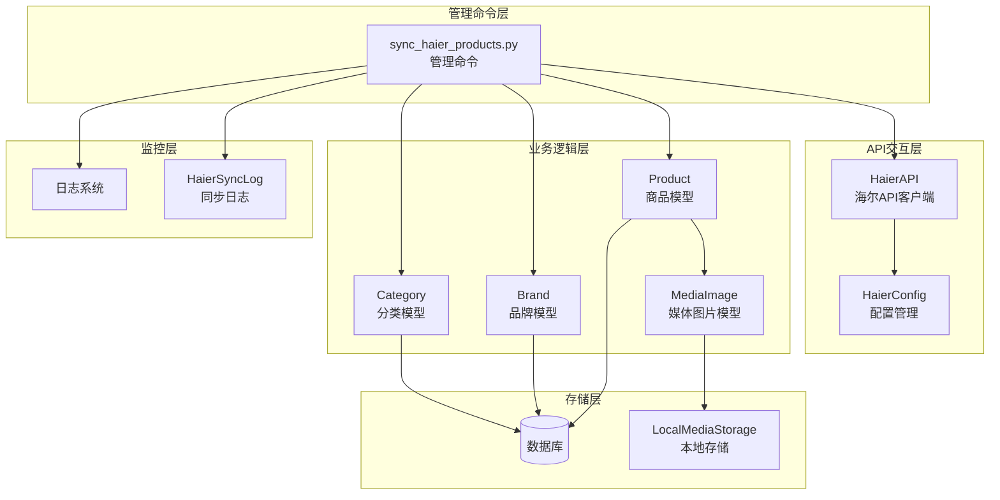

**图表来源**
- [sync_haier_products.py](file://backend/catalog/management/commands/sync_haier_products.py#L1-L156)
- [haierapi.py](file://backend/integrations/haierapi.py#L1-L214)
- [models.py](file://backend/catalog/models.py#L1-L312)

## 核心组件分析

### 管理命令组件

管理命令是整个同步系统的核心入口点，负责协调各个组件的工作流程。

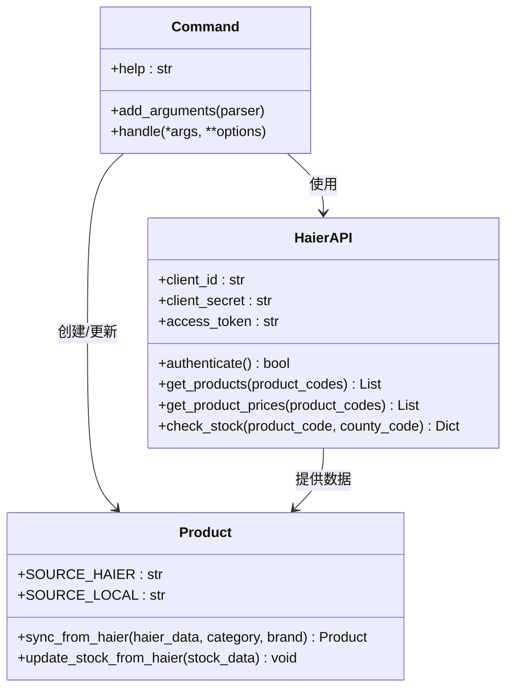

**图表来源**
- [sync_haier_products.py](file://backend/catalog/management/commands/sync_haier_products.py#L13-L156)
- [haierapi.py](file://backend/integrations/haierapi.py#L10-L214)
- [models.py](file://backend/catalog/models.py#L118-L195)

### API客户端组件

HaierAPI类封装了与海尔API的所有交互逻辑，提供认证、数据获取和错误处理功能。

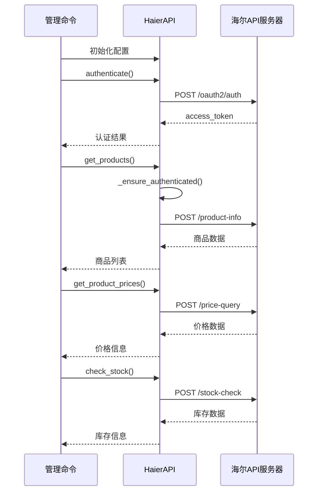

**图表来源**
- [sync_haier_products.py](file://backend/catalog/management/commands/sync_haier_products.py#L50-L156)
- [haierapi.py](file://backend/integrations/haierapi.py#L41-L214)

**章节来源**
- [sync_haier_products.py](file://backend/catalog/management/commands/sync_haier_products.py#L1-L156)
- [haierapi.py](file://backend/integrations/haierapi.py#L1-L214)

## 命令执行流程

### 参数配置

管理命令支持丰富的命令行参数，允许用户精确控制同步行为：

| 参数 | 类型 | 默认值 | 描述 |
|------|------|--------|------|
| --product-codes | List[str] | None | 指定要同步的产品编码列表 |
| --category | str | None | 指定商品分类名称 |
| --brand | str | None | 指定品牌名称 |
| --sync-prices | bool | False | 是否同步价格信息 |
| --sync-stock | bool | False | 是否同步库存信息 |
| --county-code | str | "110101" | 区域编码（用于库存查询） |

### 执行步骤

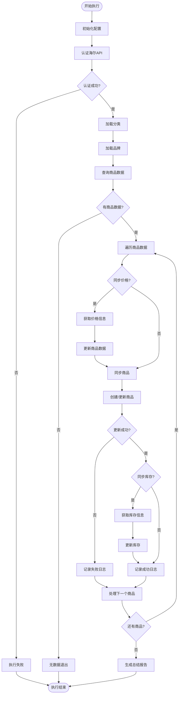

**图表来源**
- [sync_haier_products.py](file://backend/catalog/management/commands/sync_haier_products.py#L50-L156)

**章节来源**
- [sync_haier_products.py](file://backend/catalog/management/commands/sync_haier_products.py#L16-L48)

## API交互机制

### 认证流程

海尔API采用OAuth2.0客户端凭据模式进行认证：

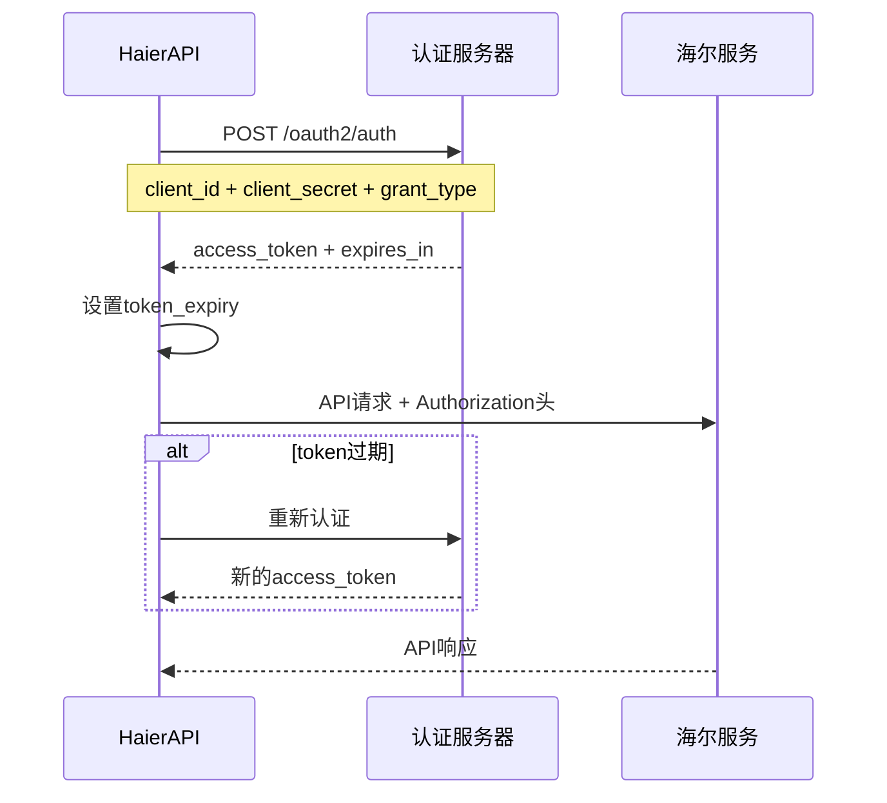

**图表来源**
- [haierapi.py](file://backend/integrations/haierapi.py#L41-L64)

### 数据接口

系统调用多个海尔API端点获取不同类型的商品数据：

| 接口类型 | 端点路径 | 功能描述 | 请求参数 |
|----------|----------|----------|----------|
| 商品查询 | `/product-info/procurable-products-out/check-procurable-products` | 获取可采购商品列表 | customerCode, supplierCode, productCodes |
| 价格查询 | `/goods-price/price-daily-sales/price-query/pt-out-list-price` | 获取商品价格信息 | customerCode, productCodes, priceType |
| 库存查询 | `/stock/get-available-stock-open` | 获取可用库存 | salesCode, productCode, countyCode |
| 物流查询 | `/logistics/sass/get-thirdparty-logistics-info-by-order-code-auth` | 获取物流信息 | orderCode, sellerCode |

**章节来源**
- [haierapi.py](file://backend/integrations/haierapi.py#L74-L214)

## 数据同步逻辑

### SKU匹配策略

系统采用多层次的SKU匹配机制确保数据准确性：

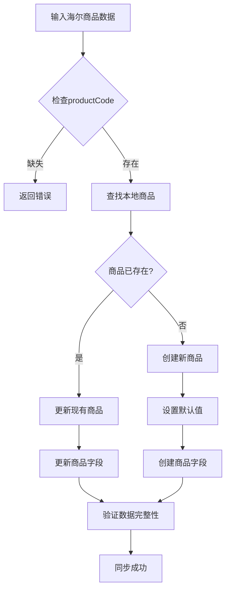

**图表来源**
- [models.py](file://backend/catalog/models.py#L118-L179)

### 价格更新策略

系统实现了智能的价格更新机制：

| 字段 | 更新规则 | 优先级 |
|------|----------|--------|
| supply_price | 海尔API提供的普通供价 | 最高 |
| invoice_price | 海尔API提供的开票价 | 高 |
| stock_rebate | 海尔API提供的直扣金额 | 中 |
| rebate_money | 海尔API提供的台返金额 | 中 |
| price | 作为最终销售价格 | 最低 |

### 增量同步逻辑

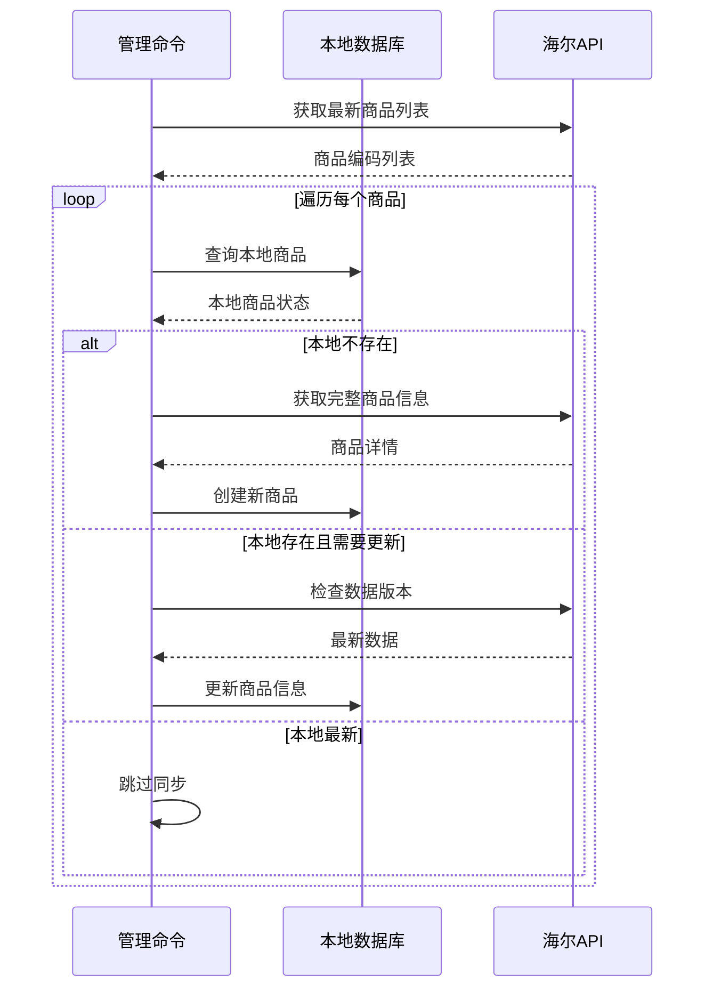

**图表来源**
- [models.py](file://backend/catalog/models.py#L118-L195)
- [sync_haier_products.py](file://backend/catalog/management/commands/sync_haier_products.py#L116-L142)

**章节来源**
- [models.py](file://backend/catalog/models.py#L118-L195)
- [sync_haier_products.py](file://backend/catalog/management/commands/sync_haier_products.py#L104-L142)

## 图片本地化存储

### 存储架构

系统采用分层的图片存储架构，确保图片的安全性和可访问性：

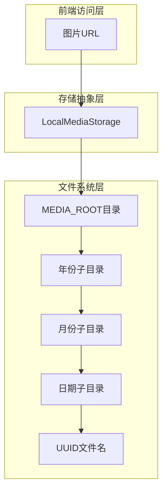

**图表来源**
- [storage.py](file://backend/catalog/storage.py#L5-L15)
- [views.py](file://backend/catalog/views.py#L773-L792)

### 文件命名策略

系统使用UUID-based的安全文件命名策略：

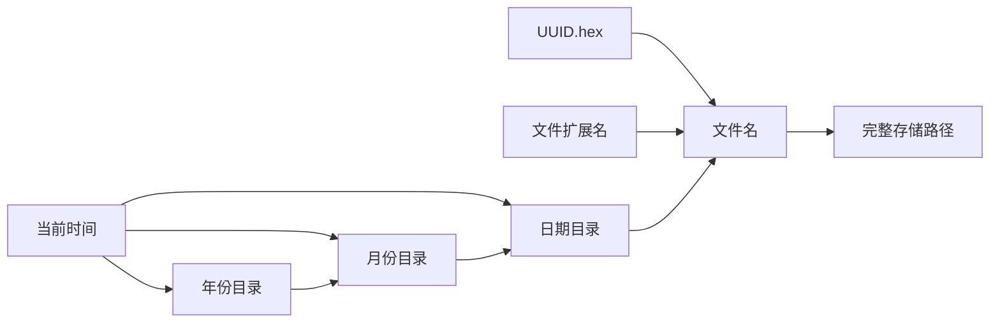

**图表来源**
- [views.py](file://backend/catalog/views.py#L773-L792)

### 图片处理流程

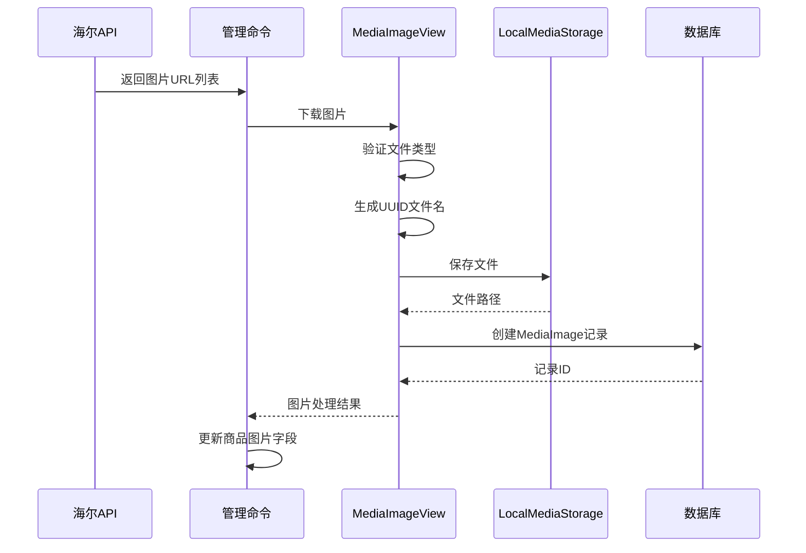

**图表来源**
- [views.py](file://backend/catalog/views.py#L840-L936)
- [serializers.py](file://backend/catalog/serializers.py#L280-L328)

**章节来源**
- [storage.py](file://backend/catalog/storage.py#L1-L15)
- [views.py](file://backend/catalog/views.py#L749-L936)
- [serializers.py](file://backend/catalog/serializers.py#L280-L328)

## 错误处理与重试机制

### 异常分类处理

系统对不同类型的异常采用差异化的处理策略：

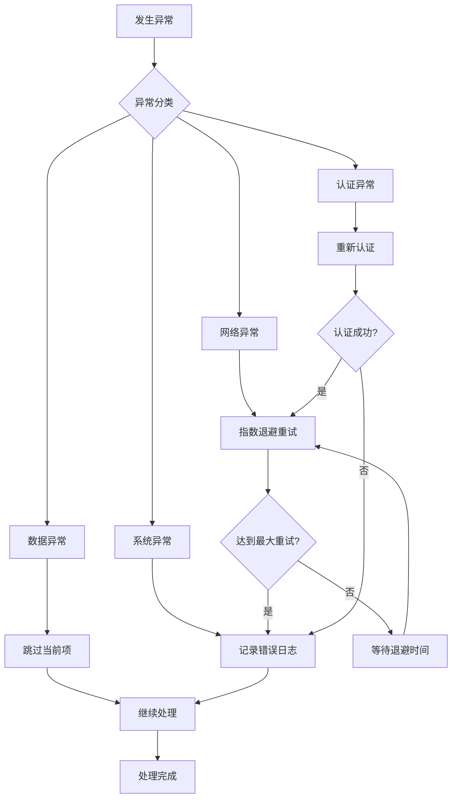

### 日志记录策略

系统实现了分级的日志记录机制：

| 日志级别 | 记录内容 | 触发条件 |
|----------|----------|----------|
| DEBUG | 详细执行信息 | 开发环境 |
| INFO | 关键操作记录 | 生产环境 |
| WARNING | 警告信息 | 可恢复错误 |
| ERROR | 错误信息 | 不可恢复错误 |
| CRITICAL | 严重错误 | 系统级错误 |

**章节来源**
- [sync_haier_products.py](file://backend/catalog/management/commands/sync_haier_products.py#L147-L151)
- [logging_config.py](file://backend/common/logging_config.py#L1-L428)

## 日志记录与监控

### 同步日志模型

系统提供了专门的同步日志模型用于审计和监控：

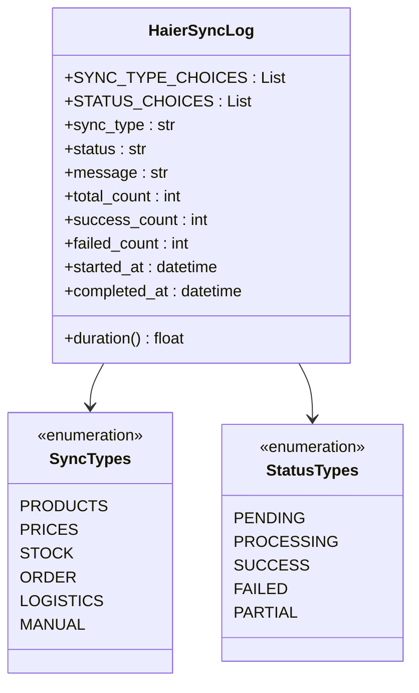

**图表来源**
- [integrations/models.py](file://backend/integrations/models.py#L50-L150)

### 监控指标

系统收集以下关键性能指标：

| 指标类型 | 指标名称 | 计算方式 | 监控阈值 |
|----------|----------|----------|----------|
| 吞吐量 | 每分钟同步商品数 | 成功同步数/执行时间 | >100商品/分钟 |
| 准确率 | 同步成功率 | 成功数/总数 | >95% |
| 响应时间 | API调用平均延迟 | 总时间/调用次数 | <5秒 |
| 错误率 | 失败率 | 失败数/总数 | <5% |
| 可用性 | 系统可用时间 | 运行时间/总时间 | >99.9% |

**章节来源**
- [integrations/models.py](file://backend/integrations/models.py#L50-L150)

## 配置管理

### 环境配置

系统支持多环境配置管理：

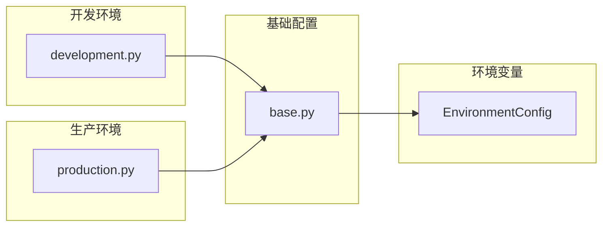

**图表来源**
- [base.py](file://backend/backend/settings/base.py#L235-L246)

### 配置参数

| 参数名称 | 环境变量 | 默认值 | 用途 |
|----------|----------|--------|------|
| HAIER_CLIENT_ID | HAIER_CLIENT_ID | '' | 海尔API客户端ID |
| HAIER_CLIENT_SECRET | HAIER_CLIENT_SECRET | '' | 海尔API客户端密钥 |
| HAIER_TOKEN_URL | HAIER_TOKEN_URL | 测试地址 | 认证服务器地址 |
| HAIER_BASE_URL | HAIER_BASE_URL | 测试地址 | API基础URL |
| HAIER_CUSTOMER_CODE | HAIER_CUSTOMER_CODE | '' | 客户编码 |
| HAIER_SEND_TO_CODE | HAIER_SEND_TO_CODE | '' | 发送目标编码 |
| HAIER_SUPPLIER_CODE | HAIER_SUPPLIER_CODE | '' | 供应商编码 |
| HAIER_PASSWORD | HAIER_PASSWORD | '' | 通用密码 |
| HAIER_SELLER_PASSWORD | HAIER_SELLER_PASSWORD | '' | 卖家密码 |

**章节来源**
- [base.py](file://backend/backend/settings/base.py#L235-L246)

## 生产环境部署

### Cron定时任务配置

推荐的cron配置示例：

```bash
# 每天凌晨2点同步商品数据
0 2 * * * /path/to/python /path/to/manage.py sync_haier_products --sync-prices --sync-stock >> /var/log/sync_haier.log 2>&1

# 每小时同步价格信息
0 * * * * /path/to/python /path/to/manage.py sync_haier_products --sync-prices >> /var/log/sync_prices.log 2>&1

# 每30分钟检查库存变化
*/30 * * * * /path/to/python /path/to/manage.py sync_haier_products --sync-stock --county-code 110101 >> /var/log/sync_stock.log 2>&1
```

### 监控建议

1. **健康检查**：定期检查API连接状态
2. **性能监控**：监控同步时间和成功率
3. **容量规划**：跟踪数据增长趋势
4. **告警设置**：
   - 同步失败率超过5%
   - API响应时间超过10秒
   - 磁盘空间不足

### 安全考虑

1. **API密钥保护**：使用环境变量存储敏感信息
2. **网络隔离**：限制API访问的网络范围
3. **访问控制**：仅授权账户可以执行同步命令
4. **审计日志**：记录所有同步操作的详细信息

## 故障排除指南

### 常见问题及解决方案

| 问题类型 | 症状 | 可能原因 | 解决方案 |
|----------|------|----------|----------|
| 认证失败 | "认证失败"错误 | API密钥无效 | 检查环境变量配置 |
| 网络超时 | 请求超时 | 网络连接问题 | 检查网络连通性 |
| 数据不一致 | 同步前后数据不符 | 并发修改冲突 | 实施乐观锁机制 |
| 存储空间不足 | 图片上传失败 | 磁盘空间满 | 清理旧文件 |
| 权限错误 | 文件写入失败 | 目录权限问题 | 检查文件系统权限 |

### 调试技巧

1. **启用调试模式**：设置`DEBUG=True`查看详细错误信息
2. **查看日志文件**：检查`logs/`目录下的各类日志文件
3. **单个商品测试**：使用`--product-codes`参数测试特定商品
4. **分步执行**：分别测试认证、数据获取和存储功能

### 性能优化建议

1. **批量处理**：合理设置`product_codes`参数减少API调用
2. **并发控制**：避免同时运行多个同步任务
3. **缓存策略**：缓存认证令牌减少重复认证
4. **索引优化**：确保数据库表有适当的索引

**章节来源**
- [sync_haier_products.py](file://backend/catalog/management/commands/sync_haier_products.py#L1-L156)
- [logging_config.py](file://backend/common/logging_config.py#L1-L428)