# 用户模块结构

<cite>
**本文档引用的文件**
- [users/models.py](file://backend/users/models.py)
- [users/views.py](file://backend/users/views.py)
- [users/serializers.py](file://backend/users/serializers.py)
- [users/services.py](file://backend/users/services.py)
- [users/urls.py](file://backend/users/urls.py)
- [users/admin.py](file://backend/users/admin.py)
- [common/permissions.py](file://backend/common/permissions.py)
- [common/responses.py](file://backend/common/responses.py)
- [backend/settings/base.py](file://backend/backend/settings/base.py)
</cite>

## 目录
1. [简介](#简介)
2. [项目结构概览](#项目结构概览)
3. [核心数据模型](#核心数据模型)
4. [认证与授权机制](#认证与授权机制)
5. [API视图层详解](#api视图层详解)
6. [数据序列化与反序列化](#数据序列化与反序列化)
7. [业务逻辑服务层](#业务逻辑服务层)
8. [权限控制系统](#权限控制系统)
9. [响应格式标准化](#响应格式标准化)
10. [调用链路分析](#调用链路分析)
11. [总结](#总结)

## 简介

用户模块是电商业务系统的核心组件，采用Django REST Framework构建了完整的用户管理体系。该模块实现了微信小程序登录、传统用户名密码登录、用户资料管理、收货地址管理等功能，同时集成了JWT认证机制和完善的权限控制体系。

## 项目结构概览

用户模块遵循Django应用的标准目录结构，包含以下核心文件：

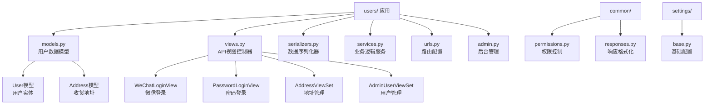

**图表来源**
- [users/models.py](file://backend/users/models.py#L1-L95)
- [users/views.py](file://backend/users/views.py#L1-L460)
- [users/serializers.py](file://backend/users/serializers.py#L1-L92)
- [users/services.py](file://backend/users/services.py#L1-L55)

**章节来源**
- [users/models.py](file://backend/users/models.py#L1-L95)
- [users/views.py](file://backend/users/views.py#L1-L460)
- [users/serializers.py](file://backend/users/serializers.py#L1-L92)
- [users/services.py](file://backend/users/services.py#L1-L55)
- [users/urls.py](file://backend/users/urls.py#L1-L18)

## 核心数据模型

### User模型设计

User模型继承自Django的AbstractUser，扩展了微信小程序登录所需的字段：

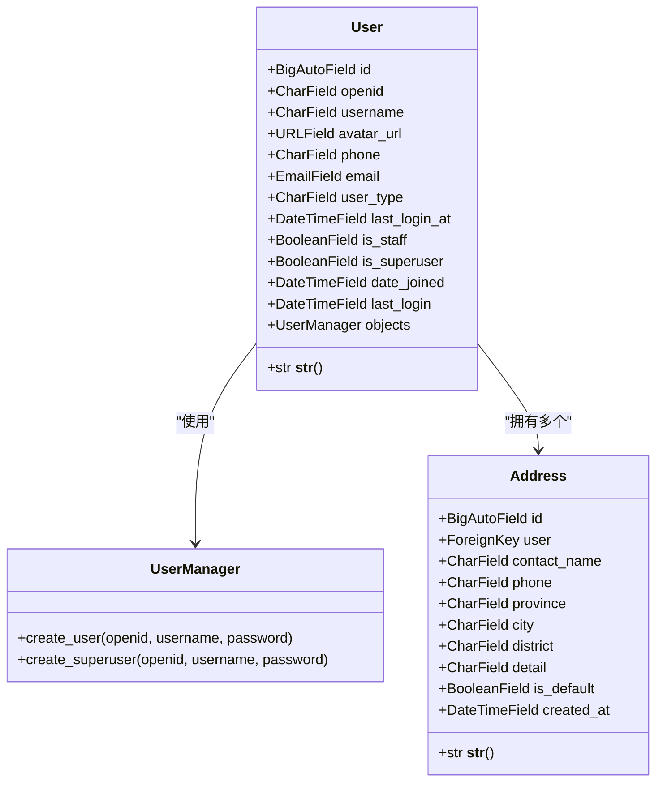

**图表来源**
- [users/models.py](file://backend/users/models.py#L31-L74)
- [users/models.py](file://backend/users/models.py#L77-L95)

#### 关键字段说明

| 字段名 | 类型 | 描述 | 默认值 |
|--------|------|------|--------|
| openid | CharField | 微信小程序唯一标识符 | null |
| username | CharField | 用户名，唯一约束 | 自动生成 |
| avatar_url | URLField | 头像链接 | Gravatar默认头像 |
| phone | CharField | 手机号码 | 空字符串 |
| email | EmailField | 电子邮箱 | 空字符串 |
| user_type | CharField | 用户类型：wechat/admin | 'wechat' |
| last_login_at | DateTimeField | 最后登录时间 | null |

#### 用户类型枚举

系统支持两种用户类型：
- `wechat`: 微信小程序用户，通过openid识别
- `admin`: 系统管理员用户，具有完整管理权限

**章节来源**
- [users/models.py](file://backend/users/models.py#L31-L74)

### Address模型设计

Address模型与User模型建立一对多关系，支持用户的多个收货地址：

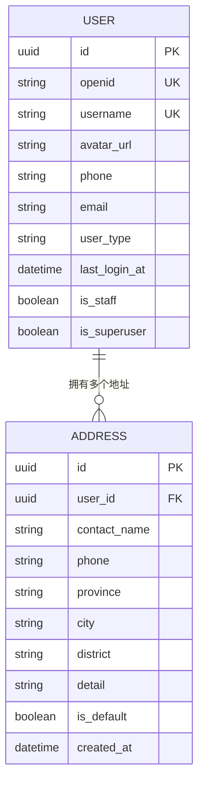

**图表来源**
- [users/models.py](file://backend/users/models.py#L77-L95)

**章节来源**
- [users/models.py](file://backend/users/models.py#L77-L95)

## 认证与授权机制

### JWT认证集成

系统采用REST Framework SimpleJWT实现JWT认证：

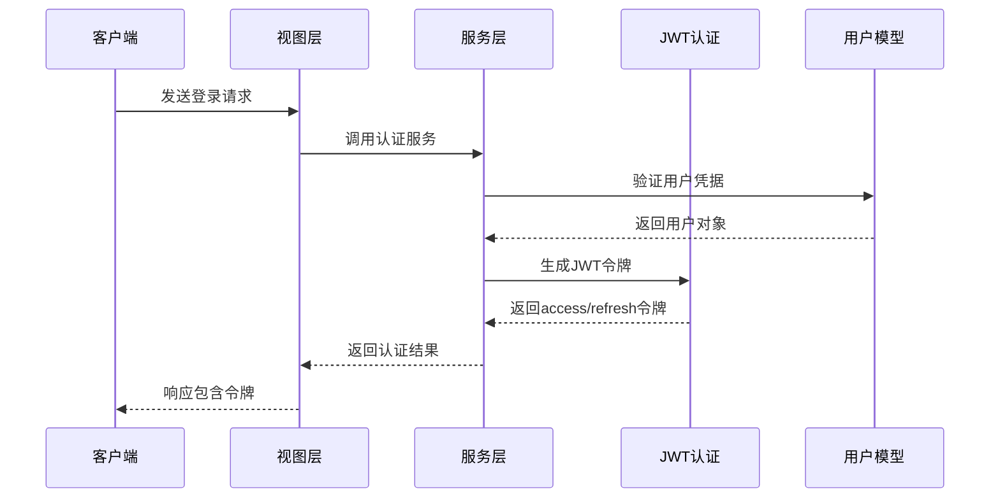

**图表来源**
- [users/views.py](file://backend/users/views.py#L49-L154)
- [users/services.py](file://backend/users/services.py#L22-L24)

#### JWT配置参数

| 参数 | 值 | 描述 |
|------|-----|------|
| ACCESS_TOKEN_LIFETIME | 7天 | 访问令牌有效期 |
| REFRESH_TOKEN_LIFETIME | 30天 | 刷新令牌有效期 |

### 双重认证模式

系统支持两种认证方式：

1. **微信小程序认证**：基于openid的无密码认证
2. **传统密码认证**：基于用户名和密码的传统认证

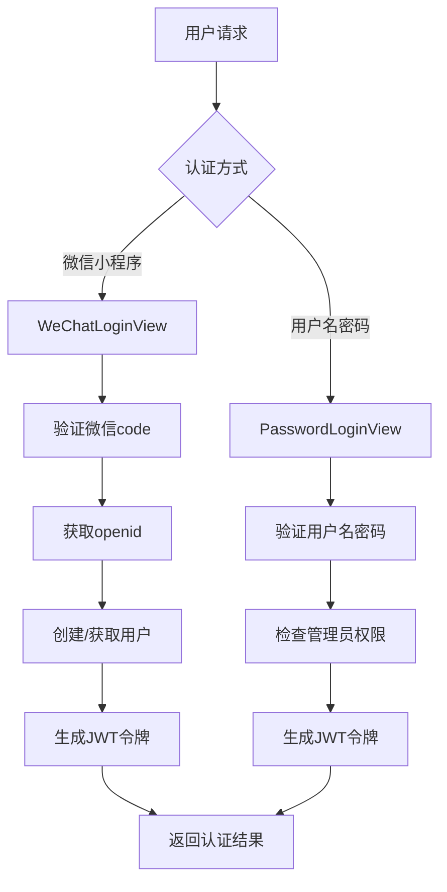

**图表来源**
- [users/views.py](file://backend/users/views.py#L22-L154)
- [users/views.py](file://backend/users/views.py#L161-L233)

**章节来源**
- [backend/settings/base.py](file://backend/backend/settings/base.py#L142-L146)
- [users/views.py](file://backend/users/views.py#L22-L154)
- [users/views.py](file://backend/users/views.py#L161-L233)

## API视图层详解

### 登录API实现

#### 微信小程序登录

WeChatLoginView处理微信小程序的登录流程：

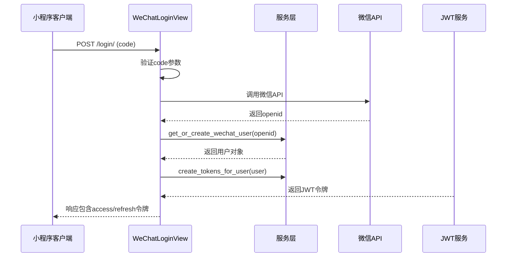

**图表来源**
- [users/views.py](file://backend/users/views.py#L49-L154)

#### 密码登录

PasswordLoginView处理管理员的用户名密码登录：

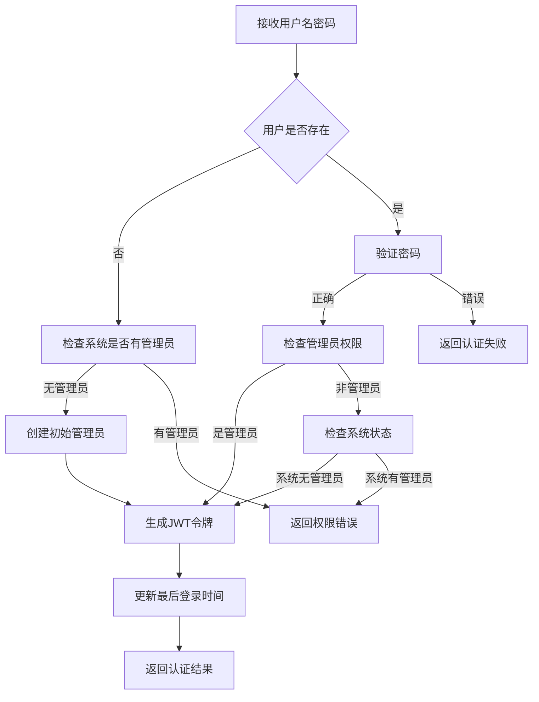

**图表来源**
- [users/views.py](file://backend/users/views.py#L177-L233)

### 地址管理API

AddressViewSet提供了完整的地址管理功能：

| 方法 | 路径 | 权限 | 功能 |
|------|------|------|------|
| GET | /addresses/ | IsAuthenticated | 获取用户地址列表 |
| POST | /addresses/ | IsAuthenticated | 创建新地址 |
| GET | /addresses/{id}/ | IsAuthenticated | 获取单个地址 |
| PUT/PATCH | /addresses/{id}/ | IsAuthenticated | 更新地址 |
| DELETE | /addresses/{id}/ | IsAuthenticated | 删除地址 |
| POST | /addresses/{id}/set_default/ | IsAuthenticated | 设置默认地址 |
| POST | /addresses/parse/ | IsAuthenticated | 地址解析 |

**章节来源**
- [users/views.py](file://backend/users/views.py#L287-L386)

### 用户管理API

AdminUserViewSet为管理员提供用户管理功能：

```mermaid
classDiagram
class AdminUserViewSet {
+GET /users/ : 获取用户列表
+POST /users/ : 创建用户
+GET /users/{id}/ : 获取用户详情
+PUT /users/{id}/ : 更新用户
+DELETE /users/{id}/ : 删除用户
+POST /users/{id}/set_admin/ : 设置管理员
+POST /users/{id}/unset_admin/ : 取消管理员
}
class IsAdmin {
+has_permission() : 检查管理员权限
}
AdminUserViewSet --> IsAdmin : "使用权限检查"
```

**图表来源**
- [users/views.py](file://backend/users/views.py#L387-L460)

**章节来源**
- [users/views.py](file://backend/users/views.py#L287-L460)

## 数据序列化与反序列化

### 用户序列化器

#### UserSerializer

UserSerializer扩展了ModelSerializer，添加了统计字段：

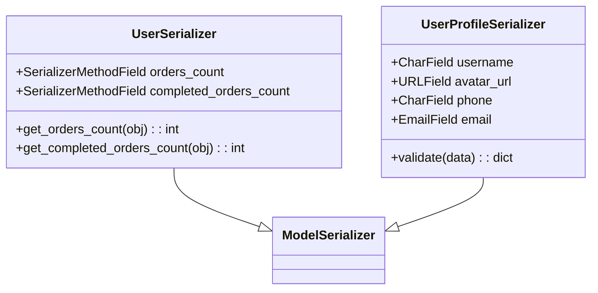

**图表来源**
- [users/serializers.py](file://backend/users/serializers.py#L6-L42)
- [users/serializers.py](file://backend/users/serializers.py#L43-L55)

#### AddressSerializer

AddressSerializer处理地址数据的创建和更新：

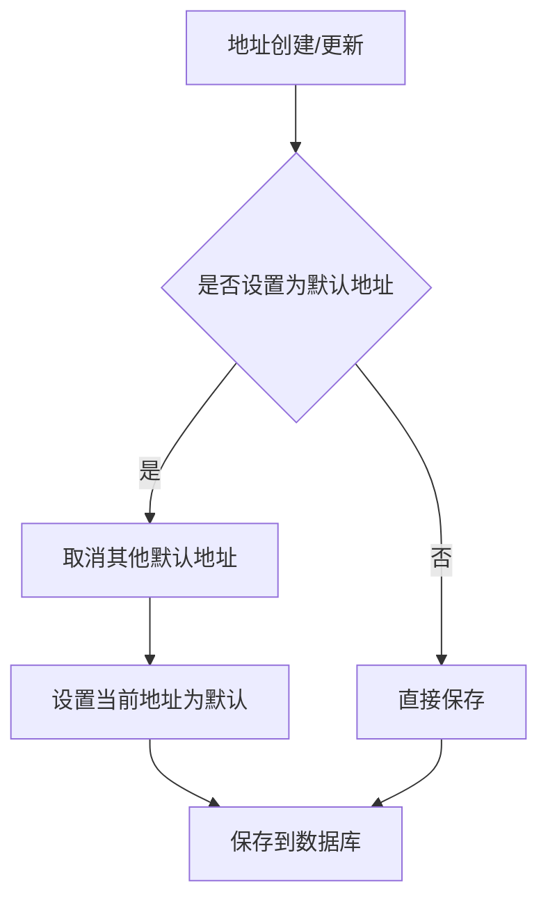

**图表来源**
- [users/serializers.py](file://backend/users/serializers.py#L78-L91)

### 缓存优化策略

序列化器中实现了缓存机制来优化性能：

| 缓存键格式 | 过期时间 | 缓存内容 |
|------------|----------|----------|
| `user_orders_count_{user_id}` | 5分钟 | 用户订单总数 |
| `user_completed_orders_count_{user_id}` | 5分钟 | 已完成订单数 |

**章节来源**
- [users/serializers.py](file://backend/users/serializers.py#L6-L92)

## 业务逻辑服务层

### 核心服务函数

services.py模块封装了用户相关的业务逻辑：

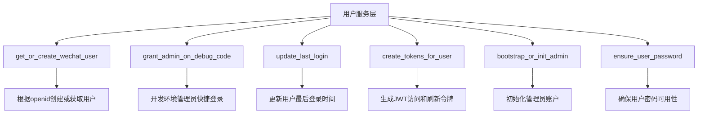

**图表来源**
- [users/services.py](file://backend/users/services.py#L1-L55)

### 管理员初始化流程

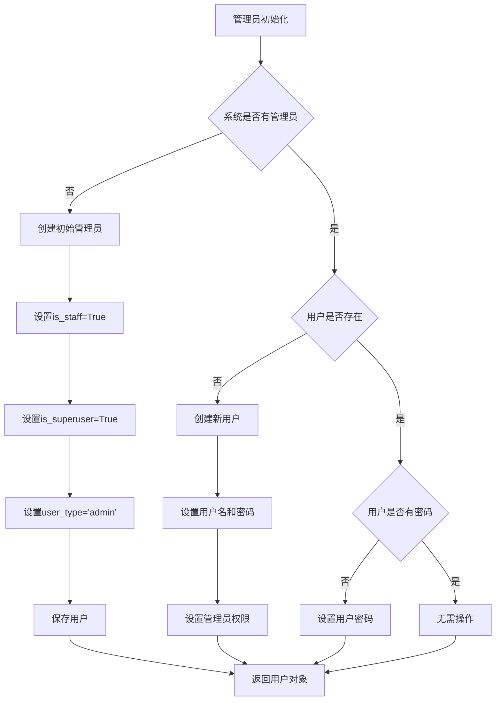

**图表来源**
- [users/services.py](file://backend/users/services.py#L26-L49)

**章节来源**
- [users/services.py](file://backend/users/services.py#L1-L55)

## 权限控制系统

### 权限类架构

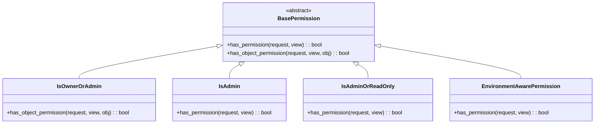

**图表来源**
- [common/permissions.py](file://backend/common/permissions.py#L12-L189)

### 权限应用场景

| 权限类 | 应用场景 | 权限要求 |
|--------|----------|----------|
| IsAuthenticated | 用户资料管理 | 必须登录 |
| IsOwnerOrAdmin | 地址管理 | 用户本人或管理员 |
| IsAdmin | 用户管理 | 管理员身份 |
| IsAdminOrReadOnly | 商品管理 | 管理员可写，所有人只读 |

**章节来源**
- [common/permissions.py](file://backend/common/permissions.py#L12-L189)

## 响应格式标准化

### 统一响应结构

系统采用统一的响应格式，便于前端处理：

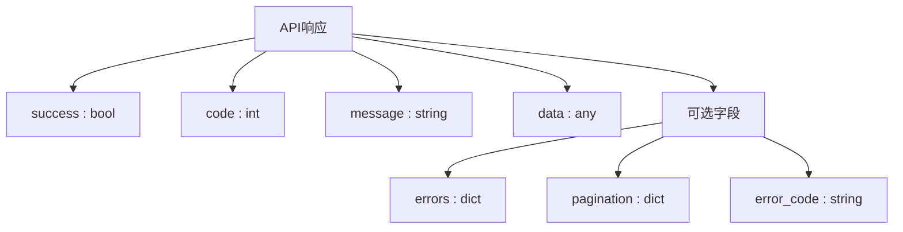

**图表来源**
- [common/responses.py](file://backend/common/responses.py#L15-L322)

### 错误处理机制

| HTTP状态码 | 错误类型 | 处理方式 |
|------------|----------|----------|
| 400 | 请求错误 | 显示具体错误信息 |
| 401 | 认证失败 | 要求重新登录 |
| 403 | 权限不足 | 提示无访问权限 |
| 404 | 资源不存在 | 提示资源未找到 |
| 500 | 服务器错误 | 记录日志，显示通用错误 |

**章节来源**
- [common/responses.py](file://backend/common/responses.py#L15-L322)

## 调用链路分析

### 典型登录流程

以下是用户登录的完整调用链路：

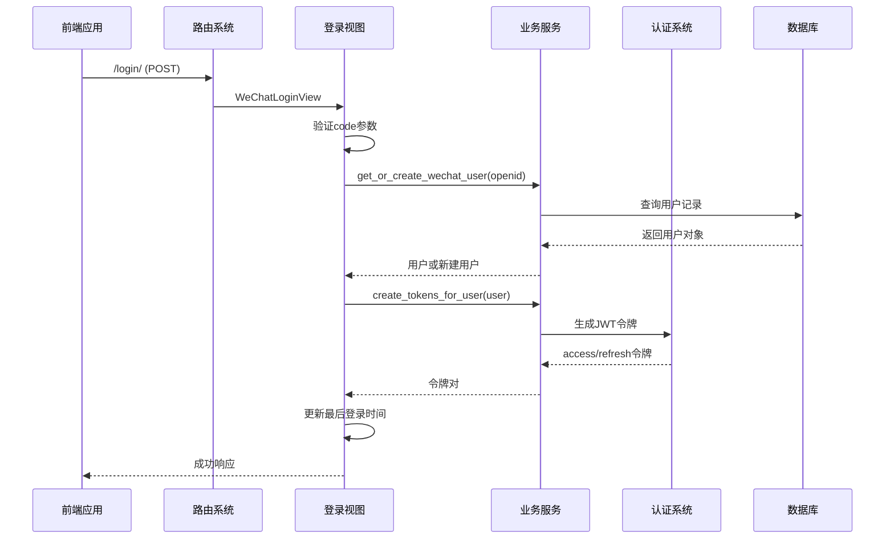

**图表来源**
- [users/views.py](file://backend/users/views.py#L49-L154)
- [users/services.py](file://backend/users/services.py#L22-L24)

### API路由映射

| 路径 | 视图类 | 功能描述 |
|------|--------|----------|
| `/login/` | WeChatLoginView | 微信小程序登录 |
| `/password_login/` | PasswordLoginView | 管理员密码登录 |
| `/user/profile/` | user_profile | 用户资料管理 |
| `/user/statistics/` | user_statistics | 用户统计信息 |
| `/addresses/` | AddressViewSet | 收货地址管理 |
| `/users/` | AdminUserViewSet | 用户管理 |

**章节来源**
- [users/urls.py](file://backend/users/urls.py#L1-L18)

## 总结

用户模块展现了现代Django REST Framework项目的最佳实践，主要特点包括：

### 架构优势

1. **模块化设计**：清晰的职责分离，各层功能明确
2. **双认证机制**：支持微信小程序和传统登录方式
3. **权限控制**：细粒度的权限管理，支持角色区分
4. **性能优化**：缓存机制提升用户体验
5. **标准化响应**：统一的API响应格式

### 技术亮点

- **JWT认证**：安全可靠的令牌认证机制
- **缓存策略**：智能缓存减少数据库压力
- **异常处理**：完善的错误处理和日志记录
- **开发友好**：丰富的API文档和调试工具

### 安全特性

- 敏感信息加密存储
- 强制权限验证
- 防止SQL注入和XSS攻击
- 开发环境特殊权限控制

该用户模块为整个电商业务系统提供了坚实的基础，支撑了复杂的用户管理和业务流程，是系统架构设计的优秀范例。