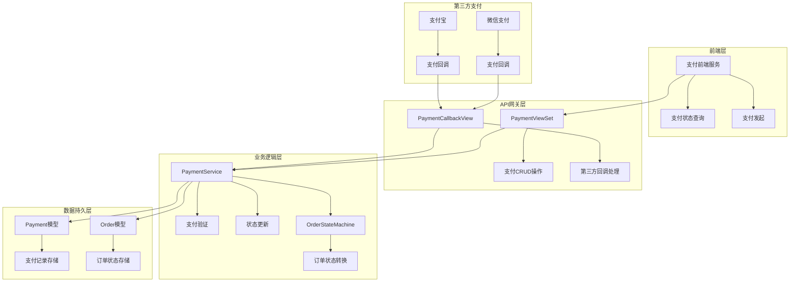
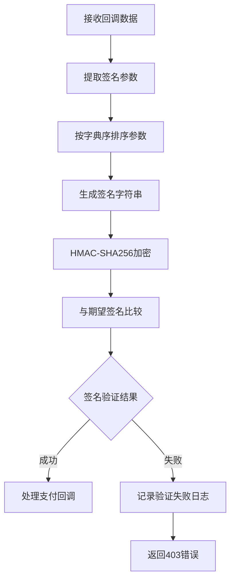
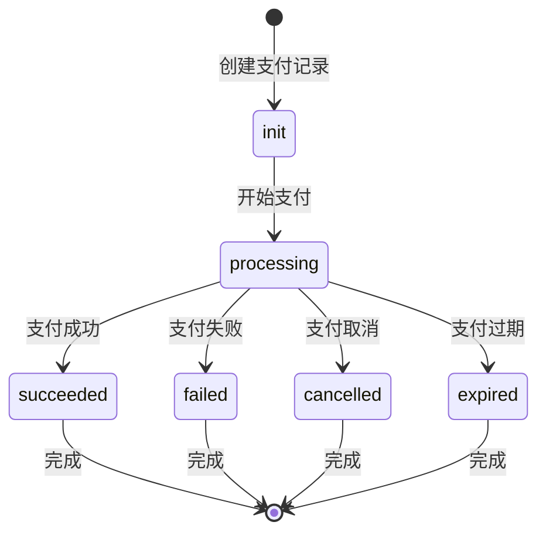
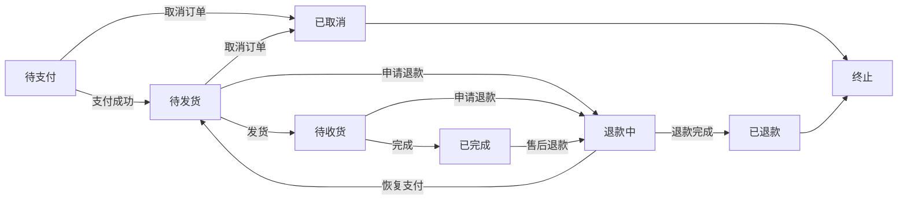
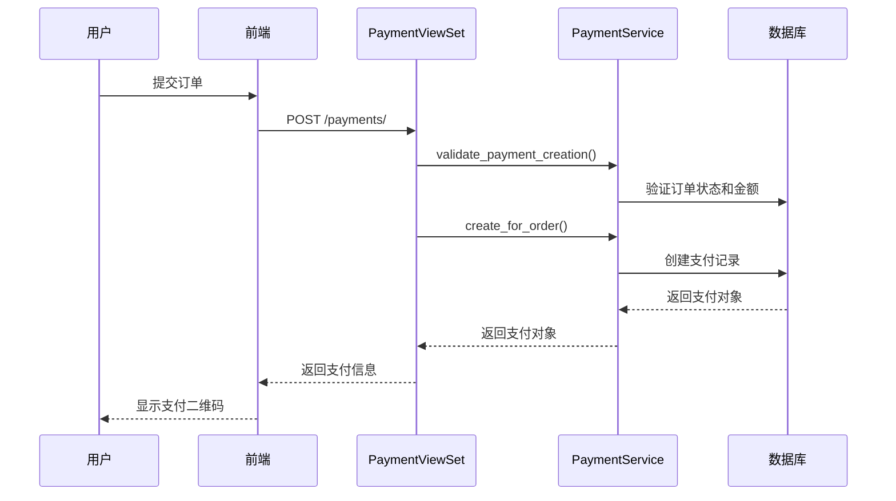
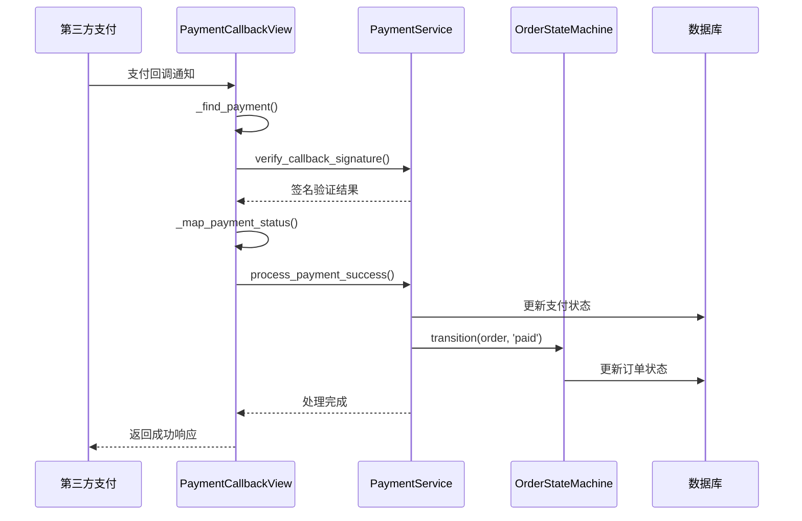
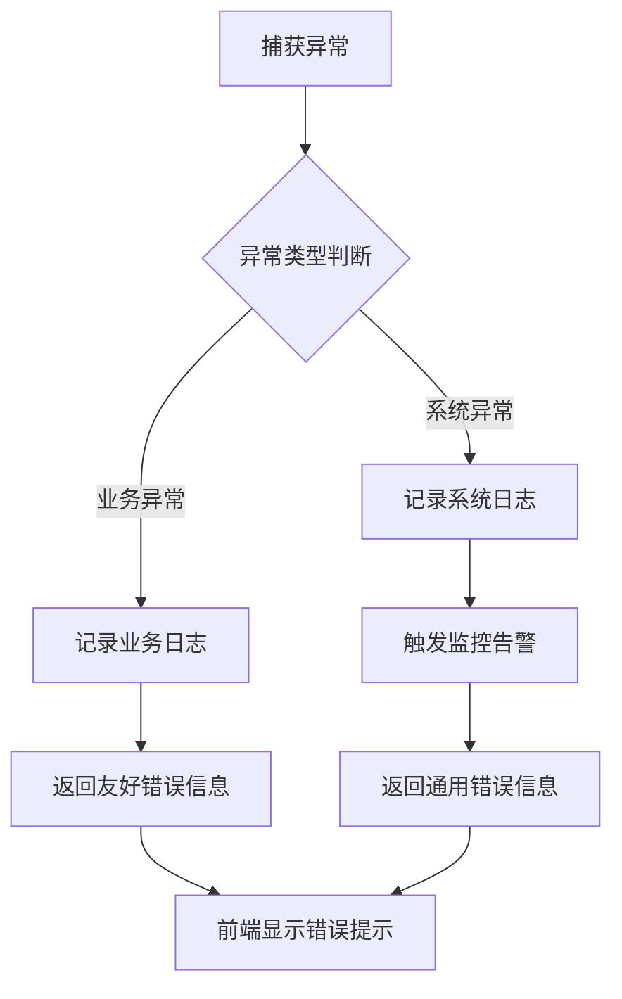

# 支付服务集成

<cite>
**本文档引用的文件**
- [payment_service.py](file://backend/orders/payment_service.py)
- [models.py](file://backend/orders/models.py)
- [views.py](file://backend/orders/views.py)
- [serializers.py](file://backend/orders/serializers.py)
- [state_machine.py](file://backend/orders/state_machine.py)
- [urls.py](file://backend/orders/urls.py)
- [payment.ts](file://frontend/src/services/payment.ts)
- [base.py](file://backend/backend/settings/base.py)
</cite>

## 目录
1. [概述](#概述)
2. [系统架构](#系统架构)
3. [核心组件分析](#核心组件分析)
4. [支付流程详解](#支付流程详解)
5. [安全机制](#安全机制)
6. [API接口文档](#api接口文档)
7. [错误处理策略](#错误处理策略)
8. [最佳实践](#最佳实践)
9. [故障排除指南](#故障排除指南)

## 概述

本支付服务集成系统是一个完整的电商支付解决方案，负责处理与第三方支付平台（如微信支付）的交互。系统采用模块化设计，通过PaymentService类封装支付业务逻辑，确保支付过程的安全性、可靠性和可扩展性。

### 主要功能特性

- **多支付方式支持**：支持微信支付、支付宝、银行卡等多种支付方式
- **安全回调验证**：采用HMAC-SHA256算法验证支付回调签名
- **防重复支付**：通过数据库锁和状态检查防止重复处理
- **状态机管理**：使用状态机模式管理订单和支付状态流转
- **完整日志记录**：记录支付全流程的详细日志便于审计和调试

## 系统架构



**架构图来源**
- [views.py](file://backend/orders/views.py#L781-L800)
- [payment_service.py](file://backend/orders/payment_service.py#L20-L292)
- [models.py](file://backend/orders/models.py#L186-L234)

## 核心组件分析

### PaymentService类

PaymentService是支付服务的核心类，提供以下关键功能：

#### 1. 回调签名验证



**图表来源**
- [payment_service.py](file://backend/orders/payment_service.py#L30-L68)

#### 2. 支付金额验证

系统采用容差机制处理浮点数精度问题，允许0.01元的误差范围。

#### 3. 支付状态处理



**图表来源**
- [payment_service.py](file://backend/orders/payment_service.py#L106-L204)
- [state_machine.py](file://backend/orders/state_machine.py#L25-L57)

**章节来源**
- [payment_service.py](file://backend/orders/payment_service.py#L20-L292)

### Payment模型

Payment模型定义了支付记录的数据结构和业务规则：

| 字段名 | 类型 | 描述 | 默认值 |
|--------|------|------|--------|
| id | BigAutoField | 支付记录主键 | 自动生成 |
| order | ForeignKey | 关联的订单 | 必填 |
| amount | Decimal | 支付金额 | 必填 |
| method | Char | 支付方式 | 'wechat' |
| status | Char | 支付状态 | 'init' |
| created_at | DateTime | 创建时间 | 自动设置 |
| updated_at | DateTime | 更新时间 | 自动更新 |
| expires_at | DateTime | 过期时间 | 必填 |
| logs | JSONField | 支付日志 | [] |

**章节来源**
- [models.py](file://backend/orders/models.py#L186-L234)

### 订单状态机

OrderStateMachine使用状态机模式管理订单状态流转，确保状态转换的合法性：



**图表来源**
- [state_machine.py](file://backend/orders/state_machine.py#L33-L57)

**章节来源**
- [state_machine.py](file://backend/orders/state_machine.py#L25-L289)

## 支付流程详解

### 支付创建流程



**图表来源**
- [views.py](file://backend/orders/views.py#L136-L217)
- [payment_service.py](file://backend/orders/payment_service.py#L206-L242)

### 支付回调处理流程



**图表来源**
- [views.py](file://backend/orders/views.py#L1133-L1296)
- [payment_service.py](file://backend/orders/payment_service.py#L106-L204)

**章节来源**
- [views.py](file://backend/orders/views.py#L1133-L1296)
- [payment_service.py](file://backend/orders/payment_service.py#L106-L204)

## 安全机制

### 签名验证机制

系统采用多层次的安全防护措施：

#### 1. HMAC-SHA256签名验证

```python
# 签名验证算法示例
sorted_params = sorted(data.items())
sign_str = '&'.join([f'{k}={v}' for k, v in sorted_params])
expected_signature = hmac.new(
    secret.encode('utf-8'),
    sign_str.encode('utf-8'),
    hashlib.sha256
).hexdigest()
return hmac.compare_digest(signature, expected_signature)
```

#### 2. 防重复支付机制

- 使用数据库锁（select_for_update）防止并发处理
- 检查支付记录状态，避免重复处理
- 设置支付过期时间限制

#### 3. 敏感信息保护

- 支付金额验证采用容差机制
- 日志记录中过滤敏感信息
- 使用HTTPS传输确保数据安全

**章节来源**
- [payment_service.py](file://backend/orders/payment_service.py#L30-L68)
- [payment_service.py](file://backend/orders/payment_service.py#L143-L149)

## API接口文档

### 支付相关API

#### 1. 创建支付记录

**请求**
```http
POST /api/payments/
Content-Type: application/json
Authorization: Bearer <token>

{
  "order_id": 123,
  "method": "wechat",
  "amount": "100.00"
}
```

**响应**
```json
{
  "id": 1,
  "order": 123,
  "amount": "100.00",
  "method": "wechat",
  "status": "init",
  "created_at": "2024-01-01T10:00:00Z",
  "updated_at": "2024-01-01T10:00:00Z",
  "expires_at": "2024-01-01T10:30:00Z",
  "logs": []
}
```

#### 2. 支付回调处理

**请求**
```http
POST /api/payments/callback/wechat/
Content-Type: application/json

{
  "payment_id": 1,
  "transaction_id": "wx_123456789",
  "status": "SUCCESS",
  "amount": "100.00",
  "signature": "abc123..."
}
```

**响应**
```json
{
  "id": 1,
  "order": 123,
  "amount": "100.00",
  "method": "wechat",
  "status": "succeeded",
  "created_at": "2024-01-01T10:00:00Z",
  "updated_at": "2024-01-01T10:05:00Z",
  "expires_at": "2024-01-01T10:30:00Z",
  "logs": [
    {
      "t": "2024-01-01T10:05:00Z",
      "event": "payment_succeeded",
      "operator": "system",
      "detail": "Payment processed successfully"
    }
  ]
}
```

**章节来源**
- [views.py](file://backend/orders/views.py#L136-L217)
- [views.py](file://backend/orders/views.py#L1133-L1296)

## 错误处理策略

### 常见错误码及处理

| 错误类型 | HTTP状态码 | 描述 | 处理建议 |
|----------|------------|------|----------|
| 签名验证失败 | 403 | 回调签名不匹配 | 检查密钥配置和参数顺序 |
| 支付记录不存在 | 404 | 支付ID或订单号无效 | 验证支付记录存在性 |
| 支付已过期 | 400 | 支付超时 | 提示用户重新下单 |
| 状态转换失败 | 400 | 订单状态非法转换 | 检查订单状态和业务逻辑 |
| 系统内部错误 | 500 | 服务器处理异常 | 记录日志并监控告警 |

### 异常处理流程



**章节来源**
- [payment_service.py](file://backend/orders/payment_service.py#L286-L292)
- [views.py](file://backend/orders/views.py#L1286-L1294)

## 最佳实践

### 1. 支付集成建议

#### 配置管理
- 使用环境变量管理支付密钥
- 实现配置热更新机制
- 定期轮换密钥

#### 性能优化
- 使用连接池管理数据库连接
- 实现支付状态缓存
- 异步处理非关键业务逻辑

#### 监控告警
- 监控支付成功率
- 跟踪支付延迟指标
- 设置异常告警阈值

### 2. 安全最佳实践

#### 数据保护
- 对敏感信息进行加密存储
- 实施访问控制和权限管理
- 定期进行安全审计

#### 网络安全
- 使用HTTPS协议传输
- 实施CORS策略限制
- 防止CSRF攻击

### 3. 开发规范

#### 代码质量
- 编写单元测试覆盖核心逻辑
- 使用类型注解提高代码可读性
- 遵循DRY原则避免重复代码

#### 文档维护
- 保持API文档同步更新
- 记录重要的业务决策
- 提供清晰的错误处理指导

## 故障排除指南

### 常见问题及解决方案

#### 1. 支付回调失败

**症状**：支付成功但订单状态未更新

**排查步骤**：
1. 检查回调URL配置是否正确
2. 验证签名密钥是否匹配
3. 查看回调日志确认处理流程
4. 检查数据库连接状态

**解决方案**：
```python
# 示例：手动处理回调
def manual_callback(payment_id, transaction_id):
    payment = Payment.objects.get(id=payment_id)
    PaymentService.process_payment_success(
        payment_id,
        transaction_id=transaction_id,
        operator=None
    )
```

#### 2. 支付金额不匹配

**症状**：支付金额验证失败

**排查步骤**：
1. 检查订单金额计算逻辑
2. 验证货币单位一致性
3. 确认汇率转换正确性

**解决方案**：
```python
# 示例：金额验证修复
def fix_amount_mismatch(order, payment_amount):
    if not PaymentService.check_payment_amount(order, payment_amount):
        # 调整金额或提示用户重新支付
        adjusted_amount = order.total_amount
        return adjusted_amount
```

#### 3. 并发支付处理

**症状**：重复支付处理导致数据不一致

**排查步骤**：
1. 检查数据库锁机制
2. 验证状态检查逻辑
3. 查看并发处理日志

**解决方案**：
```python
# 示例：改进的并发处理
@transaction.atomic
def safe_process_payment(payment_id, transaction_id):
    payment = Payment.objects.select_for_update().get(id=payment_id)
    if payment.status == 'succeeded':
        return payment
    # 继续处理逻辑
```

### 调试工具和技巧

#### 1. 日志分析
```bash
# 查看支付相关日志
tail -f /var/log/app/payment.log | grep "payment_id=123"

# 分析回调处理时间
grep "callback_processing" /var/log/app/payment.log | awk '{print $1, $2, $NF}'
```

#### 2. 数据库查询
```sql
-- 查看支付记录状态分布
SELECT status, COUNT(*) FROM orders_payment GROUP BY status;

-- 检查过期支付记录
SELECT * FROM orders_payment 
WHERE status = 'init' AND expires_at < NOW();
```

#### 3. 性能监控
```python
# 支付处理性能监控
import time
from django.db import connection

def monitor_payment_performance(func):
    def wrapper(*args, **kwargs):
        start_time = time.time()
        result = func(*args, **kwargs)
        duration = time.time() - start_time
        
        # 记录慢查询
        slow_queries = [q for q in connection.queries if q['time'] > '0.1']
        if slow_queries:
            logger.warning(f"Slow payment queries detected: {len(slow_queries)}")
        
        logger.info(f"Payment processing took {duration:.2f}s")
        return result
    return wrapper
```

**章节来源**
- [payment_service.py](file://backend/orders/payment_service.py#L286-L292)
- [views.py](file://backend/orders/views.py#L1286-L1294)

## 结论

本支付服务集成系统提供了完整的支付解决方案，具备高安全性、高可靠性和良好的可扩展性。通过合理的架构设计和严格的安全措施，能够满足电商系统对支付功能的各种需求。

系统的主要优势包括：
- **模块化设计**：清晰的职责分离便于维护和扩展
- **安全保障**：多重签名验证和防重复支付机制
- **状态管理**：使用状态机确保业务逻辑的正确性
- **监控完善**：全面的日志记录和错误处理机制

在实际部署中，建议根据具体业务需求进行适当的定制和优化，同时建立完善的监控和运维体系，确保支付系统的稳定运行。