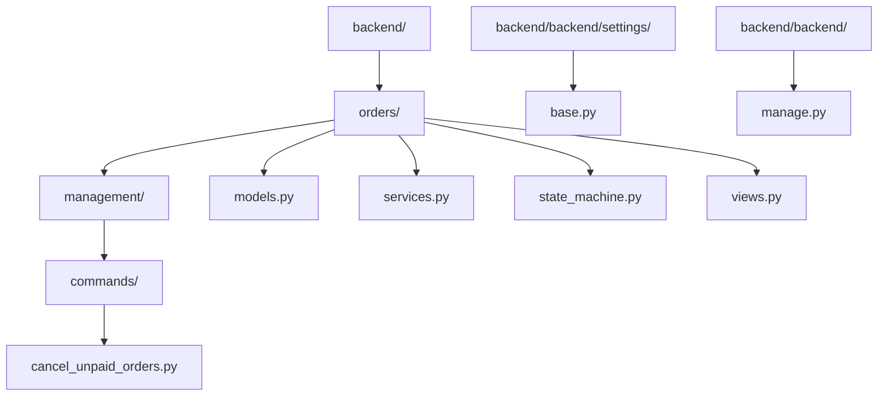
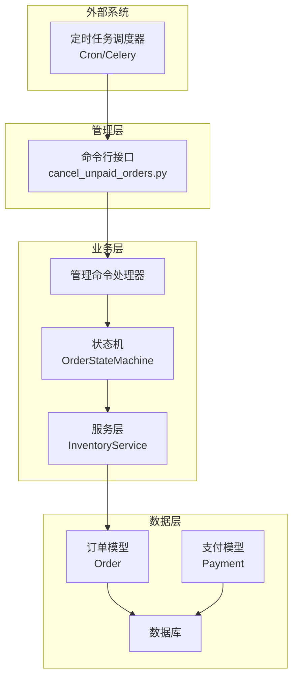
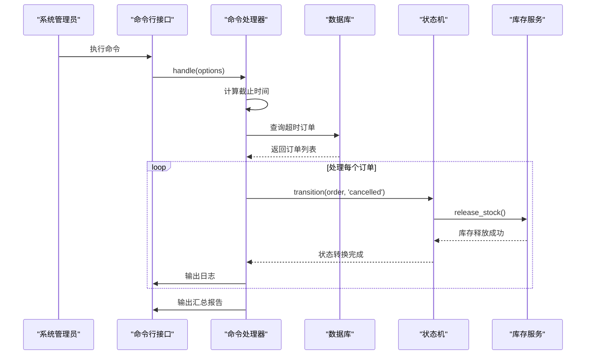
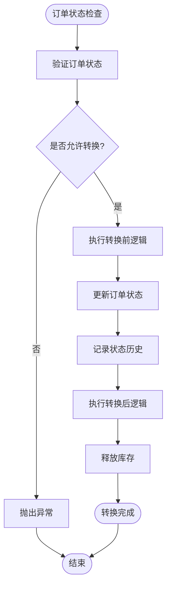
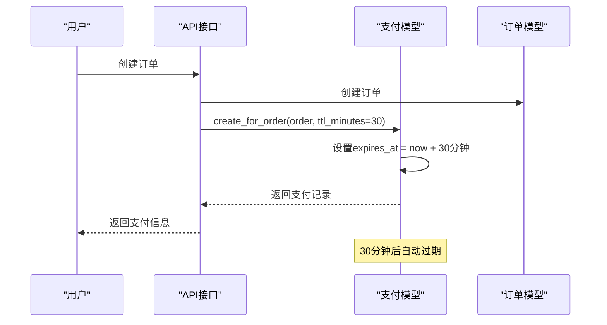
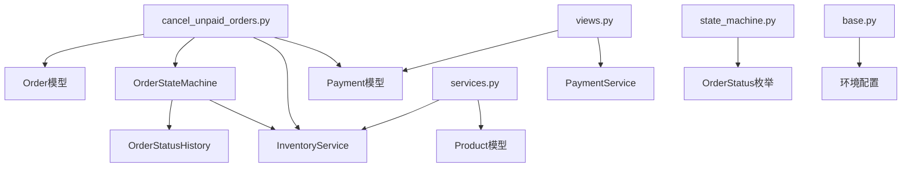

# 管理命令与定时任务

<cite>
**本文档引用的文件**
- [cancel_unpaid_orders.py](file://backend/orders/management/commands/cancel_unpaid_orders.py)
- [models.py](file://backend/orders/models.py)
- [services.py](file://backend/orders/services.py)
- [state_machine.py](file://backend/orders/state_machine.py)
- [views.py](file://backend/orders/views.py)
- [base.py](file://backend/backend/settings/base.py)
</cite>

## 目录
1. [概述](#概述)
2. [项目结构](#项目结构)
3. [核心组件](#核心组件)
4. [架构概览](#架构概览)
5. [详细组件分析](#详细组件分析)
6. [依赖关系分析](#依赖关系分析)
7. [性能考虑](#性能考虑)
8. [故障排除指南](#故障排除指南)
9. [结论](#结论)

## 概述

本文档详细说明了电商系统中`cancel_unpaid_orders`管理命令的实现机制与业务价值。该命令通过Django management command框架实现，能够自动查询超时未支付订单（基于创建时间与配置的超时阈值），并通过调用`services.py`中的取消逻辑安全地执行取消操作。

该命令在系统中扮演着关键角色，不仅维护了系统的库存准确性，还提升了用户体验，避免了无效订单占用资源。同时，文档还阐述了该命令的调度方式（如通过cron或Celery定时执行），及其对库存释放、用户体验的影响。

## 项目结构

系统采用标准的Django项目结构，管理命令位于专门的目录中：



**图表来源**
- [cancel_unpaid_orders.py](file://backend/orders/management/commands/cancel_unpaid_orders.py#L1-L117)
- [models.py](file://backend/orders/models.py#L1-L322)

**章节来源**
- [cancel_unpaid_orders.py](file://backend/orders/management/commands/cancel_unpaid_orders.py#L1-L117)
- [models.py](file://backend/orders/models.py#L1-L322)

## 核心组件

### 订单模型(Order)
订单模型定义了完整的订单生命周期，包括状态字段和时间戳字段：

- **状态字段**: `status`字段支持多种状态，包括`pending`（待支付）、`paid`（待发货）、`shipped`（待收货）、`completed`（已完成）、`cancelled`（已取消）、`refunding`（退款中）、`refunded`（已退款）
- **时间字段**: `created_at`记录订单创建时间，用于计算超时阈值
- **关联字段**: 包含用户、产品、支付记录等外键关联

### 状态机(OrderStateMachine)
状态机实现了严格的订单状态转换规则，确保业务逻辑的正确性：

- **状态转换规则**: 定义了合法的状态转换路径，如`pending`可以转换为`paid`或`cancelled`
- **前后处理逻辑**: 提供转换前后的钩子函数，用于执行特定的业务逻辑
- **事务保证**: 使用数据库事务确保状态转换的一致性

### 库存服务(InventoryService)
库存服务提供了安全的库存管理功能：

- **库存锁定**: 使用数据库行锁防止并发问题
- **库存释放**: 自动释放已取消订单的库存
- **库存调整**: 支持手动调整库存数量

**章节来源**
- [models.py](file://backend/orders/models.py#L13-L70)
- [state_machine.py](file://backend/orders/state_machine.py#L25-L289)
- [services.py](file://backend/orders/services.py#L325-L500)

## 架构概览

系统采用分层架构设计，管理命令作为业务层的重要组成部分：



**图表来源**
- [cancel_unpaid_orders.py](file://backend/orders/management/commands/cancel_unpaid_orders.py#L25-L117)
- [state_machine.py](file://backend/orders/state_machine.py#L25-L154)
- [services.py](file://backend/orders/services.py#L325-L410)

## 详细组件分析

### cancel_unpaid_orders管理命令

#### 命令实现机制

该命令继承自Django的`BaseCommand`类，实现了完整的订单超时检测和取消功能：



**图表来源**
- [cancel_unpaid_orders.py](file://backend/orders/management/commands/cancel_unpaid_orders.py#L41-L97)
- [state_machine.py](file://backend/orders/state_machine.py#L96-L154)

#### 查询条件与算法

命令使用以下查询条件查找超时未支付订单：

| 查询条件 | 条件值 | 说明 |
|---------|--------|------|
| 订单状态 | `pending` | 只查询待支付状态的订单 |
| 创建时间 | `< cutoff_time` | 创建时间早于截止时间的订单 |
| 关联查询 | `select_related('user', 'product')` | 预加载关联对象，提高查询效率 |

截止时间计算公式：
```
cutoff_time = 当前时间 - timeout_minutes
```

#### 参数配置

| 参数名 | 类型 | 默认值 | 说明 |
|--------|------|--------|------|
| `--timeout-minutes` | integer | 30 | 支付超时时间（分钟） |
| `--dry-run` | boolean | false | 干运行模式，只显示将要取消的订单 |

#### 日志输出格式

命令提供详细的日志输出，包括：

- **启动日志**: 显示超时时间和干运行模式状态
- **处理日志**: 每个订单的处理结果（成功/失败）
- **汇总日志**: 总订单数、成功取消数、错误数

**章节来源**
- [cancel_unpaid_orders.py](file://backend/orders/management/commands/cancel_unpaid_orders.py#L25-L117)

### 状态机与库存释放机制

#### 状态转换流程



**图表来源**
- [state_machine.py](file://backend/orders/state_machine.py#L96-L154)

#### 库存释放触发点

状态机在以下情况下会自动释放库存：

| 触发条件 | 方法 | 业务影响 |
|----------|------|----------|
| 订单取消 | `_handle_order_cancelled()` | 释放锁定的库存，恢复可用数量 |
| 退款完成 | `_handle_order_refunded()` | 释放锁定的库存，恢复可用数量 |
| 订单完成 | `_handle_order_completed()` | 更新商品销量统计 |

**章节来源**
- [state_machine.py](file://backend/orders/state_machine.py#L157-L289)

### 支付超时机制

#### 支付创建与过期

系统在创建支付记录时设置了30分钟的超时时间：



**图表来源**
- [views.py](file://backend/orders/views.py#L189-L194)
- [models.py](file://backend/orders/models.py#L224-L234)

#### 超时检测逻辑

管理命令通过以下逻辑检测超时订单：

1. **计算截止时间**: `cutoff_time = now - timeout_minutes`
2. **查询订单**: 查找状态为`pending`且创建时间早于截止时间的订单
3. **批量处理**: 逐个调用状态机进行状态转换

**章节来源**
- [views.py](file://backend/orders/views.py#L189-L194)
- [models.py](file://backend/orders/models.py#L224-L234)

## 依赖关系分析

### 组件依赖图



**图表来源**
- [cancel_unpaid_orders.py](file://backend/orders/management/commands/cancel_unpaid_orders.py#L15-L23)
- [state_machine.py](file://backend/orders/state_machine.py#L8-L12)

### 数据流分析

系统中的数据流向体现了清晰的职责分离：

| 数据流向 | 源组件 | 目标组件 | 数据内容 |
|----------|--------|----------|----------|
| 订单查询 | 管理命令 | 订单模型 | 超时未支付订单 |
| 状态转换 | 管理命令 | 状态机 | 订单状态变更请求 |
| 库存操作 | 状态机 | 库存服务 | 库存释放操作 |
| 日志记录 | 状态机 | 状态历史 | 状态变更记录 |

**章节来源**
- [cancel_unpaid_orders.py](file://backend/orders/management/commands/cancel_unpaid_orders.py#L15-L23)
- [state_machine.py](file://backend/orders/state_machine.py#L157-L289)

## 性能考虑

### 查询优化

1. **索引利用**: 订单模型中为`status`和`created_at`字段建立了索引
2. **预加载关联**: 使用`select_related`预加载关联的用户和产品信息
3. **批量处理**: 逐个处理订单，避免内存溢出

### 并发控制

1. **数据库事务**: 使用`@transaction.atomic`确保操作的原子性
2. **行级锁**: 库存服务使用`select_for_update`防止并发修改
3. **异常处理**: 每个订单的处理都有独立的异常捕获机制

### 内存管理

1. **流式处理**: 不一次性加载所有订单到内存
2. **错误隔离**: 单个订单的失败不影响其他订单的处理
3. **资源清理**: 及时释放数据库连接和临时资源

## 故障排除指南

### 常见问题与解决方案

#### 1. 命令执行失败

**问题症状**: 命令运行过程中出现异常终止

**排查步骤**:
- 检查数据库连接状态
- 验证订单模型的完整性
- 查看系统日志中的错误信息

**解决方案**:
- 确保数据库服务正常运行
- 检查订单数据的完整性约束
- 增加适当的错误处理和重试机制

#### 2. 库存释放失败

**问题症状**: 订单取消后库存未正确释放

**排查步骤**:
- 检查状态机的后处理逻辑
- 验证库存服务的权限设置
- 查看库存日志记录

**解决方案**:
- 确保状态机正确调用了库存释放方法
- 检查数据库事务的提交状态
- 添加库存释放的确认机制

#### 3. 性能问题

**问题症状**: 大量订单时处理速度过慢

**优化方案**:
- 调整查询的分页大小
- 增加数据库索引
- 考虑使用异步处理

**章节来源**
- [cancel_unpaid_orders.py](file://backend/orders/management/commands/cancel_unpaid_orders.py#L60-L97)
- [state_machine.py](file://backend/orders/state_machine.py#L212-L233)

## 结论

`cancel_unpaid_orders`管理命令是电商系统中不可或缺的自动化工具，它通过以下方式为系统带来显著的价值：

### 业务价值

1. **库存准确性**: 自动释放超时未支付订单的库存，避免库存积压
2. **用户体验**: 清理无效订单，保持订单列表的整洁性
3. **系统稳定性**: 防止超时订单占用系统资源，提升整体性能
4. **数据一致性**: 通过严格的状态转换规则确保数据的完整性

### 技术优势

1. **架构清晰**: 采用分层架构，职责分离明确
2. **扩展性强**: 支持自定义超时时间和干运行模式
3. **可靠性高**: 完善的错误处理和日志记录机制
4. **性能优化**: 合理的查询策略和并发控制

### 运维建议

1. **定期监控**: 监控命令的执行时间和成功率
2. **容量规划**: 根据订单量合理设置超时时间
3. **备份策略**: 在执行大规模操作前做好数据备份
4. **告警机制**: 设置执行失败的告警通知

该命令的成功实施展示了Django管理命令在企业级应用中的强大能力，为电商系统的稳定运行提供了重要保障。