# 订单数据模型

<cite>
**本文档引用的文件**
- [backend/orders/models.py](file://backend/orders/models.py)
- [backend/orders/migrations/0001_initial.py](file://backend/orders/migrations/0001_initial.py)
- [backend/orders/migrations/0003_remove_order_address_order_snapshot_address_and_more.py](file://backend/orders/migrations/0003_remove_order_address_order_snapshot_address_and_more.py)
- [backend/orders/migrations/0005_payment.py](file://backend/orders/migrations/0005_payment.py)
- [backend/orders/migrations/0006_discount_discounttarget_discount_products_and_more.py](file://backend/orders/migrations/0006_discount_discounttarget_discount_products_and_more.py)
- [backend/orders/migrations/0008_add_order_status_history.py](file://backend/orders/migrations/0008_add_order_status_history.py)
- [backend/orders/migrations/0010_alter_order_haier_so_id.py](file://backend/orders/migrations/0010_alter_order_haier_so_id.py)
- [backend/orders/state_machine.py](file://backend/orders/state_machine.py)
- [backend/orders/services.py](file://backend/orders/services.py)
- [backend/users/models.py](file://backend/users/models.py)
- [backend/catalog/models.py](file://backend/catalog/models.py)
</cite>

## 目录
1. [概述](#概述)
2. [核心模型架构](#核心模型架构)
3. [Order订单模型详解](#order订单模型详解)
4. [Payment支付模型详解](#payment支付模型详解)
5. [Discount折扣模型详解](#discount折扣模型详解)
6. [OrderStatusHistory状态历史模型](#orderstatushistory状态历史模型)
7. [模型关系与索引](#模型关系与索引)
8. [数据库迁移分析](#数据库迁移分析)
9. [状态机与业务逻辑](#状态机与业务逻辑)
10. [数据完整性保障](#数据完整性保障)

## 概述

订单模块是电商业务的核心数据层，负责管理完整的订单生命周期，包括订单创建、支付、状态流转、物流跟踪、退款处理等功能。该模块采用Django ORM设计，通过多个核心模型协同工作，实现了复杂的业务逻辑和数据完整性保障。

### 主要功能特性

- **完整的订单生命周期管理**：从下单到售后的全流程覆盖
- **灵活的支付集成**：支持多种支付方式和支付状态跟踪
- **智能折扣系统**：基于用户和商品的个性化优惠策略
- **状态机驱动**：严格的订单状态转换控制
- **海尔系统集成**：专门针对海尔家电的特殊业务需求
- **审计与追溯**：完整的操作日志和状态变更历史

## 核心模型架构

订单模块包含四个核心模型，它们之间通过外键关系建立紧密联系：

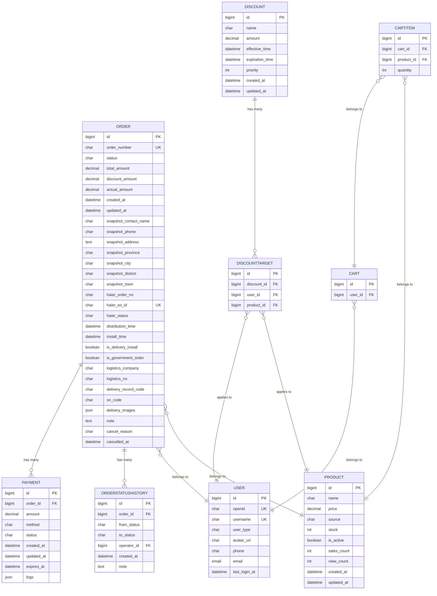

**图表来源**
- [backend/orders/models.py](file://backend/orders/models.py#L13-L322)
- [backend/users/models.py](file://backend/users/models.py#L31-L95)
- [backend/catalog/models.py](file://backend/catalog/models.py#L43-L312)

## Order订单模型详解

### 字段定义与数据类型

Order模型是订单系统的核心实体，包含了订单的完整信息：

#### 基础信息字段
- **status**: 订单状态，使用预定义的枚举值（pending, paid, shipped, completed, cancelled, refunding, refunded）
- **order_number**: 唯一订单编号，自动生成的字符串
- **user**: 外键关联用户，表示订单所属用户
- **product**: 外键关联商品，表示订单购买的商品
- **quantity**: 购买数量，正整数
- **total_amount**: 总金额，十进制数，精确到分
- **discount_amount**: 折扣金额，十进制数
- **actual_amount**: 实付金额，十进制数

#### 快照字段设计
为了确保订单数据的可追溯性，系统采用了快照机制：

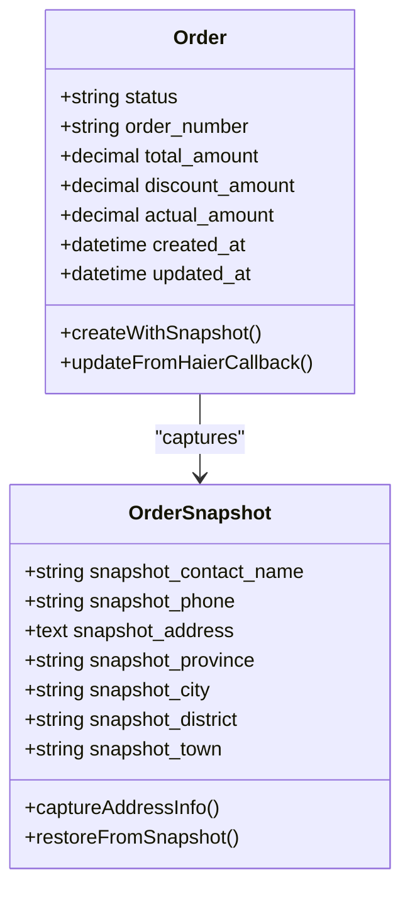

**图表来源**
- [backend/orders/models.py](file://backend/orders/models.py#L36-L42)

#### 海尔系统集成字段
针对海尔家电业务的特殊需求，增加了以下字段：
- **haier_order_no**: 海尔订单号，用于与海尔系统对接
- **haier_so_id**: 海尔子订单号，唯一标识
- **haier_status**: 海尔订单状态，同步海尔系统状态

#### 物流与安装信息
- **distribution_time**: 配送时间
- **install_time**: 安装时间  
- **is_delivery_install**: 是否送装一体
- **is_government_order**: 是否国补订单
- **logistics_company**: 物流公司
- **logistics_no**: 物流单号
- **delivery_record_code**: 发货单号
- **sn_code**: SN码（序列号）

#### 其他业务字段
- **note**: 用户备注
- **cancel_reason**: 取消原因
- **cancelled_at**: 取消时间

**章节来源**
- [backend/orders/models.py](file://backend/orders/models.py#L13-L164)

### 设计原理与约束条件

#### 订单状态设计
订单状态采用严格的状态机模式，确保状态转换的合法性：

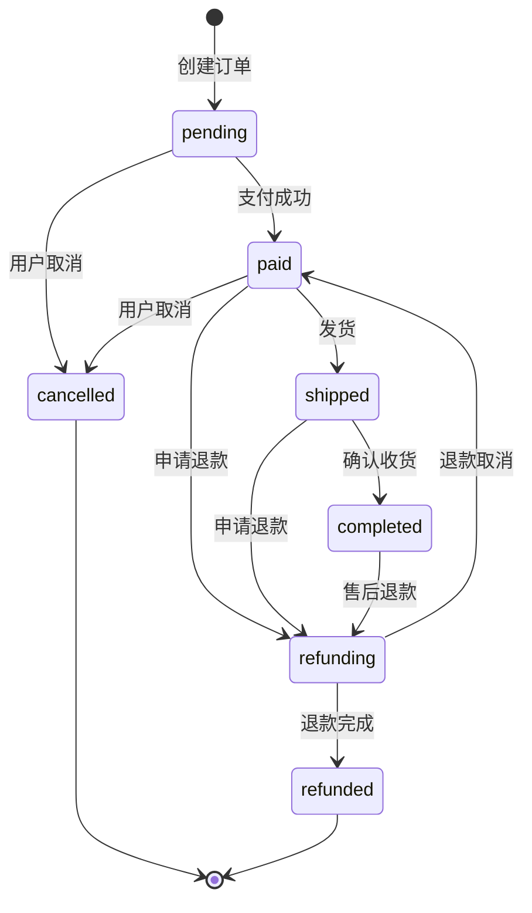

**图表来源**
- [backend/orders/state_machine.py](file://backend/orders/state_machine.py#L34-L57)

#### 数据完整性保障
- **唯一性约束**: order_number唯一，haier_so_id唯一
- **外键约束**: 引用用户和商品表，确保数据一致性
- **默认值**: 关键字段设置合理的默认值
- **验证器**: 使用MinValueValidator确保金额字段非负

#### 性能优化
- **索引设计**: 在status、created_at、user、haier_order_no、haier_so_id等字段上建立索引
- **快照机制**: 避免历史数据修改影响现有订单
- **批量操作**: 支持批量状态更新和查询优化

## Payment支付模型详解

### 支付系统架构

Payment模型负责管理订单的支付过程，支持多种支付方式和支付状态：

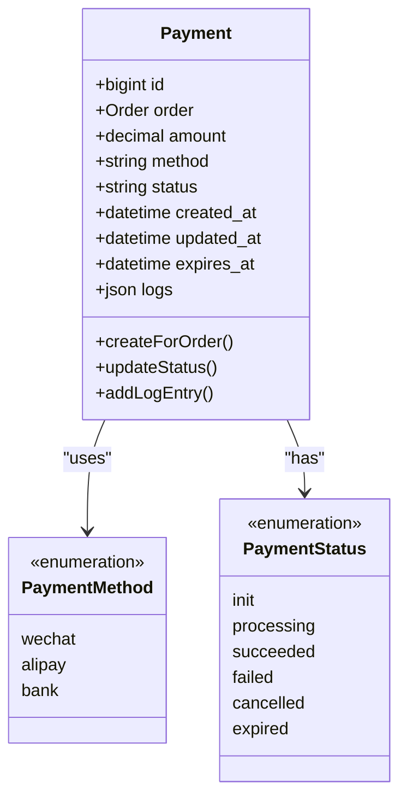

**图表来源**
- [backend/orders/models.py](file://backend/orders/models.py#L186-L234)

### 字段详解

#### 核心支付字段
- **amount**: 支付金额，与订单总金额对应
- **method**: 支付方式，支持微信支付、支付宝、银行卡
- **status**: 支付状态，包含待支付、支付中、支付成功、支付失败、已取消、已过期
- **expires_at**: 支付过期时间，默认30分钟

#### 日志记录机制
- **logs**: JSON格式的日志记录，记录支付过程中的所有重要事件
- **自动更新**: created_at和updated_at字段自动维护

### 支付流程集成

Payment模型与微信支付等第三方支付系统的集成特点：

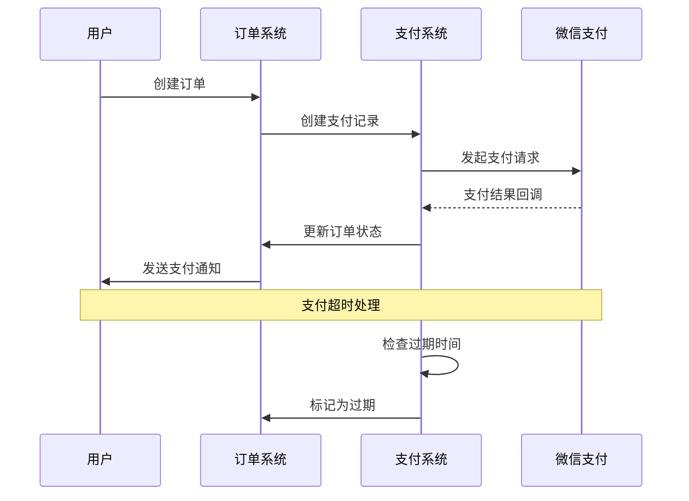

**图表来源**
- [backend/orders/models.py](file://backend/orders/models.py#L224-L234)

**章节来源**
- [backend/orders/models.py](file://backend/orders/models.py#L186-L234)

## Discount折扣模型详解

### 折扣系统架构

Discount模型实现了灵活的折扣策略系统，支持基于用户和商品的个性化优惠：

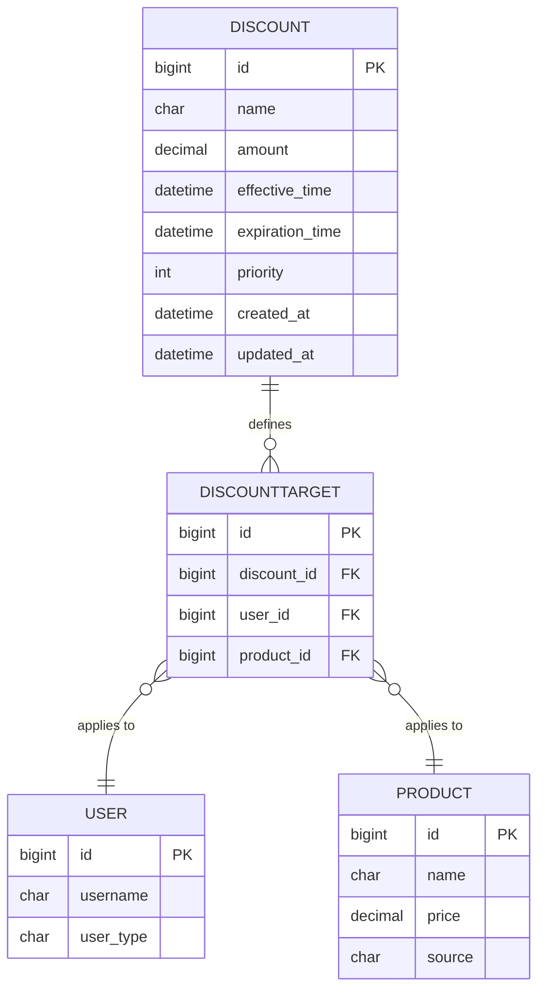

**图表来源**
- [backend/orders/models.py](file://backend/orders/models.py#L237-L290)

### 折扣规则设计

#### 基础折扣字段
- **name**: 折扣名称，便于识别和管理
- **amount**: 固定折扣金额，非负数
- **effective_time**: 生效时间
- **expiration_time**: 过期时间
- **priority**: 优先级，数值越大优先级越高

#### 适用范围机制
通过DiscountTarget中间表实现灵活的适用范围控制：
- **多对多关系**: 一个折扣可以适用于多个用户和商品组合
- **唯一约束**: (discount, user, product)的唯一性确保每个组合只有一个折扣规则
- **动态计算**: 系统自动匹配最合适的折扣

### 折扣计算逻辑

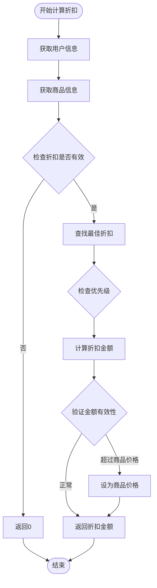

**图表来源**
- [backend/orders/services.py](file://backend/orders/services.py#L11-L41)

**章节来源**
- [backend/orders/models.py](file://backend/orders/models.py#L237-L290)
- [backend/orders/services.py](file://backend/orders/services.py#L11-L41)

## OrderStatusHistory状态历史模型

### 状态变更追踪

OrderStatusHistory模型记录订单状态的完整变更历史，为业务审计和问题排查提供重要依据：

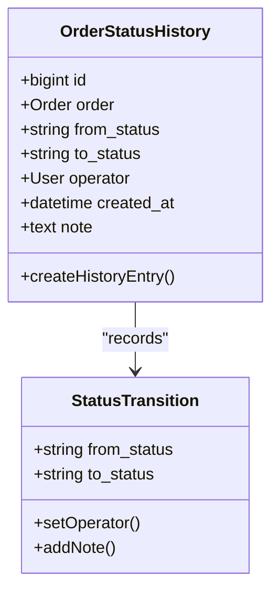

**图表来源**
- [backend/orders/models.py](file://backend/orders/models.py#L292-L322)

### 设计特点

#### 自动化记录
- **触发机制**: 每次订单状态变更时自动创建历史记录
- **完整性**: 记录原状态、新状态、操作时间和备注
- **关联性**: 与具体的操作员关联，便于责任追溯

#### 查询优化
- **复合索引**: 在(order, created_at)和(from_status, to_status)上建立索引
- **历史查询**: 支持按时间段、状态变化类型等条件查询历史记录

### 业务价值

1. **审计追踪**: 完整记录订单状态变更过程
2. **问题诊断**: 快速定位状态异常的原因
3. **性能分析**: 分析订单流转效率和瓶颈
4. **合规要求**: 满足业务审计和监管要求

**章节来源**
- [backend/orders/models.py](file://backend/orders/models.py#L292-L322)
- [backend/orders/migrations/0008_add_order_status_history.py](file://backend/orders/migrations/0008_add_order_status_history.py#L16-L33)

## 模型关系与索引

### 外键关系设计

订单模块的外键关系体现了清晰的业务逻辑分离：

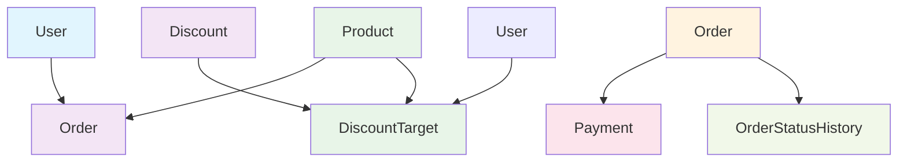

**图表来源**
- [backend/orders/models.py](file://backend/orders/models.py#L26-L322)

### 索引策略

#### 核心索引设计
- **状态索引**: 提高状态查询和报表统计效率
- **时间索引**: 优化时间范围查询和排序
- **关联索引**: 加快外键查询和连接操作
- **唯一索引**: 确保数据唯一性和完整性

#### 性能优化考虑
- **选择性索引**: 在高选择性的字段上建立索引
- **复合索引**: 在经常一起查询的字段组合上建立复合索引
- **覆盖索引**: 减少索引扫描和回表操作

**章节来源**
- [backend/orders/models.py](file://backend/orders/models.py#L75-L81)
- [backend/orders/migrations/0008_add_order_status_history.py](file://backend/orders/migrations/0008_add_order_status_history.py#L25-L30)

## 数据库迁移分析

### 关键迁移变更

通过对迁移文件的分析，我们可以了解订单模块的演进历程：

#### 初始版本（0001_initial.py）
- 基础订单结构：订单号、数量、地址、总金额
- 用户和商品关联
- 简单的状态管理

#### 地址快照剥离（0003_remove_order_address_order_snapshot_address_and_more.py）
**业务背景**: 为确保订单数据的可追溯性，将地址信息从实时地址改为订单创建时的快照。

**变更内容**:
- 移除实时地址字段
- 添加多个快照字段（联系人、电话、详细地址、省市区镇）
- 保留地址的结构化信息

#### 支付系统引入（0005_payment.py）
**业务背景**: 随着支付功能的完善，需要独立的支付记录表来管理支付状态和流程。

**变更内容**:
- 创建Payment模型
- 支持多种支付方式
- 完整的支付状态管理
- 支付日志记录

#### 折扣系统完善（0006_discount_discounttarget_discount_products_and_more.py）
**业务背景**: 业务发展需要更灵活的折扣策略，支持基于用户和商品的个性化优惠。

**变更内容**:
- 创建Discount和DiscountTarget模型
- 多对多关系实现灵活的适用范围
- 优先级和时间范围控制
- 复合索引优化查询性能

#### 状态历史记录（0008_add_order_status_history.py）
**业务背景**: 为满足审计和问题排查需求，需要记录完整的状态变更历史。

**变更内容**:
- 创建OrderStatusHistory模型
- 自动记录状态变更
- 操作员关联
- 备注字段支持

#### 海尔系统优化（0010_alter_order_haier_so_id.py）
**业务背景**: 海尔系统对接的深入，需要更严格的haier_so_id唯一性约束。

**变更内容**:
- 修改haier_so_id字段属性
- 添加null=True约束
- 确保唯一性

**章节来源**
- [backend/orders/migrations/0001_initial.py](file://backend/orders/migrations/0001_initial.py#L18-L31)
- [backend/orders/migrations/0003_remove_order_address_order_snapshot_address_and_more.py](file://backend/orders/migrations/0003_remove_order_address_order_snapshot_address_and_more.py#L13-L32)
- [backend/orders/migrations/0005_payment.py](file://backend/orders/migrations/0005_payment.py#L14-L32)
- [backend/orders/migrations/0006_discount_discounttarget_discount_products_and_more.py](file://backend/orders/migrations/0006_discount_discounttarget_discount_products_and_more.py#L18-L79)
- [backend/orders/migrations/0008_add_order_status_history.py](file://backend/orders/migrations/0008_add_order_status_history.py#L16-L33)
- [backend/orders/migrations/0010_alter_order_haier_so_id.py](file://backend/orders/migrations/00010_alter_order_haier_so_id.py#L13-L18)

## 状态机与业务逻辑

### 状态转换规则

订单状态机定义了严格的转换规则，确保业务流程的正确性：

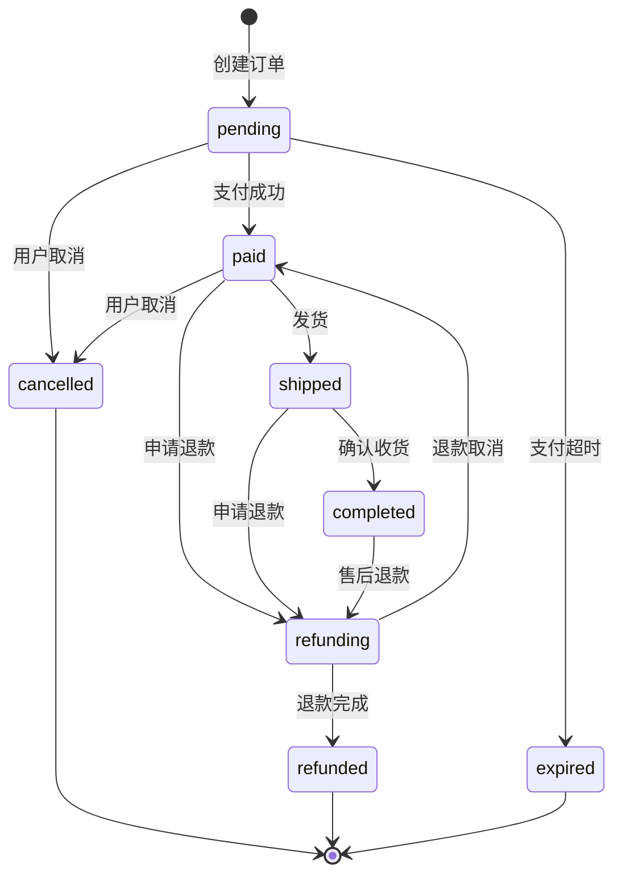

**图表来源**
- [backend/orders/state_machine.py](file://backend/orders/state_machine.py#L34-L57)

### 业务逻辑处理

#### 状态转换前验证
- **权限检查**: 确认操作者的权限
- **状态检查**: 验证当前状态是否允许转换
- **业务规则**: 检查业务约束条件

#### 状态转换后处理
- **库存管理**: 订单取消或完成时的库存释放
- **销量统计**: 更新商品销量和浏览次数
- **通知发送**: 发送状态变更通知
- **数据分析**: 触发相关分析任务

### 并发安全保障

状态机采用事务机制确保并发安全：

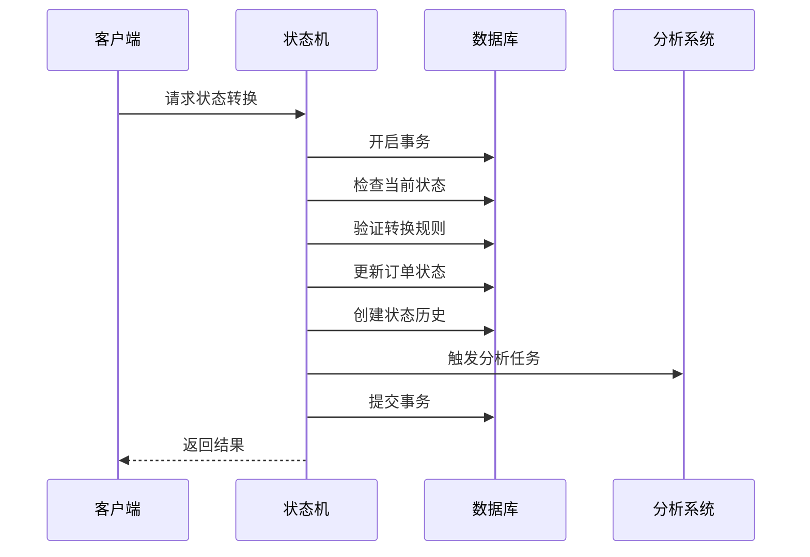

**图表来源**
- [backend/orders/state_machine.py](file://backend/orders/state_machine.py#L96-L154)

**章节来源**
- [backend/orders/state_machine.py](file://backend/orders/state_machine.py#L14-L289)

## 数据完整性保障

### 约束机制

#### 数据库层面约束
- **主键约束**: 所有模型都有唯一的主键
- **外键约束**: 确保关联数据的一致性
- **唯一约束**: 订单号、海尔子订单号等字段的唯一性
- **检查约束**: 数值字段的范围验证

#### 业务层面约束
- **状态机验证**: 严格的订单状态转换规则
- **金额验证**: 折扣金额不超过商品价格
- **库存验证**: 下单前检查库存充足性
- **时间验证**: 生效时间和过期时间的逻辑关系

### 数据一致性保证

#### 事务管理
- **原子性**: 状态转换在事务中执行
- **一致性**: 确保数据始终处于一致状态
- **隔离性**: 防止并发操作导致的数据冲突
- **持久性**: 确保操作结果的持久化

#### 错误处理
- **异常捕获**: 捕获和处理各种异常情况
- **回滚机制**: 发生错误时自动回滚
- **日志记录**: 记录错误信息便于排查
- **降级策略**: 在部分功能异常时的备用方案

### 性能与扩展性

#### 查询优化
- **索引策略**: 合理的索引设计提高查询性能
- **缓存机制**: 关键数据的缓存减少数据库访问
- **批量操作**: 支持批量处理提高效率

#### 扩展性设计
- **模块化**: 清晰的模块划分便于功能扩展
- **插件化**: 支持新的支付方式和业务规则
- **配置化**: 通过配置调整业务逻辑

**章节来源**
- [backend/orders/models.py](file://backend/orders/models.py#L72-L81)
- [backend/orders/state_machine.py](file://backend/orders/state_machine.py#L118-L154)
- [backend/orders/services.py](file://backend/orders/services.py#L333-L410)

## 总结

订单模块的数据模型设计体现了现代电商系统的核心设计理念：

1. **完整性**: 通过快照机制和状态机确保数据的完整性和业务逻辑的正确性
2. **灵活性**: 支持多种支付方式、折扣策略和业务场景
3. **可扩展性**: 模块化设计便于功能扩展和业务创新
4. **可维护性**: 清晰的代码结构和完善的文档便于维护和升级
5. **高性能**: 合理的索引设计和查询优化确保系统性能

该模型不仅满足了当前的业务需求，还为未来的功能扩展和业务发展奠定了坚实的基础。通过持续的迭代优化，这个订单系统能够适应不断变化的市场需求和技术发展趋势。