# 订单模块结构

<cite>
**本文档引用的文件**
- [models.py](file://backend/orders/models.py)
- [views.py](file://backend/orders/views.py)
- [serializers.py](file://backend/orders/serializers.py)
- [state_machine.py](file://backend/orders/state_machine.py)
- [payment_service.py](file://backend/orders/payment_service.py)
- [services.py](file://backend/orders/services.py)
- [analytics.py](file://backend/orders/analytics.py)
- [cancel_unpaid_orders.py](file://backend/orders/management/commands/cancel_unpaid_orders.py)
- [urls.py](file://backend/orders/urls.py)
- [apps.py](file://backend/orders/apps.py)
- [admin.py](file://backend/orders/admin.py)
</cite>

## 目录
1. [项目概述](#项目概述)
2. [模块架构](#模块架构)
3. [核心模型设计](#核心模型设计)
4. [视图层实现](#视图层实现)
5. [序列化器规范](#序列化器规范)
6. [状态机设计](#状态机设计)
7. [支付服务集成](#支付服务集成)
8. [业务服务层](#业务服务层)
9. [数据分析与统计](#数据分析与统计)
10. [定时任务机制](#定时任务机制)
11. [管理后台配置](#管理后台配置)
12. [总结](#总结)

## 项目概述

订单模块是电商系统的核心业务组件，负责处理从购物车到订单完成的完整业务流程。该模块采用Django框架构建，实现了完整的订单生命周期管理，包括订单创建、状态流转、支付处理、库存管理、数据分析等功能。

### 主要特性

- **完整的订单生命周期管理**：从购物车到订单完成的全流程支持
- **灵活的状态机设计**：确保订单状态转换的合法性和一致性
- **多渠道支付集成**：支持微信支付、支付宝等多种支付方式
- **智能库存管理**：实时库存检查和锁定机制
- **海尔系统对接**：专门针对海尔产品的订单处理和物流集成
- **数据分析统计**：提供丰富的销售和运营数据统计功能

## 模块架构

订单模块采用清晰的分层架构设计，各层职责明确，便于维护和扩展。

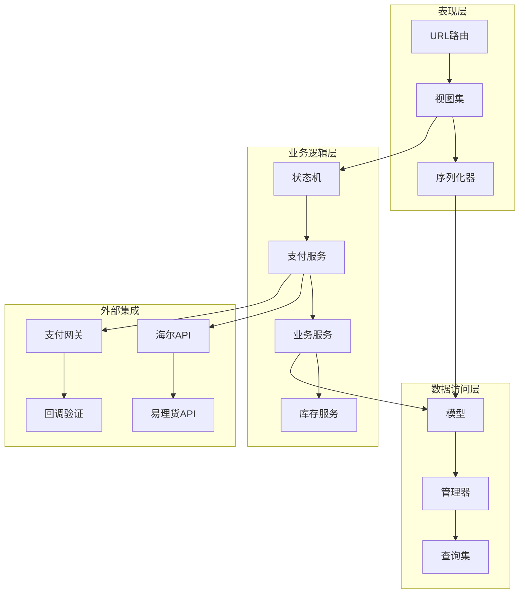

**图表来源**
- [urls.py](file://backend/orders/urls.py#L1-L16)
- [views.py](file://backend/orders/views.py#L1-L50)
- [models.py](file://backend/orders/models.py#L1-L100)

**章节来源**
- [urls.py](file://backend/orders/urls.py#L1-L16)
- [apps.py](file://backend/orders/apps.py#L1-L7)

## 核心模型设计

订单模块的核心模型包括Order、Payment、Discount等，它们构成了完整的订单业务实体。

### Order模型设计

Order模型是订单系统的核心，包含了订单的完整信息和状态管理。

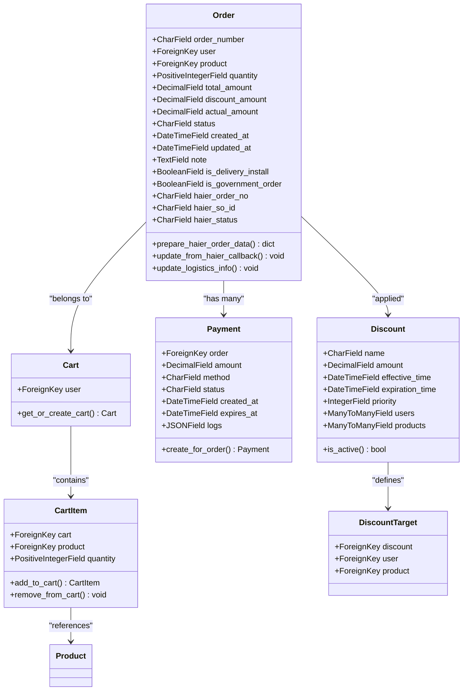

**图表来源**
- [models.py](file://backend/orders/models.py#L13-L322)

#### 关键字段说明

| 字段名 | 类型 | 描述 | 用途 |
|--------|------|------|------|
| order_number | CharField | 订单编号 | 唯一标识订单，自动生成 |
| status | CharField | 订单状态 | 使用choices定义的枚举值 |
| total_amount | DecimalField | 总金额 | 订单商品总价 |
| discount_amount | DecimalField | 折扣金额 | 优惠券或促销折扣 |
| actual_amount | DecimalField | 实付金额 | 最终支付金额 |
| snapshot_* | CharField/TextField | 快照信息 | 订单创建时的快照数据 |
| haier_* | CharField | 海尔系统字段 | 与海尔系统对接专用字段 |

#### 状态定义

订单支持以下状态流转：

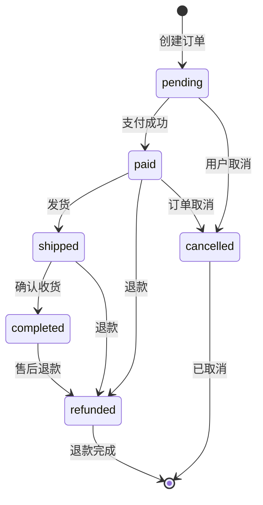

**图表来源**
- [state_machine.py](file://backend/orders/state_machine.py#L34-L57)

**章节来源**
- [models.py](file://backend/orders/models.py#L13-L322)

### Payment模型设计

Payment模型负责管理订单的支付相关信息。

#### 支付状态流程

| 状态 | 描述 | 允许的操作 |
|------|------|------------|
| init | 待支付 | 创建支付记录 |
| processing | 支付中 | 等待回调处理 |
| succeeded | 支付成功 | 触发订单状态转换 |
| failed | 支付失败 | 重新发起支付 |
| cancelled | 已取消 | 不允许操作 |
| expired | 已过期 | 不允许操作 |

### Discount模型设计

Discount模型实现了灵活的折扣系统，支持多种折扣规则和适用范围。

#### 折扣适用范围

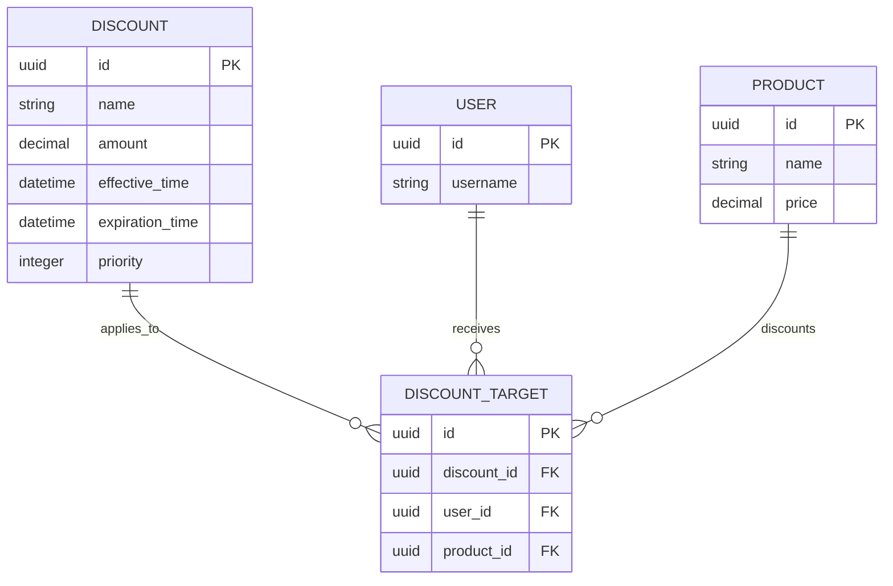

**图表来源**
- [models.py](file://backend/orders/models.py#L238-L322)

**章节来源**
- [models.py](file://backend/orders/models.py#L186-L322)

## 视图层实现

订单模块的视图层采用Django REST Framework构建，提供了完整的API接口。

### OrderViewSet核心功能

OrderViewSet是订单管理的主要视图集，提供了订单的CRUD操作和状态管理。

#### 核心API端点

| 端点 | 方法 | 功能 | 权限要求 |
|------|------|------|----------|
| /api/orders/ | GET | 获取订单列表 | IsOwnerOrAdmin |
| /api/orders/ | POST | 创建订单 | IsAuthenticated |
| /api/orders/{id}/ | GET | 获取订单详情 | IsOwnerOrAdmin |
| /api/orders/{id}/status/ | PATCH | 更新订单状态 | IsOwnerOrAdmin |
| /api/orders/{id}/cancel/ | PATCH | 取消订单 | IsAuthenticated |
| /api/orders/{id}/ship/ | PATCH | 发货操作 | IsAdmin |
| /api/orders/{id}/complete/ | PATCH | 完成订单 | IsAdmin |

#### 订单创建流程

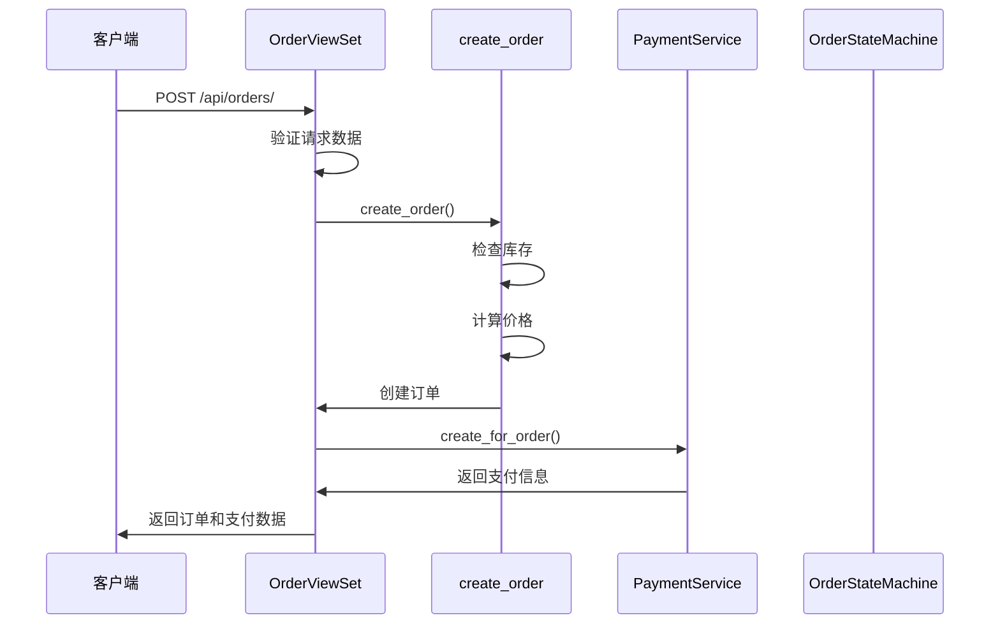

**图表来源**
- [views.py](file://backend/orders/views.py#L136-L217)

### CartViewSet购物车管理

CartViewSet提供了完整的购物车管理功能，支持商品的添加、删除、修改和清空操作。

#### 购物车操作流程

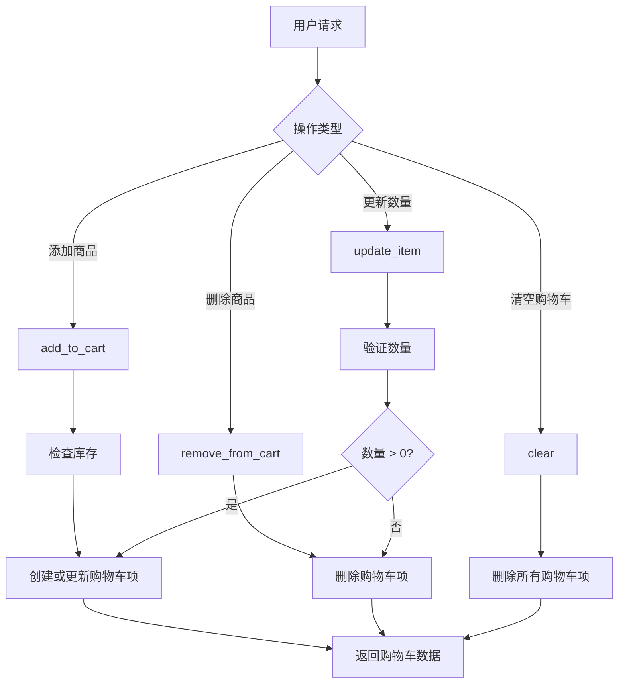

**图表来源**
- [views.py](file://backend/orders/views.py#L647-L779)

**章节来源**
- [views.py](file://backend/orders/views.py#L23-L800)

## 序列化器规范

序列化器负责数据的序列化和反序列化，确保API接口的数据格式统一和验证。

### OrderSerializer设计

OrderSerializer提供了订单数据的完整序列化，包括状态标签、海尔订单标识、物流信息等扩展字段。

#### 序列化字段映射

| 序列化字段 | 模型字段 | 类型 | 功能 |
|------------|----------|------|------|
| status_label | status | SerializerMethodField | 显示中文状态描述 |
| is_haier_order | product.source | SerializerMethodField | 判断是否为海尔产品 |
| haier_order_info | haier_* | SerializerMethodField | 海尔订单详细信息 |
| logistics_info | logistics_* | SerializerMethodField | 物流信息 |
| user_username | user.username | CharField | 用户名显示 |

### 订单创建序列化器

OrderCreateSerializer专门用于订单创建场景，提供了严格的输入验证。

#### 验证规则

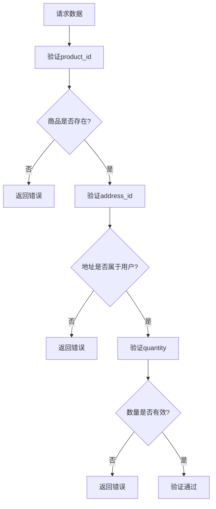

**图表来源**
- [serializers.py](file://backend/orders/serializers.py#L99-L134)

**章节来源**
- [serializers.py](file://backend/orders/serializers.py#L1-L230)

## 状态机设计

订单状态机是订单模块的核心设计，确保了订单状态转换的合法性和一致性。

### 状态转换规则

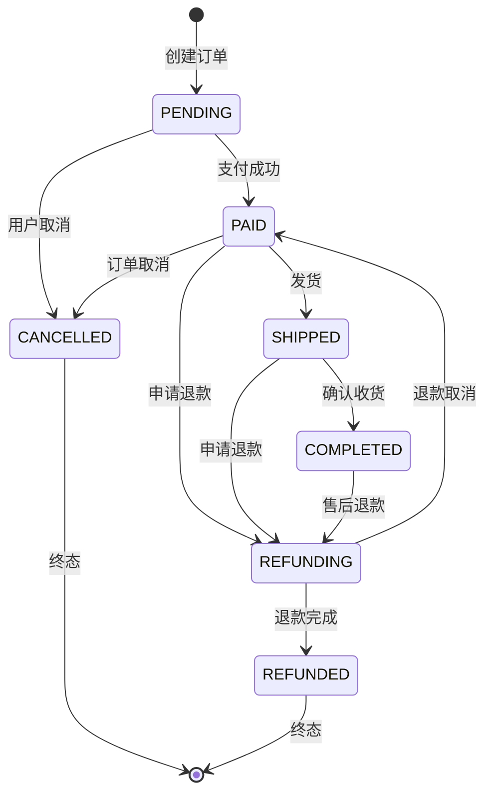

**图表来源**
- [state_machine.py](file://backend/orders/state_machine.py#L34-L57)

### 状态转换验证

状态机提供了严格的状态转换验证机制：

#### 转换规则表

| 当前状态 | 允许转换到的状态 | 业务含义 |
|----------|------------------|----------|
| PENDING | PAID, CANCELLED | 支付成功或取消订单 |
| PAID | SHIPPED, REFUNDING, CANCELLED | 发货、申请退款或取消 |
| SHIPPED | COMPLETED, REFUNDING | 确认收货或申请退款 |
| COMPLETED | REFUNDING | 售后退款 |
| REFUNDING | REFUNDED, PAID | 退款完成或退款取消 |

### 状态转换业务逻辑

状态转换不仅更新订单状态，还触发相应的业务逻辑：

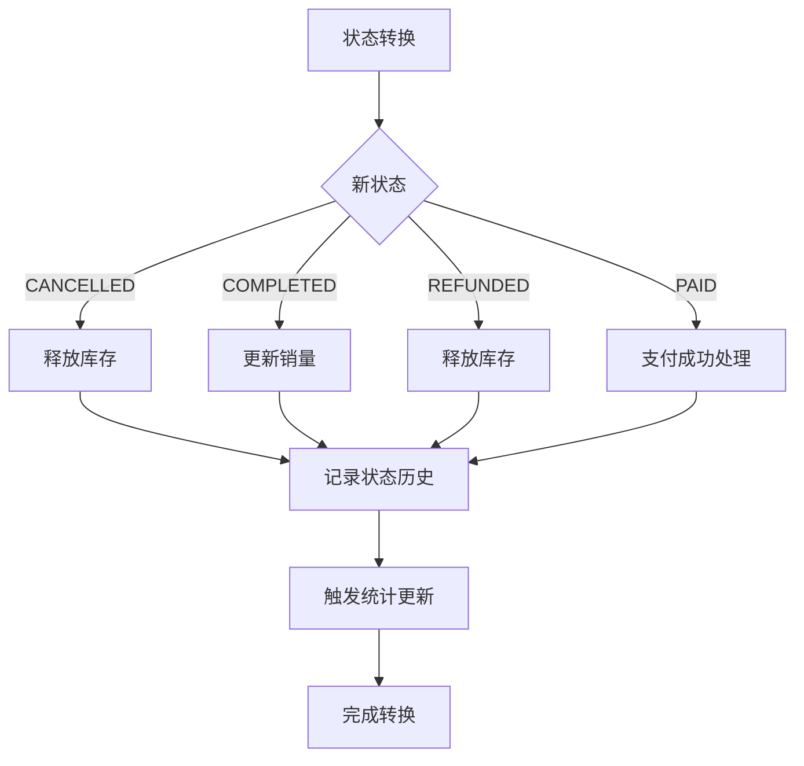

**图表来源**
- [state_machine.py](file://backend/orders/state_machine.py#L156-L289)

**章节来源**
- [state_machine.py](file://backend/orders/state_machine.py#L1-L289)

## 支付服务集成

支付服务模块负责处理支付流程、回调验证和防止重复支付。

### 支付回调验证

支付服务提供了完整的回调验证机制，确保支付结果的真实性和安全性。

#### 签名验证流程

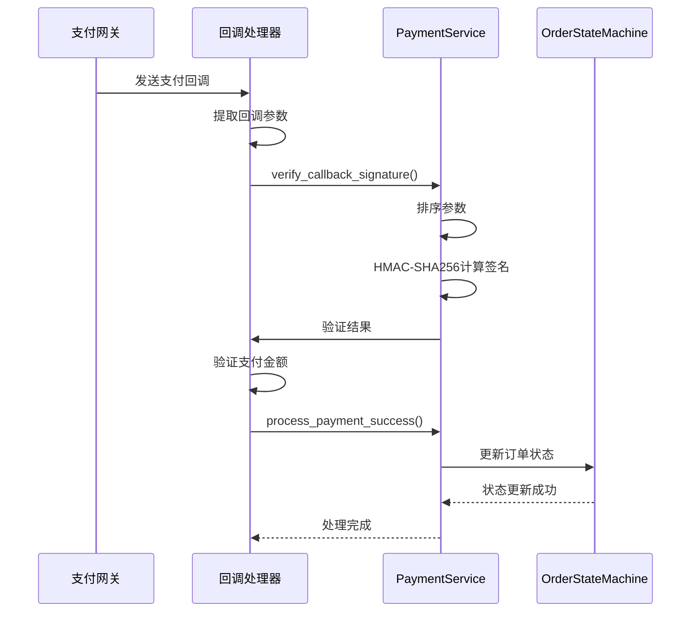

**图表来源**
- [payment_service.py](file://backend/orders/payment_service.py#L30-L69)

### 支付金额验证

支付服务实现了精确的金额验证机制，允许0.01元的误差以处理浮点数精度问题。

#### 金额验证规则

| 场景 | 验证规则 | 允许误差 |
|------|----------|----------|
| 正常支付 | 订单金额 = 支付金额 | 0.01元 |
| 零钱支付 | 订单金额 ≤ 支付金额 | 0.01元 |
| 部分退款 | 退款金额 ≤ 已支付金额 | 0.01元 |

### 防重复支付机制

支付服务采用了多重机制防止重复支付：

1. **数据库行锁**：使用`select_for_update()`确保并发安全
2. **状态检查**：验证支付记录状态是否为`succeeded`
3. **过期检查**：验证支付是否在有效期内
4. **幂等性保证**：相同的回调参数多次处理只会产生一次效果

**章节来源**
- [payment_service.py](file://backend/orders/payment_service.py#L1-L292)

## 业务服务层

业务服务层封装了订单创建、库存管理、折扣计算等核心业务逻辑。

### 订单创建流程

订单创建是一个复杂的业务流程，涉及多个服务的协调工作。

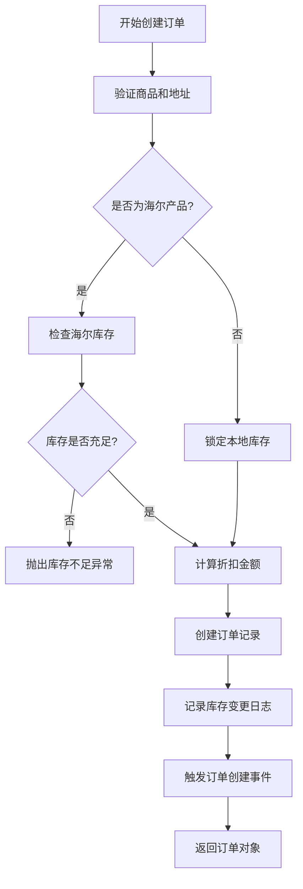

**图表来源**
- [services.py](file://backend/orders/services.py#L219-L297)

### 库存管理服务

库存管理服务提供了完整的库存操作功能，包括锁定、释放和调整。

#### 库存操作类型

| 操作类型 | 方法 | 业务场景 | 数据库操作 |
|----------|------|----------|------------|
| 锁定库存 | lock_stock | 订单创建时 | 减少库存字段值 |
| 释放库存 | release_stock | 订单取消时 | 增加库存字段值 |
| 调整库存 | adjust_stock | 库存盘点时 | 直接设置库存值 |
| 查看日志 | get_inventory_logs | 库存审计 | 查询变更记录 |

### 折扣计算服务

折扣计算服务实现了智能的折扣匹配和计算逻辑。

#### 折扣匹配规则

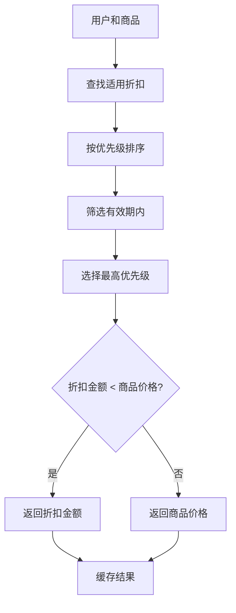

**图表来源**
- [services.py](file://backend/orders/services.py#L11-L41)

**章节来源**
- [services.py](file://backend/orders/services.py#L1-L500)

## 数据分析与统计

数据分析模块提供了丰富的销售和运营数据统计功能，支持缓存优化以提升查询性能。

### 销售统计功能

#### 销售汇总统计

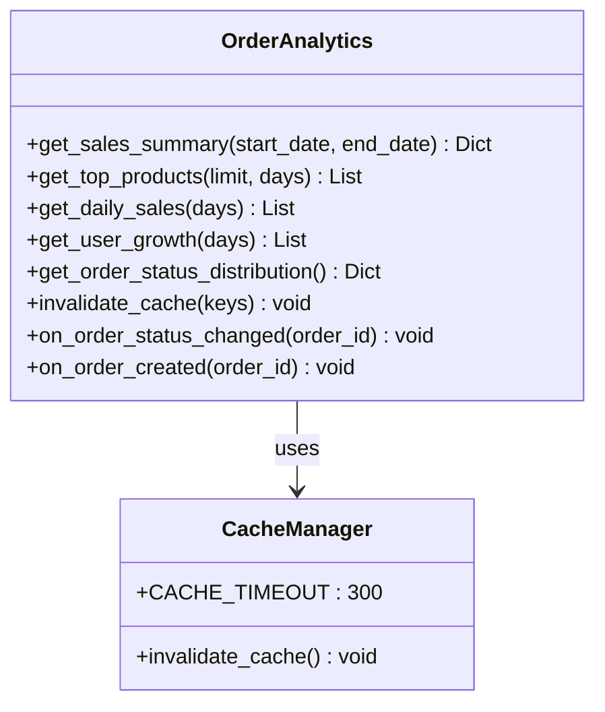

**图表来源**
- [analytics.py](file://backend/orders/analytics.py#L17-L322)

#### 统计指标说明

| 指标类型 | 方法 | 缓存时间 | 用途 |
|----------|------|----------|------|
| 销售汇总 | get_sales_summary | 5分钟 | 总体销售情况 |
| 热销商品 | get_top_products | 5分钟 | 商品销售排行 |
| 每日销售 | get_daily_sales | 5分钟 | 销售趋势分析 |
| 用户增长 | get_user_growth | 5分钟 | 用户发展统计 |
| 状态分布 | get_order_status_distribution | 5分钟 | 订单状态分析 |

### 缓存策略

数据分析模块采用了智能的缓存策略来提升查询性能：

#### 缓存失效机制

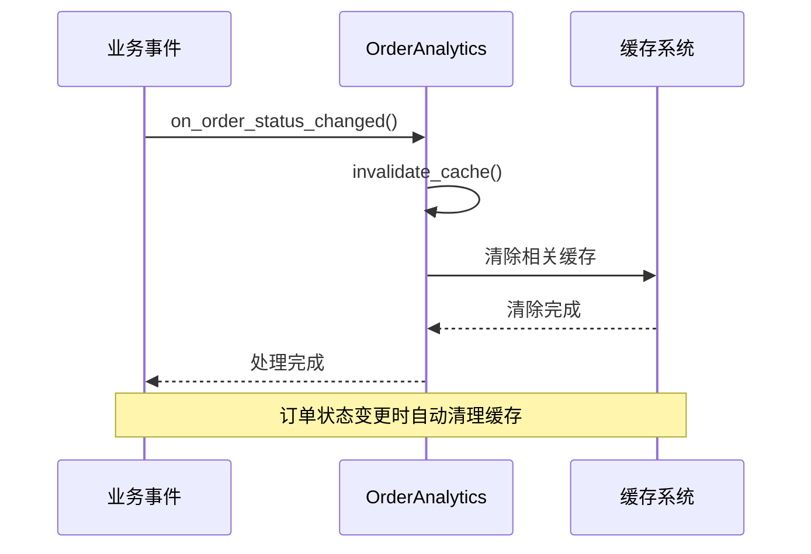

**图表来源**
- [analytics.py](file://backend/orders/analytics.py#L302-L322)

**章节来源**
- [analytics.py](file://backend/orders/analytics.py#L1-L322)

## 定时任务机制

定时任务模块负责自动处理未支付订单的取消，确保库存的有效利用。

### 自动取消机制

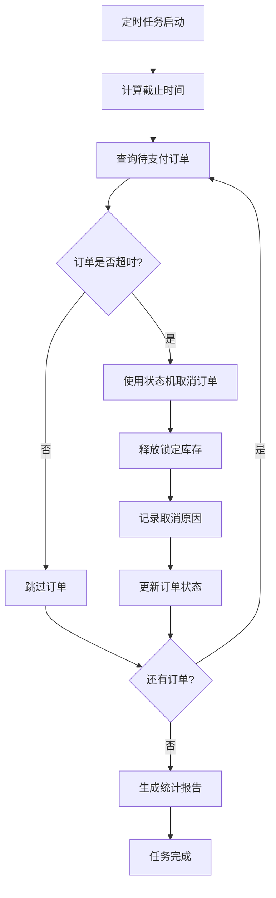

**图表来源**
- [cancel_unpaid_orders.py](file://backend/orders/management/commands/cancel_unpaid_orders.py#L41-L117)

### 定时任务配置

| 参数 | 默认值 | 说明 |
|------|--------|------|
| --timeout-minutes | 30 | 支付超时时间（分钟） |
| --dry-run | False | 干运行模式，不实际执行取消 |
| 执行频率 | 每30分钟 | 可根据需求调整 |

### 任务执行流程

定时任务采用了安全的事务处理机制：

1. **原子性操作**：使用`@transaction.atomic`确保操作的原子性
2. **状态验证**：检查订单状态是否允许取消
3. **库存释放**：通过状态机自动释放锁定的库存
4. **日志记录**：详细记录每次取消操作的详细信息

**章节来源**
- [cancel_unpaid_orders.py](file://backend/orders/management/commands/cancel_unpaid_orders.py#L1-L117)

## 管理后台配置

管理后台提供了直观的订单管理界面，支持各种查询和操作功能。

### 模型注册配置

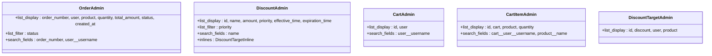

**图表来源**
- [admin.py](file://backend/orders/admin.py#L1-L41)

### 管理功能特性

| 模型 | 主要功能 | 查询过滤 | 搜索字段 |
|------|----------|----------|----------|
| Order | 订单管理 | 状态过滤 | 订单号、用户名 |
| Discount | 折扣管理 | 优先级过滤 | 折扣名称 |
| Cart | 购物车管理 | 无 | 用户名 |
| CartItem | 购物车项 | 无 | 用户名、商品名 |
| DiscountTarget | 适用范围 | 无 | 折扣、用户、商品 |

**章节来源**
- [admin.py](file://backend/orders/admin.py#L1-L41)

## 总结

订单模块作为电商系统的核心业务组件，展现了优秀的架构设计和业务实现：

### 设计亮点

1. **清晰的分层架构**：从表现层到数据访问层的职责分离
2. **灵活的状态机设计**：确保业务逻辑的一致性和可维护性
3. **完善的异常处理**：多层次的验证和错误处理机制
4. **高效的缓存策略**：提升数据分析和查询性能
5. **智能的定时任务**：自动化处理未支付订单，提高运营效率

### 扩展建议

1. **监控告警**：增加关键业务指标的监控和告警
2. **性能优化**：进一步优化大数据量下的查询性能
3. **安全增强**：加强支付回调的安全验证机制
4. **国际化支持**：为多语言环境提供更好的支持

该订单模块为电商系统提供了稳定、可靠、高性能的订单管理能力，是系统成功的重要保障。