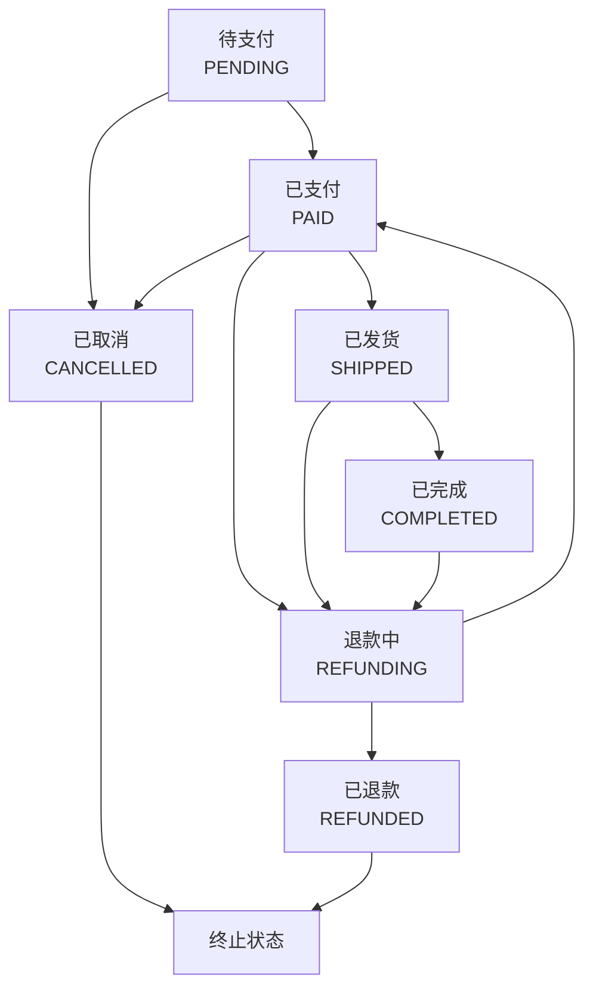
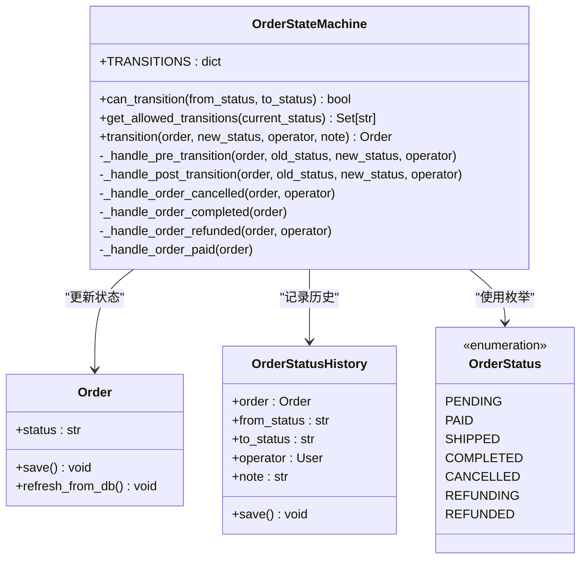
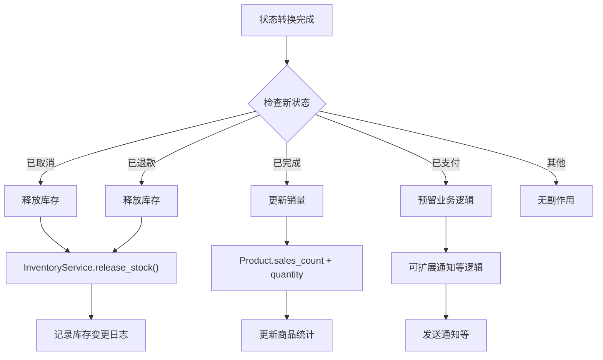
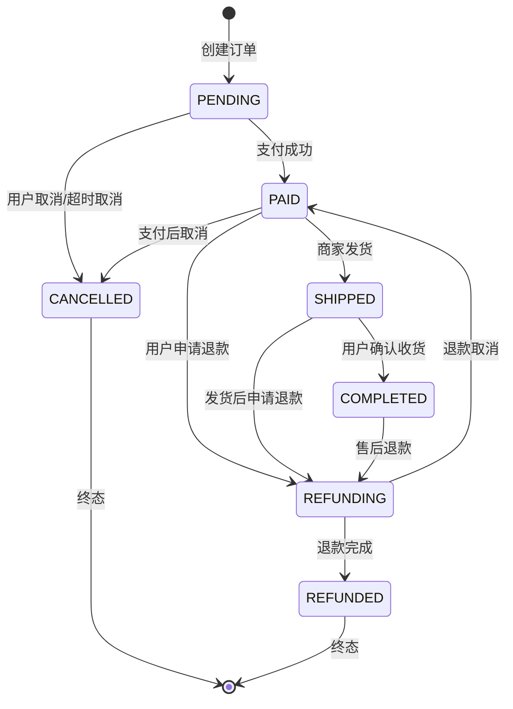

# 订单状态机

<cite>
**本文档中引用的文件**
- [state_machine.py](file://backend/orders/state_machine.py)
- [models.py](file://backend/orders/models.py)
- [services.py](file://backend/orders/services.py)
- [payment_service.py](file://backend/orders/payment_service.py)
- [views.py](file://backend/orders/views.py)
- [admin.py](file://backend/orders/admin.py)
- [cancel_unpaid_orders.py](file://backend/orders/management/commands/cancel_unpaid_orders.py)
</cite>

## 目录
1. [概述](#概述)
2. [状态定义与转换规则](#状态定义与转换规则)
3. [状态机架构设计](#状态机架构设计)
4. [状态转换触发机制](#状态转换触发机制)
5. [状态变更的原子性与一致性](#状态变更的原子性与一致性)
6. [副作用处理机制](#副作用处理机制)
7. [状态转换图](#状态转换图)
8. [异常处理机制](#异常处理机制)
9. [实际代码示例](#实际代码示例)
10. [调试与监控建议](#调试与监控建议)

## 概述

订单状态机是电商系统中核心的业务逻辑组件，负责管理订单在整个生命周期中的状态流转。该状态机采用严格的规则约束，确保订单状态只能按照预定义的路径进行转换，从而维护系统的业务一致性和数据完整性。

### 核心特性

- **严格的状态转换规则**：基于枚举定义的合法转换路径
- **原子性保证**：使用数据库事务确保状态变更的原子性
- **副作用自动化**：状态转换时自动执行相关业务逻辑
- **历史追踪**：记录每次状态变更的详细信息
- **异常容错**：完善的错误处理和回滚机制

## 状态定义与转换规则

### 订单状态枚举

系统定义了以下订单状态：

| 状态值 | 中文描述 | 英文常量 | 状态含义 |
|--------|----------|----------|----------|
| `pending` | 待支付 | PENDING | 订单已创建，等待用户支付 |
| `paid` | 待发货 | PAID | 支付成功，等待发货 |
| `shipped` | 待收货 | SHIPPED | 已发货，等待用户确认收货 |
| `completed` | 已完成 | COMPLETED | 订单完成，交易结束 |
| `cancelled` | 已取消 | CANCELLED | 订单被取消 |
| `refunding` | 退款中 | REFUNDING | 正在处理退款 |
| `refunded` | 已退款 | REFUNDED | 退款完成 |

### 状态转换规则表



**图表来源**
- [state_machine.py](file://backend/orders/state_machine.py#L34-L56)

### 转换规则详解

状态机定义了明确的转换规则，每个状态只能转换到特定的其他状态：

1. **待支付(PENDING)** → **已支付(PAID)**：支付成功
2. **待支付(PENDING)** → **已取消(CANCELLED)**：用户主动取消
3. **已支付(PAID)** → **已发货(SHIPPED)**：商家发货
4. **已支付(PAID)** → **退款中(REFUNDING)**：用户申请退款
5. **已支付(PAID)** → **已取消(CANCELLED)**：支付后取消订单
6. **已发货(SHIPPED)** → **已完成(COMPLETED)**：用户确认收货
7. **已发货(SHIPPED)** → **退款中(REFUNDING)**：发货后申请退款
8. **已完成(COMPLETED)** → **退款中(REFUNDING)**：售后退款
9. **退款中(REFUNDING)** → **已退款(REFUNDED)**：退款完成
10. **退款中(REFUNDING)** → **已支付(PAID)**：退款取消，恢复原状态

**节来源**
- [state_machine.py](file://backend/orders/state_machine.py#L34-L56)

## 状态机架构设计

### 类结构设计



**图表来源**
- [state_machine.py](file://backend/orders/state_machine.py#L14-L289)
- [models.py](file://backend/orders/models.py#L24-L24)

### 核心方法设计

状态机提供了三个核心方法：

1. **`can_transition()`**：检查状态转换是否合法
2. **`get_allowed_transitions()`**：获取当前状态允许的转换目标
3. **`transition()`**：执行状态转换并处理副作用

**节来源**
- [state_machine.py](file://backend/orders/state_machine.py#L60-L189)

## 状态转换触发机制

### 触发方式

订单状态转换主要通过以下几种方式触发：

#### 1. 支付服务触发

支付成功时自动触发状态转换：

```python
# 支付成功后状态转换
OrderStateMachine.transition(
    payment.order,
    'paid',
    operator=operator,
    note=f'Payment succeeded with transaction_id: {transaction_id}'
)
```

#### 2. 管理员操作触发

管理员通过API接口手动修改订单状态：

```python
# 管理员更新订单状态
order.status = new_status
order.save()
```

#### 3. 自动化任务触发

定时任务自动处理超时订单：

```python
# 取消超时未支付订单
OrderStateMachine.transition(
    order=order,
    new_status='cancelled',
    operator=None,
    note='Automatically cancelled due to payment timeout'
)
```

#### 4. 业务逻辑触发

其他业务模块调用状态机：

```python
# 取消订单并释放库存
OrderStateMachine.transition(
    order=order,
    new_status='cancelled',
    operator=order.user,
    note='User requested cancellation'
)
```

**节来源**
- [payment_service.py](file://backend/orders/payment_service.py#L185-L191)
- [cancel_unpaid_orders.py](file://backend/orders/management/commands/cancel_unpaid_orders.py#L111-L115)

## 状态变更的原子性与一致性

### 数据库事务保证

状态机使用数据库事务确保状态变更的原子性：

```python
@classmethod
@transaction.atomic
def transition(cls, order, new_status: str, operator=None, note: str = ''):
    # 事务开始
    if not cls.can_transition(order.status, new_status):
        raise ValueError(f"不允许的状态转换")
    
    old_status = order.status
    
    # 执行转换前的业务逻辑
    cls._handle_pre_transition(order, old_status, new_status, operator)
    
    # 更新订单状态
    order.status = new_status
    order.updated_at = timezone.now()
    order.save(update_fields=['status', 'updated_at'])
    
    # 记录状态变更历史
    OrderStatusHistory.objects.create(
        order=order,
        from_status=old_status,
        to_status=new_status,
        operator=operator,
        note=note
    )
    
    # 执行转换后的业务逻辑
    cls._handle_post_transition(order, old_status, new_status, operator)
    
    return order
```

### 并发控制机制

1. **数据库行锁**：使用`select_for_update()`防止并发修改
2. **乐观锁**：通过`updated_at`字段检测并发冲突
3. **事务隔离**：使用数据库事务隔离不同操作

**节来源**
- [state_machine.py](file://backend/orders/state_machine.py#L96-L154)

## 副作用处理机制

### 状态转换前处理

在状态转换前执行必要的验证和准备工作：

```python
@classmethod
def _handle_pre_transition(cls, order, old_status: str, new_status: str, operator=None):
    # 可在此添加转换前的验证逻辑
    pass
```

### 状态转换后处理

状态转换完成后自动执行相关业务逻辑：



**图表来源**
- [state_machine.py](file://backend/orders/state_machine.py#L178-L288)

### 具体副作用处理

#### 1. 订单取消处理

```python
@classmethod
def _handle_order_cancelled(cls, order, operator=None):
    from .services import InventoryService
    
    try:
        InventoryService.release_stock(
            product_id=order.product_id,
            quantity=order.quantity,
            reason='order_cancelled',
            operator=operator
        )
    except Exception as e:
        # 记录错误但不中断流程
        print(f'释放库存失败: {str(e)}')
```

#### 2. 订单完成处理

```python
@classmethod
def _handle_order_completed(cls, order):
    from catalog.models import Product
    from django.db.models import F
    
    try:
        Product.objects.filter(id=order.product_id).update(
            sales_count=F('sales_count') + order.quantity
        )
    except Exception as e:
        # 记录错误但不中断流程
        print(f'更新销量失败: {str(e)}')
```

#### 3. 退款完成处理

```python
@classmethod
def _handle_order_refunded(cls, order, operator=None):
    from .services import InventoryService
    
    try:
        InventoryService.release_stock(
            product_id=order.product_id,
            quantity=order.quantity,
            reason='order_refunded',
            operator=operator
        )
    except Exception as e:
        # 记录错误但不中断流程
        print(f'释放库存失败: {str(e)}')
```

**节来源**
- [state_machine.py](file://backend/orders/state_machine.py#L212-L288)

## 状态转换图

### 完整状态转换图



### 合法转换路径

以下是系统中常见的合法转换路径：

1. **正常购物流程**：
   ```
   PENDING → PAID → SHIPPED → COMPLETED
   ```

2. **支付后取消**：
   ```
   PENDING → PAID → CANCELLED
   ```

3. **发货后退款**：
   ```
   PENDING → PAID → SHIPPED → REFUNDING → REFUNDED
   ```

4. **售后退款**：
   ```
   PENDING → PAID → SHIPPED → COMPLETED → REFUNDING → REFUNDED
   ```

5. **直接取消**：
   ```
   PENDING → CANCELLED
   ```

### 非法转换示例

以下转换是非法的，会抛出`ValueError`异常：

- `COMPLETED → PAID`：已完成的订单不能回到已支付状态
- `REFUNDED → COMPLETED`：已退款的订单不能重新完成
- `CANCELLED → PAID`：已取消的订单不能重新支付
- `PAID → PENDING`：已支付的订单不能回到待支付状态

**节来源**
- [state_machine.py](file://backend/orders/state_machine.py#L34-L56)

## 异常处理机制

### 状态转换异常

当状态转换不合法时，状态机会抛出`ValueError`异常：

```python
try:
    OrderStateMachine.transition(order, 'invalid_status')
except ValueError as e:
    print(f"状态转换失败: {str(e)}")
    # 输出示例: 不允许从状态 "pending" 转换到 "invalid_status"。允许的转换: {'paid', 'cancelled'}
```

### 异常处理策略

1. **转换前验证**：在执行转换前检查合法性
2. **事务回滚**：发生异常时自动回滚数据库事务
3. **日志记录**：详细记录异常信息便于排查
4. **优雅降级**：部分副作用失败不影响主流程

### 副作用异常处理

```python
@classmethod
def _handle_order_cancelled(cls, order, operator=None):
    try:
        # 执行副作用逻辑
        InventoryService.release_stock(...)
    except Exception as e:
        # 记录错误但继续执行后续逻辑
        logger.error(f"库存释放失败: {str(e)}")
        # 不抛出异常，保持状态转换的完整性
```

**节来源**
- [state_machine.py](file://backend/orders/state_machine.py#L118-L124)
- [state_machine.py](file://backend/orders/state_machine.py#L230-L233)

## 实际代码示例

### 支付成功状态转换

```python
# 支付服务中处理支付成功
@staticmethod
@transaction.atomic
def process_payment_success(payment_id: int, transaction_id: str = None, operator=None):
    from .models import Payment
    from .state_machine import OrderStateMachine
    
    # 获取支付记录（使用行锁防止并发）
    payment = Payment.objects.select_for_update().get(id=payment_id)
    
    # 防止重复处理
    if payment.status == 'succeeded':
        return payment
    
    # 更新支付状态
    payment.status = 'succeeded'
    payment.logs.append({
        't': timezone.now().isoformat(),
        'event': 'payment_succeeded',
        'operator': operator.username if operator else 'system',
        'detail': 'Payment processed successfully'
    })
    payment.save()
    
    # 使用状态机更新订单状态
    try:
        OrderStateMachine.transition(
            payment.order,
            'paid',
            operator=operator,
            note=f'Payment succeeded with transaction_id: {transaction_id}'
        )
    except ValueError as e:
        # 记录状态转换失败但不中断支付处理
        payment.logs.append({
            't': timezone.now().isoformat(),
            'event': 'order_transition_failed',
            'error': str(e)
        })
        payment.save()
        raise
```

### 管理员手动修改状态

```python
# 管理员通过API修改订单状态
@action(detail=True, methods=['patch'], permission_classes=[IsAdmin])
def status(self, request, pk=None):
    order = self.get_object()
    new_status = str(request.data.get('status', '')).lower()
    
    # 验证状态是否合法
    allowed = {s for s, _ in Order.STATUS_CHOICES}
    if new_status not in allowed:
        return Response({'detail': 'invalid status'}, status=400)
    
    # 直接修改状态（绕过状态机，仅用于特殊场景）
    order.status = new_status
    order.save()
    
    return Response(OrderSerializer(order).data)
```

### 自动化任务取消超时订单

```python
# 定时任务取消超时未支付订单
@transaction.atomic
def _cancel_order(self, order):
    # 使用状态机确保状态转换的合法性
    OrderStateMachine.transition(
        order=order,
        new_status='cancelled',
        operator=None,
        note='Automatically cancelled due to payment timeout'
    )
```

**节来源**
- [payment_service.py](file://backend/orders/payment_service.py#L106-L202)
- [views.py](file://backend/orders/views.py#L99-L111)
- [cancel_unpaid_orders.py](file://backend/orders/management/commands/cancel_unpaid_orders.py#L99-L116)

## 调试与监控建议

### 状态变更监控

1. **状态历史记录**：
   ```python
   # 查看订单状态变更历史
   history = OrderStatusHistory.objects.filter(order=order).order_by('-created_at')
   for record in history:
       print(f"{record.created_at}: {record.from_status} → {record.to_status}")
   ```

2. **状态统计报表**：
   ```python
   # 统计各状态下订单数量
   from django.db.models import Count
   status_counts = Order.objects.values('status').annotate(count=Count('id'))
   ```

### 调试技巧

1. **状态转换验证**：
   ```python
   # 检查状态转换是否合法
   can_convert = OrderStateMachine.can_transition(current_status, target_status)
   allowed_states = OrderStateMachine.get_allowed_transitions(current_status)
   ```

2. **事务回滚测试**：
   ```python
   # 测试状态转换的事务性
   with transaction.atomic():
       order = Order.objects.get(id=1)
       OrderStateMachine.transition(order, 'completed')
       # 手动抛出异常验证回滚
       raise Exception("测试回滚")
   ```

3. **并发测试**：
   ```python
   # 模拟并发场景测试
   from threading import Thread
   
   def concurrent_transition():
       order = Order.objects.get(id=1)
       OrderStateMachine.transition(order, 'paid')
   
   threads = [Thread(target=concurrent_transition) for _ in range(10)]
   for t in threads:
       t.start()
   for t in threads:
       t.join()
   ```

### 性能优化建议

1. **索引优化**：
   ```python
   # 确保状态字段有索引
   class Order(models.Model):
       status = models.CharField(max_length=20, choices=STATUS_CHOICES, default='pending', verbose_name='订单状态')
       # 添加索引
       class Meta:
           indexes = [
               models.Index(fields=['status']),
               models.Index(fields=['created_at']),
           ]
   ```

2. **批量操作优化**：
   ```python
   # 批量更新状态时避免触发信号
   Order.objects.filter(status='pending', created_at__lt=cutoff_time).update(
       status='cancelled',
       updated_at=timezone.now()
   )
   ```

3. **缓存状态转换规则**：
   ```python
   # 缓存状态转换规则避免重复计算
   from django.core.cache import cache
   
   @classmethod
   def get_allowed_transitions(cls, current_status: str) -> Set[str]:
       cache_key = f'state_machine_allowed_{current_status}'
       allowed = cache.get(cache_key)
       if allowed is None:
           allowed = super().get_allowed_transitions(current_status)
           cache.set(cache_key, allowed, timeout=3600)  # 缓存1小时
       return allowed
   ```

### 日志记录最佳实践

```python
import logging

logger = logging.getLogger(__name__)

@classmethod
@transaction.atomic
def transition(cls, order, new_status: str, operator=None, note: str = ''):
    try:
        logger.info(f"开始状态转换: order_id={order.id}, "
                   f"from={order.status}, to={new_status}, "
                   f"operator={operator.username if operator else 'system'}")
        
        # 执行转换
        result = super().transition(order, new_status, operator, note)
        
        logger.info(f"状态转换成功: order_id={order.id}, "
                   f"from={order.status}, to={new_status}")
        
        return result
        
    except ValueError as e:
        logger.error(f"状态转换失败: order_id={order.id}, "
                    f"from={order.status}, to={new_status}, "
                    f"error={str(e)}")
        raise
    except Exception as e:
        logger.exception(f"状态转换异常: order_id={order.id}, "
                        f"from={order.status}, to={new_status}")
        raise
```

通过这些监控和调试措施，可以有效地跟踪和维护订单状态机的正常运行，及时发现和解决潜在问题。