# 通用组件模块结构

<cite>
**本文档引用的文件**
- [utils.py](file://backend/common/utils.py)
- [permissions.py](file://backend/common/permissions.py)
- [responses.py](file://backend/common/responses.py)
- [pagination.py](file://backend/common/pagination.py)
- [audit_logger.py](file://backend/common/audit_logger.py)
- [throttles.py](file://backend/common/throttles.py)
- [views.py](file://backend/users/views.py)
- [views.py](file://backend/orders/views.py)
- [views.py](file://backend/catalog/views.py)
- [services.py](file://backend/orders/services.py)
- [services.py](file://backend/users/services.py)
</cite>

## 目录
1. [项目概述](#项目概述)
2. [通用组件模块架构](#通用组件模块架构)
3. [核心工具函数模块](#核心工具函数模块)
4. [权限控制体系](#权限控制体系)
5. [统一响应格式系统](#统一响应格式系统)
6. [分页器配置](#分页器配置)
7. [操作日志记录](#操作日志记录)
8. [限流策略实现](#限流策略实现)
9. [实际应用场景](#实际应用场景)
10. [完整API请求处理流程](#完整api请求处理流程)
11. [总结与最佳实践](#总结与最佳实践)

## 项目概述

本文档详细介绍了电商业务平台中通用组件模块的目录结构和设计思想。该系统采用模块化架构，将通用功能抽象为独立的组件，实现了高度的代码复用和一致性保障。通用组件模块位于 `backend/common/` 目录下，包含了数据处理、权限控制、响应格式化、日志记录、限流控制等核心功能。

## 通用组件模块架构

通用组件模块采用分层设计，每个文件专注于特定的功能领域：

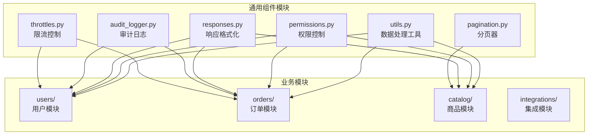

**图表来源**
- [utils.py](file://backend/common/utils.py#L1-L48)
- [permissions.py](file://backend/common/permissions.py#L1-L189)
- [responses.py](file://backend/common/responses.py#L1-L322)
- [pagination.py](file://backend/common/pagination.py#L1-L99)
- [audit_logger.py](file://backend/common/audit_logger.py#L1-L348)
- [throttles.py](file://backend/common/throttles.py#L1-L78)

**章节来源**
- [utils.py](file://backend/common/utils.py#L1-L48)
- [permissions.py](file://backend/common/permissions.py#L1-L189)
- [responses.py](file://backend/common/responses.py#L1-L322)
- [pagination.py](file://backend/common/pagination.py#L1-L99)
- [audit_logger.py](file://backend/common/audit_logger.py#L1-L348)
- [throttles.py](file://backend/common/throttles.py#L1-L78)

## 核心工具函数模块

### 数据格式化工具

`utils.py` 提供了一系列强大的数据处理工具函数，支持多种数据类型的转换和验证：

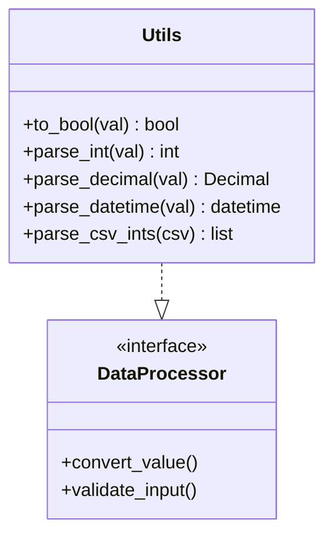

**图表来源**
- [utils.py](file://backend/common/utils.py#L1-L48)

#### 主要功能特性

1. **布尔值转换 (`to_bool`)**：支持字符串、数字、布尔值等多种输入格式的智能转换
2. **整数解析 (`parse_int`)**：安全的整数转换，处理异常情况
3. **十进制解析 (`parse_decimal`)**：精确的数值处理，避免浮点精度问题
4. **日期时间解析 (`parse_datetime`)**：基于 Django 的日期解析功能
5. **CSV整数解析 (`parse_csv_ints`)**：批量处理逗号分隔的整数列表

### 字符串处理能力

工具函数具备强大的字符串处理能力，能够优雅地处理各种输入格式：

- **空值处理**：对 None 值的安全处理
- **类型兼容性**：支持多种输入类型的统一处理
- **异常容错**：在转换失败时返回 None 而非抛出异常
- **格式标准化**：统一的输出格式和类型保证

**章节来源**
- [utils.py](file://backend/common/utils.py#L1-L48)

## 权限控制体系

### 自定义权限类设计

`permissions.py` 实现了多层次的权限控制系统，提供了灵活且安全的访问控制机制：

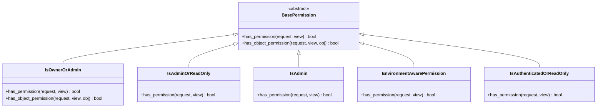

**图表来源**
- [permissions.py](file://backend/common/permissions.py#L12-L189)

#### 权限类功能详解

1. **IsOwnerOrAdmin**：所有者或管理员权限，支持对象级别的细粒度控制
2. **IsAdminOrReadOnly**：只读权限，管理员可写，普通用户只读
3. **IsAdmin**：严格的管理员权限控制
4. **EnvironmentAwarePermission**：环境感知权限，在开发和生产环境中采用不同的策略
5. **IsAuthenticatedOrReadOnly**：认证用户只写，未认证用户只读

### 权限应用模式

权限系统支持多种应用场景：

- **对象级别权限**：针对具体资源的访问控制
- **方法级别权限**：基于HTTP方法的权限控制
- **环境级别权限**：开发环境的宽松策略
- **继承式权限**：基于父类的权限继承机制

**章节来源**
- [permissions.py](file://backend/common/permissions.py#L1-L189)

## 统一响应格式系统

### 响应格式封装机制

`responses.py` 提供了统一的API响应格式，确保所有接口的一致性和可预测性：

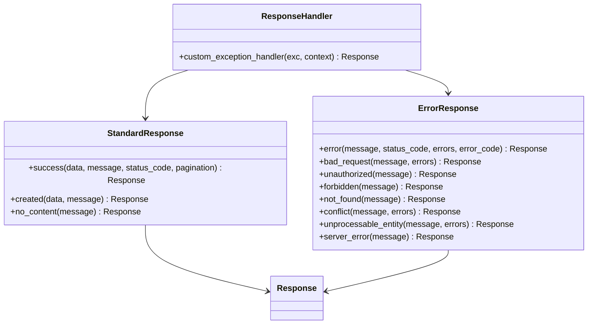

**图表来源**
- [responses.py](file://backend/common/responses.py#L15-L322)

#### 响应格式规范

**成功响应格式**：
```json
{
    "success": true,
    "code": 200,
    "message": "操作成功",
    "data": {...},
    "pagination": {...}
}
```

**错误响应格式**：
```json
{
    "success": false,
    "code": 400,
    "message": "错误信息",
    "errors": {...},
    "error_code": "ERROR_CODE"
}
```

### 异常处理机制

系统提供了完善的异常处理机制，包括：

- **DRF异常处理器**：自动格式化Django Rest Framework的异常
- **自定义异常处理**：支持业务逻辑异常的统一处理
- **错误码映射**：将HTTP状态码映射到业务错误码
- **详细错误信息**：提供结构化的错误详情

**章节来源**
- [responses.py](file://backend/common/responses.py#L1-L322)

## 分页器配置

### 分页器设计模式

`pagination.py` 提供了三种不同场景的分页器配置，适应不同的性能需求：

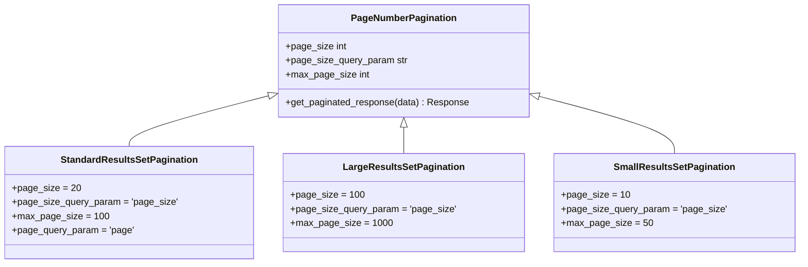

**图表来源**
- [pagination.py](file://backend/common/pagination.py#L8-L99)

#### 分页器应用场景

1. **StandardResultsSetPagination**：标准分页，适用于大多数列表接口
2. **LargeResultsSetPagination**：大数据集分页，适用于商品列表等
3. **SmallResultsSetPagination**：小数据集分页，适用于移动端或特殊场景

### 分页元数据设计

分页器返回完整的元数据信息：

- **结果列表**：当前页的数据项
- **总数统计**：总记录数
- **页面信息**：当前页码、总页数
- **导航信息**：是否有上一页、下一页
- **兼容字段**：向后兼容的传统字段

**章节来源**
- [pagination.py](file://backend/common/pagination.py#L1-L99)

## 操作日志记录

### 审计日志系统

`audit_logger.py` 实现了全面的操作日志记录系统，支持关键业务操作的审计追踪：

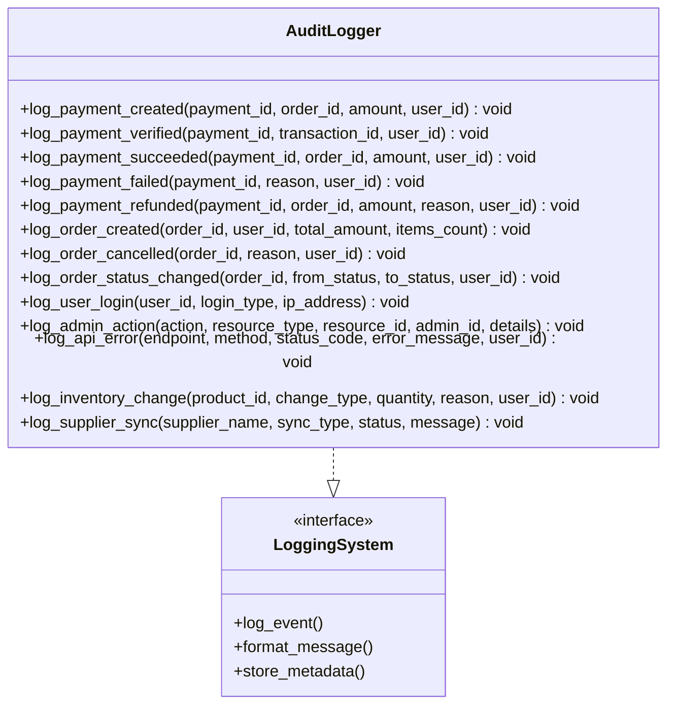

**图表来源**
- [audit_logger.py](file://backend/common/audit_logger.py#L22-L348)

#### 日志记录类型

1. **支付操作日志**：创建、验证、成功、失败、退款
2. **订单操作日志**：创建、取消、状态变更
3. **用户操作日志**：登录、权限变更
4. **管理员操作日志**：资源管理操作
5. **系统错误日志**：API错误追踪
6. **库存操作日志**：库存变更记录
7. **供应商同步日志**：第三方数据同步

### 日志格式设计

日志采用结构化格式，包含：

- **事件标识**：明确的事件类型
- **上下文信息**：相关的业务实体ID
- **操作详情**：具体的操作参数
- **时间戳**：精确的时间记录
- **用户信息**：操作者的身份标识

**章节来源**
- [audit_logger.py](file://backend/common/audit_logger.py#L1-L348)

## 限流策略实现

### 速率限制机制

`throttles.py` 实现了精细化的API速率限制策略，保护系统免受恶意请求攻击：

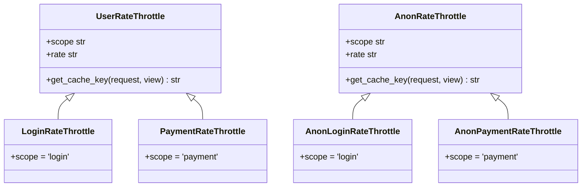

**图表来源**
- [throttles.py](file://backend/common/throttles.py#L11-L78)

#### 限流策略配置

1. **LoginRateThrottle**：登录接口严格限制，防止暴力破解
   - 已认证用户：5次/分钟
   - 匿名用户：5次/分钟

2. **PaymentRateThrottle**：支付接口更严格限制
   - 已认证用户：10次/分钟
   - 匿名用户：不允许访问

3. **AnonLoginRateThrottle**：匿名登录限制
   - 匿名用户：5次/分钟

4. **AnonPaymentRateThrottle**：匿名支付限制
   - 匿名用户：10次/分钟

### 限流实现原理

限流系统基于Redis缓存实现：

- **令牌桶算法**：平滑的请求速率控制
- **用户级别限制**：区分已认证和匿名用户
- **作用域隔离**：不同接口使用不同的限流规则
- **动态调整**：支持运行时修改限流参数

**章节来源**
- [throttles.py](file://backend/common/throttles.py#L1-L78)

## 实际应用场景

### 用户模块应用

在用户模块中，通用组件被广泛应用于各种场景：

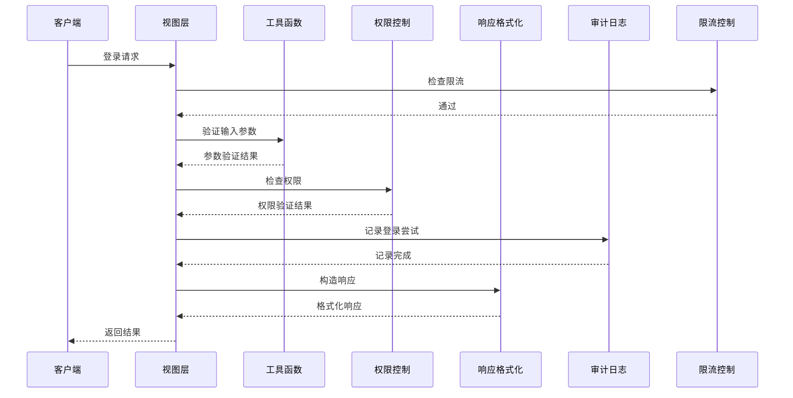

**图表来源**
- [views.py](file://backend/users/views.py#L21-L200)

#### 用户模块具体应用

1. **登录接口**：
   - 使用 `LoginRateThrottle` 进行限流
   - 使用 `to_bool` 处理参数
   - 使用 `IsOwnerOrAdmin` 控制访问
   - 使用 `StandardResponse` 返回结果
   - 使用 `log_user_login` 记录日志

2. **用户资料管理**：
   - 使用 `parse_int` 处理ID参数
   - 使用 `IsOwnerOrAdmin` 确保数据安全
   - 使用 `ErrorResponse` 处理错误

### 订单模块应用

订单模块展示了通用组件的综合应用：

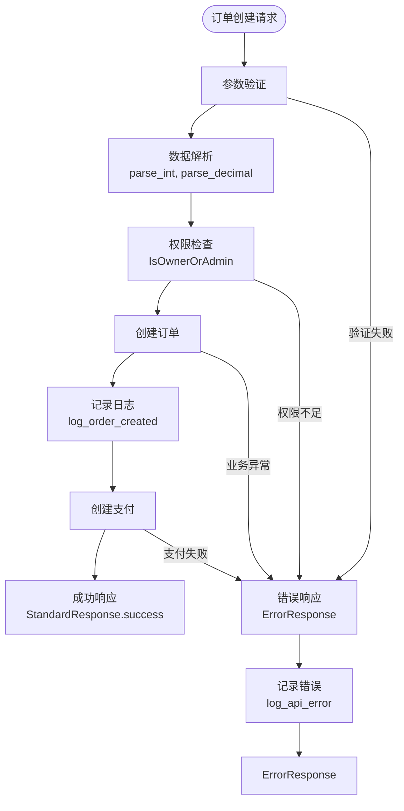

**图表来源**
- [views.py](file://backend/orders/views.py#L1-L200)
- [services.py](file://backend/orders/services.py#L1-L200)

#### 订单模块功能特点

1. **复杂数据处理**：大量使用工具函数进行数据验证和转换
2. **精细权限控制**：支持用户只能访问自己的订单
3. **完整的日志记录**：从订单创建到支付成功的全流程记录
4. **灵活的响应格式**：支持分页和详细的错误信息

### 商品模块应用

商品模块主要展示搜索和过滤功能：

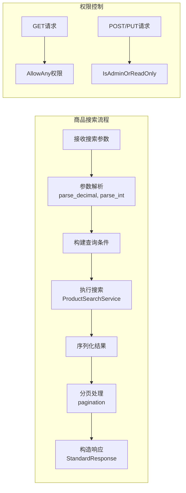

**图表来源**
- [views.py](file://backend/catalog/views.py#L1-L200)

**章节来源**
- [views.py](file://backend/users/views.py#L1-L200)
- [views.py](file://backend/orders/views.py#L1-L200)
- [views.py](file://backend/catalog/views.py#L1-L200)
- [services.py](file://backend/orders/services.py#L1-L200)
- [services.py](file://backend/users/services.py#L1-L55)

## 完整API请求处理流程

以下是一个包含权限校验、日志记录和响应封装的完整API请求处理流程：

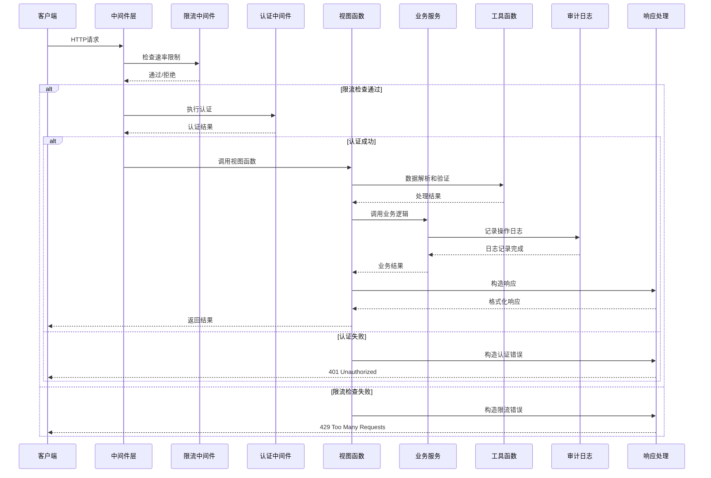

### 流程关键节点

1. **限流检查**：在请求进入业务逻辑前进行速率限制
2. **认证授权**：确保只有合法用户才能访问受保护资源
3. **数据验证**：使用工具函数进行参数验证和转换
4. **业务处理**：调用相应的业务服务处理核心逻辑
5. **日志记录**：记录关键操作以便审计和监控
6. **响应封装**：使用统一的响应格式返回结果

### 错误处理机制

系统实现了多层次的错误处理：

- **语法错误**：参数格式错误，返回400 Bad Request
- **权限错误**：访问被拒绝，返回403 Forbidden
- **业务错误**：业务逻辑异常，返回422 Unprocessable Entity
- **系统错误**：内部服务器错误，返回500 Internal Server Error
- **限流错误**：请求过于频繁，返回429 Too Many Requests

**章节来源**
- [views.py](file://backend/users/views.py#L21-L200)
- [views.py](file://backend/orders/views.py#L1-L200)
- [views.py](file://backend/catalog/views.py#L1-L200)
- [responses.py](file://backend/common/responses.py#L276-L322)

## 总结与最佳实践

### 通用组件的价值

通用组件模块的设计体现了以下核心价值：

1. **代码复用**：避免重复开发相同功能，提高开发效率
2. **一致性保障**：确保整个系统的行为和表现一致
3. **可维护性**：集中管理通用功能，便于维护和升级
4. **安全性**：提供经过验证的安全机制和最佳实践
5. **可扩展性**：模块化设计支持功能的灵活扩展

### 设计原则

1. **单一职责**：每个组件专注于特定的功能领域
2. **开闭原则**：对扩展开放，对修改封闭
3. **依赖倒置**：高层模块不依赖低层模块的具体实现
4. **接口隔离**：提供简洁明了的接口
5. **组合优于继承**：通过组合实现功能的灵活组合

### 最佳实践建议

1. **合理使用工具函数**：在需要数据转换和验证的地方优先使用工具函数
2. **权限控制粒度**：根据业务需求选择合适的权限控制级别
3. **响应格式统一**：始终使用统一的响应格式，便于前端处理
4. **日志记录完整**：关键操作都要有相应的日志记录
5. **限流策略适度**：根据业务特点设置合理的限流参数
6. **错误信息友好**：提供用户友好的错误提示和解决建议

### 未来发展方向

1. **性能优化**：进一步优化工具函数的性能，减少不必要的计算
2. **功能扩展**：根据业务发展添加新的通用功能
3. **监控增强**：增加对通用组件使用的监控和分析
4. **文档完善**：持续完善组件的使用文档和示例
5. **测试覆盖**：提高通用组件的自动化测试覆盖率

通过这套通用组件模块，系统实现了高度的模块化和标准化，为业务的发展奠定了坚实的基础。这些组件不仅解决了当前的需求，也为未来的扩展预留了足够的空间。