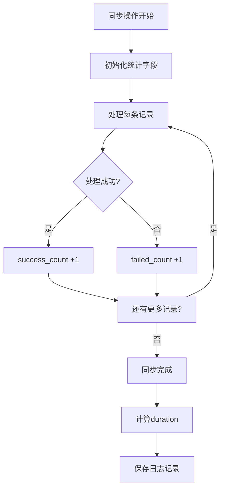
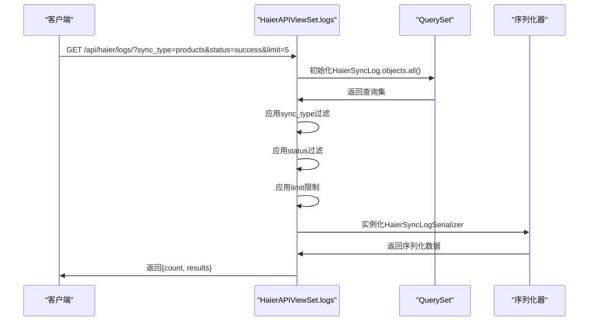

# 同步日志管理

<cite>
**本文档引用的文件**  
- [models.py](file://backend/integrations/models.py)
- [views.py](file://backend/integrations/views.py)
- [serializers.py](file://backend/integrations/serializers.py)
- [admin.py](file://backend/integrations/admin.py)
- [sync_haier_products.py](file://backend/catalog/management/commands/sync_haier_products.py)
</cite>

## 目录
1. [引言](#引言)
2. [HaierSyncLog模型数据结构设计](#haiersynclog模型数据结构设计)
3. [sync_type字段枚举值及业务含义](#sync_type字段枚举值及业务含义)
4. [status字段枚举值及业务含义](#status字段枚举值及业务含义)
5. [统计字段说明](#统计字段说明)
6. [日志查询API接口分析](#日志查询api接口分析)
7. [日志记录最佳实践](#日志记录最佳实践)
8. [基于日志的故障排查指南](#基于日志的故障排查指南)

## 引言
本文档详细介绍了海尔API同步日志（HaierSyncLog）的数据结构设计与管理机制。该日志系统用于记录所有与海尔API交互的数据同步操作，包括商品、价格、库存、订单推送和物流查询等关键业务流程。通过详细的日志信息，系统能够实现操作审计、性能监控和故障排查等功能，确保数据同步过程的可追溯性和可靠性。

## HaierSyncLog模型数据结构设计

HaierSyncLog模型是系统中用于记录海尔API数据同步操作的核心数据结构。该模型设计遵循清晰的字段分类原则，包含同步类型、状态、消息、统计信息和时间戳等关键字段。

```mermaid
classDiagram
class HaierSyncLog {
+sync_type : CharField
+status : CharField
+message : TextField
+total_count : IntegerField
+success_count : IntegerField
+failed_count : IntegerField
+started_at : DateTimeField
+completed_at : DateTimeField
+created_at : DateTimeField
+duration : property
+__str__() : str
}
HaierSyncLog : SYNC_TYPE_CHOICES = [
('products', '商品同步'),
('prices', '价格同步'),
('stock', '库存同步'),
('order', '订单推送'),
('logistics', '物流查询'),
('manual', '手动操作')
]
HaierSyncLog : STATUS_CHOICES = [
('pending', '待处理'),
('processing', '处理中'),
('success', '成功'),
('failed', '失败'),
('partial', '部分成功')
]
```

**图表来源**  
- [models.py](file://backend/integrations/models.py#L50-L149)

**本节来源**  
- [models.py](file://backend/integrations/models.py#L50-L149)

## sync_type字段枚举值及业务含义

sync_type字段定义了同步操作的类型，使用枚举值来确保数据的一致性和可读性。每个枚举值都有明确的业务含义：

- **products（商品同步）**：表示从海尔API同步商品基本信息的操作，包括商品编码、名称、规格等元数据
- **prices（价格同步）**：表示从海尔API同步商品价格信息的操作，用于更新商品的销售价格
- **stock（库存同步）**：表示从海尔API查询和更新商品库存信息的操作，确保库存数据的实时性
- **order（订单推送）**：表示向海尔系统推送订单信息的操作，将本地订单同步到海尔平台
- **logistics（物流查询）**：表示从海尔API查询订单物流信息的操作，用于跟踪订单配送状态
- **manual（手动操作）**：表示通过管理界面手动触发的同步操作，通常用于紧急情况或数据修复

这些枚举值的设计覆盖了系统与海尔API交互的主要业务场景，便于对不同类型的同步操作进行分类统计和分析。

**本节来源**  
- [models.py](file://backend/integrations/models.py#L57-L64)

## status字段枚举值及业务含义

status字段表示同步操作的当前状态，反映了操作的生命周期。各枚举值的业务含义如下：

- **pending（待处理）**：同步任务已创建但尚未开始执行，处于等待队列中
- **processing（处理中）**：同步任务正在执行过程中，部分数据可能已经处理完成
- **success（成功）**：同步任务已顺利完成，所有数据都已成功处理
- **failed（失败）**：同步任务执行失败，未能完成任何数据处理，通常由于认证错误或网络问题导致
- **partial（部分成功）**：同步任务部分完成，部分数据处理成功而部分失败，常见于批量操作中个别记录出错的情况

状态机的设计遵循从初始状态到最终状态的单向流转原则，确保了状态转换的逻辑一致性。例如，一个日志记录的状态通常会从"pending"变为"processing"，最后变为"success"、"failed"或"partial"之一。

**本节来源**  
- [models.py](file://backend/integrations/models.py#L66-L72)

## 统计字段说明

HaierSyncLog模型包含一组统计字段，用于量化同步操作的结果和性能：

- **total_count（总数）**：表示本次同步操作计划处理的总记录数。例如，在商品同步中，这表示需要同步的商品总数
- **success_count（成功数）**：表示成功处理的记录数量。该值应小于或等于total_count
- **failed_count（失败数）**：表示处理失败的记录数量。该值也应小于或等于total_count
- **duration（耗时）**：通过属性方法计算得出，表示同步操作的总耗时（秒）。计算公式为completed_at与started_at的时间差

这些统计字段的设计遵循"总数=成功数+失败数"的数学关系，确保了数据的完整性。通过这些字段，管理员可以快速评估同步操作的效率和成功率，例如计算成功率（success_count/total_count）和平均处理时间等关键指标。



**图表来源**  
- [models.py](file://backend/integrations/models.py#L96-L112)
- [models.py](file://backend/integrations/models.py#L144-L149)

**本节来源**  
- [models.py](file://backend/integrations/models.py#L96-L112)

## 日志查询API接口分析

系统提供了/logs端点用于查询同步日志，该API支持灵活的过滤和分页功能。

### API端点信息
- **路径**：GET /api/haier/logs/
- **权限**：仅管理员可访问
- **功能**：获取海尔API操作日志记录

### 过滤参数
API支持以下查询参数进行数据过滤：
- **sync_type**：按同步类型过滤，值为sync_type字段的枚举值之一
- **status**：按同步状态过滤，值为status字段的枚举值之一

### 分页机制
API采用简单的数量限制分页机制：
- **limit参数**：指定返回的最大记录数，默认值为10
- **实现方式**：通过Django ORM的切片操作queryset[:limit]实现
- **响应格式**：返回包含count（实际返回数量）和results（日志数据列表）的JSON对象



**图表来源**  
- [views.py](file://backend/integrations/views.py#L297-L326)
- [serializers.py](file://backend/integrations/serializers.py#L33-L66)

**本节来源**  
- [views.py](file://backend/integrations/views.py#L297-L326)

## 日志记录最佳实践

为了确保同步日志的有效性和可用性，建议遵循以下最佳实践：

### 日志创建时机
- **操作开始时**：创建日志记录，设置sync_type、status为"pending"、total_count等初始值
- **操作执行中**：更新status为"processing"，实时更新success_count和failed_count
- **操作完成时**：设置status为最终状态，设置completed_at时间戳

### 信息完整性
- **sync_type选择**：准确选择与操作匹配的同步类型，避免使用"manual"作为默认值
- **message字段**：在失败或部分成功时，记录详细的错误信息，包括异常类型、消息和堆栈跟踪摘要
- **统计准确性**：确保total_count、success_count和failed_count的数值关系正确

### 性能考虑
- **批量操作**：对于大量数据的同步，考虑分批处理并创建多个日志记录，避免单个日志过大
- **异步处理**：对于耗时较长的同步操作，采用异步任务模式，避免阻塞API请求

### 安全性
- **敏感信息**：避免在message字段中记录密码、令牌等敏感信息
- **输入验证**：对sync_type和status等枚举字段进行严格验证，防止注入攻击

**本节来源**  
- [models.py](file://backend/integrations/models.py#L50-L149)
- [sync_haier_products.py](file://backend/catalog/management/commands/sync_haier_products.py#L50-L156)

## 基于日志的故障排查指南

同步日志是诊断系统问题的重要工具，以下是基于日志的常见故障排查方法：

### 常见问题模式识别
- **认证失败**：查找status为"failed"且message包含"认证失败"的日志，检查HaierConfig配置
- **网络超时**：查找status为"failed"且message包含"timeout"的日志，检查网络连接和API可用性
- **部分成功**：分析status为"partial"的日志，检查failed_count与total_count的比例，定位特定失败记录

### 排查步骤
1. **确定问题范围**：根据sync_type过滤日志，聚焦相关业务领域
2. **时间序列分析**：按created_at排序，观察问题是否集中在特定时间段
3. **状态分布统计**：统计不同status的日志数量，识别主要问题类型
4. **错误信息分析**：查看message字段，提取关键错误模式
5. **性能评估**：计算duration的平均值和分布，识别性能瓶颈

### 典型场景解决方案
- **连续失败**：检查API配额、认证信息和网络连接
- **间歇性失败**：考虑网络不稳定或API限流，实施重试机制
- **部分成功**：分析失败记录的共同特征，如特定商品编码或区域代码
- **性能下降**：比较不同时间段的duration，识别性能退化趋势

通过系统性地分析同步日志，可以快速定位问题根源，实施针对性的解决方案，确保系统稳定运行。

**本节来源**  
- [models.py](file://backend/integrations/models.py#L50-L149)
- [views.py](file://backend/integrations/views.py#L297-L326)
- [haierapi.py](file://backend/integrations/haierapi.py#L41-L64)