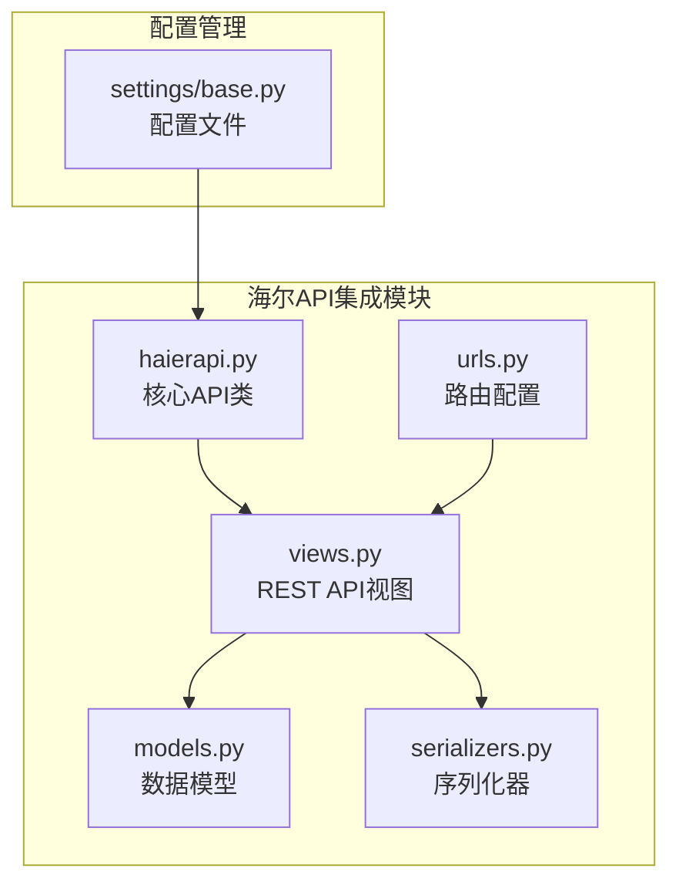
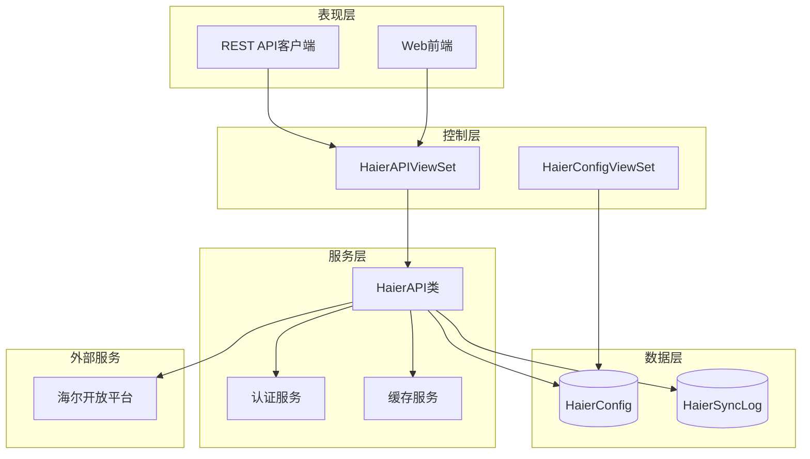
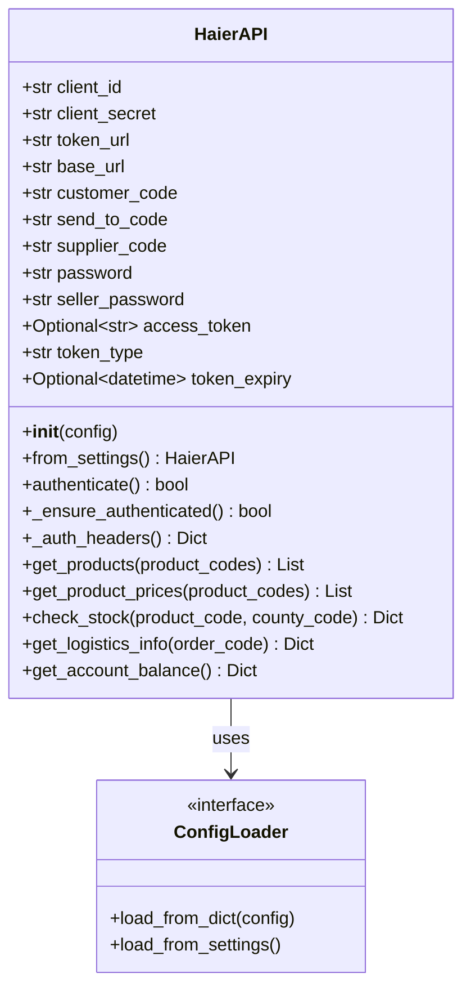
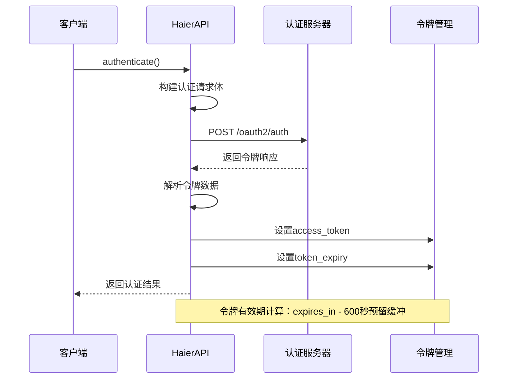
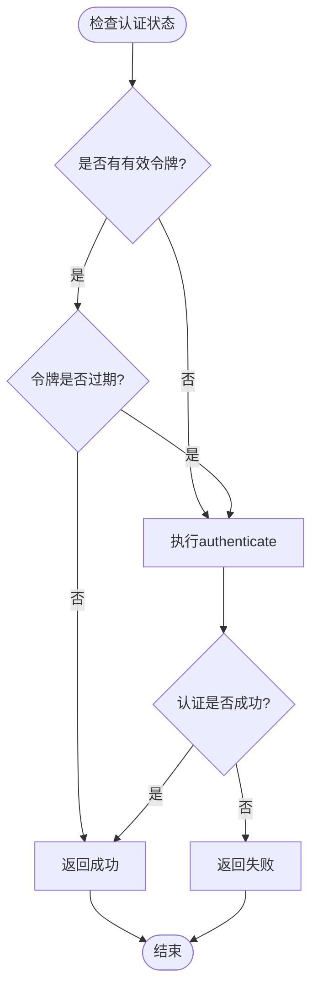
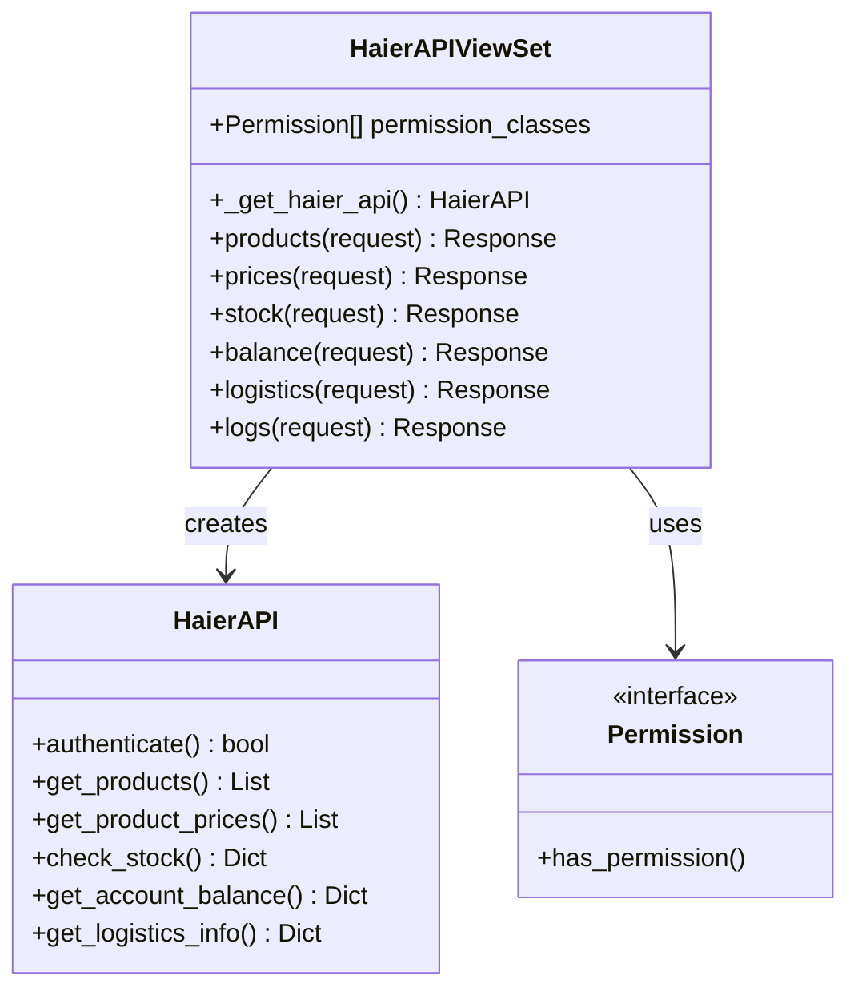
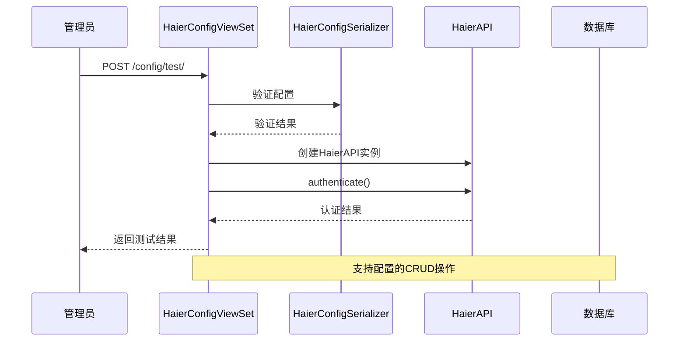
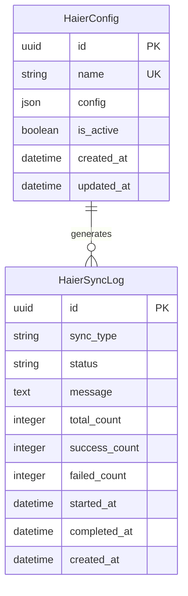
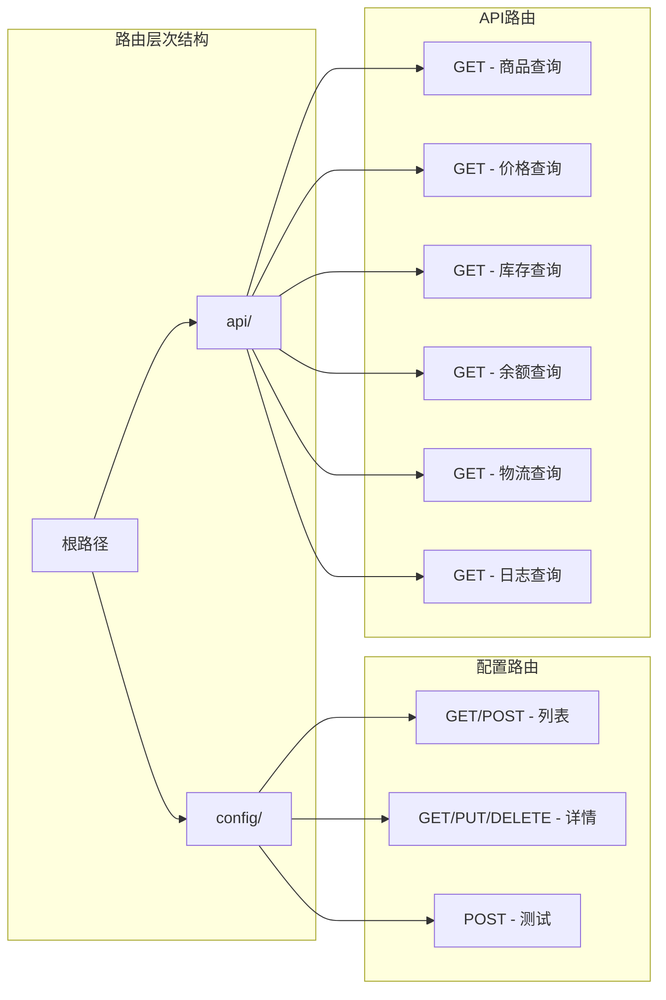
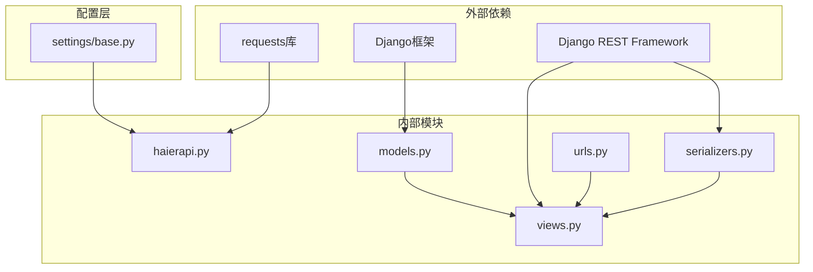

# 海尔API集成

<cite>
**本文档引用的文件**
- [haierapi.py](file://backend/integrations/haierapi.py)
- [views.py](file://backend/integrations/views.py)
- [models.py](file://backend/integrations/models.py)
- [urls.py](file://backend/integrations/urls.py)
- [serializers.py](file://backend/integrations/serializers.py)
- [base.py](file://backend/backend/settings/base.py)
</cite>

## 目录
1. [简介](#简介)
2. [项目结构](#项目结构)
3. [核心组件](#核心组件)
4. [架构概览](#架构概览)
5. [详细组件分析](#详细组件分析)
6. [依赖关系分析](#依赖关系分析)
7. [性能考虑](#性能考虑)
8. [故障排除指南](#故障排除指南)
9. [结论](#结论)

## 简介

海尔API集成系统是一个完整的电商平台与海尔开放平台对接的解决方案，提供了商品信息查询、价格获取、库存检查、物流查询和账户余额等功能。该系统采用RESTful API设计，通过OAuth2.0认证机制确保安全性，并实现了智能的令牌刷新策略以保证API调用的连续性。

## 项目结构

海尔API集成模块位于`backend/integrations/`目录下，包含以下核心文件：



**图表来源**
- [haierapi.py](file://backend/integrations/haierapi.py#L1-L214)
- [views.py](file://backend/integrations/views.py#L1-L327)
- [models.py](file://backend/integrations/models.py#L1-L150)

**章节来源**
- [haierapi.py](file://backend/integrations/haierapi.py#L1-L214)
- [views.py](file://backend/integrations/views.py#L1-L327)
- [models.py](file://backend/integrations/models.py#L1-L150)

## 核心组件

### HaierAPI类
HaierAPI类是整个集成系统的核心，负责与海尔开放平台的所有交互。该类提供了完整的OAuth2.0认证机制和多个业务API接口。

### HaierAPIViewSet
REST API视图集，为前端提供标准化的HTTP接口，包括商品查询、价格查询、库存检查、物流查询等功能。

### HaierConfig模型
数据库模型，用于存储和管理海尔API的配置信息，支持多配置管理和动态切换。

**章节来源**
- [haierapi.py](file://backend/integrations/haierapi.py#L10-L214)
- [views.py](file://backend/integrations/views.py#L104-L327)
- [models.py](file://backend/integrations/models.py#L4-L47)

## 架构概览

海尔API集成系统采用分层架构设计，确保了良好的可维护性和扩展性：



**图表来源**
- [views.py](file://backend/integrations/views.py#L104-L327)
- [haierapi.py](file://backend/integrations/haierapi.py#L10-L214)
- [models.py](file://backend/integrations/models.py#L4-L150)

## 详细组件分析

### HaierAPI类深度分析

#### 初始化与配置管理

HaierAPI类通过多种方式初始化，支持从配置字典直接初始化或从Django设置中自动加载配置：



**图表来源**
- [haierapi.py](file://backend/integrations/haierapi.py#L10-L39)

#### 认证流程分析

authenticate()方法实现了OAuth2.0客户端凭据模式的认证流程：



**图表来源**
- [haierapi.py](file://backend/integrations/haierapi.py#L41-L64)

#### 令牌刷新策略

_ensure_authenticated()方法实现了智能的令牌刷新机制：



**图表来源**
- [haierapi.py](file://backend/integrations/haierapi.py#L66-L69)

#### 核心API方法实现

##### 商品查询功能

get_products()方法支持批量查询可采购商品信息：

| 参数 | 类型 | 必需 | 描述 |
|------|------|------|------|
| product_codes | List[str] | 否 | 商品编码列表，最多20个 |
| customerCode | str | 是 | 客户编码 |
| supplierCode | str | 是 | 供应商编码 |
| searchType | str | 是 | 搜索类型（固定为PTJSH） |
| passWord | str | 是 | 密码验证 |

##### 价格查询功能

get_product_prices()方法提供商品价格查询服务：

| 参数 | 类型 | 必需 | 描述 |
|------|------|------|------|
| productCodes | List[str] | 是 | 商品编码列表，最多20个 |
| customerCode | str | 是 | 客户编码 |
| sendToCode | str | 是 | 发送目标编码 |
| priceType | str | 是 | 价格类型（固定为PT） |
| passWord | str | 是 | 密码验证 |

##### 库存检查功能

check_stock()方法查询指定商品在特定地区的可用库存：

| 参数 | 类型 | 必需 | 描述 |
|------|------|------|------|
| product_code | str | 是 | 商品编码 |
| county_code | str | 是 | 区县编码 |
| salesCode | str | 是 | 销售编码 |
| senderCode | str | 是 | 发送者编码 |
| source | str | 否 | 数据源（默认JSH-B） |
| sellerPassword | str | 是 | 卖家密码 |

**章节来源**
- [haierapi.py](file://backend/integrations/haierapi.py#L41-L142)

### REST API视图集分析

#### HaierAPIViewSet架构

HaierAPIViewSet继承自Django REST Framework的ViewSet，提供了标准化的REST API接口：



**图表来源**
- [views.py](file://backend/integrations/views.py#L104-L327)

#### API端点映射关系

| 端点 | HTTP方法 | 功能描述 | 参数要求 |
|------|----------|----------|----------|
| `/api/haier/products/` | GET | 查询可采购商品 | `product_codes`（可选） |
| `/api/haier/prices/` | GET | 查询商品价格 | `product_codes`（必需） |
| `/api/haier/stock/` | GET | 查询库存信息 | `product_code`（必需），`county_code`（可选） |
| `/api/haier/balance/` | GET | 查询账户余额 | 无 |
| `/api/haier/logistics/` | GET | 查询物流信息 | `order_code`（必需） |
| `/api/haier/logs/` | GET | 获取同步日志 | 多个筛选参数 |

#### 配置管理视图集

HaierConfigViewSet提供了完整的配置管理功能：



**图表来源**
- [views.py](file://backend/integrations/views.py#L36-L101)

**章节来源**
- [views.py](file://backend/integrations/views.py#L104-L327)

### 数据模型分析

#### HaierConfig模型

HaierConfig模型使用JSONField存储灵活的配置结构：



**图表来源**
- [models.py](file://backend/integrations/models.py#L4-L150)

#### HaierSyncLog模型

HaierSyncLog模型记录所有API同步操作的详细信息：

| 字段名 | 类型 | 描述 |
|--------|------|------|
| sync_type | CharField | 同步类型（products, prices, stock, order, logistics, manual） |
| status | CharField | 同步状态（pending, processing, success, failed, partial） |
| message | TextField | 详细消息或错误信息 |
| total_count | IntegerField | 总记录数 |
| success_count | IntegerField | 成功记录数 |
| failed_count | IntegerField | 失败记录数 |
| duration | property | 同步耗时（秒） |

**章节来源**
- [models.py](file://backend/integrations/models.py#L50-L150)

### 路由配置分析

系统使用Django REST Framework的DefaultRouter进行路由注册：



**图表来源**
- [urls.py](file://backend/integrations/urls.py#L8-L14)

**章节来源**
- [urls.py](file://backend/integrations/urls.py#L1-L15)

## 依赖关系分析

海尔API集成系统的依赖关系清晰明确，遵循了良好的软件工程原则：



**图表来源**
- [haierapi.py](file://backend/integrations/haierapi.py#L1-L9)
- [views.py](file://backend/integrations/views.py#L1-L32)

### 关键依赖说明

1. **requests库**：用于HTTP请求的发送和处理
2. **Django ORM**：数据库操作和模型定义
3. **Django REST Framework**：REST API的快速开发框架
4. **Python标准库**：datetime、json等基础模块

**章节来源**
- [haierapi.py](file://backend/integrations/haierapi.py#L1-L9)
- [views.py](file://backend/integrations/views.py#L1-L32)

## 性能考虑

### 令牌缓存策略

系统实现了智能的令牌缓存机制，避免频繁的认证请求：

- **令牌有效期计算**：从API响应的`expires_in`减去600秒作为安全缓冲
- **延迟加载**：只有在需要API调用时才检查和刷新令牌
- **并发安全**：通过单例模式确保令牌的一致性

### 请求超时设置

所有HTTP请求都设置了合理的超时时间：
- **认证请求**：10秒超时
- **业务API请求**：30秒超时

### 批量操作优化

- **商品查询**：最多支持20个商品编码同时查询
- **价格查询**：最多支持20个商品编码同时查询
- **库存查询**：单个商品编码查询

## 故障排除指南

### 常见问题及解决方案

#### 认证失败

**症状**：API调用返回401未授权错误
**原因**：令牌过期或配置错误
**解决方案**：
1. 检查配置信息是否正确
2. 验证网络连接
3. 查看日志获取详细错误信息

#### 网络连接超时

**症状**：API调用超时异常
**原因**：网络不稳定或服务器负载过高
**解决方案**：
1. 检查网络连接
2. 增加超时时间
3. 实现重试机制

#### 数据格式错误

**症状**：API返回数据格式异常
**原因**：海尔平台返回的数据结构变化
**解决方案**：
1. 检查API版本兼容性
2. 更新数据解析逻辑
3. 添加数据验证机制

### 日志记录最佳实践

系统在关键位置添加了详细的日志记录：

```python
# 认证失败日志
logger.error(f'haier auth failed: {res.status_code} {res.text}')

# API调用失败日志  
logger.error(f'haier products failed: {res.status_code} {res.text}')

# 系统级错误日志
logger.error(f'获取海尔API实例失败: {str(e)}')
```

**章节来源**
- [haierapi.py](file://backend/integrations/haierapi.py#L49-L64)
- [views.py](file://backend/integrations/views.py#L146-L147)

## 结论

海尔API集成系统是一个设计良好、功能完整的电商平台与海尔开放平台对接解决方案。系统具有以下特点：

### 技术优势

1. **模块化设计**：清晰的职责分离，便于维护和扩展
2. **安全性保障**：完整的OAuth2.0认证机制
3. **智能缓存**：自动化的令牌刷新策略
4. **RESTful架构**：标准化的API接口设计
5. **完善的监控**：详细的日志记录和状态跟踪

### 扩展性考虑

1. **配置管理**：支持多配置和动态切换
2. **错误处理**：完善的异常捕获和恢复机制
3. **性能优化**：智能的缓存和超时控制
4. **监控审计**：完整的操作日志记录

该系统为电商平台提供了稳定可靠的海尔API集成能力，能够满足商品同步、价格查询、库存管理等核心业务需求，是现代电商系统与第三方平台集成的优秀范例。