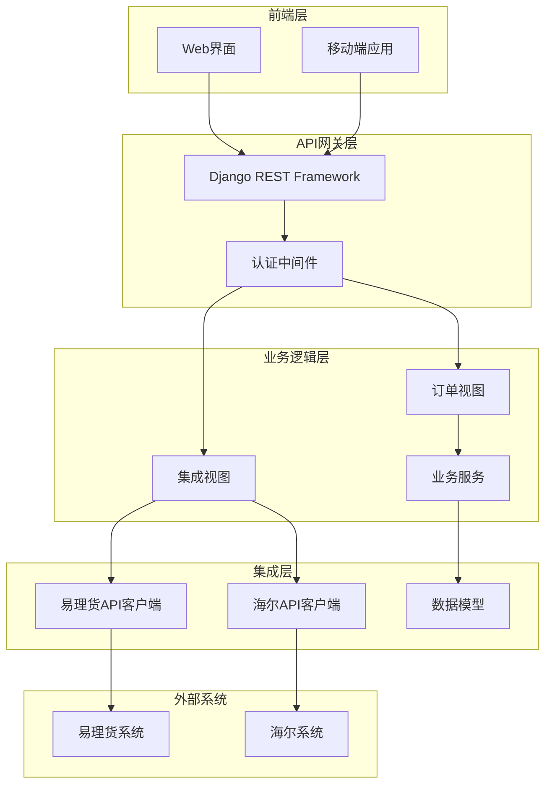
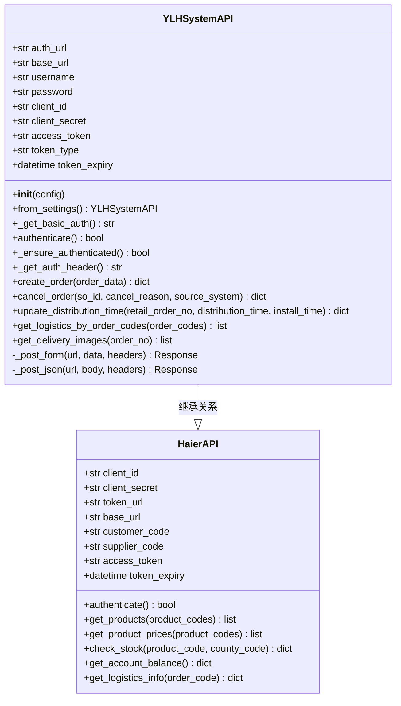
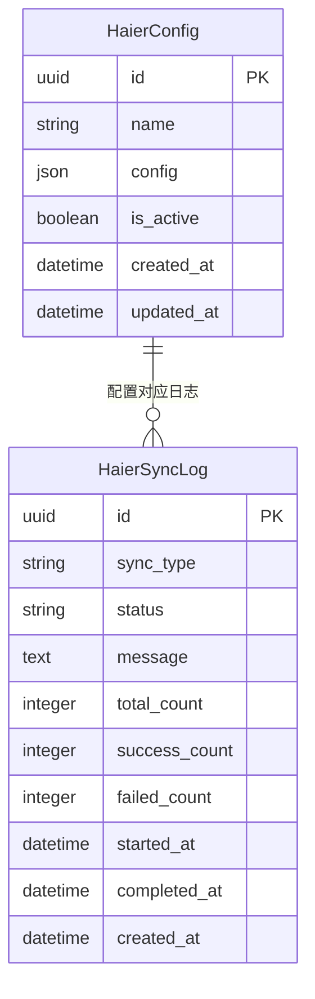
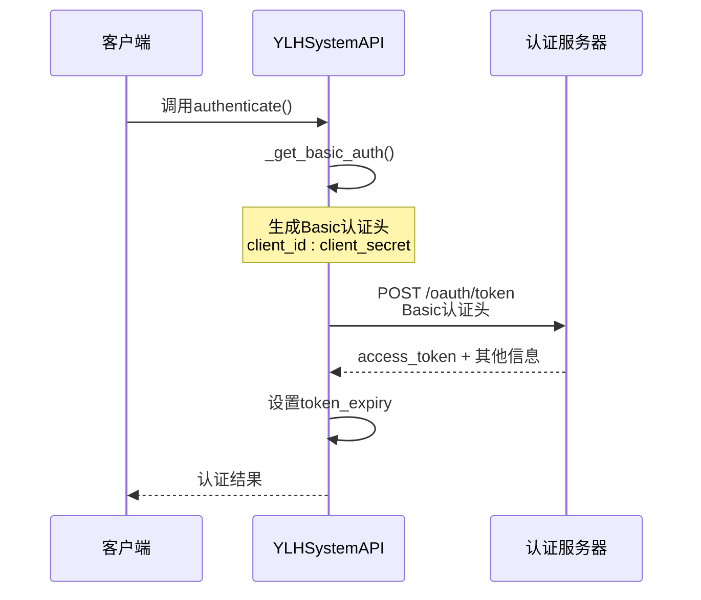
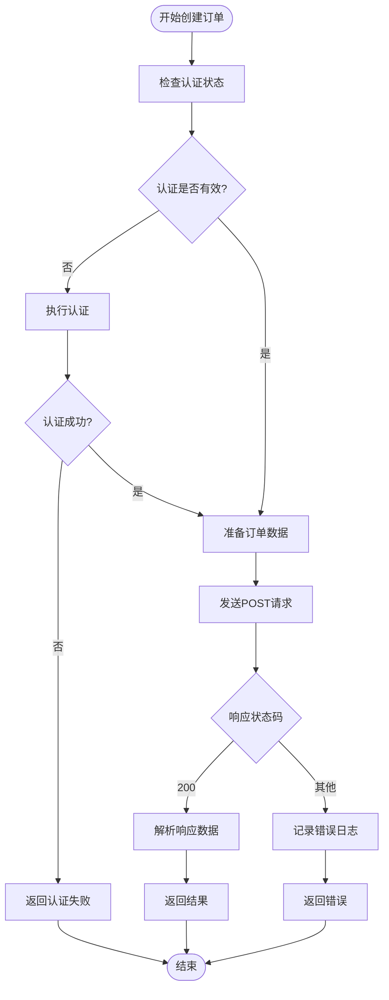
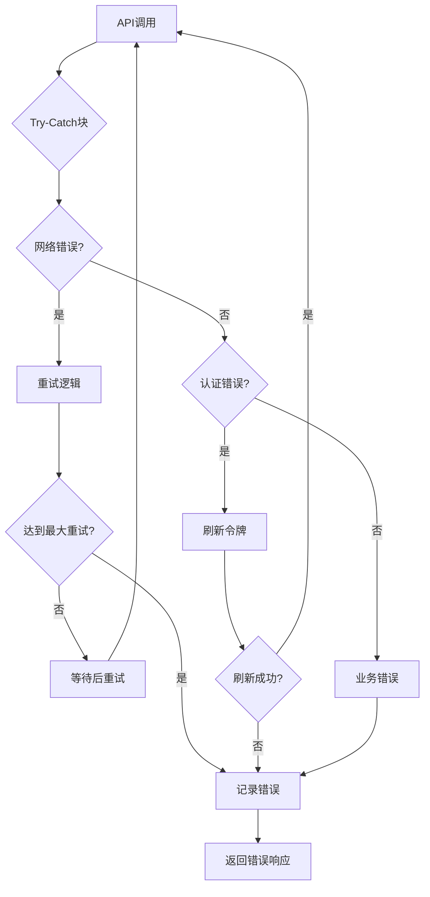
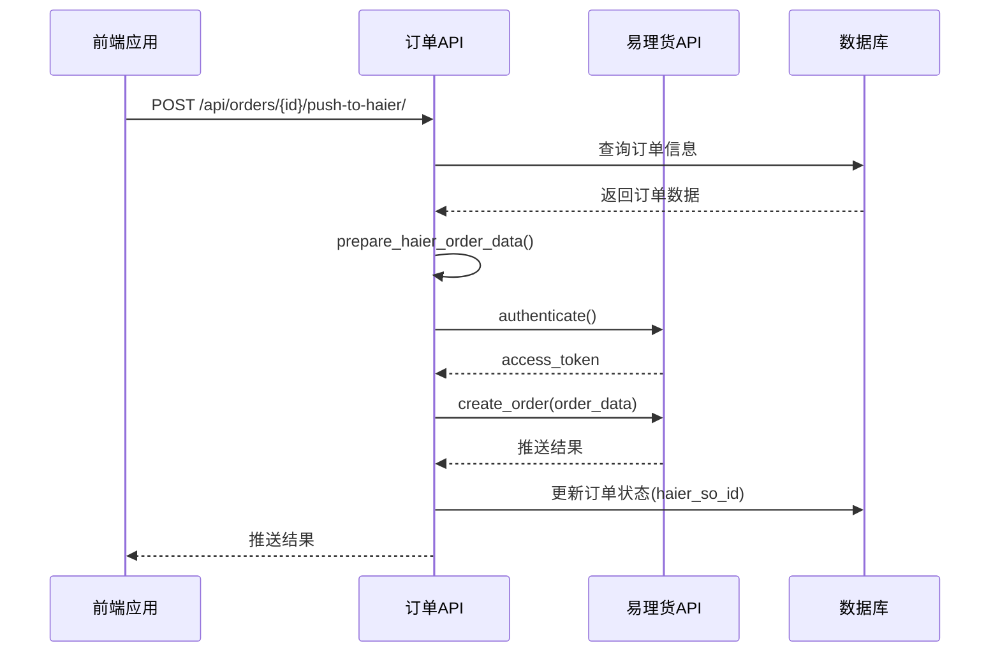
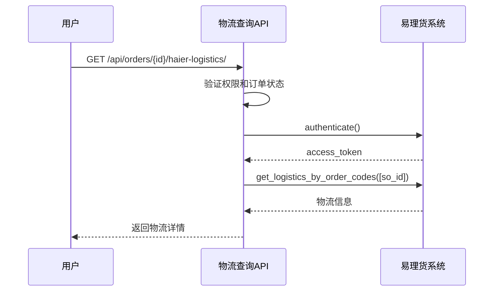

# 第三方系统集成

<cite>
**本文档引用的文件**
- [ylhapi.py](file://backend/integrations/ylhapi.py)
- [views.py](file://backend/integrations/views.py)
- [urls.py](file://backend/integrations/urls.py)
- [models.py](file://backend/integrations/models.py)
- [serializers.py](file://backend/integrations/serializers.py)
- [haierapi.py](file://backend/integrations/haierapi.py)
- [views.py](file://backend/orders/views.py)
- [services.py](file://backend/orders/services.py)
- [base.py](file://backend/backend/settings/base.py)
</cite>

## 目录
1. [简介](#简介)
2. [项目架构](#项目架构)
3. [核心组件](#核心组件)
4. [认证机制](#认证机制)
5. [订单操作接口](#订单操作接口)
6. [物流信息查询](#物流信息查询)
7. [视图层设计](#视图层设计)
8. [异常处理策略](#异常处理策略)
9. [实际调用示例](#实际调用示例)
10. [最佳实践](#最佳实践)

## 简介

本文档详细介绍了一个完整的第三方系统集成解决方案，主要围绕易理货（YLH）系统API的实现。该系统提供了独立的认证机制、订单操作接口和物流信息查询功能，通过RESTful API的方式暴露给前端应用和内部服务。

系统采用模块化设计，将第三方集成逻辑封装在`integrations`应用中，确保了代码的可维护性和扩展性。同时，系统支持模拟数据模式和真实API调用两种运行模式，便于开发、测试和生产环境的部署。

## 项目架构

**图表来源**
- [views.py](file://backend/integrations/views.py#L1-L327)
- [ylhapi.py](file://backend/integrations/ylhapi.py#L1-L459)

**章节来源**
- [views.py](file://backend/integrations/views.py#L1-L50)
- [urls.py](file://backend/integrations/urls.py#L1-L15)

## 核心组件

### YLHSystemAPI类设计

YLHSystemAPI类是易理货系统集成的核心组件，实现了完整的第三方API客户端功能。

**图表来源**
- [ylhapi.py](file://backend/integrations/ylhapi.py#L16-L459)
- [haierapi.py](file://backend/integrations/haierapi.py#L10-L39)

### 数据模型设计

系统使用两个主要的数据模型来管理第三方系统的配置和操作日志。

**图表来源**
- [models.py](file://backend/integrations/models.py#L4-L150)

**章节来源**
- [ylhapi.py](file://backend/integrations/ylhapi.py#L16-L106)
- [models.py](file://backend/integrations/models.py#L4-L150)

## 认证机制

### 独立认证系统

YLHSystemAPI实现了独立的OAuth2认证机制，与系统的JWT认证体系分离，确保第三方系统集成的安全性。

#### Basic认证生成

**图表来源**
- [ylhapi.py](file://backend/integrations/ylhapi.py#L60-L115)

#### 认证流程详解

认证机制包含以下关键特性：

1. **自动令牌刷新**：系统会在令牌过期前10分钟自动刷新
2. **重试机制**：支持HTTP请求的指数退避重试
3. **超时控制**：每个API调用都有明确的超时设置
4. **错误处理**：完善的异常捕获和日志记录

**章节来源**
- [ylhapi.py](file://backend/integrations/ylhapi.py#L60-L131)

## 订单操作接口

### 创建订单接口

create_order方法实现了向易理货系统推送零售订单的功能。

#### 接口规范

| 参数 | 类型 | 必需 | 描述 |
|------|------|------|------|
| sourceSystem | string | 是 | 订单来源系统标识 |
| shopName | string | 是 | 店铺名称 |
| sellerCode | string | 是 | 客户八码 |
| consigneeName | string | 是 | 收货人姓名 |
| consigneeMobile | string | 是 | 收货人手机号 |
| onlineNo | string | 是 | 平台订单号 |
| soId | string | 是 | 子订单号（唯一） |
| remark | string | 否 | 备注信息 |
| totalQty | number | 是 | 订单总数量 |
| totalAmt | number | 是 | 订单总金额 |
| createTime | number | 是 | 订单创建时间戳（毫秒） |
| province | string | 是 | 省份 |
| city | string | 是 | 城市 |
| area | string | 是 | 区县 |
| detailAddress | string | 是 | 详细地址 |
| distributionTime | number | 是 | 配送时间戳 |
| installTime | number | 是 | 安装时间戳 |
| deliveryInstall | boolean | 是 | 是否送装一体 |
| itemList | array | 是 | 订单明细列表 |

#### 实现细节

**图表来源**
- [ylhapi.py](file://backend/integrations/ylhapi.py#L174-L230)

### 取消订单接口

cancel_order方法提供了订单取消功能，支持指定取消原因和时间。

#### 接口特性

- **时间戳支持**：可指定精确的取消时间
- **来源系统标记**：记录订单来自哪个系统
- **批量处理能力**：支持多个订单的批量取消

### 时间改约功能

update_distribution_time方法允许修改订单的配送和安装时间。

#### 时间格式要求

系统要求配送时间和安装时间的时间部分必须为`23:59:59`，这是易理货系统的特定要求。

**章节来源**
- [ylhapi.py](file://backend/integrations/ylhapi.py#L174-L328)

## 物流信息查询

### get_logistics_by_order_codes方法

该方法通过SO单号查询物流相关信息，包括物流单号、物流公司和SN码等。

#### 功能特点

1. **批量查询**：支持最多100个订单号的批量查询
2. **数据标准化**：统一返回格式，便于前端处理
3. **错误容错**：即使部分订单查询失败，仍返回成功的结果

### get_delivery_images方法

获取配送安装的照片信息，支持订单完成后的质量检查。

**章节来源**
- [ylhapi.py](file://backend/integrations/ylhapi.py#L330-L406)

## 视图层设计

### RESTful API端点

系统通过Django REST Framework提供了完整的RESTful API接口。

#### 订单相关端点

| 端点 | 方法 | 权限 | 功能描述 |
|------|------|------|----------|
| `/api/orders/{id}/push-to-haier/` | POST | IsAuthenticated | 推送订单到易理货系统 |
| `/api/orders/{id}/haier-logistics/` | GET | IsAuthenticated | 查询海尔订单物流信息 |
| `/api/orders/haier-callback/` | POST | AllowAny | 接收海尔系统回调 |

#### 集成配置端点

| 端点 | 方法 | 权限 | 功能描述 |
|------|------|------|----------|
| `/api/haier/config/` | GET, POST | IsAdminUser | 获取/创建海尔API配置 |
| `/api/haier/config/{id}/` | GET, PUT, DELETE | IsAdminUser | 获取/更新/删除配置 |
| `/api/haier/config/{id}/test/` | POST | IsAdminUser | 测试API连接 |
| `/api/haier/products/` | GET | IsAdminUser | 查询可采购商品 |
| `/api/haier/prices/` | GET | IsAdminUser | 查询商品价格 |
| `/api/haier/stock/` | GET | IsAdminUser | 查询库存信息 |
| `/api/haier/balance/` | GET | IsAdminUser | 查询账户余额 |
| `/api/haier/logistics/` | GET | IsAdminUser | 查询物流信息 |
| `/api/haier/logs/` | GET | IsAdminUser | 获取操作日志 |

### 权限控制

系统实现了细粒度的权限控制：

- **管理员权限**：配置管理、系统监控
- **用户权限**：订单查询、物流跟踪
- **公开权限**：回调接口、健康检查

**章节来源**
- [views.py](file://backend/integrations/views.py#L36-L327)
- [urls.py](file://backend/integrations/urls.py#L1-L15)

## 异常处理策略

### 错误分类与处理

系统实现了多层次的异常处理机制：

**图表来源**
- [ylhapi.py](file://backend/integrations/ylhapi.py#L142-L172)

### 日志记录策略

系统采用分级日志记录：

1. **INFO级别**：正常操作记录
2. **WARNING级别**：潜在问题警告
3. **ERROR级别**：错误情况记录
4. **DEBUG级别**：调试信息记录

### 超时与重试机制

- **HTTP请求超时**：10秒（认证）至30秒（主要操作）
- **重试次数**：最多3次
- **退避策略**：指数退避算法

**章节来源**
- [ylhapi.py](file://backend/integrations/ylhapi.py#L142-L172)

## 实际调用示例

### 订单推送流程

以下是完整的订单推送流程示例：

**图表来源**
- [views.py](file://backend/orders/views.py#L407-L478)

### 物流查询示例

**图表来源**
- [views.py](file://backend/orders/views.py#L489-L537)

### 配置管理示例

系统提供了完整的配置管理功能：

1. **创建配置**：通过API创建新的易理货系统配置
2. **测试连接**：验证配置的有效性
3. **激活切换**：支持多套配置的快速切换
4. **配置备份**：数据库保存所有配置历史

**章节来源**
- [views.py](file://backend/integrations/views.py#L36-L101)

## 最佳实践

### 配置管理

1. **环境隔离**：开发、测试、生产环境使用不同的配置
2. **敏感信息保护**：使用环境变量存储敏感配置
3. **配置验证**：序列化器提供配置字段验证
4. **配置备份**：定期备份配置数据

### 性能优化

1. **连接池**：复用HTTP连接减少开销
2. **缓存策略**：缓存认证令牌避免重复认证
3. **异步处理**：大容量操作使用异步队列
4. **批量操作**：支持批量查询和操作

### 监控与运维

1. **操作日志**：记录所有API调用和结果
2. **性能监控**：监控API响应时间和成功率
3. **告警机制**：配置异常时的告警通知
4. **健康检查**：提供系统健康状态检查接口

### 安全考虑

1. **认证隔离**：第三方认证与系统认证分离
2. **访问控制**：严格的API权限控制
3. **数据加密**：敏感数据传输加密
4. **审计追踪**：完整的操作审计日志

### 开发指南

1. **模拟数据**：开发环境使用模拟数据提高效率
2. **单元测试**：为每个API方法编写单元测试
3. **文档维护**：保持API文档与代码同步
4. **版本兼容**：考虑API版本升级的兼容性

**章节来源**
- [models.py](file://backend/integrations/models.py#L50-L150)
- [serializers.py](file://backend/integrations/serializers.py#L8-L67)