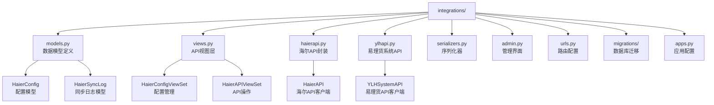
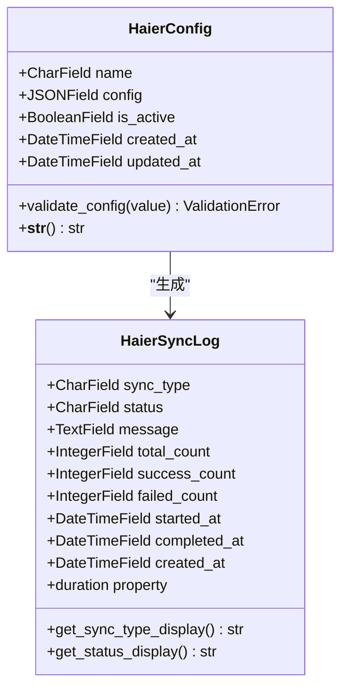
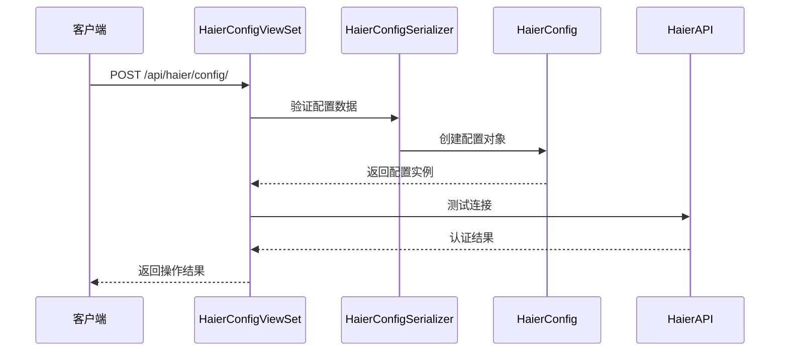
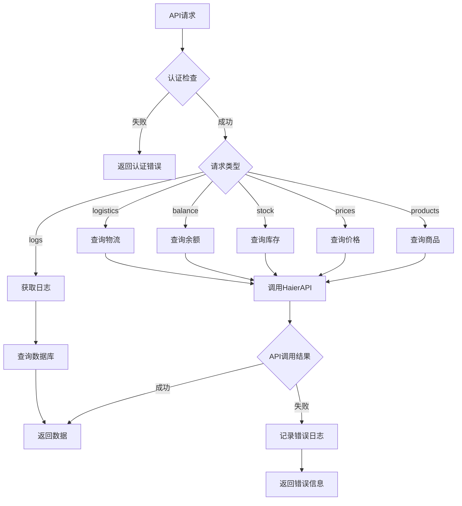
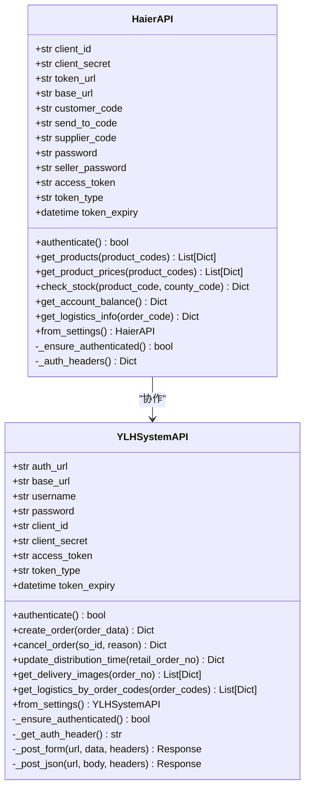
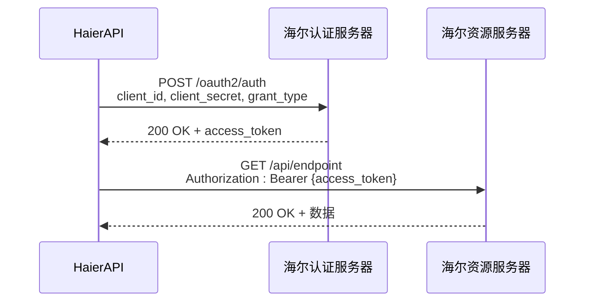
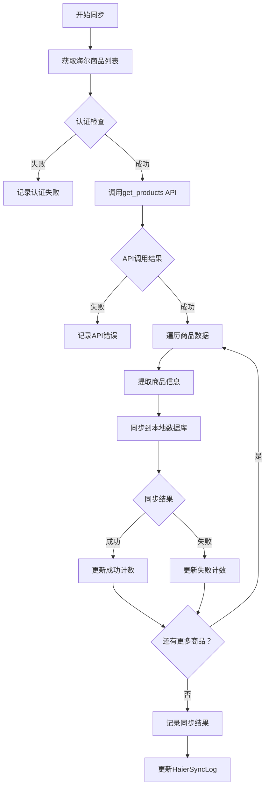
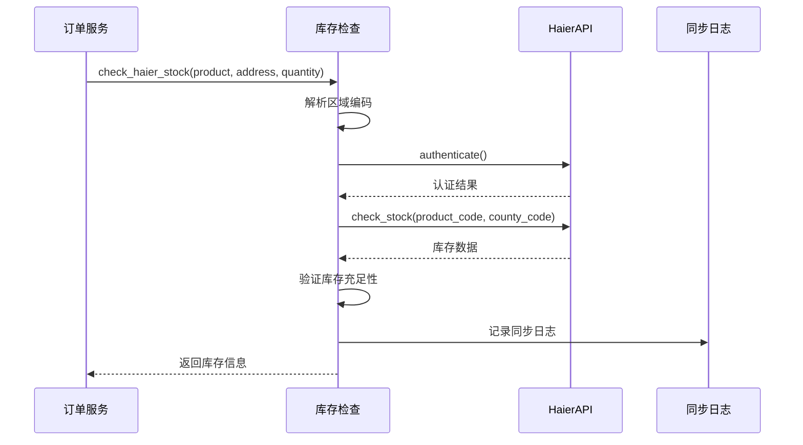
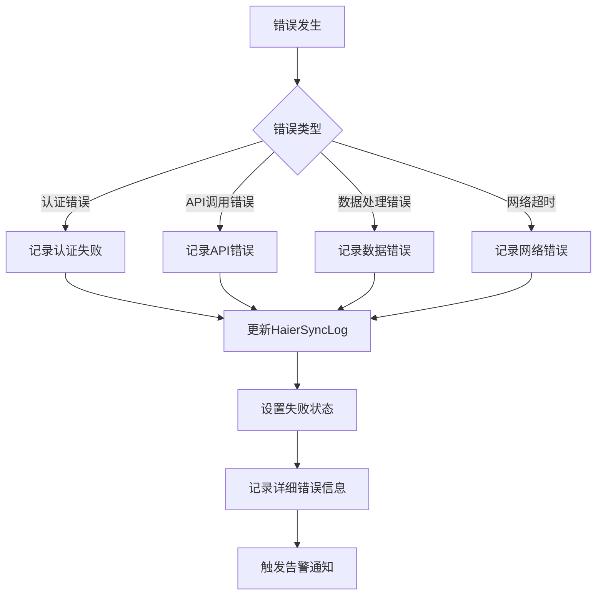
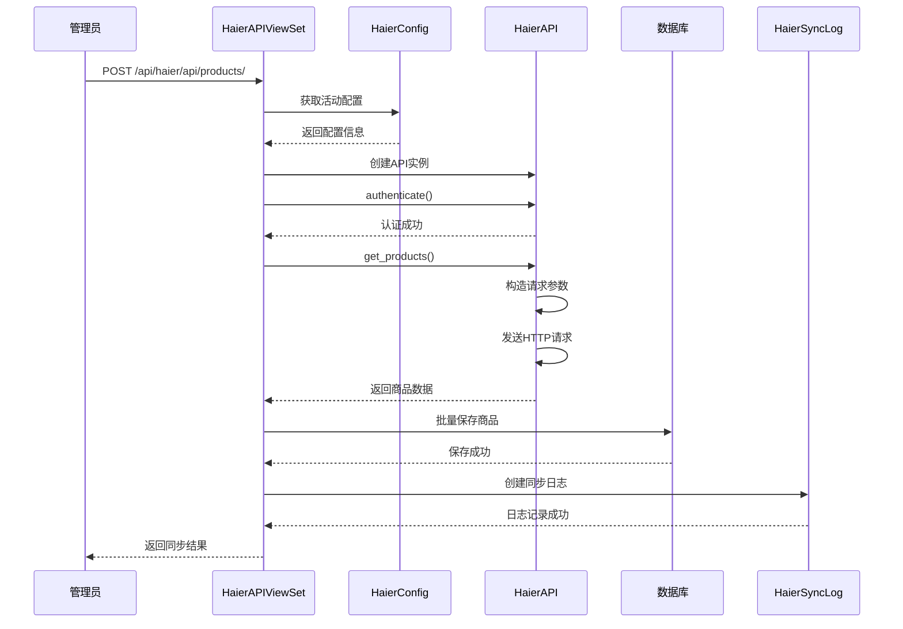

# 集成模块结构

<cite>
**本文档引用的文件**
- [apps.py](file://backend/integrations/apps.py)
- [models.py](file://backend/integrations/models.py)
- [views.py](file://backend/integrations/views.py)
- [haierapi.py](file://backend/integrations/haierapi.py)
- [ylhapi.py](file://backend/integrations/ylhapi.py)
- [serializers.py](file://backend/integrations/serializers.py)
- [admin.py](file://backend/integrations/admin.py)
- [urls.py](file://backend/integrations/urls.py)
- [0001_initial.py](file://backend/integrations/migrations/0001_initial.py)
- [0002_haierconfig_haiersynclog_delete_supplierconfig_and_more.py](file://backend/integrations/migrations/0002_haierconfig_haiersynclog_delete_supplierconfig_and_more.py)
- [sync_haier_products.py](file://backend/catalog/management/commands/sync_haier_products.py)
- [catalog/models.py](file://backend/catalog/models.py)
- [orders/services.py](file://backend/orders/services.py)
</cite>

## 目录
1. [概述](#概述)
2. [项目结构](#项目结构)
3. [核心数据模型](#核心数据模型)
4. [API接口层](#api接口层)
5. [外部系统集成](#外部系统集成)
6. [同步机制](#同步机制)
7. [错误处理与日志](#错误处理与日志)
8. [调用链路分析](#调用链路分析)
9. [最佳实践](#最佳实践)
10. [总结](#总结)

## 概述

集成模块是电小二小程序后端系统的核心组件之一，负责与外部系统（主要是海尔API）进行数据交互和业务对接。该模块采用模块化设计，提供了完整的API配置管理、数据同步、错误处理和监控功能。

### 主要功能特性

- **多系统集成**：支持海尔API和易理货系统（YLH）的双向数据交互
- **灵活配置管理**：提供动态配置管理和多环境支持
- **完整的同步机制**：涵盖商品、价格、库存、订单等全业务流程
- **完善的监控体系**：实时跟踪同步状态，提供详细的日志记录
- **健壮的错误处理**：支持重试机制和状态追踪

## 项目结构

集成模块位于`backend/integrations/`目录下，采用标准的Django应用结构：

**图表来源**
- [apps.py](file://backend/integrations/apps.py#L1-L7)
- [models.py](file://backend/integrations/models.py#L1-L150)
- [views.py](file://backend/integrations/views.py#L1-L327)
- [haierapi.py](file://backend/integrations/haierapi.py#L1-L214)
- [ylhapi.py](file://backend/integrations/ylhapi.py#L1-L459)

**章节来源**
- [apps.py](file://backend/integrations/apps.py#L1-L7)
- [urls.py](file://backend/integrations/urls.py#L1-L15)

## 核心数据模型

### HaierConfig 配置模型

HaierConfig模型是集成模块的核心配置实体，用于存储海尔API的认证信息和运行参数。

**图表来源**
- [models.py](file://backend/integrations/models.py#L4-L47)
- [models.py](file://backend/integrations/models.py#L50-L150)

#### 配置模型设计特点

1. **JSONField灵活存储**：使用JSONField存储配置信息，支持动态字段结构
2. **状态管理**：通过`is_active`字段控制配置的启用状态
3. **时间追踪**：自动记录创建和更新时间
4. **验证机制**：内置配置验证，确保必需字段完整性

#### 同步日志模型设计

HaierSyncLog模型记录所有海尔API同步操作的详细信息：

| 字段名 | 类型 | 描述 | 索引 |
|--------|------|------|------|
| sync_type | CharField | 同步类型（商品、价格、库存等） | 是 |
| status | CharField | 同步状态（待处理、成功、失败等） | 是 |
| message | TextField | 详细消息或错误信息 | 否 |
| total_count | IntegerField | 总记录数 | 否 |
| success_count | IntegerField | 成功记录数 | 否 |
| failed_count | IntegerField | 失败记录数 | 否 |
| started_at | DateTimeField | 开始时间 | 否 |
| completed_at | DateTimeField | 完成时间 | 否 |
| created_at | DateTimeField | 创建时间 | 是 |

**章节来源**
- [models.py](file://backend/integrations/models.py#L4-L150)

## API接口层

### HaierConfigViewSet 配置管理

HaierConfigViewSet提供完整的配置管理API，支持RESTful操作：

**图表来源**
- [views.py](file://backend/integrations/views.py#L36-L101)

#### API端点概览

| 方法 | URL | 描述 | 权限 |
|------|-----|------|------|
| GET | `/api/haier/config/` | 获取配置列表 | 管理员 |
| POST | `/api/haier/config/` | 创建新配置 | 管理员 |
| GET | `/api/haier/config/{id}/` | 获取配置详情 | 管理员 |
| PUT | `/api/haier/config/{id}/` | 更新配置 | 管理员 |
| DELETE | `/api/haier/config/{id}/` | 删除配置 | 管理员 |
| POST | `/api/haier/config/{id}/test/` | 测试连接 | 管理员 |

### HaierAPIViewSet API操作

HaierAPIViewSet提供多种海尔API操作的统一入口：

**图表来源**
- [views.py](file://backend/integrations/views.py#L104-L327)

**章节来源**
- [views.py](file://backend/integrations/views.py#L36-L327)

## 外部系统集成

### 海尔API封装（HaierAPI）

HaierAPI类是对海尔开放平台API的完整封装，提供认证、请求和响应处理的统一接口。

**图表来源**
- [haierapi.py](file://backend/integrations/haierapi.py#L10-L214)
- [ylhapi.py](file://backend/integrations/ylhapi.py#L16-L459)

#### 海尔API认证机制

海尔API采用OAuth 2.0客户端凭证模式进行认证：

**图表来源**
- [haierapi.py](file://backend/integrations/haierapi.py#L41-L64)

#### 易理货系统API

YLHSystemAPI专门处理订单相关操作，使用独立的Basic认证机制：

| 功能 | 方法 | 描述 |
|------|------|------|
| 订单创建 | create_order() | 接收水联网订单 |
| 订单取消 | cancel_order() | 取消指定订单 |
| 改约操作 | update_distribution_time() | 更新配送安装时间 |
| 图片获取 | get_delivery_images() | 获取配送安装照片 |
| 物流查询 | get_logistics_by_order_codes() | 查询物流信息 |

**章节来源**
- [haierapi.py](file://backend/integrations/haierapi.py#L10-L214)
- [ylhapi.py](file://backend/integrations/ylhapi.py#L16-L459)

## 同步机制

### 商品同步流程

集成模块提供了完整的商品同步机制，支持批量同步和增量更新：

**图表来源**
- [sync_haier_products.py](file://backend/catalog/management/commands/sync_haier_products.py#L50-L142)
- [catalog/models.py](file://backend/catalog/models.py#L119-L179)

### 库存同步机制

库存同步是电商系统的关键环节，集成模块提供了实时库存检查功能：

**图表来源**
- [orders/services.py](file://backend/orders/services.py#L123-L216)

**章节来源**
- [sync_haier_products.py](file://backend/catalog/management/commands/sync_haier_products.py#L50-L142)
- [orders/services.py](file://backend/orders/services.py#L123-L216)

## 错误处理与日志

### 日志记录策略

集成模块实现了多层次的日志记录机制：

### 重试机制

对于网络请求和API调用，集成模块实现了指数退避重试机制：

| 重试次数 | 延迟时间 | 最大延迟 |
|----------|----------|----------|
| 第1次 | 0.5秒 | 30秒 |
| 第2次 | 1.0秒 | 30秒 |
| 第3次 | 2.0秒 | 30秒 |
| 第4次 | 4.0秒 | 30秒 |
| 第5次 | 8.0秒 | 30秒 |

### 状态追踪

同步状态采用五状态模型：

| 状态 | 英文 | 描述 |
|------|------|------|
| 待处理 | pending | 初始状态，等待处理 |
| 处理中 | processing | 正在执行同步操作 |
| 成功 | success | 同步完成且无错误 |
| 失败 | failed | 同步失败，有错误信息 |
| 部分成功 | partial | 部分数据同步成功 |

**章节来源**
- [models.py](file://backend/integrations/models.py#L50-L150)
- [views.py](file://backend/integrations/views.py#L104-L327)

## 调用链路分析

### 成功同步操作的完整链路

以商品同步为例，展示完整的调用链路：

**图表来源**
- [views.py](file://backend/integrations/views.py#L149-L174)
- [haierapi.py](file://backend/integrations/haierapi.py#L74-L97)

### 关键调用路径

1. **配置管理路径**：`HaierConfigViewSet.test()` → `HaierAPI.authenticate()` → `HaierAPI._ensure_authenticated()`
2. **商品同步路径**：`HaierAPIViewSet.products()` → `HaierAPI.get_products()` → `HaierAPI._auth_headers()`
3. **库存检查路径**：`check_haier_stock()` → `HaierAPI.check_stock()` → `HaierAPI._ensure_authenticated()`
4. **命令行同步路径**：`sync_haier_products` → `HaierAPI.get_products()` → `Product.sync_from_haier()`

**章节来源**
- [views.py](file://backend/integrations/views.py#L149-L174)
- [sync_haier_products.py](file://backend/catalog/management/commands/sync_haier_products.py#L50-L142)

## 最佳实践

### 配置管理最佳实践

1. **环境隔离**：使用不同的配置名称区分开发、测试、生产环境
2. **敏感信息保护**：避免在代码中硬编码认证信息，使用环境变量
3. **配置验证**：在保存配置时进行完整性验证
4. **配置备份**：定期备份配置数据，防止意外删除

### API调用最佳实践

1. **认证缓存**：合理设置token过期时间，避免频繁认证
2. **请求限流**：控制API调用频率，避免触发限流机制
3. **错误处理**：实现完善的错误处理和重试机制
4. **超时设置**：为每个API调用设置合理的超时时间

### 监控和运维最佳实践

1. **实时监控**：监控API响应时间和成功率
2. **日志聚合**：集中收集和分析同步日志
3. **告警机制**：设置关键指标的告警阈值
4. **性能优化**：定期分析慢查询和性能瓶颈

## 总结

集成模块作为电小二小程序后端系统的重要组成部分，提供了完整而健壮的外部系统集成解决方案。通过模块化的架构设计、完善的错误处理机制和丰富的监控功能，该模块能够可靠地支撑复杂的业务场景。

### 核心优势

1. **架构清晰**：采用MVC模式，职责分离明确
2. **扩展性强**：支持多种外部系统和API类型
3. **稳定性高**：完善的错误处理和重试机制
4. **可维护性好**：详细的日志记录和监控功能

### 技术特色

- **JSONField灵活配置**：支持动态配置结构
- **多认证机制**：支持OAuth 2.0和Basic认证
- **智能重试**：指数退避算法减少API压力
- **实时监控**：完整的同步状态追踪

集成模块的设计充分体现了现代Web应用的最佳实践，为企业的数字化转型提供了坚实的技术基础。