# 品牌与品类管理结构

<cite>
**本文档引用的文件**
- [api.ts](file://merchant/src/services/api.ts)
- [Brands/index.tsx](file://merchant/src/pages/Brands/index.tsx)
- [Categories/index.tsx](file://merchant/src/pages/Categories/index.tsx)
- [models.py](file://backend/catalog/models.py)
- [views.py](file://backend/catalog/views.py)
- [serializers.py](file://backend/catalog/serializers.py)
- [index.ts](file://frontend/src/types/index.ts)
- [brand.ts](file://frontend/src/services/brand.ts)
- [category.ts](file://frontend/src/services/category.ts)
- [0010_extend_brand_model.py](file://backend/catalog/migrations/0010_extend_brand_model.py)
- [0001_initial.py](file://backend/catalog/migrations/0001_initial.py)
- [0004_alter_category_options_category_level_category_order_and_more.py](file://backend/catalog/migrations/0004_alter_category_options_category_level_category_order_and_more.py)
- [0007_flatten_categories_remove_parent_level.py](file://backend/catalog/migrations/0007_flatten_categories_remove_parent_level.py)
</cite>

## 目录
1. [概述](#概述)
2. [项目架构](#项目架构)
3. [核心组件分析](#核心组件分析)
4. [CRUD操作对比分析](#crud操作对比分析)
5. [分类层级管理](#分类层级管理)
6. [表单验证与唯一性校验](#表单验证与唯一性校验)
7. [删除操作与force_delete机制](#删除操作与force_delete机制)
8. [品牌与品类关联关系](#品牌与品类关联关系)
9. [性能优化考虑](#性能优化考虑)
10. [总结](#总结)

## 概述

本文档深入分析了电动商城项目中的品牌与品类管理模块，重点对比分析了Brands/和Categories/两个页面在CRUD操作上的共性与差异。通过对services/api.ts中的API接口、前端页面组件、后端模型和视图的全面分析，揭示了这两个管理模块的设计理念、实现细节和最佳实践。

该系统采用前后端分离架构，前端使用React框架配合Ant Design组件库，后端基于Django REST Framework构建RESTful API服务。品牌管理专注于单一实体的生命周期管理，而品类管理则体现了更复杂的树形结构处理需求。

## 项目架构

### 整体架构概览

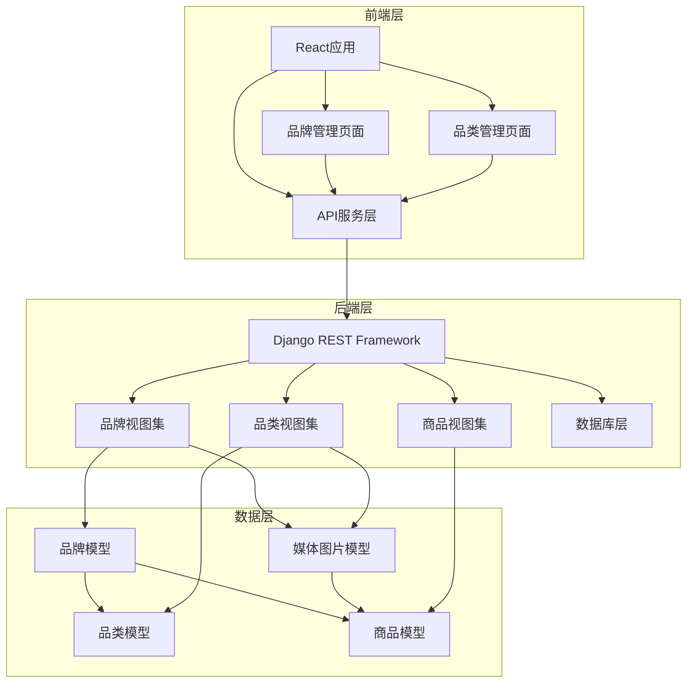

**图表来源**
- [api.ts](file://merchant/src/services/api.ts#L1-L66)
- [models.py](file://backend/catalog/models.py#L1-L312)
- [views.py](file://backend/catalog/views.py#L1-L980)

### 数据模型关系

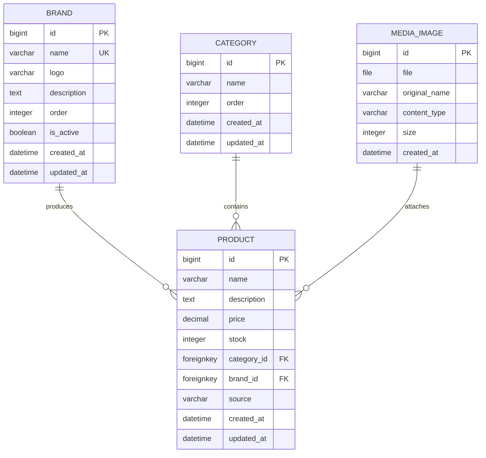

**图表来源**
- [models.py](file://backend/catalog/models.py#L5-L312)

**章节来源**
- [models.py](file://backend/catalog/models.py#L1-L312)
- [views.py](file://backend/catalog/views.py#L1-L980)

## 核心组件分析

### 品牌管理组件分析

品牌管理页面实现了完整的CRUD功能，具有以下特点：

#### 主要特性
- **搜索功能**：支持按品牌名称进行模糊搜索
- **状态管理**：启用/禁用状态切换
- **排序控制**：通过order字段控制显示顺序
- **图片展示**：支持品牌Logo的URL输入和预览
- **批量操作**：支持分页和批量选择

#### 表单验证规则
- 品牌名称为必填项
- Logo字段为可选URL
- 描述字段允许为空
- 排序值必须为非负整数

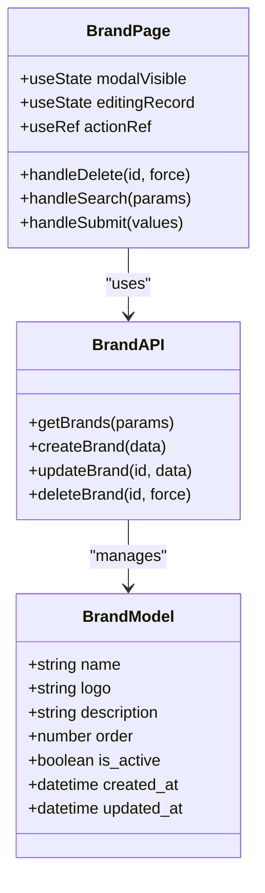

**图表来源**
- [Brands/index.tsx](file://merchant/src/pages/Brands/index.tsx#L1-L189)
- [api.ts](file://merchant/src/services/api.ts#L16-L21)

### 品类管理组件分析

品类管理页面相对简化，专注于基本的层级结构管理：

#### 主要特性
- **扁平化设计**：不支持多级嵌套
- **简单排序**：通过order字段控制层级顺序
- **无状态管理**：仅支持启用/禁用
- **快速操作**：简洁的CRUD界面

#### 表单验证规则
- 分类名称为必填项
- 排序值必须为非负整数

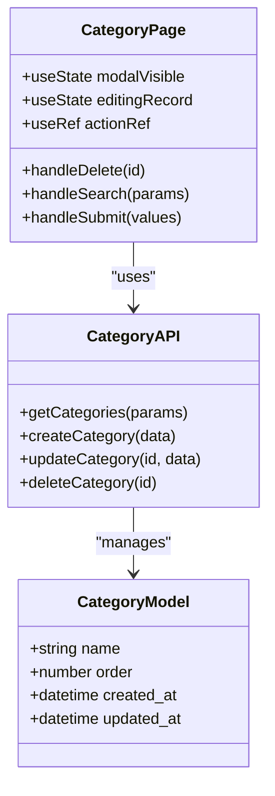

**图表来源**
- [Categories/index.tsx](file://merchant/src/pages/Categories/index.tsx#L1-L134)
- [api.ts](file://merchant/src/services/api.ts#L23-L27)

**章节来源**
- [Brands/index.tsx](file://merchant/src/pages/Brands/index.tsx#L1-L189)
- [Categories/index.tsx](file://merchant/src/pages/Categories/index.tsx#L1-L134)

## CRUD操作对比分析

### 共性特征

#### 1. API接口设计
两个管理模块都遵循RESTful API设计原则：

| 操作类型 | 品牌API | 品类API | 说明 |
|---------|---------|---------|------|
| 列表获取 | `GET /brands/` | `GET /categories/` | 支持查询参数过滤 |
| 单条获取 | `GET /brands/{id}/` | `GET /categories/{id}/` | 返回完整实体信息 |
| 创建操作 | `POST /brands/` | `POST /categories/` | 验证数据完整性 |
| 更新操作 | `PATCH /brands/{id}/` | `PATCH /categories/{id}/` | 部分字段更新 |
| 删除操作 | `DELETE /brands/{id}/?force_delete={bool}` | `DELETE /categories/{id}/` | 品牌支持强制删除 |

#### 2. 前端交互模式
- **表格展示**：均使用ProTable组件提供统一的表格界面
- **模态表单**：通过ModalForm实现编辑和创建功能
- **分页支持**：默认每页20条记录，支持动态调整
- **搜索功能**：支持关键词过滤和状态筛选

#### 3. 错误处理机制
- **统一错误提示**：使用Ant Design的message组件
- **状态码处理**：根据HTTP状态码提供相应反馈
- **用户引导**：提供清晰的操作建议

### 差异特征

#### 1. 数据复杂度
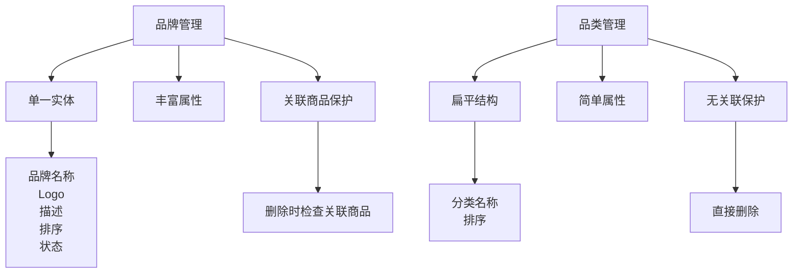

**图表来源**
- [models.py](file://backend/catalog/models.py#L21-L312)
- [views.py](file://backend/catalog/views.py#L589-L674)

#### 2. 删除策略差异
- **品牌删除**：实施保护性删除，防止意外删除关联商品的品牌
- **品类删除**：采用直接删除策略，适用于扁平结构

#### 3. 验证规则差异
- **品牌验证**：包含唯一性约束（name字段）
- **品类验证**：同样包含唯一性约束（name字段）

**章节来源**
- [api.ts](file://merchant/src/services/api.ts#L16-L27)
- [Brands/index.tsx](file://merchant/src/pages/Brands/index.tsx#L13-L32)
- [Categories/index.tsx](file://merchant/src/pages/Categories/index.tsx#L13-L20)

## 分类层级管理

### 历史演进过程

系统经历了从树形结构到扁平化的演进过程：

#### 早期树形结构设计
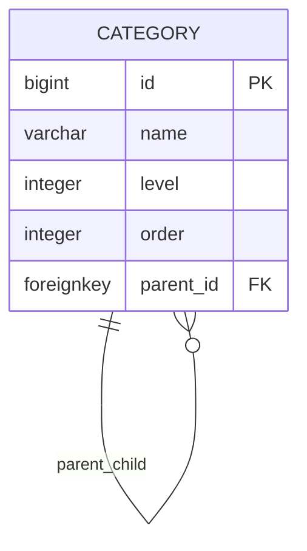

**图表来源**
- [0004_alter_category_options_category_level_category_order_and_more.py](file://backend/catalog/migrations/0004_alter_category_options_category_level_category_order_and_more.py#L19-L31)

#### 当前扁平化设计
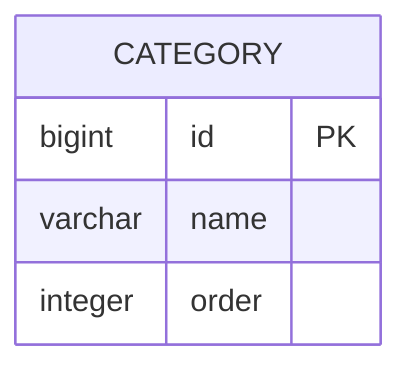

**图表来源**
- [0007_flatten_categories_remove_parent_level.py](file://backend/catalog/migrations/0007_flatten_categories_remove_parent_level.py#L11-L18)

### 设计考量因素

#### 1. 简化复杂度
- **查询优化**：扁平结构避免了递归查询的复杂性
- **索引效率**：单字段排序比复合索引更高效
- **业务简化**：减少了层级管理的业务逻辑复杂度

#### 2. 性能优势
- **查询速度**：单表查询比树形结构的JOIN查询更快
- **缓存友好**：扁平结构更适合缓存策略
- **并发控制**：减少了锁竞争的可能性

#### 3. 使用场景适配
- **业务需求**：当前业务场景不需要深度层级
- **用户体验**：扁平结构更符合用户认知习惯
- **维护成本**：降低系统维护和开发成本

### 实现细节

#### 排序机制
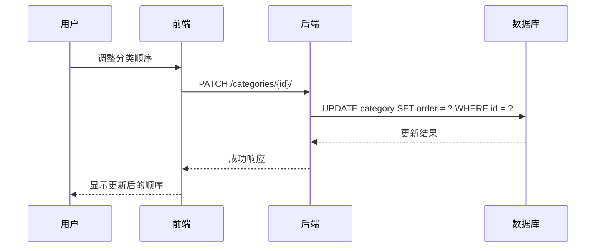

**图表来源**
- [views.py](file://backend/catalog/views.py#L580-L586)
- [models.py](file://backend/catalog/models.py#L7-L8)

**章节来源**
- [0004_alter_category_options_category_level_category_order_and_more.py](file://backend/catalog/migrations/0004_alter_category_options_category_level_category_order_and_more.py#L1-L44)
- [0007_flatten_categories_remove_parent_level.py](file://backend/catalog/migrations/0007_flatten_categories_remove_parent_level.py#L1-L19)
- [views.py](file://backend/catalog/views.py#L567-L588)

## 表单验证与唯一性校验

### 品牌验证机制

#### 后端验证规则
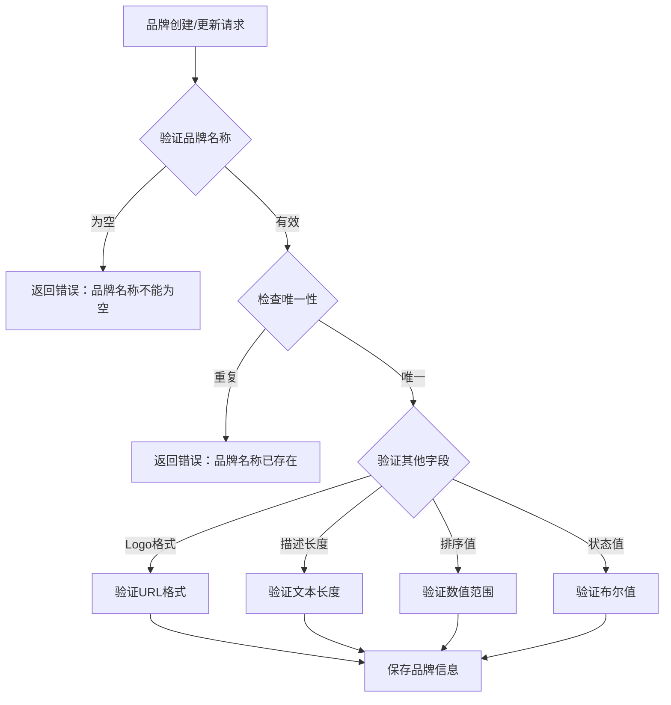

**图表来源**
- [serializers.py](file://backend/catalog/serializers.py#L43-L47)
- [models.py](file://backend/catalog/models.py#L22-L24)

#### 前端验证规则
- **必填验证**：品牌名称字段设置为required
- **实时反馈**：输入时提供即时验证反馈
- **错误提示**：明确的错误消息指导用户修正

### 品类验证机制

#### 后端验证规则
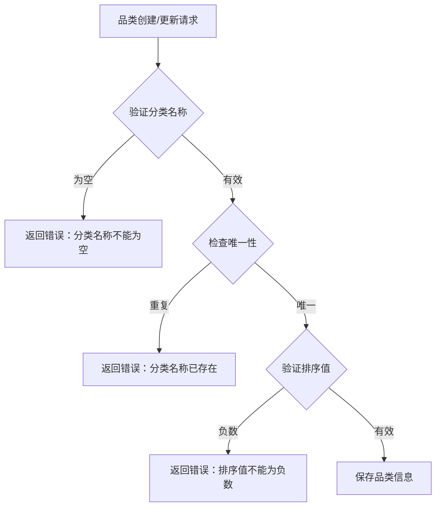

**图表来源**
- [serializers.py](file://backend/catalog/serializers.py#L16-L19)
- [models.py](file://backend/catalog/models.py#L6-L7)

#### 唯一性约束
两个模型都设置了数据库级别的唯一性约束：
- **品牌名称**：确保品牌标识的唯一性
- **品类名称**：确保分类标识的唯一性

### 验证流程对比

| 验证维度 | 品牌验证 | 品类验证 | 说明 |
|---------|---------|---------|------|
| 唯一性检查 | 品牌名称 | 分类名称 | 数据库级别约束 |
| 必填字段 | 品牌名称 | 分类名称 | 前端+后端双重验证 |
| 格式验证 | Logo URL | 无特殊要求 | 品牌Logo可选 |
| 数值范围 | 排序≥0 | 排序≥0 | 非负整数验证 |
| 状态验证 | 启用/禁用 | 无状态字段 | 品牌有激活状态 |

**章节来源**
- [serializers.py](file://backend/catalog/serializers.py#L22-L48)
- [models.py](file://backend/catalog/models.py#L21-L312)

## 删除操作与force_delete机制

### 品牌删除保护机制

#### 强制删除策略
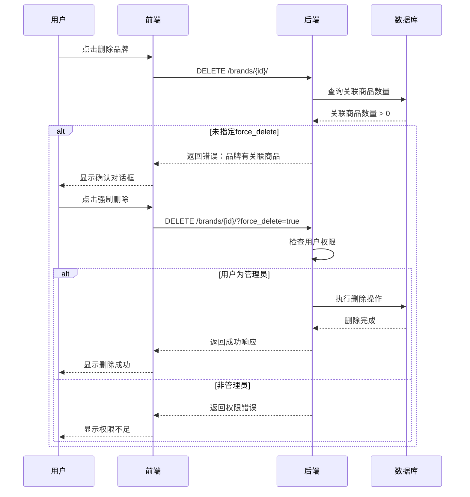

**图表来源**
- [views.py](file://backend/catalog/views.py#L634-L674)
- [Brands/index.tsx](file://merchant/src/pages/Brands/index.tsx#L13-L32)

#### 删除保护逻辑
1. **关联检查**：查询品牌关联的商品数量
2. **权限验证**：确认用户具有管理员权限
3. **级联处理**：可选择保留商品或转移关联关系

### 品类删除机制

#### 简化删除流程
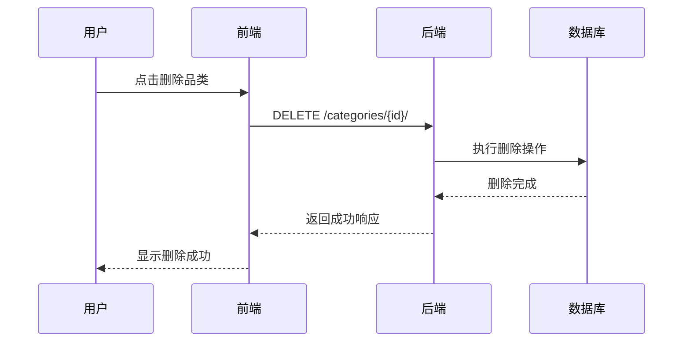

**图表来源**
- [views.py](file://backend/catalog/views.py#L568-L588)
- [Categories/index.tsx](file://merchant/src/pages/Categories/index.tsx#L13-L20)

### 删除策略对比

| 特性 | 品牌删除 | 品类删除 | 说明 |
|-----|---------|---------|------|
| 关联保护 | 是 | 否 | 品牌删除会检查商品关联 |
| 强制删除 | 支持 | 不支持 | 品牌可通过force_delete参数强制删除 |
| 权限要求 | 管理员 | 无特殊要求 | 品牌删除需要管理员权限 |
| 级联影响 | 可配置 | 直接删除 | 品牌删除可能影响商品关联 |
| 错误处理 | 详细提示 | 简单反馈 | 品牌删除提供详细的关联信息 |

**章节来源**
- [views.py](file://backend/catalog/views.py#L634-L674)
- [Brands/index.tsx](file://merchant/src/pages/Brands/index.tsx#L13-L32)

## 品牌与品类关联关系

### 商品关联机制

#### 关联关系设计
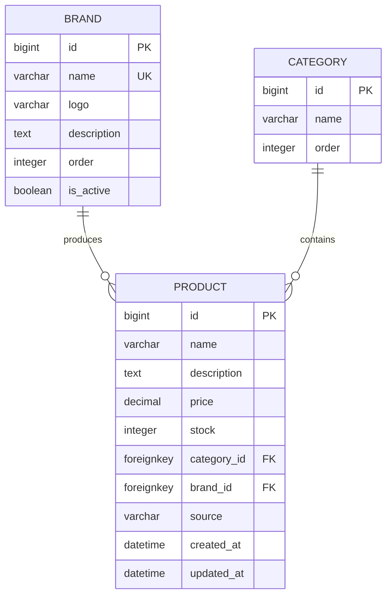

**图表来源**
- [models.py](file://backend/catalog/models.py#L43-L49)

### 关联关系处理

#### 1. 品牌关联处理
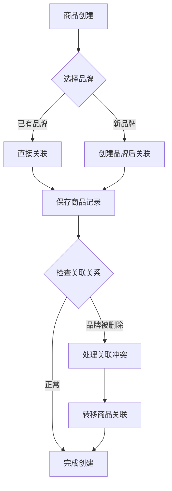

**图表来源**
- [models.py](file://backend/catalog/models.py#L47-L48)

#### 2. 品类关联处理

### 关联关系查询

#### 性能优化策略
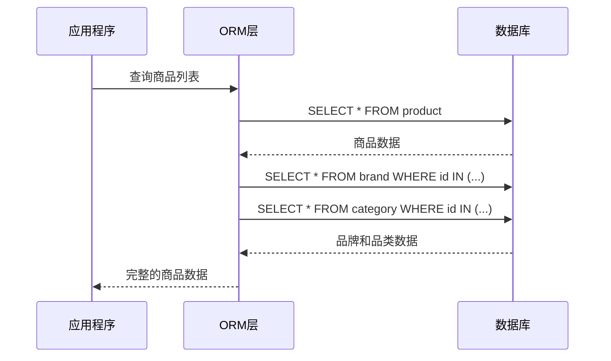

**图表来源**
- [views.py](file://backend/catalog/views.py#L52-L67)

### 关联关系维护

#### 1. 级联更新
- **品牌更新**：自动更新所有关联商品的品牌信息
- **品类更新**：自动更新所有关联商品的品类信息

#### 2. 级联删除
- **品牌删除**：可选择保留商品或删除关联商品
- **品类删除**：直接删除关联商品

**章节来源**
- [models.py](file://backend/catalog/models.py#L43-L49)
- [views.py](file://backend/catalog/views.py#L52-L67)

## 性能优化考虑

### 查询优化策略

#### 1. 索引设计
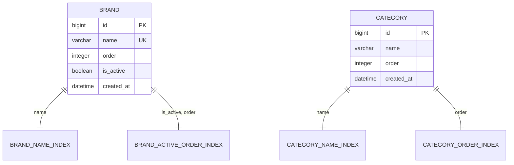

**图表来源**
- [models.py](file://backend/catalog/models.py#L35-L37)
- [models.py](file://backend/catalog/models.py#L8-L9)

#### 2. 查询优化
- **预加载关联**：使用select_related减少查询次数
- **分页处理**：避免大量数据一次性加载
- **缓存策略**：缓存频繁访问的分类和品牌数据

### 前端性能优化

#### 1. 渲染优化
- **虚拟滚动**：大数据量表格使用虚拟滚动
- **懒加载**：图片和内容的懒加载
- **防抖处理**：搜索输入的防抖处理

#### 2. 网络优化
- **请求合并**：减少不必要的API调用
- **数据压缩**：传输数据的压缩处理
- **错误重试**：网络异常的自动重试机制

### 数据库优化

#### 1. 索引策略
- **复合索引**：品牌活跃状态和排序的复合索引
- **单字段索引**：常用查询字段的独立索引
- **覆盖索引**：减少回表查询的覆盖索引

#### 2. 查询优化
- **EXPLAIN分析**：定期分析慢查询
- **连接优化**：优化JOIN操作的执行计划
- **分区策略**：大数据量表的分区处理

## 总结

品牌与品类管理模块展现了现代电商系统中数据管理的最佳实践。通过对比分析，我们可以看到：

### 设计亮点
1. **统一的API设计**：遵循RESTful原则，提供一致的接口体验
2. **灵活的验证机制**：前后端双重验证，确保数据完整性
3. **智能的删除保护**：品牌删除的强制保护机制，防止数据丢失
4. **扁平化的分类设计**：简化了系统复杂度，提升了性能表现

### 技术特色
1. **类型安全**：完整的TypeScript类型定义
2. **错误处理**：完善的错误捕获和用户反馈机制
3. **性能优化**：多层次的性能优化策略
4. **扩展性**：良好的架构设计支持未来功能扩展

### 最佳实践
1. **数据一致性**：通过数据库约束和业务逻辑确保数据一致性
2. **用户体验**：直观的操作界面和及时的反馈机制
3. **安全性**：权限控制和数据验证双重保障
4. **可维护性**：清晰的代码结构和完善的注释

这个模块不仅满足了当前的业务需求，更为系统的未来发展奠定了坚实的基础。其设计理念和实现方式值得在类似项目中借鉴和应用。