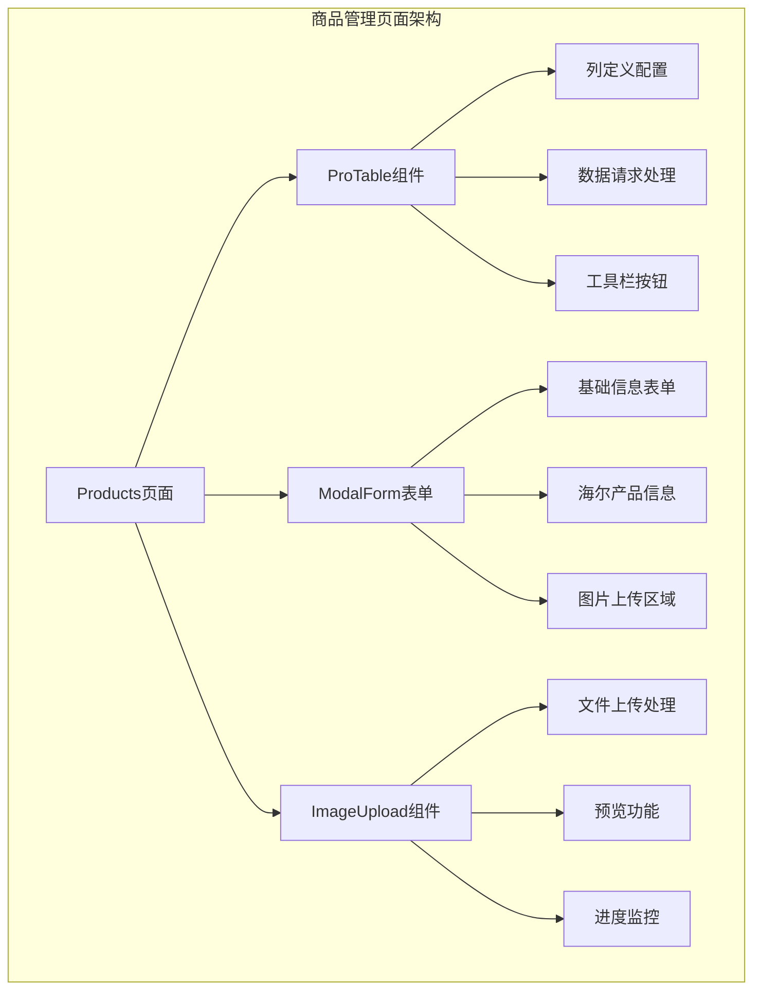
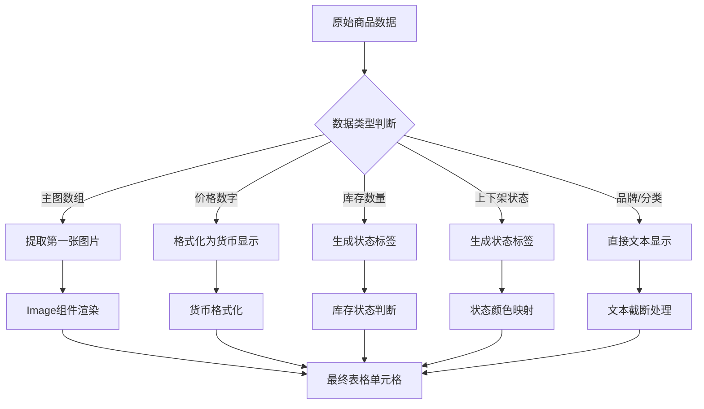
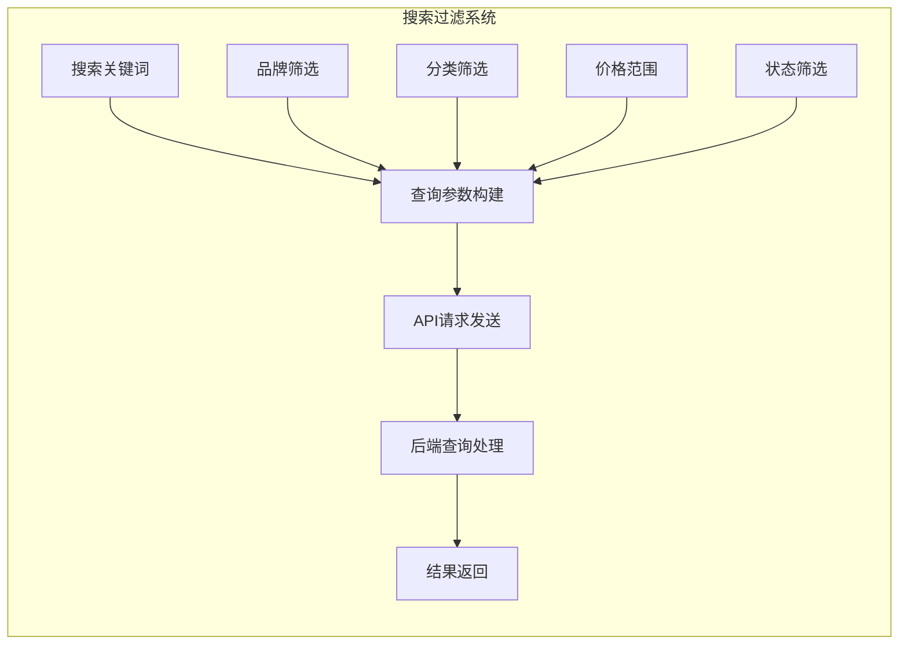
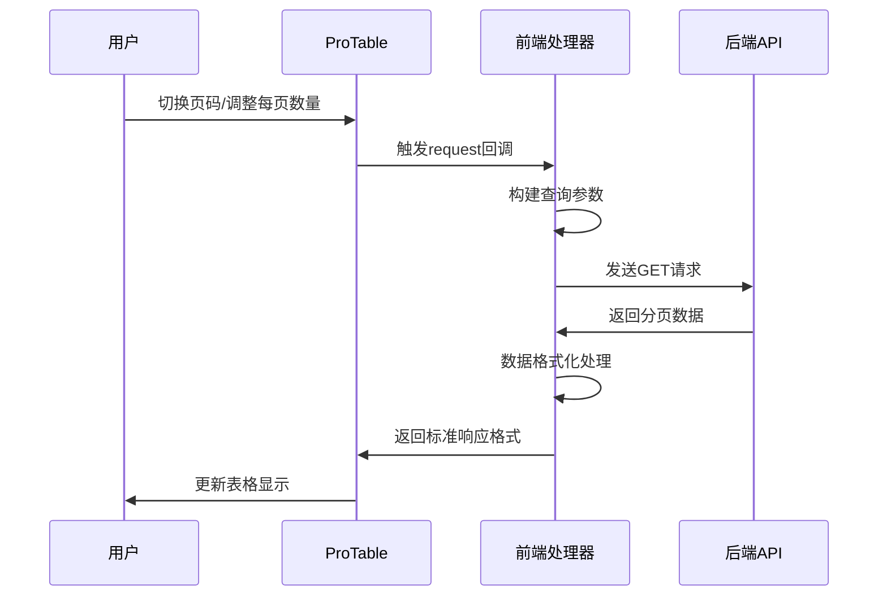
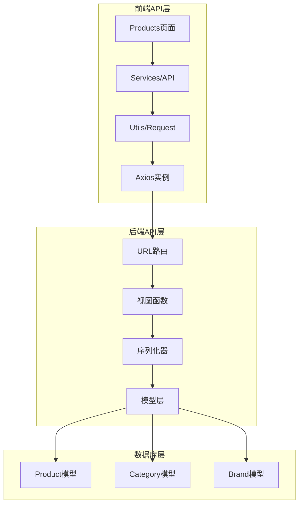
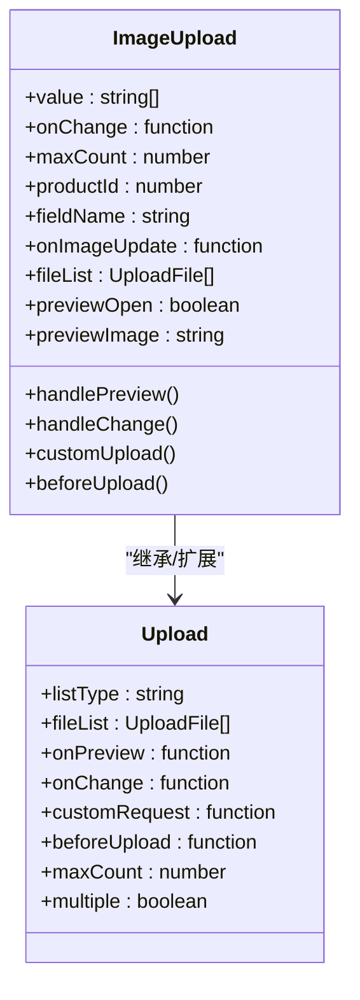
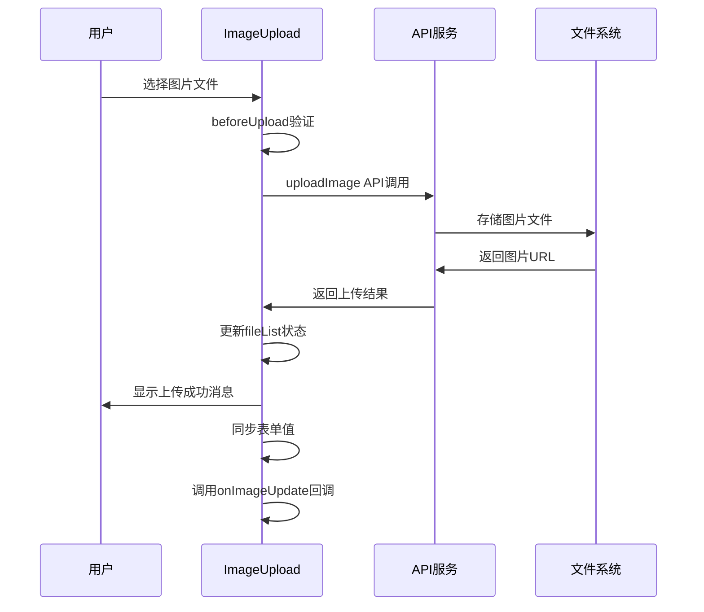
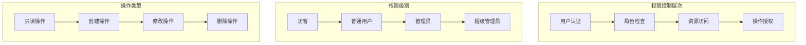
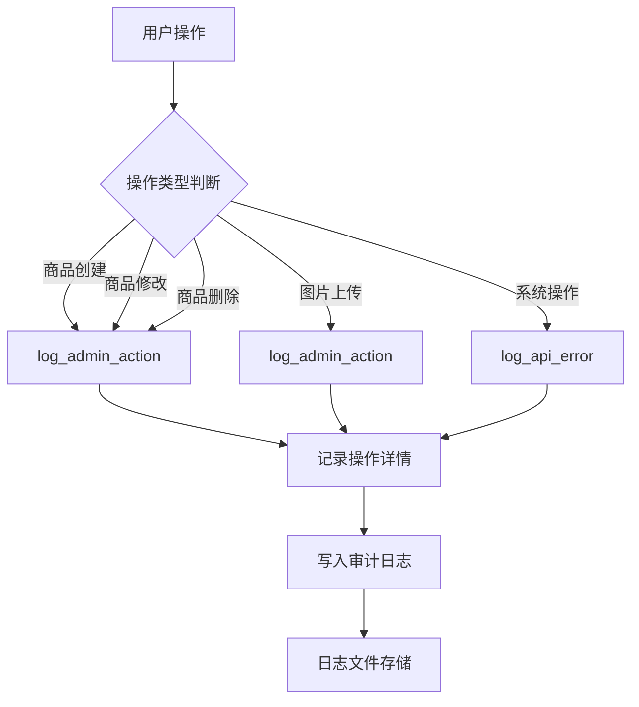

# 商品管理页面结构

<cite>
**本文档引用的文件**
- [Products/index.tsx](file://merchant/src/pages/Products/index.tsx)
- [api.ts](file://merchant/src/services/api.ts)
- [ImageUpload/index.tsx](file://merchant/src/components/ImageUpload/index.tsx)
- [request.ts](file://merchant/src/utils/request.ts)
- [image.ts](file://merchant/src/utils/image.ts)
- [auth.ts](file://merchant/src/utils/auth.ts)
- [audit_logger.py](file://backend/common/audit_logger.py)
- [permissions.py](file://backend/common/permissions.py)
- [views.py](file://backend/catalog/views.py)
</cite>

## 目录
1. [项目概述](#项目概述)
2. [页面架构设计](#页面架构设计)
3. [商品列表展示机制](#商品列表展示机制)
4. [搜索过滤功能实现](#搜索过滤功能实现)
5. [分页处理机制](#分页处理机制)
6. [前后端数据交互流程](#前后端数据交互流程)
7. [图片上传组件集成](#图片上传组件集成)
8. [商品表单验证与字段映射](#商品表单验证与字段映射)
9. [权限控制与操作日志](#权限控制与操作日志)
10. [性能优化策略](#性能优化策略)
11. [总结](#总结)

## 项目概述

商品管理页面是商户管理后台的核心功能模块，基于React技术栈构建，采用Ant Design Pro组件库实现现代化的管理界面。该页面实现了完整的商品生命周期管理，包括商品列表展示、搜索过滤、分页处理、图片上传、表单验证等功能。

### 技术架构特点

- **前端框架**: React + TypeScript
- **UI组件库**: Ant Design Pro
- **状态管理**: React Hooks
- **HTTP请求**: Axios封装的自定义请求库
- **图片处理**: 自定义图片上传组件
- **权限控制**: 基于角色的访问控制(RBAC)

## 页面架构设计

商品管理页面采用模块化架构设计，主要由以下几个核心组件构成：

**图表来源**
- [Products/index.tsx](file://merchant/src/pages/Products/index.tsx#L1-L720)

### 核心组件职责

1. **Products页面**: 主控制器，负责整体状态管理和事件处理
2. **ProTable组件**: 数据表格展示，提供高级搜索和分页功能
3. **ModalForm表单**: 商品编辑/创建表单，包含复杂字段验证
4. **ImageUpload组件**: 图片上传专用组件，支持批量上传和实时更新

**章节来源**
- [Products/index.tsx](file://merchant/src/pages/Products/index.tsx#L10-L720)

## 商品列表展示机制

商品列表采用ProTable组件实现，提供了丰富的展示功能和交互体验。

### 列定义与数据映射

商品列表包含以下核心列：

| 列名 | 数据字段 | 功能描述 | 特殊处理 |
|------|----------|----------|----------|
| 主图 | main_images | 展示商品主图，支持缩略图预览 | 图片懒加载，错误处理 |
| 产品名称 | name | 商品基本信息展示 | 文本截断，超长提示 |
| 品牌 | brand | 品牌信息展示 | 静态显示，无筛选 |
| 分类 | category | 分类信息展示 | 静态显示，无筛选 |
| 价格 | price | 价格信息展示 | 格式化显示，货币符号 |
| 库存 | stock | 库存状态展示 | 状态标签，颜色区分 |
| 状态 | is_active | 上下架状态 | 开关切换，实时更新 |
| 销量 | sales_count | 销售统计 | 数字排序，降序默认 |
| 操作 | - | 编辑删除功能 | 按钮组合，确认对话框 |

### 数据格式化与渲染

**图表来源**
- [Products/index.tsx](file://merchant/src/pages/Products/index.tsx#L41-L204)

**章节来源**
- [Products/index.tsx](file://merchant/src/pages/Products/index.tsx#L41-L204)

## 搜索过滤功能实现

搜索过滤功能基于ProTable的高级搜索特性，支持多维度条件筛选。

### 筛选条件配置

**图表来源**
- [Products/index.tsx](file://merchant/src/pages/Products/index.tsx#L313-L378)

### 查询参数构建逻辑

搜索功能的查询参数构建遵循以下规则：

1. **关键词搜索**: 支持模糊匹配商品名称和描述
2. **品牌筛选**: 基于品牌名称进行精确匹配
3. **分类筛选**: 基于分类名称进行精确匹配
4. **价格范围**: 支持最小值和最大值同时设置
5. **状态筛选**: 支持上架/下架状态过滤
6. **排序规则**: 支持按销量、价格、创建时间等排序

### 实时搜索与防抖处理

搜索功能采用实时监听机制，当用户输入关键词时立即触发搜索，但通过防抖机制避免频繁请求：

- 输入延迟：300毫秒
- 参数合并：合并多个筛选条件
- 错误处理：网络异常时保持当前状态

**章节来源**
- [Products/index.tsx](file://merchant/src/pages/Products/index.tsx#L313-L378)

## 分页处理机制

分页功能采用ProTable内置的分页组件，支持灵活的分页配置和性能优化。

### 分页配置参数

| 参数名 | 默认值 | 功能描述 | 可配置范围 |
|--------|--------|----------|------------|
| page_size | 20 | 每页显示条数 | 10-100 |
| showSizeChanger | true | 显示页码选择器 | 布尔值 |
| showQuickJumper | true | 显示快速跳转 | 布尔值 |
| showTotal | 函数 | 显示总数信息 | 自定义函数 |

### 分页数据处理流程

**图表来源**
- [Products/index.tsx](file://merchant/src/pages/Products/index.tsx#L313-L378)

### 数据格式标准化

前端统一处理不同格式的分页响应：

1. **标准分页格式**: 包含results、total、page等字段
2. **数组格式**: 直接返回商品数组，自动计算总数
3. **兼容性处理**: 支持后端返回的不同字段命名

**章节来源**
- [Products/index.tsx](file://merchant/src/pages/Products/index.tsx#L313-L378)

## 前后端数据交互流程

商品管理页面的前后端数据交互采用RESTful API设计，通过统一的请求封装层处理所有HTTP通信。

### API服务层架构

**图表来源**
- [api.ts](file://merchant/src/services/api.ts#L1-L66)
- [request.ts](file://merchant/src/utils/request.ts#L1-L38)

### 核心API接口

| 接口方法 | URL路径 | 功能描述 | 请求参数 | 响应格式 |
|----------|---------|----------|----------|----------|
| getProducts | /products/ | 获取商品列表 | 分页、搜索、筛选参数 | 分页对象 |
| getProduct | /products/{id}/ | 获取单个商品 | 商品ID | 单个商品对象 |
| createProduct | /products/ | 创建新商品 | 商品数据 | 创建结果 |
| updateProduct | /products/{id}/ | 更新商品信息 | 商品ID、更新数据 | 更新结果 |
| deleteProduct | /products/{id}/ | 删除商品 | 商品ID | 删除结果 |
| uploadImage | /media-images/ | 上传图片 | 文件、产品ID、字段名 | 图片URL |

### 请求拦截与响应处理

前端请求库实现了统一的拦截器处理：

1. **认证拦截**: 自动添加Bearer Token
2. **错误处理**: 统一错误提示和状态码处理
3. **超时控制**: 10秒请求超时
4. **重定向**: 401错误自动跳转登录页

**章节来源**
- [api.ts](file://merchant/src/services/api.ts#L1-L66)
- [request.ts](file://merchant/src/utils/request.ts#L1-L38)

## 图片上传组件集成

ImageUpload组件是商品管理页面的重要组成部分，专门处理商品图片的上传、预览和管理功能。

### 组件架构设计

**图表来源**
- [ImageUpload/index.tsx](file://merchant/src/components/ImageUpload/index.tsx#L8-L26)

### 图片上传流程

**图表来源**
- [ImageUpload/index.tsx](file://merchant/src/components/ImageUpload/index.tsx#L73-L122)

### FormData构造与上传

图片上传过程中的FormData构造遵循以下规范：

1. **基础字段**: `file`（必需）- 上传的图片文件
2. **产品关联**: `product_id`（可选）- 关联的产品ID
3. **字段标识**: `field_name`（可选）- 图片所属字段名
4. **文件验证**: 类型检查、大小限制（≤20MB）
5. **响应处理**: 确保返回包含`url`字段的对象

### 上传进度与错误处理

组件实现了完善的上传状态管理和错误处理机制：

- **上传状态**: 显示上传进度和完成状态
- **错误提示**: 网络错误、文件格式错误等
- **重试机制**: 失败时提供重新上传选项
- **预览功能**: 支持图片预览和删除操作

**章节来源**
- [ImageUpload/index.tsx](file://merchant/src/components/ImageUpload/index.tsx#L1-L173)

## 商品表单验证与字段映射

商品创建和编辑表单采用ProForm组件体系，实现了复杂的字段验证和动态表单逻辑。

### 表单字段结构

```mermaid
graph TB
subgraph "商品基本信息"
A[产品名称] --> B[品牌选择]
B --> C[分类选择]
C --> D[商品来源]
D --> E[价格]
E --> F[库存]
F --> G[产品描述]
end
subgraph "海尔产品信息"
H[产品编码] --> I[产品型号]
I --> J[产品组]
J --> K[是否可采]
K --> L[不可采原因]
L --> M[价格信息]
M --> N[市场价]
N --> O[直扣]
O --> P[台返]
P --> Q[库位编码]
Q --> R[仓库等级]
end
subgraph "图片上传"
S[主图上传] --> T[详情图上传]
end
subgraph "其他设置"
U[是否上架] --> V[状态开关]
end
```

**图表来源**
- [Products/index.tsx](file://merchant/src/pages/Products/index.tsx#L483-L716)

### 字段验证规则

| 字段名 | 验证规则 | 错误提示 | 特殊处理 |
|--------|----------|----------|----------|
| name | 必填 | 请输入产品名称 | 字符长度限制 |
| brand_id | 必填 | 请选择品牌 | 下拉选择验证 |
| category_id | 必填 | 请选择分类 | 下拉选择验证 |
| price | 必填 | 请输入价格 | 数字格式验证 |
| stock | 必填 | 请输入库存 | 整数验证 |
| source | 必填 | 请选择商品来源 | 枚举值验证 |
| main_images | 可选 | 主图不能为空 | 编辑模式特殊处理 |
| detail_images | 可选 | 详情图不能为空 | 编辑模式特殊处理 |

### 动态字段控制

表单支持根据商品来源动态显示不同的字段集：

1. **本地商品**: 显示完整的基础信息字段
2. **海尔商品**: 显示海尔特有的产品信息字段
3. **只读控制**: 海尔商品的部分字段设置为只读
4. **条件显示**: 根据字段值动态显示/隐藏相关字段

### 关联数据选择器集成

品牌和分类选择器集成了以下功能：

- **异步加载**: 首次访问时加载品牌和分类数据
- **搜索功能**: 支持品牌和分类的搜索过滤
- **缓存机制**: 避免重复加载相同数据
- **错误处理**: 网络错误时的降级处理

**章节来源**
- [Products/index.tsx](file://merchant/src/pages/Products/index.tsx#L483-L716)

## 权限控制与操作日志

系统实现了基于角色的访问控制(RBAC)和完整的操作审计功能。

### 权限控制架构

**图表来源**
- [permissions.py](file://backend/common/permissions.py#L1-L189)

### 后端权限控制

后端采用Django REST Framework的权限类实现细粒度控制：

1. **IsAdminOrReadOnly**: 管理员可写，其他人只读
2. **IsAdmin**: 仅管理员可访问
3. **IsOwnerOrAdmin**: 所有者或管理员可访问
4. **EnvironmentAwarePermission**: 环境感知权限

### 前端权限处理

前端通过以下方式实现权限控制：

- **路由守卫**: 检查用户认证状态
- **组件级权限**: 根据权限显示/隐藏功能
- **API调用权限**: 未授权时阻止API请求
- **UI反馈**: 权限不足时的友好提示

### 操作审计日志

系统实现了全面的操作审计功能：

**图表来源**
- [audit_logger.py](file://backend/common/audit_logger.py#L223-L245)

### 审计日志内容

审计日志记录以下关键信息：

- **操作时间**: 精确到毫秒的时间戳
- **操作用户**: 用户ID和用户名
- **操作类型**: create/update/delete等
- **资源类型**: product/order/user等
- **资源ID**: 操作的具体资源ID
- **详细信息**: 操作前后的数据对比
- **IP地址**: 操作来源IP地址

**章节来源**
- [audit_logger.py](file://backend/common/audit_logger.py#L223-L245)
- [permissions.py](file://backend/common/permissions.py#L1-L189)

## 性能优化策略

商品管理页面采用了多种性能优化策略，确保良好的用户体验。

### 数据加载优化

1. **懒加载**: 品牌和分类数据采用懒加载方式
2. **缓存策略**: 前端缓存常用数据，减少重复请求
3. **分页加载**: 大数据量采用分页加载
4. **防抖处理**: 搜索输入采用防抖机制

### 渲染性能优化

1. **虚拟滚动**: 长列表采用虚拟滚动技术
2. **状态分离**: 将可变状态与静态数据分离
3. **记忆化**: 使用useMemo和useCallback优化重渲染
4. **组件拆分**: 大型组件拆分为更小的子组件

### 网络请求优化

1. **请求合并**: 将多个小请求合并为批量请求
2. **并发控制**: 限制同时进行的请求数量
3. **错误重试**: 网络错误时自动重试
4. **超时控制**: 设置合理的请求超时时间

### 图片处理优化

1. **压缩处理**: 上传前对图片进行压缩
2. **CDN加速**: 图片资源使用CDN分发
3. **懒加载**: 图片采用懒加载方式
4. **格式转换**: 自动转换为WebP等高效格式

## 总结

商品管理页面是一个功能完整、架构清晰的商户管理后台核心模块。它成功地整合了现代前端开发的最佳实践，包括：

### 技术亮点

1. **模块化架构**: 清晰的组件划分和职责分离
2. **响应式设计**: 适配各种屏幕尺寸和设备
3. **用户体验**: 流畅的交互体验和友好的错误提示
4. **性能优化**: 多层次的性能优化策略
5. **安全可靠**: 完善的权限控制和审计日志

### 功能完整性

- **商品全生命周期管理**: 从创建到删除的完整流程
- **高级搜索过滤**: 多维度的筛选和排序功能
- **实时数据同步**: 图片上传和状态变更的实时更新
- **权限精细化控制**: 基于角色的细粒度权限管理
- **操作审计追踪**: 完整的操作日志记录

### 扩展性考虑

页面设计充分考虑了未来的功能扩展需求：
- **插件化架构**: 易于添加新的功能模块
- **配置化管理**: 通过配置即可调整功能行为
- **API标准化**: 统一的API接口设计便于维护
- **组件复用**: 高度可复用的组件设计

这个商品管理页面不仅满足了当前的业务需求，还为未来的功能扩展和系统升级奠定了坚实的基础，是现代电商管理系统中商品管理功能的优秀实现范例。