# 商户管理后台目录结构

<cite>
**本文档引用的文件**
- [main.tsx](file://merchant/src/main.tsx)
- [App.tsx](file://merchant/src/App.tsx)
- [vite.config.ts](file://merchant/vite.config.ts)
- [ENVIRONMENT.md](file://merchant/ENVIRONMENT.md)
- [api.ts](file://merchant/src/services/api.ts)
- [Layout/index.tsx](file://merchant/src/components/Layout/index.tsx)
- [Products/index.tsx](file://merchant/src/pages/Products/index.tsx)
- [Login/index.tsx](file://merchant/src/pages/Login/index.tsx)
- [Users/index.tsx](file://merchant/src/pages/Users/index.tsx)
- [Orders/index.tsx](file://merchant/src/pages/Orders/index.tsx)
- [ImageUpload/index.tsx](file://merchant/src/components/ImageUpload/index.tsx)
- [request.ts](file://merchant/src/utils/request.ts)
- [auth.ts](file://merchant/src/utils/auth.ts)
- [image.ts](file://merchant/src/utils/image.ts)
- [package.json](file://merchant/package.json)
</cite>

## 目录

1. [项目概述](#项目概述)
2. [项目结构分析](#项目结构分析)
3. [应用入口与初始化](#应用入口与初始化)
4. [路由配置与布局系统](#路由配置与布局系统)
5. [页面功能模块](#页面功能模块)
6. [组件系统设计](#组件系统设计)
7. [API服务层](#api服务层)
8. [构建配置与环境管理](#构建配置与环境管理)
9. [数据流与权限控制](#数据流与权限控制)
10. [技术栈与架构特点](#技术栈与架构特点)

## 项目概述

商户管理后台是一个基于React + Vite构建的现代化管理控制台，采用前后端分离架构，为商户提供完整的商品、订单、用户等管理功能。系统具备完善的权限控制、数据可视化和高效的数据交互能力。

### 核心特性

- **现代化前端架构**：基于React 18和TypeScript，使用Vite作为构建工具
- **组件化设计**：高度模块化的组件体系，支持复用和扩展
- **权限管理**：基于JWT的认证授权机制
- **数据可视化**：集成Ant Design Pro组件库，提供丰富的表格和表单组件
- **图片管理**：完整的图片上传、预览和管理功能
- **RESTful API**：统一的API调用封装，支持多种数据交互模式

## 项目结构分析

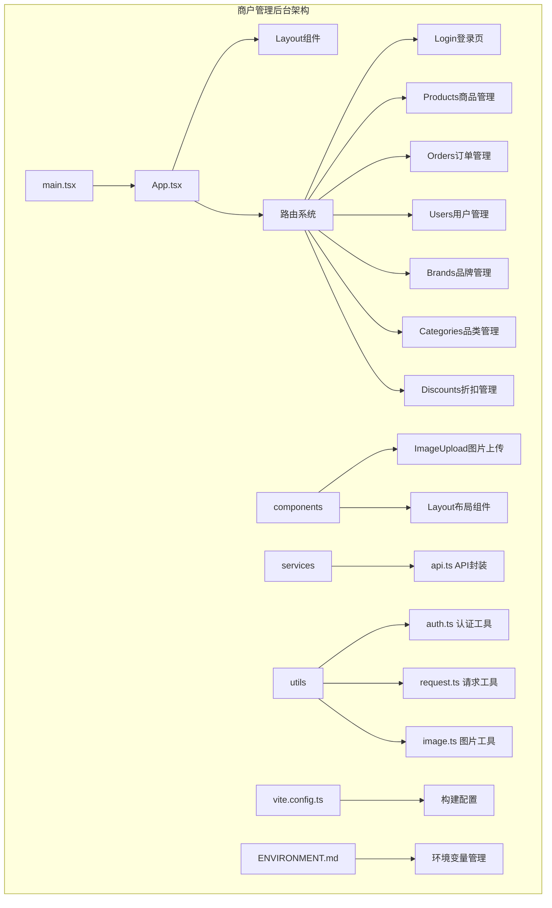

**图表来源**
- [main.tsx](file://merchant/src/main.tsx#L1-L17)
- [App.tsx](file://merchant/src/App.tsx#L1-L45)
- [Layout/index.tsx](file://merchant/src/components/Layout/index.tsx#L1-L60)

### 目录结构详解

项目采用清晰的分层架构，主要包含以下核心目录：

- **src/**: 源代码目录，包含所有业务逻辑
  - **components/**: 可复用的UI组件
  - **pages/**: 页面级组件，每个目录对应一个功能模块
  - **services/**: API服务封装
  - **utils/**: 工具函数集合
  - **assets/**: 静态资源文件

- **配置文件**: 包含构建配置和环境变量管理

**章节来源**
- [main.tsx](file://merchant/src/main.tsx#L1-L17)
- [App.tsx](file://merchant/src/App.tsx#L1-L45)

## 应用入口与初始化

### main.tsx - 应用启动点

应用入口文件负责初始化React应用，配置国际化和主题，并设置全局的配置提供者。

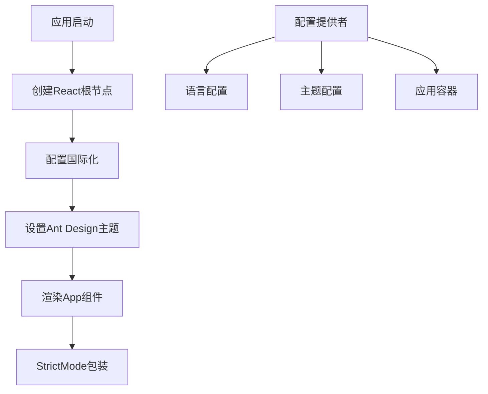

**图表来源**
- [main.tsx](file://merchant/src/main.tsx#L8-L16)

#### 初始化流程特点

1. **严格模式启用**: 在开发环境中启用React StrictMode，帮助发现潜在问题
2. **国际化配置**: 设置中文语言包，提供本地化支持
3. **主题系统**: 集成Ant Design的ConfigProvider，支持全局主题配置
4. **应用容器**: 使用Ant Design的App组件包装整个应用

**章节来源**
- [main.tsx](file://merchant/src/main.tsx#L1-L17)

## 路由配置与布局系统

### App.tsx - 路由与权限控制

应用的核心路由配置实现了基于角色的访问控制，确保只有登录用户才能访问受保护的管理功能。

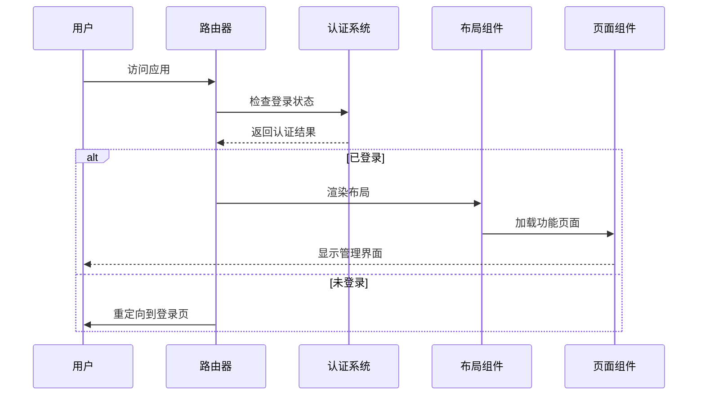

**图表来源**
- [App.tsx](file://merchant/src/App.tsx#L12-L14)
- [App.tsx](file://merchant/src/App.tsx#L16-L42)

#### 路由系统设计

1. **私有路由保护**: 使用`PrivateRoute`组件保护所有管理页面
2. **嵌套路由结构**: 布局组件内部包含功能页面的嵌套路由
3. **默认路由**: 自动重定向到用户管理页面
4. **灵活的权限控制**: 基于token的存在与否决定访问权限

#### Layout组件架构

Layout组件提供了完整的管理后台布局，包括侧边栏导航和顶部操作区域。

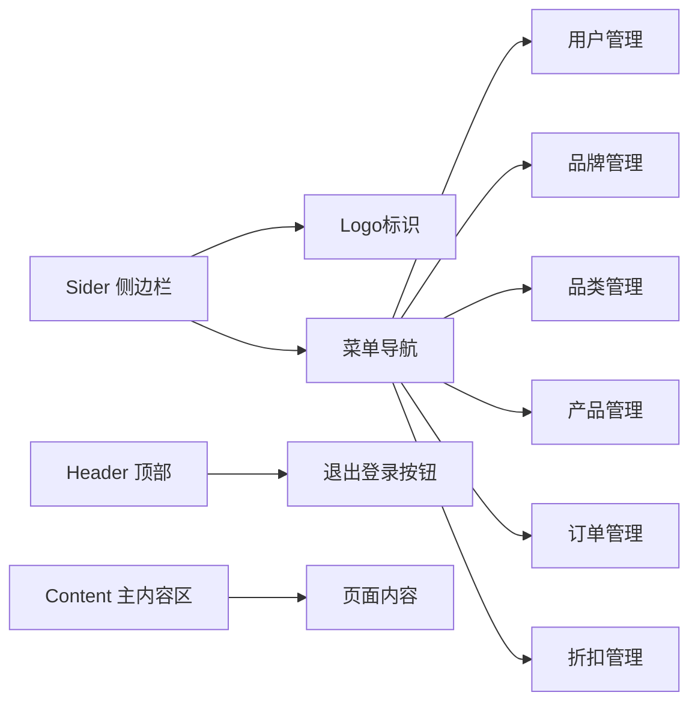

**图表来源**
- [Layout/index.tsx](file://merchant/src/components/Layout/index.tsx#L15-L24)
- [Layout/index.tsx](file://merchant/src/components/Layout/index.tsx#L36-L57)

**章节来源**
- [App.tsx](file://merchant/src/App.tsx#L1-L45)
- [Layout/index.tsx](file://merchant/src/components/Layout/index.tsx#L1-L60)

## 页面功能模块

### 商品管理 (Products)

商品管理页面是系统的核心功能之一，提供了完整的商品生命周期管理能力。

#### 功能特性

1. **数据表格展示**: 使用ProTable组件实现高级表格功能
2. **实时搜索过滤**: 支持多维度的商品搜索和筛选
3. **批量操作**: 支持商品的新增、编辑、删除操作
4. **图片管理**: 集成专门的图片上传组件
5. **状态管理**: 实时的状态显示和操作反馈

#### 数据流架构

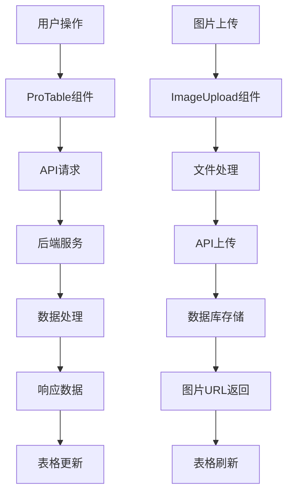

**图表来源**
- [Products/index.tsx](file://merchant/src/pages/Products/index.tsx#L298-L410)
- [Products/index.tsx](file://merchant/src/pages/Products/index.tsx#L272-L295)

#### 关键实现细节

- **异步数据加载**: 使用`useEffect`钩子加载品牌和分类数据
- **表单状态管理**: 通过`useState`管理编辑状态和表单数据
- **错误处理**: 完善的错误捕获和用户反馈机制
- **性能优化**: 使用`ref`和`memo`优化组件性能

**章节来源**
- [Products/index.tsx](file://merchant/src/pages/Products/index.tsx#L1-L720)

### 订单管理 (Orders)

订单管理页面提供了完整的订单生命周期管理，包括订单状态跟踪、物流管理和第三方系统集成。

#### 核心功能

1. **订单状态管理**: 支持订单的支付、发货、完成、取消等状态转换
2. **物流跟踪**: 集成海尔物流系统的查询功能
3. **第三方推送**: 支持订单数据推送到海尔系统
4. **详细信息查看**: 提供订单详情的详细展示

#### 订单状态流转

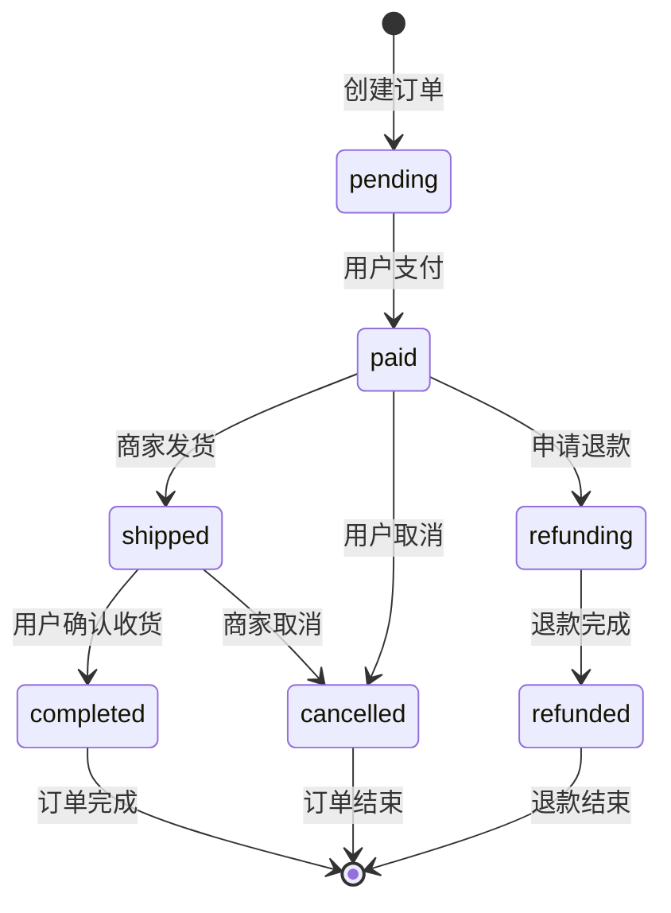

**图表来源**
- [Orders/index.tsx](file://merchant/src/pages/Orders/index.tsx#L30-L58)

**章节来源**
- [Orders/index.tsx](file://merchant/src/pages/Orders/index.tsx#L1-L200)

### 用户管理 (Users)

用户管理页面负责商户用户的全生命周期管理，包括用户信息维护和权限控制。

#### 管理功能

1. **用户信息管理**: 支持用户的增删改查操作
2. **权限控制**: 管理员权限的授予和撤销
3. **统计信息**: 展示用户的订单、收藏等统计数据
4. **安全控制**: 基于用户类型的权限隔离

**章节来源**
- [Users/index.tsx](file://merchant/src/pages/Users/index.tsx#L1-L200)

## 组件系统设计

### ImageUpload组件 - 图片上传系统

ImageUpload组件是系统中最重要的自定义组件之一，提供了完整的图片管理解决方案。

#### 设计原则

1. **高度可配置**: 支持多种配置选项，适应不同的使用场景
2. **即时反馈**: 提供上传进度和结果的实时反馈
3. **数据同步**: 支持编辑模式下的即时数据库同步
4. **错误处理**: 完善的错误处理和用户提示机制

#### 组件架构

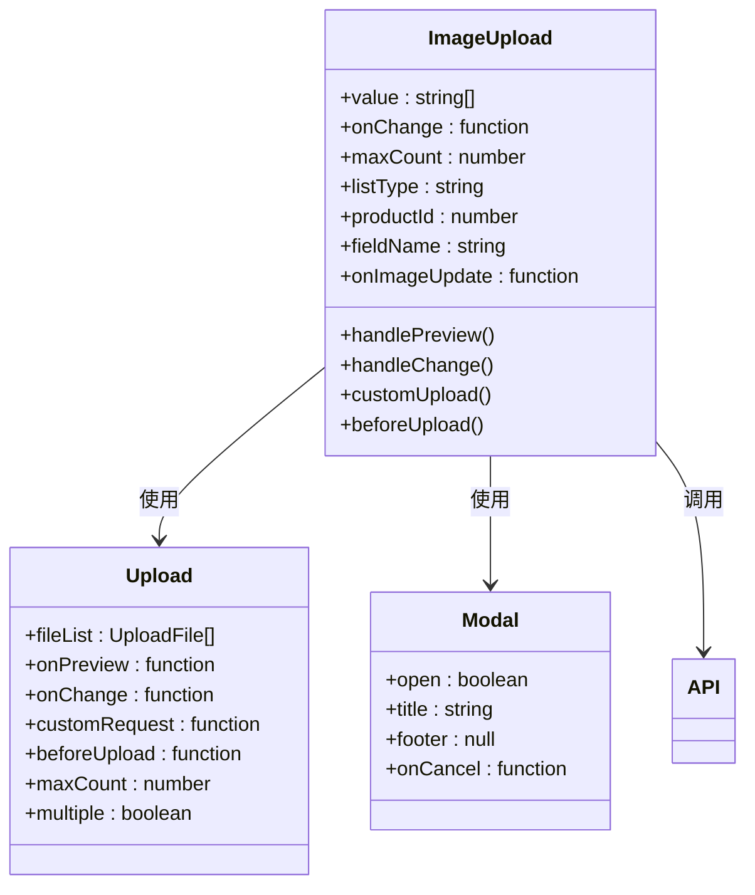

**图表来源**
- [ImageUpload/index.tsx](file://merchant/src/components/ImageUpload/index.tsx#L8-L16)
- [ImageUpload/index.tsx](file://merchant/src/components/ImageUpload/index.tsx#L148-L172)

#### 核心功能实现

1. **文件验证**: 检查文件类型和大小限制
2. **预览功能**: 支持图片预览和放大查看
3. **批量上传**: 支持多张图片的同时上传
4. **即时同步**: 编辑模式下支持图片的即时删除和更新

**章节来源**
- [ImageUpload/index.tsx](file://merchant/src/components/ImageUpload/index.tsx#L1-L173)

## API服务层

### api.ts - 统一API封装

API服务层提供了统一的接口调用方法，封装了所有与后端交互的逻辑。

#### API分类架构

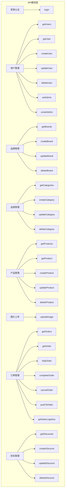

**图表来源**
- [api.ts](file://merchant/src/services/api.ts#L1-L66)

#### API调用模式

1. **统一请求格式**: 所有API调用都遵循一致的参数和返回格式
2. **错误处理**: 统一的错误处理和用户反馈机制
3. **类型安全**: 使用TypeScript提供完整的类型定义
4. **参数验证**: 对输入参数进行必要的验证和处理

**章节来源**
- [api.ts](file://merchant/src/services/api.ts#L1-L66)

## 构建配置与环境管理

### vite.config.ts - 构建配置

Vite配置文件定义了开发和生产环境的构建参数，以及代理服务器的设置。

#### 配置特点

1. **路径别名**: 设置`@`为`src`目录的别名，简化导入路径
2. **代理配置**: 配置API请求的代理转发
3. **环境变量**: 支持基于模式的环境变量加载
4. **开发服务器**: 配置开发服务器的端口和代理规则

#### 环境变量管理

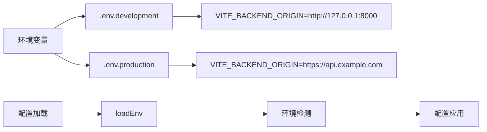

**图表来源**
- [vite.config.ts](file://merchant/vite.config.ts#L5-L26)
- [ENVIRONMENT.md](file://merchant/ENVIRONMENT.md#L1-L44)

**章节来源**
- [vite.config.ts](file://merchant/vite.config.ts#L1-L27)
- [ENVIRONMENT.md](file://merchant/ENVIRONMENT.md#L1-L44)

## 数据流与权限控制

### 认证与授权机制

系统采用了基于JWT的认证机制，确保数据的安全性和访问控制的准确性。

#### 认证流程

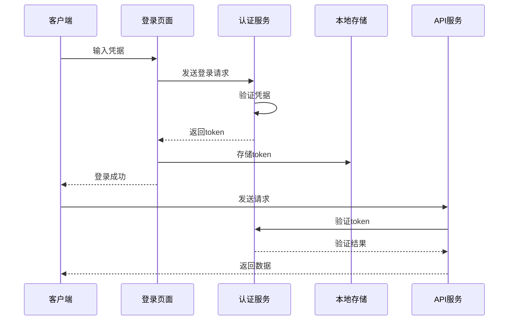

**图表来源**
- [Login/index.tsx](file://merchant/src/pages/Login/index.tsx#L11-L19)
- [auth.ts](file://merchant/src/utils/auth.ts#L1-L14)

#### 权限控制策略

1. **路由级权限**: 通过PrivateRoute组件控制页面访问权限
2. **API级权限**: 在请求拦截器中添加认证头
3. **功能级权限**: 基于用户角色控制具体功能的可用性
4. **数据级权限**: 根据用户权限过滤可访问的数据

**章节来源**
- [Login/index.tsx](file://merchant/src/pages/Login/index.tsx#L1-L42)
- [auth.ts](file://merchant/src/utils/auth.ts#L1-L14)

### 请求拦截与响应处理

#### 请求拦截器

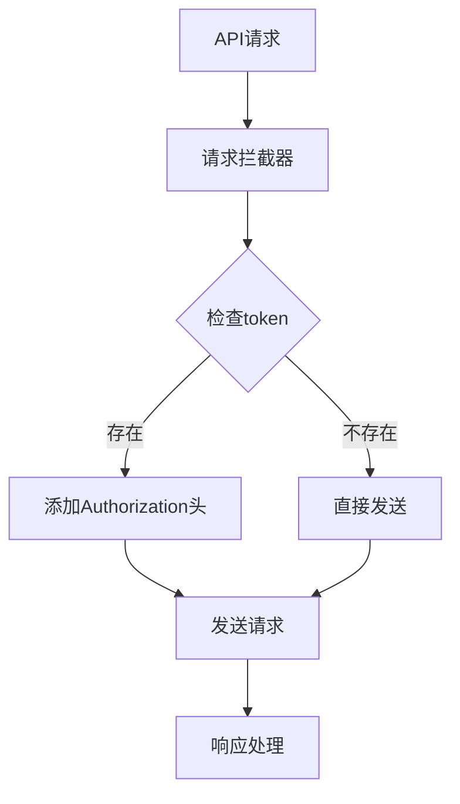

**图表来源**
- [request.ts](file://merchant/src/utils/request.ts#L10-L17)

#### 响应拦截器

1. **数据提取**: 自动提取响应中的数据部分
2. **错误处理**: 统一处理各种错误情况
3. **认证失效**: 处理401错误，自动跳转登录页
4. **用户提示**: 提供友好的错误信息和成功提示

**章节来源**
- [request.ts](file://merchant/src/utils/request.ts#L1-L38)

## 技术栈与架构特点

### 核心技术栈

| 技术组件 | 版本 | 用途 |
|---------|------|------|
| React | ^18.2.0 | 核心框架 |
| TypeScript | ^5.3.3 | 类型安全 |
| Vite | ^5.0.8 | 构建工具 |
| Ant Design | ^5.12.2 | UI组件库 |
| Ant Design Pro | ^2.6.43 | 高级组件 |
| Axios | ^1.6.2 | HTTP客户端 |
| React Router DOM | ^6.20.1 | 路由管理 |

### 架构设计特点

1. **模块化设计**: 清晰的目录结构和职责分离
2. **组件化开发**: 高度可复用的组件体系
3. **类型安全**: 完整的TypeScript类型定义
4. **开发体验**: 优秀的开发工具链和热重载
5. **性能优化**: 基于现代前端技术的最佳实践

### 最佳实践体现

1. **代码组织**: 遵循React最佳实践的组件组织方式
2. **状态管理**: 合理使用React Hooks进行状态管理
3. **错误处理**: 完善的错误边界和用户反馈机制
4. **性能优化**: 合理的组件拆分和渲染优化
5. **可维护性**: 清晰的代码结构和注释规范

**章节来源**
- [package.json](file://merchant/package.json#L1-L27)

## 总结

商户管理后台是一个设计精良、功能完备的现代化管理控制台。通过React + Vite的技术组合，结合Ant Design生态系统的丰富组件，构建了一个既美观又实用的管理界面。

### 主要优势

1. **架构清晰**: 分层明确的架构设计，便于维护和扩展
2. **功能完整**: 覆盖了商户管理的核心需求
3. **用户体验**: 优秀的用户界面和交互体验
4. **技术先进**: 采用最新的前端技术和最佳实践
5. **可扩展性**: 良好的模块化设计，支持功能扩展

### 技术亮点

- **组件化架构**: 高度模块化的组件设计
- **类型安全**: 完整的TypeScript支持
- **API封装**: 统一的API调用和错误处理
- **权限控制**: 完善的认证和授权机制
- **开发效率**: 优秀的开发工具链支持

这个项目展示了现代前端开发的最佳实践，为类似的管理系统开发提供了很好的参考价值。