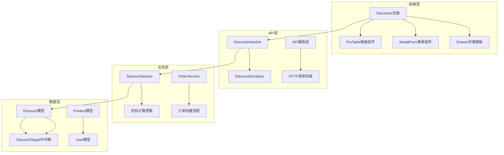
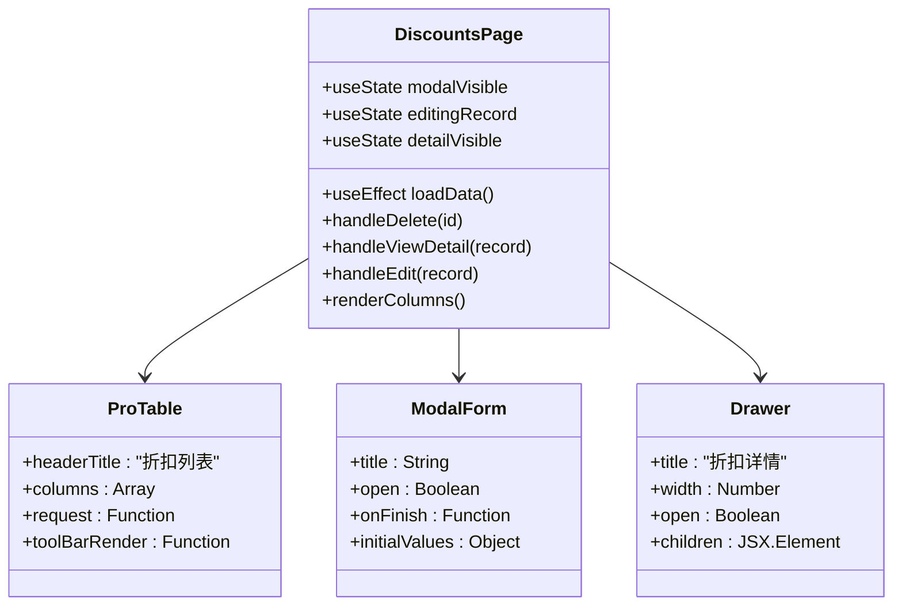
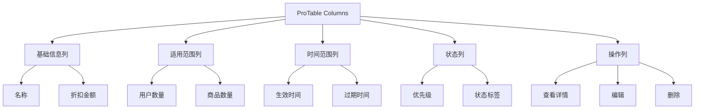
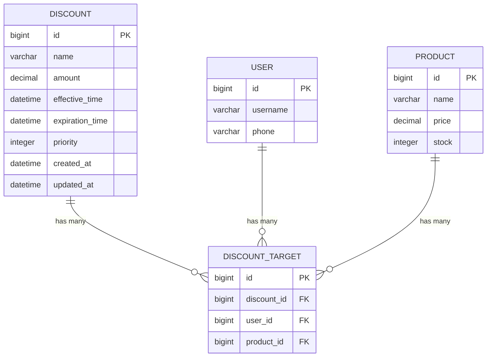
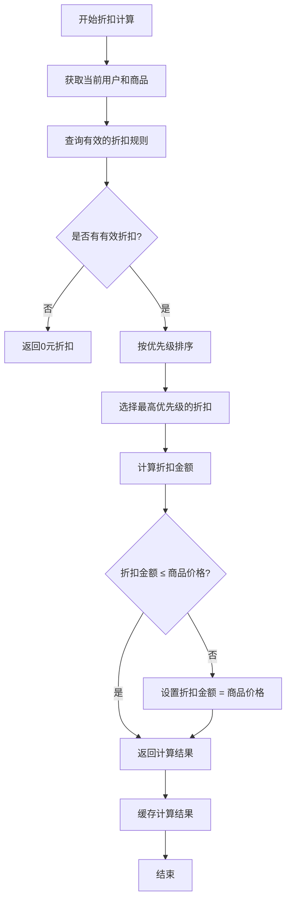
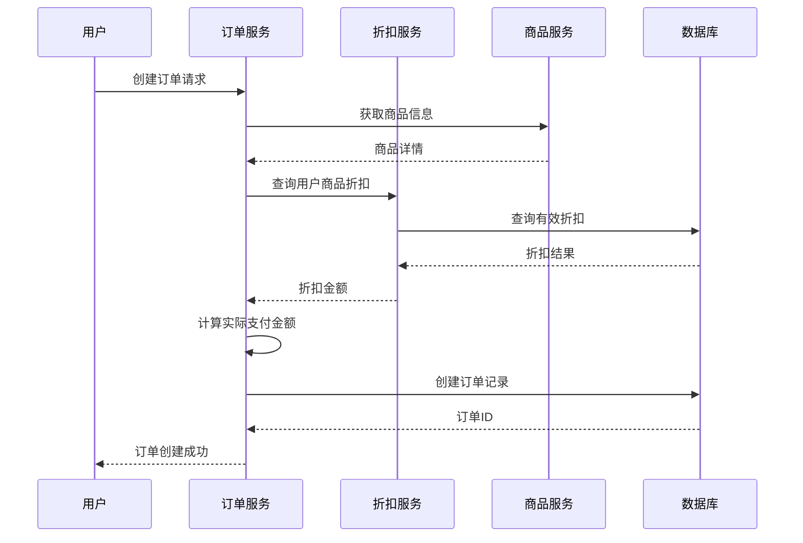
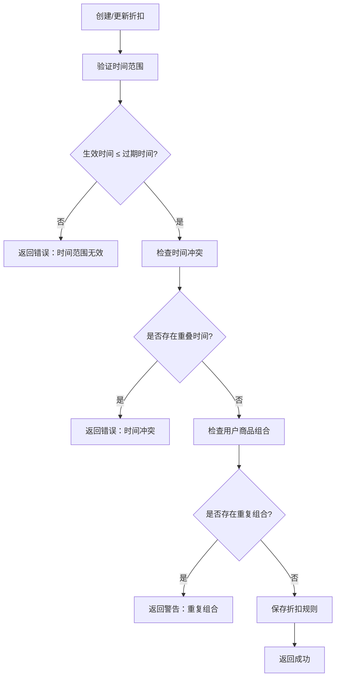
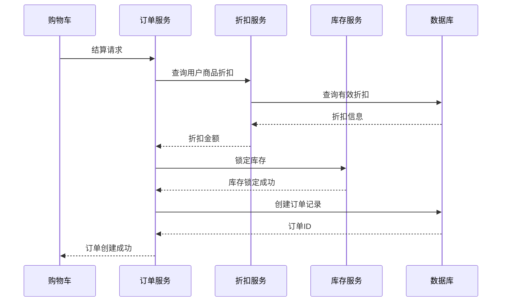
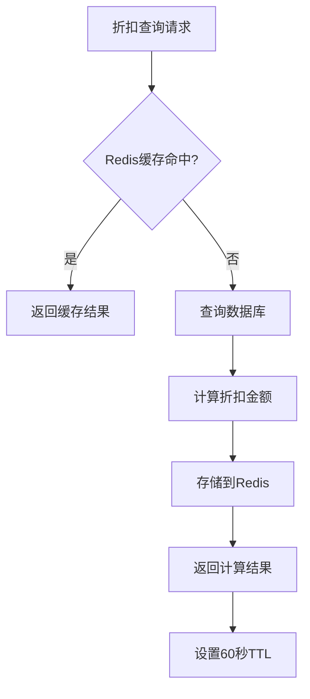

# 折扣管理页面结构

<cite>
**本文档引用的文件**
- [Discounts/index.tsx](file://merchant/src/pages/Discounts/index.tsx)
- [api.ts](file://merchant/src/services/api.ts)
- [models.py](file://backend/orders/models.py)
- [views.py](file://backend/orders/views.py)
- [serializers.py](file://backend/orders/serializers.py)
- [services.py](file://backend/orders/services.py)
- [DiscountViewSet](file://backend/orders/views.py#L973-L1129)
- [DiscountSerializer](file://backend/orders/serializers.py#L175-L208)
- [Discount](file://backend/orders/models.py#L237-L290)
</cite>

## 目录
1. [项目概述](#项目概述)
2. [折扣管理架构](#折扣管理架构)
3. [前端页面设计](#前端页面设计)
4. [后端API接口](#后端api接口)
5. [数据模型分析](#数据模型分析)
6. [折扣计算逻辑](#折扣计算逻辑)
7. [冲突检测机制](#冲突检测机制)
8. [与订单系统的集成](#与订单系统的集成)
9. [性能优化策略](#性能优化策略)
10. [故障排除指南](#故障排除指南)

## 项目概述

折扣管理系统是一个完整的电商折扣规则配置和管理平台，支持多种折扣类型的灵活配置，包括百分比折扣、固定金额折扣、时间范围限制、用户群体筛选等功能。系统采用前后端分离架构，前端基于React+Ant Design构建，后端使用Django REST framework实现。

### 核心功能特性

- **多维度折扣配置**：支持按用户、商品、时间等多个维度设置折扣
- **灵活的折扣类型**：支持固定金额折扣和百分比折扣
- **智能冲突检测**：自动检测和处理折扣规则冲突
- **实时折扣计算**：在订单创建时实时应用最优折扣
- **高效缓存机制**：通过Redis缓存提升折扣查询性能

## 折扣管理架构



**图表来源**
- [Discounts/index.tsx](file://merchant/src/pages/Discounts/index.tsx#L1-L368)
- [DiscountViewSet](file://backend/orders/views.py#L973-L1129)
- [models.py](file://backend/orders/models.py#L237-L290)

## 前端页面设计

### 主要组件结构

折扣管理页面采用模块化设计，包含以下核心组件：



**图表来源**
- [Discounts/index.tsx](file://merchant/src/pages/Discounts/index.tsx#L8-L368)

### 折扣配置表单设计

前端表单组件提供了完整的折扣配置界面，支持以下字段：

| 字段名称 | 类型 | 必填 | 说明 | 验证规则 |
|---------|------|------|------|----------|
| 折扣名称 | Text | 是 | 折扣规则的描述性名称 | 非空，最大100字符 |
| 折扣金额 | Decimal | 是 | 固定金额折扣值 | ≥0，最多2位小数 |
| 适用用户 | Select(Multiple) | 是 | 可享受折扣的用户列表 | 至少选择一个用户 |
| 适用商品 | Select(Multiple) | 是 | 可使用折扣的商品列表 | 至少选择一个商品 |
| 生效时间 | DateTime | 是 | 折扣开始生效的时间 | 必须早于过期时间 |
| 过期时间 | DateTime | 是 | 折扣结束的时间 | 必须晚于生效时间 |
| 优先级 | Integer | 否 | 折扣优先级，数值越大优先级越高 | ≥0，默认0 |

**章节来源**
- [Discounts/index.tsx](file://merchant/src/pages/Discounts/index.tsx#L195-L368)

### 数据表格列定义

系统使用ProTable组件展示折扣列表，包含以下列配置：



**图表来源**
- [Discounts/index.tsx](file://merchant/src/pages/Discounts/index.tsx#L66-L151)

## 后端API接口

### 核心API端点

系统提供了完整的RESTful API接口，支持折扣规则的CRUD操作：

| HTTP方法 | 端点路径 | 权限要求 | 功能描述 | 请求参数 |
|---------|----------|----------|----------|----------|
| GET | `/discounts/` | IsAuthenticated | 获取折扣规则列表 | 分页参数、搜索条件 |
| POST | `/discounts/` | IsAdmin | 创建新的折扣规则 | 折扣配置数据 |
| GET | `/discounts/{id}/` | IsAuthenticated | 获取折扣详情 | 折扣ID |
| PATCH | `/discounts/{id}/` | IsAdmin | 更新折扣规则 | 部分更新字段 |
| DELETE | `/discounts/{id}/` | IsAdmin | 删除折扣规则 | 折扣ID |
| POST | `/discounts/batch_set/` | IsAdmin | 批量设置折扣 | 用户ID、商品列表、折扣参数 |
| GET | `/discounts/query_user_products/` | IsAuthenticated | 查询用户商品折扣 | 商品ID列表 |

**章节来源**
- [api.md](file://api.md#L380-L423)
- [DiscountViewSet](file://backend/orders/views.py#L973-L1129)

### API请求响应格式

#### 创建折扣规则请求格式

```typescript
// 请求体结构
interface CreateDiscountRequest {
  name: string;           // 折扣名称
  amount: number;         // 折扣金额
  effective_time: string; // 生效时间（ISO格式）
  expiration_time: string; // 过期时间（ISO格式）
  priority?: number;      // 优先级
  user_ids: number[];     // 适用用户ID列表
  product_ids: number[];  // 适用商品ID列表
}

// 响应格式
interface CreateDiscountResponse {
  id: number;
  name: string;
  amount: number;
  effective_time: string;
  expiration_time: string;
  priority: number;
  created_at: string;
  updated_at: string;
  targets: DiscountTarget[];
}
```

#### 批量设置折扣请求格式

```typescript
// 批量设置请求体
interface BatchSetDiscountRequest {
  user_id: number;        // 目标用户ID
  product_ids: number[];  // 商品ID列表
  amount: number;         // 折扣金额
  effective_time: string; // 生效时间
  expiration_time: string; // 过期时间
  priority?: number;      // 优先级
}

// 响应格式
interface BatchSetDiscountResponse {
  discount_id: number;    // 创建的折扣ID
  created_targets: number;// 创建的目标数量
}
```

**章节来源**
- [DiscountSerializer](file://backend/orders/serializers.py#L175-L208)

## 数据模型分析

### Discount主模型

Discount模型是折扣系统的核心实体，定义了折扣的基本属性和行为：



**图表来源**
- [models.py](file://backend/orders/models.py#L237-L290)

### DiscountTarget中间表

DiscountTarget模型作为多对多关系的中间表，实现了"用户-商品"的精确匹配：

| 字段名称 | 数据类型 | 约束条件 | 说明 |
|---------|----------|----------|------|
| id | BigAutoField | PRIMARY KEY | 主键ID |
| discount | ForeignKey | FOREIGN KEY | 关联的折扣规则 |
| user | ForeignKey | FOREIGN KEY | 关联的用户 |
| product | ForeignKey | FOREIGN KEY | 关联的商品 |

**唯一约束**：`(discount, user, product)` - 确保每个用户-商品组合只能有一个折扣规则

**章节来源**
- [models.py](file://backend/orders/models.py#L273-L290)

### 模型索引优化

系统为提高查询性能建立了以下索引：

| 索引名称 | 字段组合 | 用途 |
|---------|----------|------|
| `orders_discount_effective_time_expiration_time` | `(effective_time, expiration_time)` | 时间范围查询优化 |
| `orders_discount_priority` | `(priority)` | 优先级排序优化 |
| `orders_discount_target_user_product` | `(user, product)` | 用户商品匹配查询优化 |
| `orders_discount_target_discount` | `(discount)` | 折扣规则关联查询优化 |

**章节来源**
- [models.py](file://backend/orders/models.py#L259-L262)

## 折扣计算逻辑

### 折扣计算流程

系统在订单创建时执行折扣计算，遵循以下优先级规则：



**图表来源**
- [services.py](file://backend/orders/services.py#L11-L41)

### 折扣计算算法

```python
def get_best_active_discount(user, product):
    """获取最佳活跃折扣金额"""
    if not user or not getattr(user, 'is_authenticated', False):
        return 0
    
    # 构建缓存键
    cache_key = f"discount:{user.id}:{product.id}"
    cached = cache.get(cache_key)
    if cached is not None:
        return cached
    
    now = timezone.now()
    # 查询有效的折扣规则
    dt = (
        DiscountTarget.objects.select_related('discount')
        .filter(
            user=user,
            product=product,
            discount__effective_time__lte=now,
            discount__expiration_time__gt=now,
        )
        .order_by('-discount__priority', '-discount__updated_at')
        .first()
    )
    
    # 计算折扣金额
    amount = dt.discount.amount if dt else 0
    # 确保折扣金额不超过商品价格
    if amount > product.price:
        amount = product.price
    
    # 缓存结果（60秒）
    cache.set(cache_key, amount, 60)
    return amount
```

**章节来源**
- [services.py](file://backend/orders/services.py#L11-L41)

### 订单创建时的折扣应用

在订单创建过程中，系统会自动应用最优折扣：



**图表来源**
- [services.py](file://backend/orders/services.py#L219-L297)

## 冲突检测机制

### 时间范围冲突检测

系统通过数据库唯一约束和业务逻辑双重保障避免冲突：



### 唯一约束保障

数据库层面通过以下唯一约束防止冲突：

1. **DiscountTarget唯一约束**：`(discount, user, product)` - 确保每个用户-商品组合只有一个折扣
2. **时间范围索引**：`(effective_time, expiration_time)` - 优化时间范围查询
3. **优先级索引**：`(priority)` - 支持快速排序和优先级查询

**章节来源**
- [models.py](file://backend/orders/models.py#L282-L286)

### 冲突解决策略

当检测到潜在冲突时，系统采用以下策略：

| 冲突类型 | 解决策略 | 用户提示 |
|---------|----------|----------|
| 时间范围重叠 | 拒绝创建/更新 | "该时间段已有其他折扣规则" |
| 用户商品重复 | 覆盖现有规则 | "已为您更新该用户的折扣" |
| 优先级冲突 | 按更新时间排序 | "高优先级规则将优先生效" |

## 与订单系统的集成

### 订单创建流程中的折扣应用



**图表来源**
- [services.py](file://backend/orders/services.py#L219-L297)

### 折扣在订单中的体现

订单模型中包含了折扣相关的字段和计算逻辑：

| 字段名称 | 数据类型 | 说明 | 计算方式 |
|---------|----------|------|----------|
| `total_amount` | Decimal | 订单总金额 | 商品单价 × 数量 |
| `discount_amount` | Decimal | 折扣金额 | 通过折扣服务计算 |
| `actual_amount` | Decimal | 实际支付金额 | `total_amount - discount_amount` |

**章节来源**
- [models.py](file://backend/orders/models.py#L25-L33)

### 批量查询折扣接口

系统提供了高效的批量查询接口，支持前端一次性获取多个商品的折扣信息：

```python
@action(detail=False, methods=['get'], permission_classes=[IsAuthenticated])
def query_user_products(self, request):
    """批量查询当前用户在一组商品上的有效折扣"""
    prod_ids = parse_csv_ints(request.query_params.get('product_ids', ''))
    if not prod_ids:
        return Response({})
    
    now = timezone.now()
    qs = DiscountTarget.objects.select_related('discount').filter(
        user=request.user,
        product_id__in=prod_ids,
        discount__effective_time__lte=now,
        discount__expiration_time__gt=now,
    ).order_by('-discount__priority', '-discount__updated_at')
    
    result = {}
    for dt in qs:
        if dt.product_id not in result:
            result[dt.product_id] = {
                'amount': float(dt.discount.amount),
                'discount_id': dt.discount_id
            }
    return Response(result)
```

**章节来源**
- [DiscountViewSet](file://backend/orders/views.py#L1078-L1103)

## 性能优化策略

### 缓存机制

系统采用多层缓存策略提升性能：



**缓存策略**：
- **缓存键格式**：`discount:{user_id}:{product_id}`
- **缓存时间**：60秒（短生命周期，便于及时反映管理员修改）
- **缓存失效**：折扣规则更新时自动清理相关缓存

**章节来源**
- [services.py](file://backend/orders/services.py#L11-L41)

### 数据库查询优化

1. **索引优化**：为常用查询字段建立复合索引
2. **查询优化**：使用`select_related`和`prefetch_related`减少查询次数
3. **批量操作**：使用`bulk_create`批量创建折扣目标

### 前端性能优化

1. **虚拟滚动**：ProTable组件支持大数据量的虚拟滚动
2. **懒加载**：用户和商品列表采用懒加载策略
3. **防抖提交**：表单提交使用防抖机制减少API调用

## 故障排除指南

### 常见问题及解决方案

#### 1. 折扣未生效

**问题现象**：订单创建后显示无折扣

**排查步骤**：
1. 检查折扣规则是否在有效期内
2. 验证用户和商品是否在适用范围内
3. 确认折扣优先级设置正确
4. 检查缓存是否过期

**解决方案**：
```python
# 清理相关缓存
cache.delete(f"discount:{user_id}:{product_id}")
```

#### 2. 时间范围冲突

**问题现象**：创建折扣时提示时间冲突

**解决方案**：
- 检查现有折扣的时间范围
- 调整新折扣的时间范围
- 使用批量设置功能合并相似规则

#### 3. 性能问题

**问题现象**：折扣查询响应缓慢

**优化措施**：
1. 检查Redis连接状态
2. 优化数据库索引
3. 调整缓存策略
4. 使用数据库查询分析工具

### 监控指标

建议监控以下关键指标：

| 指标名称 | 监控目的 | 告警阈值 |
|---------|----------|----------|
| 折扣查询响应时间 | 性能监控 | >100ms |
| Redis命中率 | 缓存效果评估 | <80% |
| 数据库查询次数 | 查询优化效果 | 异常增长 |
| 折扣计算成功率 | 业务稳定性 | <99% |

### 日志记录

系统在关键节点记录详细日志：

```python
logger.info(f'折扣查询: user={user.id}, product={product.id}, '
           f'discount={discount_amount}, cache={cached}')
```

**章节来源**
- [services.py](file://backend/orders/services.py#L11-L41)

## 总结

折扣管理系统通过精心设计的架构和优化策略，实现了高效、可靠的折扣规则管理和应用。系统具备以下核心优势：

1. **灵活的配置能力**：支持多维度、多层次的折扣规则配置
2. **高效的计算性能**：通过缓存和索引优化确保快速响应
3. **完善的冲突检测**：多重保障机制避免规则冲突
4. **良好的扩展性**：模块化设计便于功能扩展和维护

未来可以考虑的功能增强方向包括：
- 支持更复杂的折扣算法（如阶梯折扣、组合优惠）
- 增强数据分析功能（折扣效果统计、ROI分析）
- 提供更丰富的报表和可视化功能