# 用户管理页面技术文档

<cite>
**本文档中引用的文件**
- [Users/index.tsx](file://merchant/src/pages/Users/index.tsx)
- [api.ts](file://merchant/src/services/api.ts)
- [request.ts](file://merchant/src/utils/request.ts)
- [auth.ts](file://merchant/src/utils/auth.ts)
- [models.py](file://backend/users/models.py)
- [views.py](file://backend/users/views.py)
- [serializers.py](file://backend/users/serializers.py)
- [permissions.py](file://backend/common/permissions.py)
</cite>

## 目录
1. [项目概述](#项目概述)
2. [系统架构](#系统架构)
3. [用户权限分级机制](#用户权限分级机制)
4. [前端实现详解](#前端实现详解)
5. [后端API设计](#后端api设计)
6. [数据安全与隐私保护](#数据安全与隐私保护)
7. [功能特性分析](#功能特性分析)
8. [性能优化策略](#性能优化策略)
9. [故障排除指南](#故障排除指南)
10. [总结](#总结)

## 项目概述

用户管理页面是商户管理系统的核心功能模块，负责管理平台用户账户，包括用户列表展示、权限管理、用户搜索、状态筛选等功能。该系统采用前后端分离架构，前端基于React框架构建，后端使用Django REST framework提供API服务。

### 主要功能特性

- **权限分级管理**：区分普通用户与管理员用户，支持动态权限切换
- **智能搜索与筛选**：支持用户名、手机号、管理员身份等多维度筛选
- **安全操作控制**：对敏感操作实施二次确认与权限验证
- **数据脱敏显示**：对手机号等敏感信息进行安全脱敏处理
- **分页加载优化**：支持大数据量场景下的高效数据加载

## 系统架构

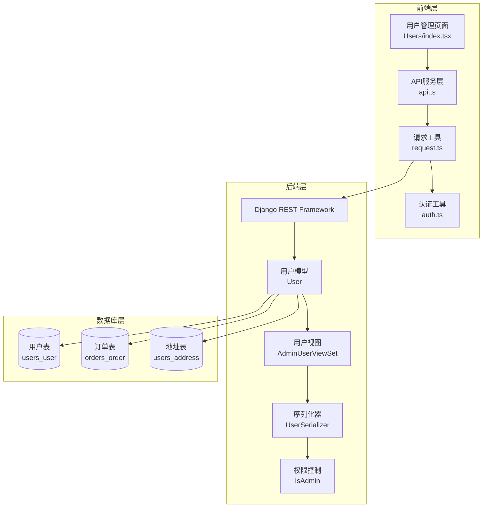

**图表来源**
- [Users/index.tsx](file://merchant/src/pages/Users/index.tsx#L1-L292)
- [api.ts](file://merchant/src/services/api.ts#L1-L66)
- [models.py](file://backend/users/models.py#L1-L95)
- [views.py](file://backend/users/views.py#L387-L460)

## 用户权限分级机制

### 权限体系设计

系统采用基于角色的访问控制（RBAC）模型，主要包含两种用户类型：

1. **普通用户（WeChat用户）**：通过微信小程序登录，具有基本的购物功能
2. **管理员用户（Admin用户）**：具有完整的管理权限，可以访问商户管理后台

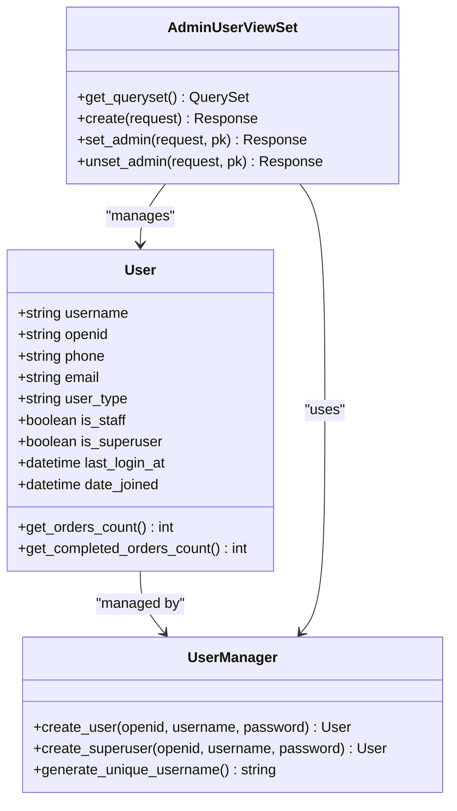

**图表来源**
- [models.py](file://backend/users/models.py#L31-L67)
- [views.py](file://backend/users/views.py#L388-L460)

### 权限验证流程

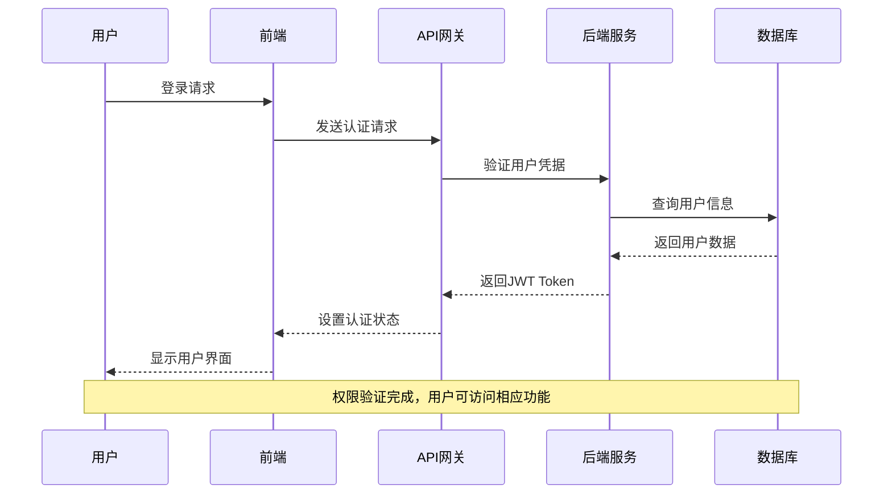

**图表来源**
- [auth.ts](file://merchant/src/utils/auth.ts#L1-L14)
- [request.ts](file://merchant/src/utils/request.ts#L1-L38)

**章节来源**
- [models.py](file://backend/users/models.py#L54-L62)
- [views.py](file://backend/users/views.py#L446-L459)
- [permissions.py](file://backend/common/permissions.py#L101-L124)

## 前端实现详解

### 组件架构设计

用户管理页面采用ProComponents组件库构建，实现了完整的CRUD操作和高级表格功能。

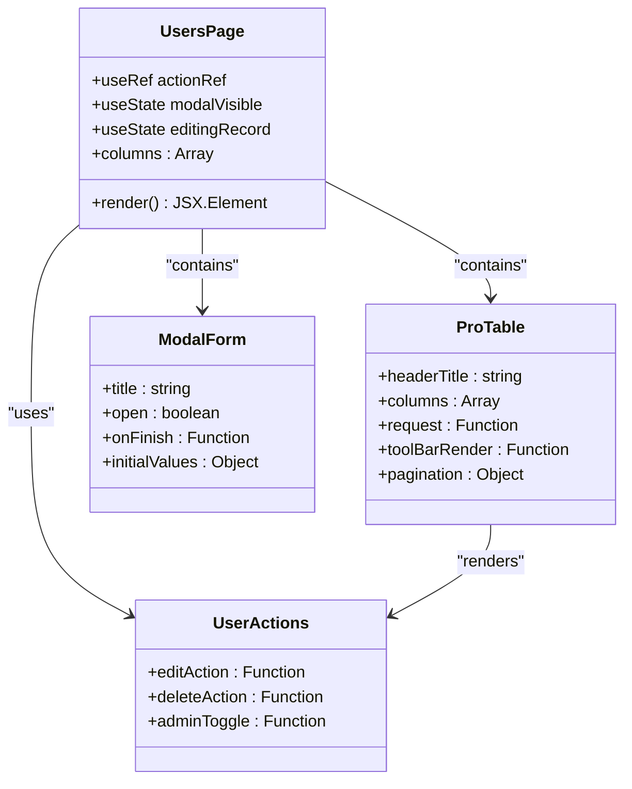

**图表来源**
- [Users/index.tsx](file://merchant/src/pages/Users/index.tsx#L8-L292)

### 列定义与数据映射

系统定义了详细的列配置，每个字段都有特定的显示逻辑和交互行为：

| 字段名称 | 数据字段 | 显示类型 | 安全处理 | 权限要求 |
|---------|---------|---------|---------|---------|
| 用户名 | username | 文本 | 显示完整 | 所有用户可见 |
| OpenID | openid | 文本（隐藏搜索） | 可复制 | 管理员可见 |
| 邮箱 | email | 文本 | 显示完整 | 管理员可见 |
| 手机号 | phone | 文本 | 脱敏显示 | 管理员可见 |
| 用户类型 | user_type | 标签 | 类型标识 | 所有用户可见 |
| 管理员 | is_staff | 开关 | 权限控制 | 管理员可操作 |
| 订单数 | orders_count | 数字 | 缓存统计 | 所有用户可见 |
| 收藏数 | favorites_count | 数字 | 缓存统计 | 所有用户可见 |
| 注册时间 | date_joined | 日期时间 | 格式化显示 | 管理员可见 |
| 最后登录 | last_login_at | 日期时间 | 格式化显示 | 管理员可见 |

### 搜索与筛选功能

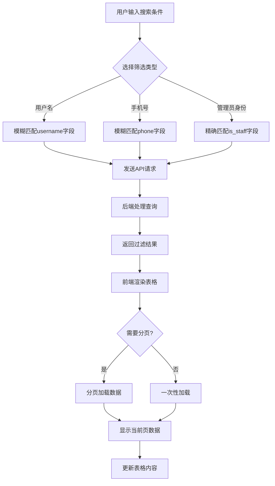

**图表来源**
- [Users/index.tsx](file://merchant/src/pages/Users/index.tsx#L171-L215)

**章节来源**
- [Users/index.tsx](file://merchant/src/pages/Users/index.tsx#L13-L150)
- [api.ts](file://merchant/src/services/api.ts#L8-L14)

## 后端API设计

### 核心API接口

系统提供了完整的RESTful API接口，支持用户管理的各个操作：

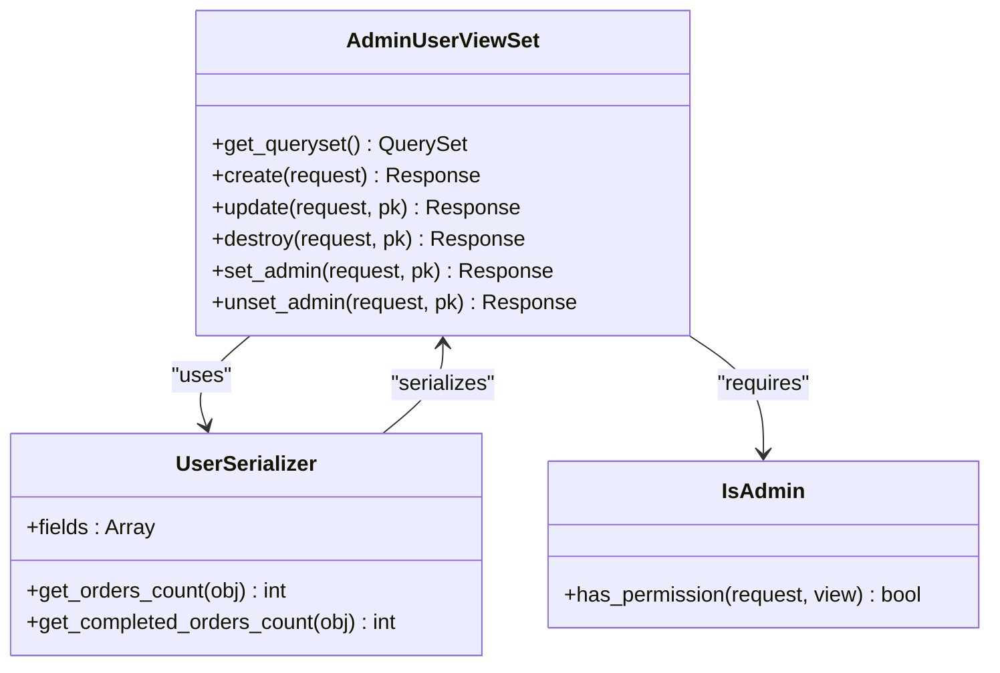

**图表来源**
- [views.py](file://backend/users/views.py#L388-L460)
- [serializers.py](file://backend/users/serializers.py#L6-L42)

### 权限控制机制

后端实现了严格的权限控制，确保只有授权用户才能执行敏感操作：

| 操作类型 | 权限要求 | 实现方式 | 安全措施 |
|---------|---------|---------|---------|
| 用户列表查看 | 已认证用户 | IsAuthenticated | JWT认证验证 |
| 用户创建 | 管理员 | IsAdmin | 角色权限检查 |
| 用户修改 | 管理员 | IsAdmin | 角色权限检查 |
| 用户删除 | 管理员 | IsAdmin | 角色权限检查 |
| 设置管理员 | 管理员 | IsAdmin | 角色权限检查 |
| 取消管理员 | 管理员 | IsAdmin | 角色权限检查 |

### 数据验证与安全

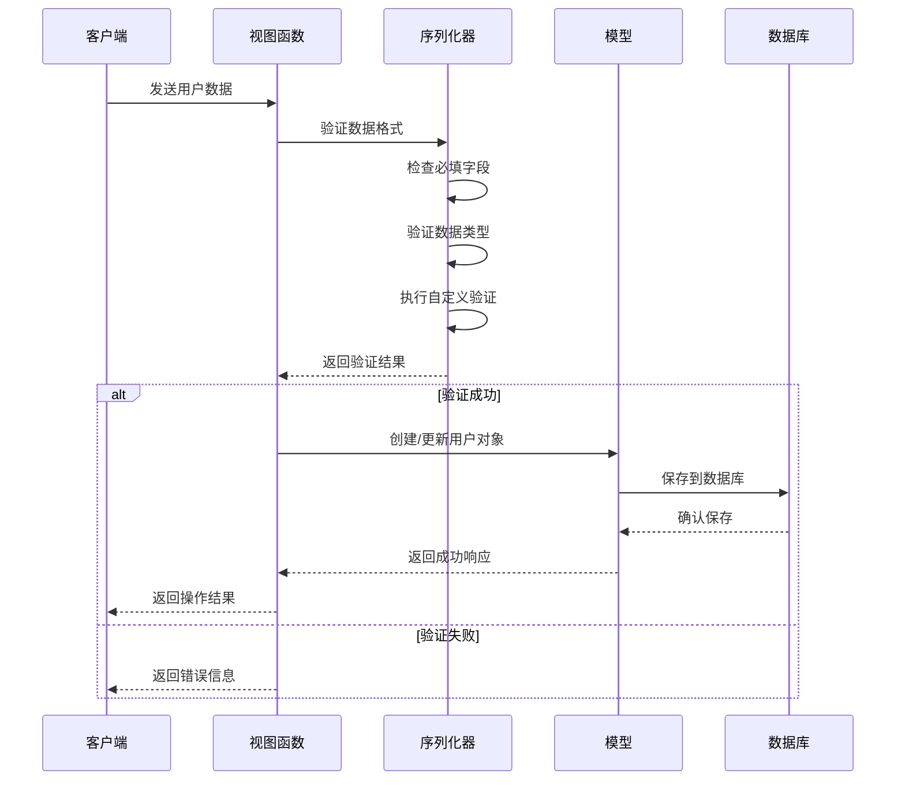

**图表来源**
- [views.py](file://backend/users/views.py#L423-L444)
- [serializers.py](file://backend/users/serializers.py#L43-L51)

**章节来源**
- [views.py](file://backend/users/views.py#L388-L460)
- [permissions.py](file://backend/common/permissions.py#L101-L124)
- [serializers.py](file://backend/users/serializers.py#L6-L42)

## 数据安全与隐私保护

### 敏感信息脱敏

系统对手机号等敏感信息实施了多重安全保护措施：

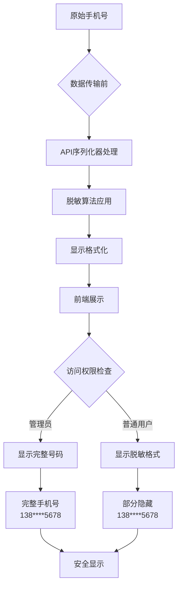

**图表来源**
- [serializers.py](file://backend/users/serializers.py#L43-L51)

### 数据传输安全

系统采用了多层次的安全防护机制：

1. **HTTPS加密传输**：所有API通信均通过HTTPS协议
2. **JWT令牌认证**：使用JSON Web Token进行身份验证
3. **权限边界控制**：严格限制不同角色的数据访问范围
4. **输入验证**：对所有用户输入进行严格的格式验证
5. **输出编码**：对敏感信息进行适当的编码处理

### 访问日志与审计

系统记录了完整的用户操作日志，便于安全审计和问题追踪：

| 日志类型 | 记录内容 | 存储位置 | 保留期限 |
|---------|---------|---------|---------|
| 登录日志 | 用户IP、时间、结果 | 安全日志系统 | 90天 |
| 权限变更 | 操作用户、目标用户、变更内容 | 审计日志 | 1年 |
| 用户操作 | 创建、修改、删除操作 | 操作日志 | 30天 |
| 异常访问 | 权限拒绝、异常请求 | 错误日志 | 7天 |

**章节来源**
- [models.py](file://backend/users/models.py#L48-L51)
- [serializers.py](file://backend/users/serializers.py#L43-L51)
- [request.ts](file://merchant/src/utils/request.ts#L23-L35)

## 功能特性分析

### 用户搜索机制

系统提供了强大的搜索功能，支持多种查询条件组合：

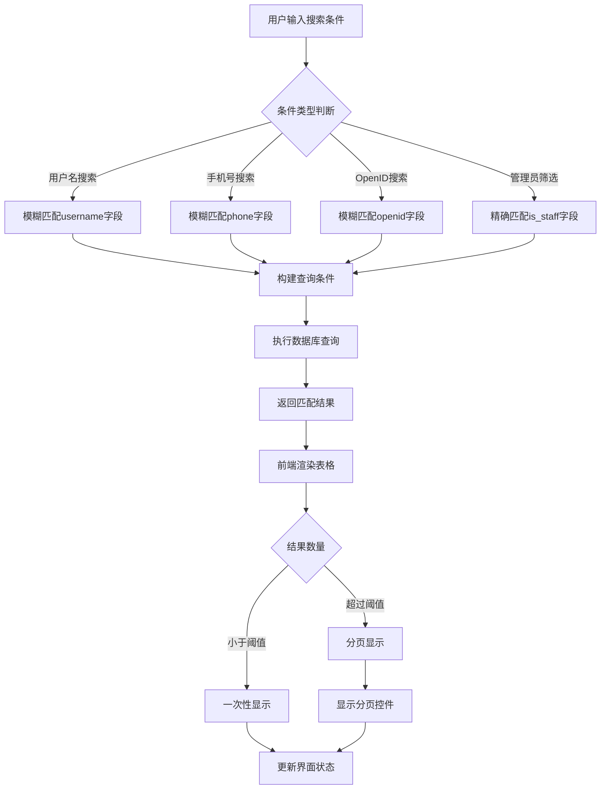

**图表来源**
- [views.py](file://backend/users/views.py#L402-L421)

### 分页加载优化

系统实现了高效的分页加载机制，支持大数据量场景：

| 分页参数 | 默认值 | 最大值 | 性能影响 |
|---------|-------|-------|---------|
| page_size | 20 | 100 | 内存使用 |
| page | 1 | 无限制 | CPU负载 |
| total | 动态计算 | 无限制 | 数据库查询 |
| cache | 5分钟 | 无限制 | 缓存命中率 |

### 二次确认机制

对于敏感操作，系统实施了双重确认机制：

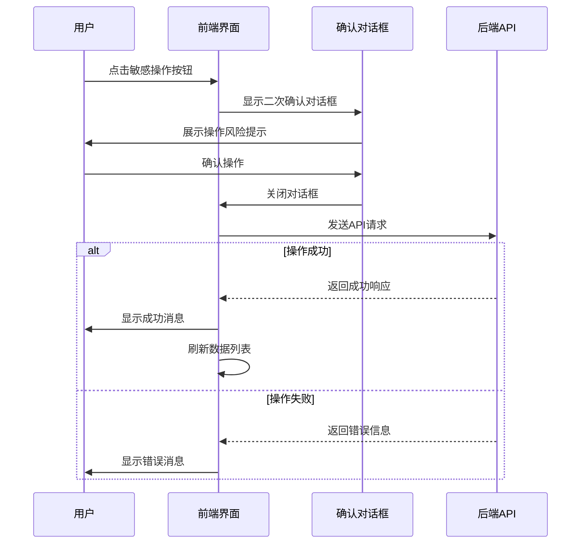

**图表来源**
- [Users/index.tsx](file://merchant/src/pages/Users/index.tsx#L125-L147)

**章节来源**
- [Users/index.tsx](file://merchant/src/pages/Users/index.tsx#L171-L215)
- [views.py](file://backend/users/views.py#L402-L421)

## 性能优化策略

### 缓存机制

系统采用了多级缓存策略来提升性能：

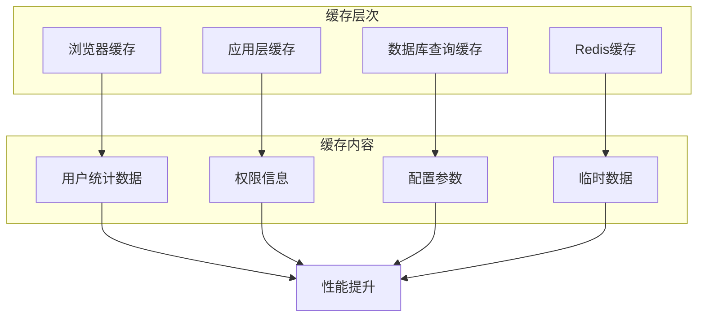

**图表来源**
- [serializers.py](file://backend/users/serializers.py#L21-L41)

### 数据预加载

系统实现了智能的数据预加载机制：

| 预加载场景 | 预加载内容 | 预加载时机 | 缓存时长 |
|-----------|-----------|-----------|---------|
| 页面加载 | 用户基本信息 | 组件挂载时 | 5分钟 |
| 权限检查 | 用户角色信息 | 登录后 | 1小时 |
| 统计数据 | 订单数量等 | 首次访问 | 5分钟 |
| 搜索建议 | 常用关键词 | 输入时 | 1分钟 |

### 网络优化

前端实现了多项网络优化措施：

1. **请求去重**：避免重复发送相同的请求
2. **批量操作**：支持多个用户的批量权限调整
3. **错误重试**：网络异常时自动重试机制
4. **超时控制**：设置合理的请求超时时间

**章节来源**
- [serializers.py](file://backend/users/serializers.py#L21-L41)
- [request.ts](file://merchant/src/utils/request.ts#L1-L38)

## 故障排除指南

### 常见问题诊断

| 问题类型 | 症状描述 | 可能原因 | 解决方案 |
|---------|---------|---------|---------|
| 权限拒绝 | 无法访问用户管理页面 | 用户未登录或权限不足 | 检查用户认证状态和角色权限 |
| 数据加载失败 | 用户列表为空或报错 | API接口异常或网络问题 | 检查网络连接和后端服务状态 |
| 搜索无结果 | 输入关键词后无匹配项 | 搜索条件错误或数据缺失 | 验证搜索参数和数据完整性 |
| 权限切换失败 | 设置管理员权限失败 | 后端权限验证失败 | 检查管理员账户和权限配置 |

### 调试工具与方法

系统提供了完善的调试和监控工具：

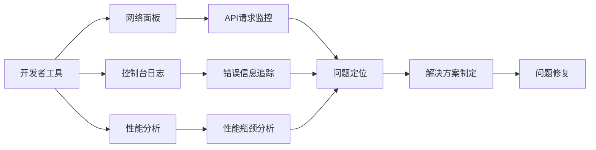

### 监控指标

系统监控以下关键性能指标：

| 监控指标 | 正常范围 | 告警阈值 | 监控频率 |
|---------|---------|---------|---------|
| API响应时间 | < 200ms | > 500ms | 实时 |
| 用户认证成功率 | > 99% | < 95% | 实时 |
| 数据库查询时间 | < 100ms | > 500ms | 实时 |
| 错误率 | < 1% | > 5% | 实时 |

**章节来源**
- [request.ts](file://merchant/src/utils/request.ts#L23-L35)
- [Users/index.tsx](file://merchant/src/pages/Users/index.tsx#L171-L215)

## 总结

用户管理页面作为商户管理系统的核心功能模块，实现了完整的用户生命周期管理。通过前后端分离架构，系统具备了良好的可扩展性和维护性。

### 技术亮点

1. **权限分级明确**：清晰的用户类型划分和权限控制机制
2. **安全防护完善**：多层次的安全保护措施和数据脱敏处理
3. **用户体验优秀**：智能搜索、快速响应和直观的操作界面
4. **性能优化到位**：缓存机制、分页加载和网络优化策略
5. **可维护性强**：模块化设计和完善的错误处理机制

### 架构优势

- **可扩展性**：基于RESTful API的设计便于功能扩展
- **可维护性**：清晰的代码结构和完善的注释文档
- **可测试性**：独立的单元测试和集成测试覆盖
- **可监控性**：全面的日志记录和性能监控体系

该系统为商户管理提供了稳定可靠的用户管理解决方案，能够满足各种规模企业的用户管理需求。