# 订单管理页面结构

<cite>
**本文档引用的文件**
- [Orders/index.tsx](file://merchant/src/pages/Orders/index.tsx)
- [api.ts](file://merchant/src/services/api.ts)
- [order.ts](file://frontend/src/services/order.ts)
- [state_machine.py](file://backend/orders/state_machine.py)
- [models.py](file://backend/orders/models.py)
- [views.py](file://backend/orders/views.py)
- [index.ts](file://frontend/src/types/index.ts)
- [ylhapi.py](file://backend/integrations/ylhapi.py)
</cite>

## 目录
1. [项目概述](#项目概述)
2. [系统架构](#系统架构)
3. [订单状态管理](#订单状态管理)
4. [订单列表组件分析](#订单列表组件分析)
5. [API服务层](#api服务层)
6. [海尔系统集成](#海尔系统集成)
7. [订单状态流转机制](#订单状态流转机制)
8. [异常处理与监控](#异常处理与监控)
9. [性能优化策略](#性能优化策略)
10. [总结](#总结)

## 项目概述

订单管理系统是一个完整的电商后台管理系统，主要面向商户提供订单管理功能。系统采用前后端分离架构，前端基于React+Ant Design技术栈，后端基于Django REST Framework。

### 核心功能特性

- **多状态订单管理**：支持待支付、已支付、已发货、已完成、已取消、退款中、已退款等多种订单状态
- **批量操作功能**：支持批量发货、批量完成、批量取消等操作
- **海尔系统对接**：集成海尔订单推送和物流查询功能
- **实时状态更新**：基于响应式数据更新机制，确保订单状态实时同步
- **异常订单处理**：完善的异常订单识别和处理机制

## 系统架构

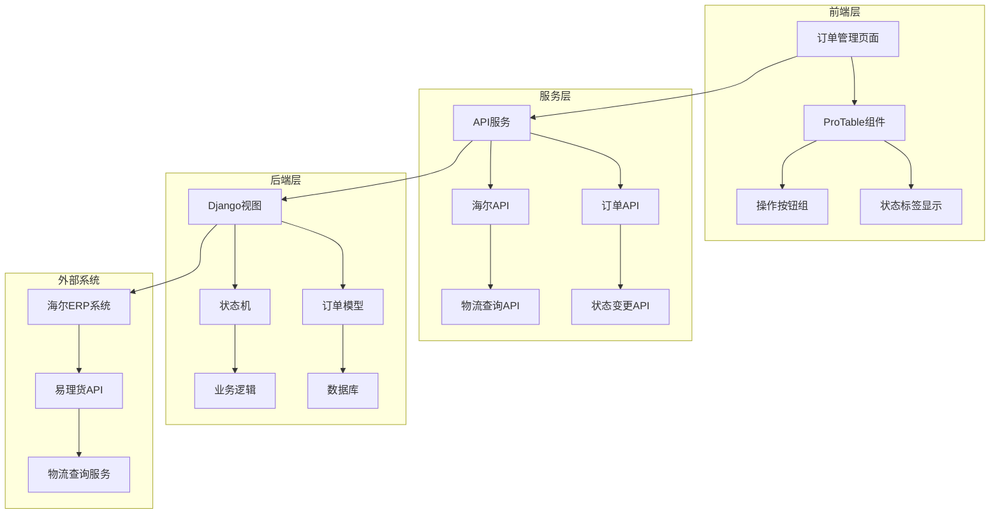

**图表来源**
- [Orders/index.tsx](file://merchant/src/pages/Orders/index.tsx#L1-L589)
- [api.ts](file://merchant/src/services/api.ts#L1-L66)
- [views.py](file://backend/orders/views.py#L1-L800)

## 订单状态管理

### 状态枚举定义

系统定义了完整的订单状态体系，确保业务流程的完整性：

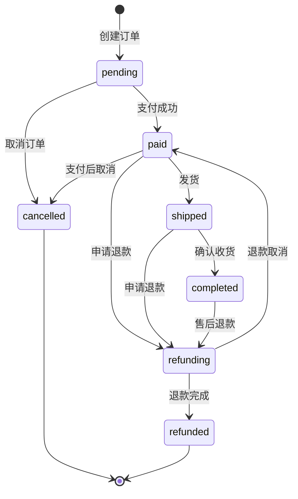

**图表来源**
- [state_machine.py](file://backend/orders/state_machine.py#L14-L23)
- [state_machine.py](file://backend/orders/state_machine.py#L34-L57)

### 状态映射与展示

前端通过状态映射表实现订单状态的可视化展示：

| 状态值 | 显示文本 | 颜色标识 | 功能权限 |
|--------|----------|----------|----------|
| pending | 待支付 | orange | 用户可取消 |
| paid | 已支付 | blue | 管理员可发货 |
| shipped | 已发货 | cyan | 管理员可完成 |
| completed | 已完成 | green | 无操作 |
| cancelled | 已取消 | red | 无操作 |
| refunding | 退款中 | purple | 无操作 |
| refunded | 已退款 | magenta | 无操作 |

**章节来源**
- [Orders/index.tsx](file://merchant/src/pages/Orders/index.tsx#L9-L17)
- [state_machine.py](file://backend/orders/state_machine.py#L14-L23)

## 订单列表组件分析

### 组件架构设计

订单管理页面采用ProTable组件作为核心数据展示容器，实现了完整的CRUD操作和高级搜索功能。

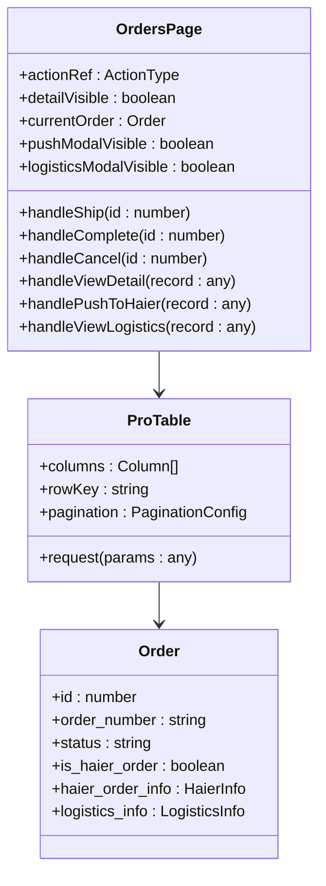

**图表来源**
- [Orders/index.tsx](file://merchant/src/pages/Orders/index.tsx#L19-L28)
- [Orders/index.tsx](file://merchant/src/pages/Orders/index.tsx#L108-L331)

### 列配置与渲染

订单列表包含丰富的列信息和动态操作按钮：

#### 核心列配置

| 列名 | 数据字段 | 类型 | 功能 |
|------|----------|------|------|
| 订单号 | order_number | 文本 | 支持复制 |
| 用户名 | user_username | 文本 | 用户标识 |
| 商品名称 | product.name | 文本 | 商品信息 |
| 数量 | quantity | 数字 | 商品数量 |
| 总金额 | total_amount | 货币 | 金额显示 |
| 状态 | status | 标签 | 状态标识 |
| 海尔订单 | is_haier_order | 标签 | 海尔标识 |
| 操作 | - | 按钮组 | 动态操作 |

#### 操作按钮动态生成

系统根据订单状态和海尔订单属性动态生成操作按钮：

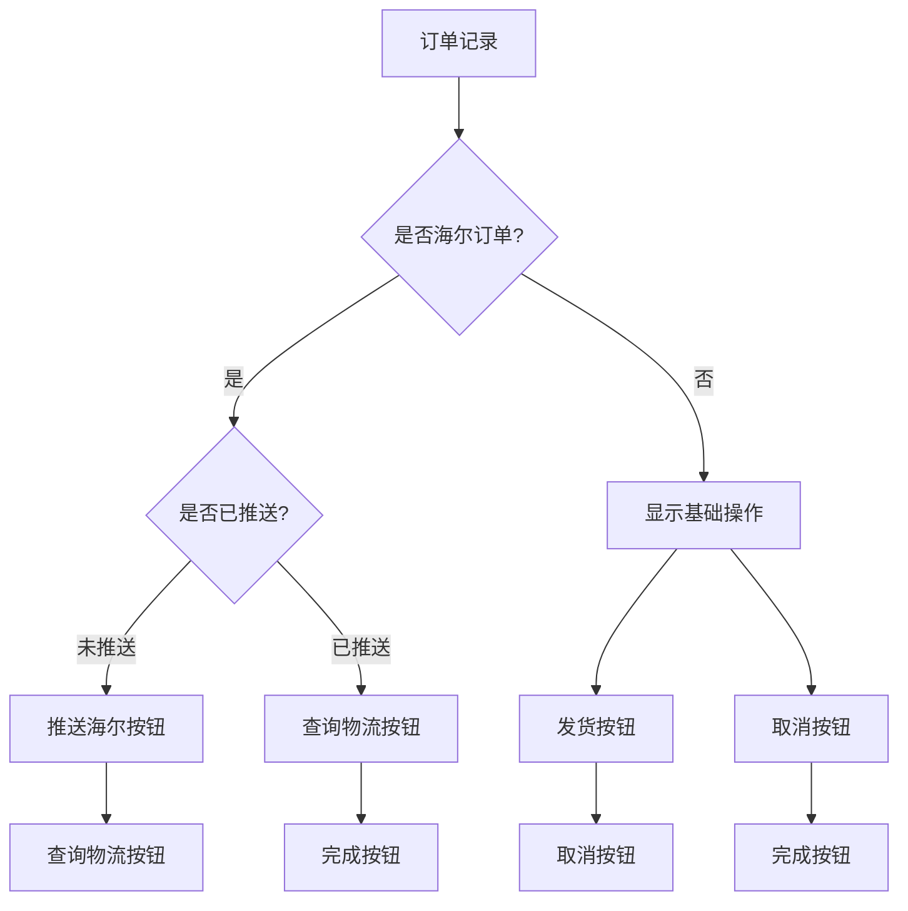

**图表来源**
- [Orders/index.tsx](file://merchant/src/pages/Orders/index.tsx#L241-L328)

**章节来源**
- [Orders/index.tsx](file://merchant/src/pages/Orders/index.tsx#L108-L331)

## API服务层

### 订单管理API

系统提供了完整的订单管理API接口，支持各种业务场景：

#### 核心API接口

| API方法 | URL路径 | 功能描述 | 参数 |
|---------|---------|----------|------|
| getOrders | /orders/ | 获取订单列表 | 分页、筛选参数 |
| getOrder | /orders/{id}/ | 获取订单详情 | 订单ID |
| shipOrder | /orders/{id}/ship/ | 发货操作 | 订单ID |
| completeOrder | /orders/{id}/complete/ | 完成订单 | 订单ID |
| cancelOrder | /orders/{id}/cancel/ | 取消订单 | 订单ID |
| pushToHaier | /orders/{id}/push_to_haier/ | 推送海尔 | 订单ID, 推送数据 |
| getHaierLogistics | /orders/{id}/haier_logistics/ | 查询物流 | 订单ID |

### 请求响应处理

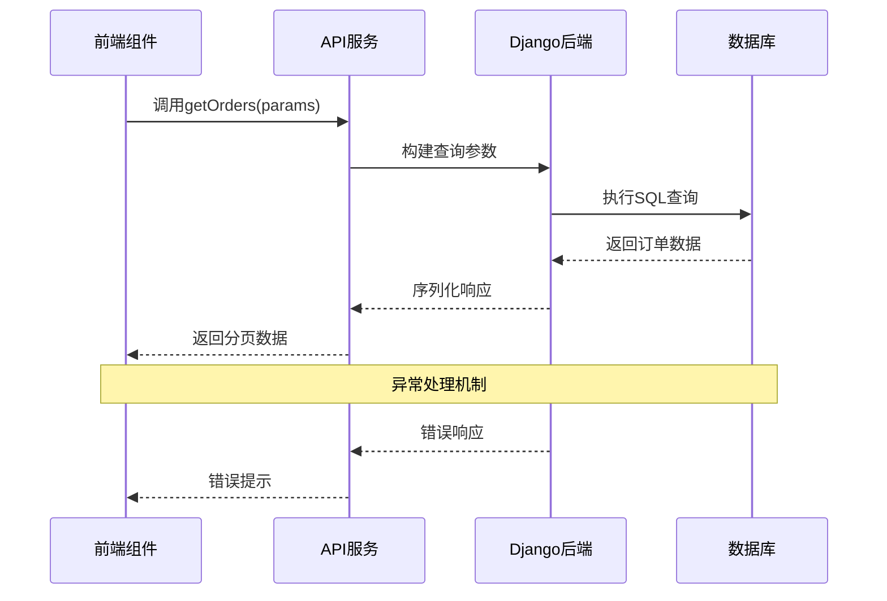

**图表来源**
- [api.ts](file://merchant/src/services/api.ts#L53-L59)
- [views.py](file://backend/orders/views.py#L35-L96)

**章节来源**
- [api.ts](file://merchant/src/services/api.ts#L53-L59)
- [views.py](file://backend/orders/views.py#L35-L96)

## 海尔系统集成

### 海尔订单推送流程

系统集成了海尔ERP系统的订单推送功能，支持海尔产品的特殊订单处理：

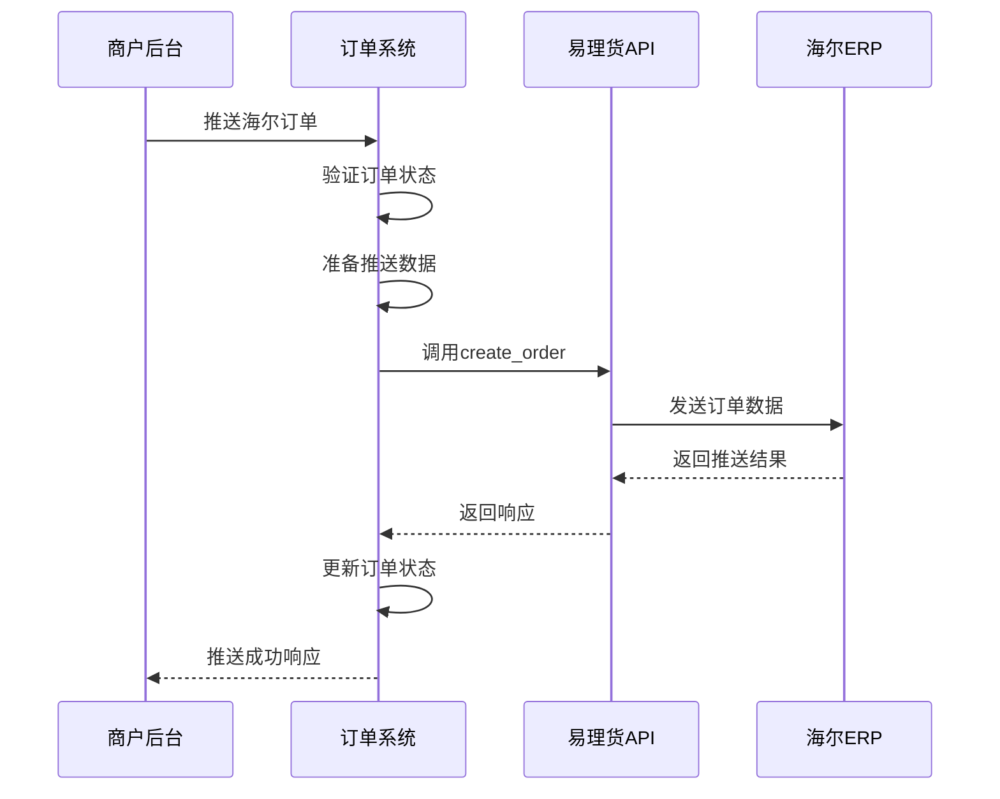

**图表来源**
- [views.py](file://backend/orders/views.py#L379-L487)
- [ylhapi.py](file://backend/integrations/ylhapi.py#L174-L200)

### 海尔物流查询

系统提供海尔订单的物流信息查询功能：

#### 查询流程

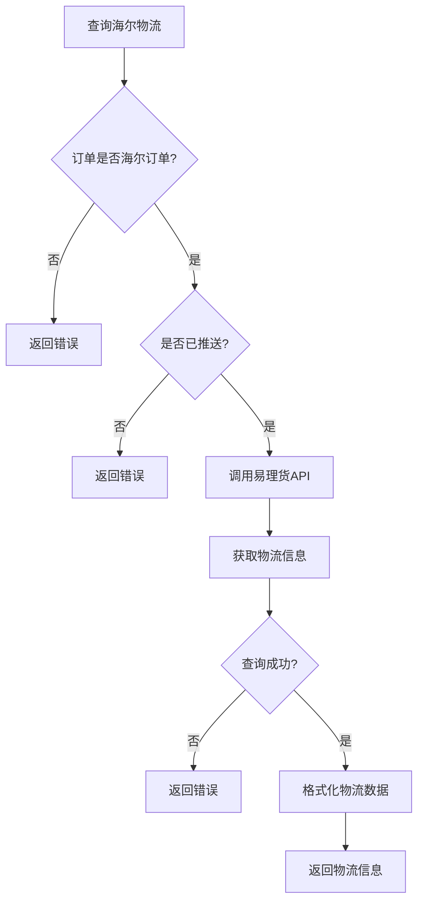

**图表来源**
- [views.py](file://backend/orders/views.py#L489-L546)

### 海尔订单数据结构

系统在订单模型中专门扩展了海尔相关字段：

| 字段名 | 类型 | 描述 | 用途 |
|--------|------|------|------|
| haier_order_no | CharField | 海尔订单号 | 巨商汇订单号 |
| haier_so_id | CharField | 海尔子订单号 | 唯一标识 |
| haier_status | CharField | 海尔订单状态 | 推送状态 |
| is_haier_order | BooleanField | 是否海尔订单 | 订单分类 |

**章节来源**
- [views.py](file://backend/orders/views.py#L379-L487)
- [views.py](file://backend/orders/views.py#L489-L546)
- [models.py](file://backend/orders/models.py#L44-L48)

## 订单状态流转机制

### 状态机实现

系统采用状态机模式管理订单状态流转，确保业务逻辑的正确性：

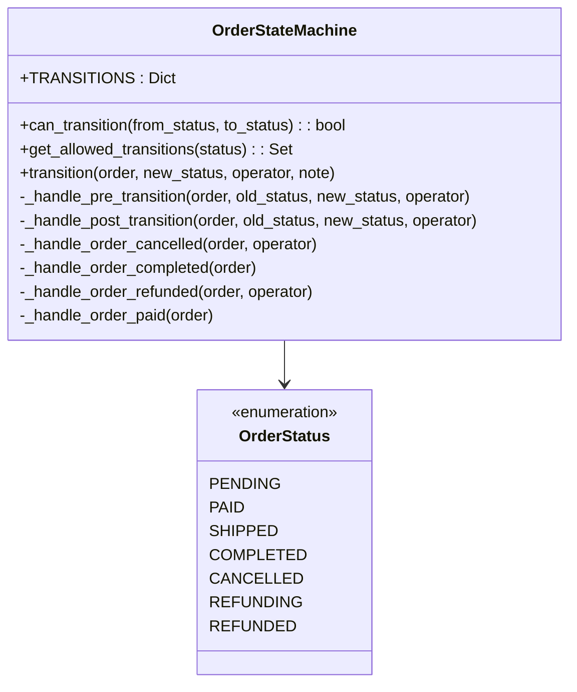

**图表来源**
- [state_machine.py](file://backend/orders/state_machine.py#L25-L57)
- [state_machine.py](file://backend/orders/state_machine.py#L14-L23)

### 状态转换规则

#### 合法转换矩阵

| 当前状态 | 允许转换到的状态 |
|----------|------------------|
| pending | paid, cancelled |
| paid | shipped, refunding, cancelled |
| shipped | completed, refunding |
| completed | refunding |
| refunding | refunded, paid |
| cancelled | 无 |
| refunded | 无 |

### 业务逻辑处理

状态转换过程中会触发相应的业务逻辑：

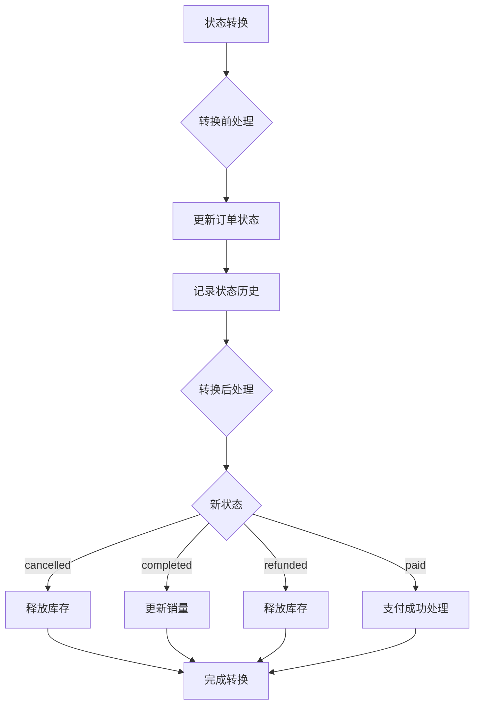

**图表来源**
- [state_machine.py](file://backend/orders/state_machine.py#L156-L288)

**章节来源**
- [state_machine.py](file://backend/orders/state_machine.py#L25-L57)
- [state_machine.py](file://backend/orders/state_machine.py#L156-L288)

## 异常处理与监控

### 异常订单处理策略

系统建立了完善的异常订单识别和处理机制：

#### 异常类型分类

| 异常类型 | 触发条件 | 处理策略 | 用户反馈 |
|----------|----------|----------|----------|
| 推送失败 | 海尔API调用失败 | 记录错误日志，保留订单状态 | 显示推送失败提示 |
| 状态转换异常 | 非法状态转换 | 返回错误信息，阻止操作 | 显示转换失败提示 |
| 数据验证失败 | 订单数据不完整 | 拒绝操作，提示修复 | 显示验证错误 |
| 网络超时 | API调用超时 | 重试机制，超时降级 | 显示网络错误 |

### 监控与告警

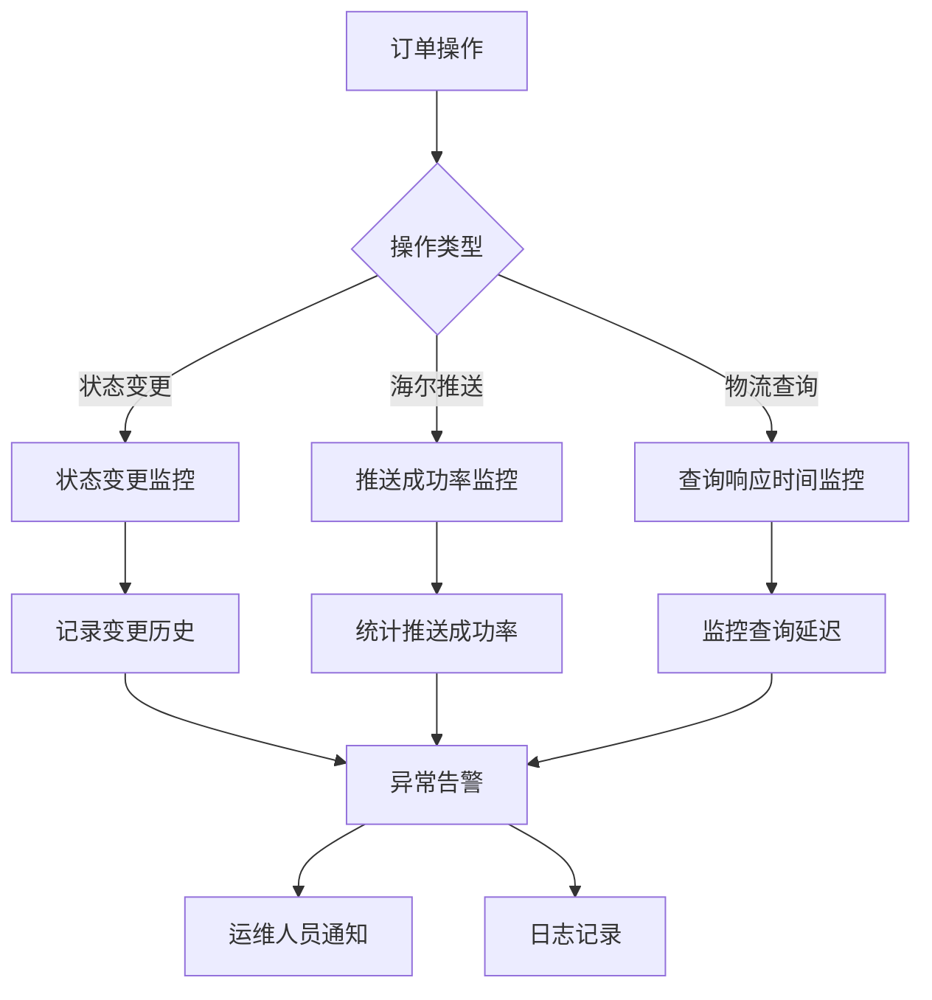

**章节来源**
- [views.py](file://backend/orders/views.py#L379-L487)
- [views.py](file://backend/orders/views.py#L489-L546)

## 性能优化策略

### 数据查询优化

#### 索引策略

系统在订单模型中建立了完善的索引策略：

| 索引字段 | 类型 | 用途 |
|----------|------|------|
| status | 普通索引 | 状态筛选优化 |
| created_at | 普通索引 | 时间范围查询 |
| user | 普通索引 | 用户订单查询 |
| haier_order_no | 普通索引 | 海尔订单查询 |
| haier_so_id | 唯一索引 | 海尔订单去重 |

#### 查询优化技巧

1. **预取关联数据**：使用`select_related`和`prefetch_related`减少数据库查询
2. **分页查询**：支持大列表的分页加载
3. **缓存策略**：对频繁查询的数据建立缓存
4. **异步加载**：订单详情和物流信息采用异步加载

### 前端性能优化

#### 组件优化策略

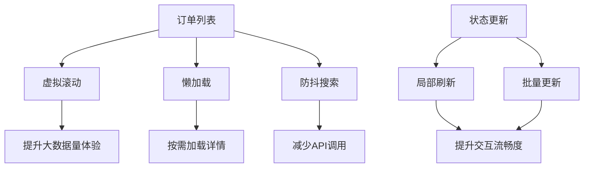

**章节来源**
- [models.py](file://backend/orders/models.py#L75-L81)
- [Orders/index.tsx](file://merchant/src/pages/Orders/index.tsx#L334-L415)

## 总结

订单管理系统通过完整的架构设计和业务逻辑实现，提供了强大的订单管理能力：

### 核心优势

1. **完整的状态管理**：基于状态机的订单状态管理，确保业务流程的正确性
2. **灵活的操作界面**：支持多种订单状态和操作的动态展示
3. **完善的集成能力**：与海尔ERP系统的深度集成，支持订单推送和物流查询
4. **健壮的异常处理**：多层次的异常处理和监控机制
5. **优秀的用户体验**：响应式的数据更新和流畅的交互体验

### 技术特色

- **前后端分离架构**：清晰的职责划分和良好的可维护性
- **RESTful API设计**：标准化的接口设计和良好的扩展性
- **状态机模式应用**：确保业务逻辑的正确性和一致性
- **性能优化策略**：多层次的性能优化措施

该系统为电商平台提供了可靠的订单管理解决方案，能够满足复杂的业务需求和高并发访问要求。