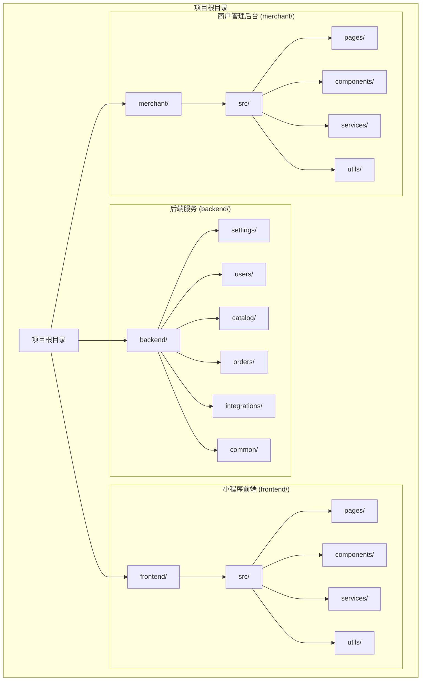
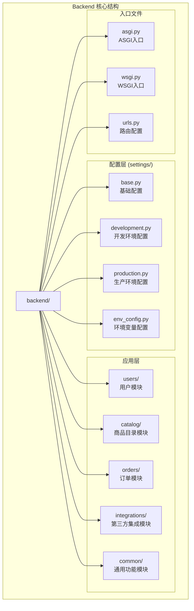
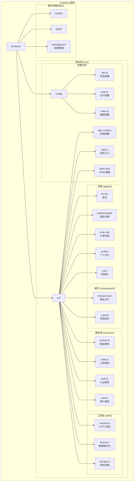
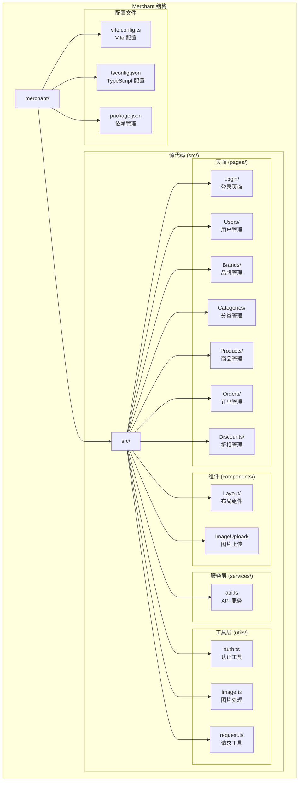

# 项目目录结构

<cite>
**本文档引用的文件**
- [backend/backend/settings/base.py](file://backend/backend/settings/base.py)
- [backend/backend/settings/development.py](file://backend/backend/settings/development.py)
- [backend/backend/settings/production.py](file://backend/backend/settings/production.py)
- [backend/backend/urls.py](file://backend/backend/urls.py)
- [backend/users/apps.py](file://backend/users/apps.py)
- [backend/catalog/apps.py](file://backend/catalog/apps.py)
- [backend/orders/apps.py](file://backend/orders/apps.py)
- [backend/integrations/apps.py](file://backend/integrations/apps.py)
- [backend/users/models.py](file://backend/users/models.py)
- [backend/catalog/models.py](file://backend/catalog/models.py)
- [backend/orders/models.py](file://backend/orders/models.py)
- [backend/integrations/models.py](file://backend/integrations/models.py)
- [frontend/src/app.ts](file://frontend/src/app.ts)
- [frontend/src/services/product.ts](file://frontend/src/services/product.ts)
- [frontend/src/utils/request.ts](file://frontend/src/utils/request.ts)
- [merchant/src/App.tsx](file://merchant/src/App.tsx)
- [merchant/src/pages/Products/index.tsx](file://merchant/src/pages/Products/index.tsx)
- [merchant/src/components/Layout/index.tsx](file://merchant/src/components/Layout/index.tsx)
</cite>

## 目录结构概览

该项目采用现代化的前后端分离架构，主要分为三个核心目录：

**图表来源**
- [backend/backend/settings/base.py](file://backend/backend/settings/base.py#L1-L263)
- [frontend/src/app.ts](file://frontend/src/app.ts#L1-L18)
- [merchant/src/App.tsx](file://merchant/src/App.tsx#L1-L45)

## Backend/ 后端服务目录结构

### 核心架构设计

Backend 目录遵循 Django 项目的标准结构，采用模块化设计，每个功能模块都是独立的应用程序。这种设计提供了良好的可维护性和扩展性。

**图表来源**
- [backend/backend/settings/base.py](file://backend/backend/settings/base.py#L11-L28)
- [backend/backend/urls.py](file://backend/backend/urls.py#L24-L48)

### 多环境配置系统

项目采用环境感知的配置管理，通过 `settings/` 目录实现不同环境的配置隔离：

#### 基础配置 (base.py)
- **INSTALLED_APPS 配置**：定义了所有注册的应用程序，包括第三方库和自定义模块
- **REST_FRAMEWORK 设置**：配置 API 的认证、权限、限流等策略
- **CORS 配置**：支持跨域资源共享
- **数据库和缓存配置**：提供本地和生产环境的适配方案

#### 开发环境配置 (development.py)
- 启用调试模式和详细错误信息
- 配置本地数据库连接
- 允许所有 CORS 源以简化开发流程

#### 生产环境配置 (production.py)
- 安全加固配置
- 数据库连接优化
- CDN 和静态资源配置
- SSL 和 HSTS 安全设置

**章节来源**
- [backend/backend/settings/base.py](file://backend/backend/settings/base.py#L11-L263)
- [backend/backend/settings/development.py](file://backend/backend/settings/development.py#L1-L20)
- [backend/backend/settings/production.py](file://backend/backend/settings/production.py#L1-L35)

### 用户模块 (users/)

用户模块负责用户身份认证、授权和个人信息管理：

#### 核心功能
- **双认证支持**：同时支持用户名密码和微信 OpenID 认证
- **用户类型管理**：区分普通用户和管理员用户
- **地址管理**：完整的收货地址管理系统
- **权限控制**：基于 Django 权限系统的细粒度访问控制

#### 数据模型设计
- **User 模型**：继承自 AbstractUser，扩展了头像、手机号、用户类型等字段
- **Address 模型**：支持多个收货地址和默认地址设置

**章节来源**
- [backend/users/models.py](file://backend/users/models.py#L1-L95)
- [backend/users/apps.py](file://backend/users/apps.py#L1-L7)

### 商品目录模块 (catalog/)

商品目录模块是电商系统的核心，管理商品、分类和品牌信息：

#### 核心功能
- **商品管理**：支持本地商品和海尔 API 商品的统一管理
- **分类体系**：扁平化的分类结构，支持无限层级
- **品牌管理**：品牌信息维护和关联
- **搜索功能**：全文搜索和高级筛选

#### 数据模型设计
- **Category 模型**：商品分类，支持排序和层级关系
- **Brand 模型**：品牌信息，包含 Logo 和描述
- **Product 模型**：商品信息，支持多种商品来源和价格体系

#### 海尔 API 集成
- 支持从海尔 API 同步商品数据
- 自动更新价格、库存和商品信息
- 提供商品来源标识和同步状态跟踪

**章节来源**
- [backend/catalog/models.py](file://backend/catalog/models.py#L1-L200)
- [backend/catalog/apps.py](file://backend/catalog/apps.py#L1-L7)

### 订单模块 (orders/)

订单模块处理完整的电商交易流程：

#### 核心功能
- **订单生命周期管理**：从创建到完成的全流程跟踪
- **支付集成**：支持多种支付方式
- **物流跟踪**：与海尔系统的订单同步
- **状态机管理**：复杂的订单状态转换逻辑

#### 数据模型设计
- **Order 模型**：完整的订单信息，包含用户快照和物流信息
- **Cart 模型**：购物车功能
- **Payment 模型**：支付记录和状态管理

#### 海尔订单集成
- 支持向海尔系统推送订单
- 实时订单状态同步
- 物流信息回传

**章节来源**
- [backend/orders/models.py](file://backend/orders/models.py#L1-L200)
- [backend/orders/apps.py](file://backend/orders/apps.py#L1-L7)

### 第三方集成模块 (integrations/)

专门处理与外部系统的集成：

#### 核心功能
- **海尔 API 集成**：商品、价格、库存的双向同步
- **配置管理**：动态配置和版本控制
- **同步日志**：详细的同步操作记录和审计

#### 数据模型设计
- **HaierConfig 模型**：海尔 API 的认证和配置信息
- **HaierSyncLog 模型**：同步操作的日志记录

**章节来源**
- [backend/integrations/models.py](file://backend/integrations/models.py#L1-L150)
- [backend/integrations/apps.py](file://backend/integrations/apps.py#L1-L7)

## Frontend/ 小程序前端目录结构

### Taro 项目架构

Frontend 目录基于 Taro 框架构建，支持多端部署（微信小程序、H5 等）：

**图表来源**
- [frontend/src/app.ts](file://frontend/src/app.ts#L1-L18)
- [frontend/src/services/product.ts](file://frontend/src/services/product.ts#L1-L64)
- [frontend/src/utils/request.ts](file://frontend/src/utils/request.ts#L1-L162)

### 页面组织结构

每个页面都采用统一的目录结构，包含配置文件、样式文件和业务逻辑：

#### 页面特性
- **页面配置**：`index.config.ts` 定义页面标题、导航栏等
- **样式文件**：`index.scss` 独立的样式文件
- **业务逻辑**：`index.tsx` 包含页面的主要逻辑

#### 核心页面功能
- **商品浏览**：商品列表、详情、搜索功能
- **购物车管理**：添加商品、数量调整、结算
- **订单管理**：订单创建、支付、状态跟踪
- **用户中心**：个人信息、地址管理、订单历史

**章节来源**
- [frontend/src/services/product.ts](file://frontend/src/services/product.ts#L1-L64)
- [frontend/src/utils/request.ts](file://frontend/src/utils/request.ts#L1-L162)

### 服务层架构

服务层封装了与后端 API 的交互逻辑：

#### 核心服务
- **product.ts**：商品相关的 API 调用
- **order.ts**：订单相关的 API 调用
- **auth.ts**：用户认证和授权
- **user.ts**：用户信息管理

#### 请求封装
- **统一错误处理**：自动处理 401、429 等常见错误
- **Token 管理**：自动刷新访问令牌
- **加载状态**：统一的加载提示

**章节来源**
- [frontend/src/services/product.ts](file://frontend/src/services/product.ts#L1-L64)
- [frontend/src/utils/request.ts](file://frontend/src/utils/request.ts#L1-L162)

## Merchant/ 商户管理后台目录结构

### React 管理后台架构

Merchant 目录基于 React 构建的管理后台，提供商品、订单、用户等管理功能：

**图表来源**
- [merchant/src/App.tsx](file://merchant/src/App.tsx#L1-L45)
- [merchant/src/pages/Products/index.tsx](file://merchant/src/pages/Products/index.tsx#L1-L720)
- [merchant/src/components/Layout/index.tsx](file://merchant/src/components/Layout/index.tsx#L1-L60)

### 路由和权限管理

管理后台采用 React Router 进行路由管理，结合私有路由保护：

#### 路由结构
- **登录路由**：独立的登录页面
- **私有路由**：需要认证才能访问的页面
- **嵌套路由**：在 Layout 组件内渲染的页面

#### 权限控制
- **Token 验证**：基于 JWT 的认证机制
- **路由守卫**：未登录用户自动跳转到登录页
- **侧边栏导航**：根据用户权限动态显示菜单

**章节来源**
- [merchant/src/App.tsx](file://merchant/src/App.tsx#L1-L45)

### 商品管理功能

商品管理页面展示了完整的 CRUD 操作和高级功能：

#### 核心功能
- **表格展示**：使用 ProTable 组件展示商品列表
- **高级搜索**：支持多条件组合搜索
- **实时编辑**：ModalForm 实现弹窗编辑
- **图片管理**：支持主图和详情图的上传和管理

#### 数据流设计
- **状态管理**：使用 React Hooks 管理组件状态
- **API 调用**：统一的 API 服务层
- **错误处理**：友好的错误提示和反馈

**章节来源**
- [merchant/src/pages/Products/index.tsx](file://merchant/src/pages/Products/index.tsx#L1-L720)

### 布局和导航

布局组件提供了统一的管理后台界面：

#### 布局特性
- **侧边栏菜单**：垂直导航菜单
- **顶部导航**：用户信息和退出按钮
- **内容区域**：主内容展示区

#### 导航功能
- **菜单高亮**：当前页面对应的菜单项高亮
- **面包屑导航**：显示当前页面路径
- **响应式设计**：适应不同屏幕尺寸

**章节来源**
- [merchant/src/components/Layout/index.tsx](file://merchant/src/components/Layout/index.tsx#L1-L60)

## 总结

该项目的目录结构体现了现代 Web 应用的最佳实践：

### 设计原则
- **模块化**：每个功能模块独立，职责清晰
- **可扩展性**：易于添加新功能和模块
- **可维护性**：清晰的目录结构和命名规范
- **一致性**：前后端框架的统一架构风格

### 技术特色
- **前后端分离**：清晰的职责划分
- **多端支持**：一套代码支持多个平台
- **微服务思维**：模块化的设计理念
- **API 驱动**：以 RESTful API 为核心的数据交互方式

这种目录结构为项目的长期发展奠定了坚实的基础，便于团队协作和功能扩展。