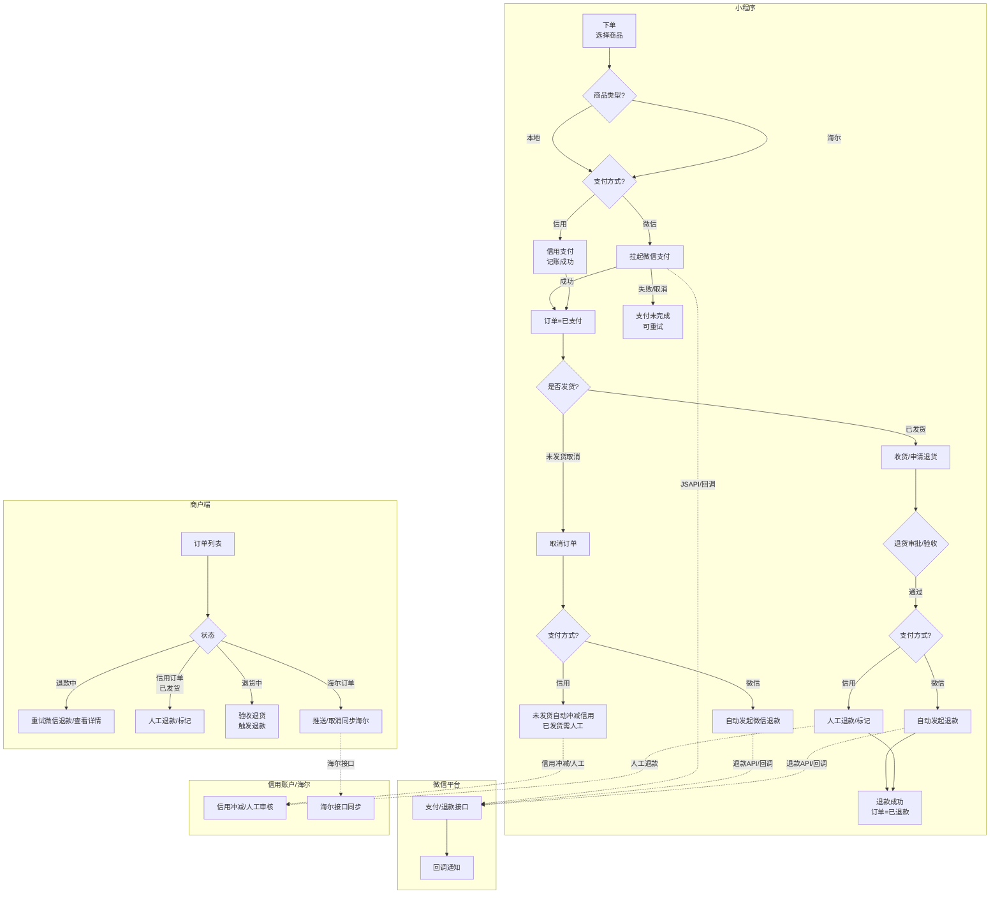

## 交易流程

```mermaid
flowchart TD
    subgraph U[小程序]
      U1[下单\n选择商品] --> U2{商品类型?}
      U2 -->|本地| U3{支付方式?}
      U2 -->|海尔| U3
      U3 -->|微信| U4[拉起微信支付]
      U3 -->|信用| U5[信用支付\n记账成功]
      U4 -->|成功| U6[订单=已支付]
      U4 -->|失败/取消| U7[支付未完成\n可重试]
      U5 --> U6

      U6 --> U8{是否发货?}
      U8 -->|未发货取消| U9[取消订单]
      U8 -->|已发货| U10[收货/申请退货]

      U9 --> U9a{支付方式?}
      U9a -->|微信| U11[自动发起微信退款]
      U9a -->|信用| U12[未发货自动冲减信用\n已发货需人工]

      U10 --> U10a{退货审批/验收}
      U10a -->|通过| U13{支付方式?}
      U13 -->|微信| U14[自动发起退款]
      U13 -->|信用| U15[人工退款/标记]
      U14 --> U16[退款成功\n订单=已退款]
      U15 --> U16
    end

    subgraph WX[微信平台]
      WX1[支付/退款接口] --> WX2[回调通知]
    end

    subgraph M[商户端]
      M1[订单列表] --> M2{状态}
      M2 -->|退款中| M3[重试微信退款/查看详情]
      M2 -->|信用订单\n已发货| M4[人工退款/标记]
      M2 -->|退货中| M5[验收退货\n触发退款]
      M2 -->|海尔订单| M6[推送/取消同步海尔]
    end

    subgraph EXT[信用账户/海尔]
      EXT1[信用冲减/人工审核]
      EXT2[海尔接口同步]
    end

    %% 关联
    U4 -.JSAPI/回调.-> WX1
    U11 -.退款API/回调.-> WX1
    U14 -.退款API/回调.-> WX1
    M6 -.海尔接口.-> EXT2
    U12 -.信用冲减/人工.-> EXT1
    U15 -.人工退款.-> EXT1
```

### 说明
- 支付结果页会调用 `/payments/{id}/sync/` 确认支付成功，未确认则提示用户刷新/联系客服。
- 微信退款自动触发，失败有用户通知；商户端可重试退款/查看详情。
- 信用支付：未发货取消自动冲减；已发货需人工处理，商户端有人工退款入口。
- 海尔订单需商户端暂时人工推送/取消同步。***
