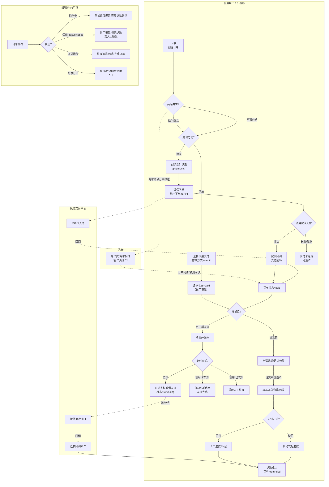

## 交易链路（微信支付 & 信用支付）

区分角色：普通用户（小程序）、经销商（商户端）；区分支付：微信/信用；区分商品：本地商品/海尔商品；区分处理：自动/人工。

### 关键节点说明
- **支付结果确认**：支付结果页在展示成功前会调用 `/payments/{id}/sync/` 确认 `payment.status == succeeded`。
- **取消并退款**：
  - 微信支付：未发货/已支付取消会自动发起微信退款（状态 `refunding`），失败会通知用户。
  - 信用支付：未发货取消自动冲减信用；已发货需人工处理，前端提示，商户端提供“信用退款/标记退款”按钮。
- **退货退款**：发货/完成后可申请退货，经商户端验收后发起退款（微信走接口，信用需人工）。
- **商户端**：
  - 退款中可重试退款并查看退款详情（当前取最近记录，建议后续支持选择具体退款）。
  - 信用退款入口用于人工确认退款/标记完成。
  - 海尔订单需人工推送/取消同步。
